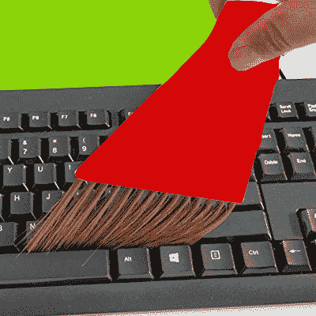
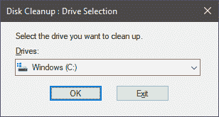
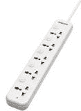
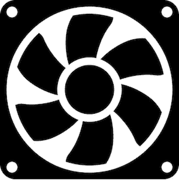
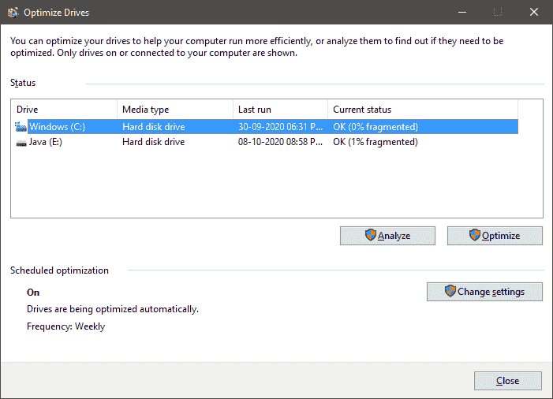

# 如何清洁电脑

> 原文：<https://www.javatpoint.com/how-to-clean-computer>

清洗电脑就是清洗由[硬件](https://www.javatpoint.com/hardware)和[软件](https://www.javatpoint.com/software)部分组成的电子机器。在知道如何清洁电脑之前，我们应该清楚为什么要清洁电脑。

### 为什么要清洁电脑

我们应该清洁计算机的部件，因为:

*   一个干净的硬件使计算机的工作变得平稳，并延长了系统的寿命。
*   当电脑屏幕干净时，它看起来很舒服，吸引我们更多地工作。因此，擦拭电脑屏幕将保护我们的眼睛不被更多的注意力集中到系统上。
*   这样，干净的软件将有助于系统更正确、更快速地工作。如果内存占用较少，进程将执行得更快。

因此，一台干净的计算机将为计算机用户节省大量的时间和金钱。

### 清洁电脑的步骤

清洁计算机时，需要执行两项任务，即清洁系统的硬件和软件。

**任务 1:清洁电脑硬件**

*   最初，请关闭计算机系统的电源按钮并将其拔下。
*   **擦屏**

使用干燥柔软的布清洁电脑的灰尘。您也可以使用合适的电脑液去除电脑屏幕上的指纹或任何硬点。不要在屏幕上直接使用液体；放在布上，在屏幕上轻轻使用。如果您没有电脑擦拭液，请使用蒸馏水或过滤水擦拭屏幕。用那块布清洁笔记本电脑的背面(如果你有笔记本电脑)。彻底清洁系统后，等待系统干燥，然后打开电源。

*   **掸掉键盘上的灰尘**

如果是桌面键盘，将其从 CPU 上取下，翻转过来，去除手指无法去除的细小灰尘颗粒，如散落的毛发和碎屑。要深入清洁键盘，请用棉签轻轻擦拭按键周围，以去除不粘和无法触及的灰尘颗粒。不要把棉花扎得太深，否则钥匙会受到影响。

*   **运行检查盘工具**

为了检测与系统硬盘相关的问题，微软视窗推出了一个名为“检查磁盘”的视窗工具。使用此工具，系统将扫描并修复坏扇区和其他文件系统错误。如果您是第一次使用此工具，请进行完全扫描，这将有助于您自动修复问题。你只需要等几个小时。

*   **检查电涌保护器**

电涌对系统非常有害，可能会损坏电源和系统的其他组件。人们应该知道，电涌保护器在一次电涌之后就失去了保护。因此，如果它仍然显示开机，并不意味着它仍然在保护。因此，我们需要在进行显著的功率激增后，不时且明确地检查它。

*   **保持电脑通风**

系统内外的空气通风是非常必要的。系统的风扇应该是干净的(连接在笔记本电脑的两侧)，并且必须没有障碍物。因此，人们需要为计算机系统的两侧保持至少 3 英寸的距离(即，与墙壁、其他系统的距离)，以便通风过程可以正常工作。人们需要检查风扇和风扇叶片，确保它们不会过热。否则需要升级 [CPU](https://www.javatpoint.com/cpu-full-form) 风扇。

**任务 2:清理电脑软件**

清除计算机软件意味着清除计算机中不需要的数据。它将使您的系统快速有效地运行和执行任务。

*   **硬盘备份**

当涉及到基本数据时，您应该立即备份这些数据，以防止任何损失或系统崩溃。基本上，备份数据有两种方法，即通过将数据副本保存在闪存驱动器或任何物理设备上，或者通过云保存数据副本。将数据保存在云上是保护数据安全的最佳备份方法。建议每周至少备份一次数据。另一个好处是，即使您删除了备份数据，您的数据仍然会存储在其他地方，因此，一些内存空间将被释放。

*   **定期更新至计算机**

为了一台好的工作电脑，你必须经常更新你的系统软件和程序，尤其是在软件繁重的情况下。这是因为未更新的软件仍保持其旧版本，并且可能对您的系统健康有害和脆弱，因为更新用于防止软件，从而防止系统受到任何威胁和病毒。如果软件版本是最新的，它会增加系统的寿命，而且系统会工作得更好。

*   **安装抗病毒药物**

防病毒软件对于防止计算机受到任何威胁、病毒和恶意软件攻击的计算机至关重要。它将防止您的凭据被黑客攻击或窃取。你可以在网上浏览，并在网上搜索免费或付费的抗病毒药物。因此，您可以不受系统黑客和黑客的压力。

*   **清洁车窗注册表**

应该清理计算机的 Windows 注册表。但是，清理系统注册表不会提高系统速度性能，但电源启动系统可能会变得更快更好。清理注册表时需要小心，因为这是一个巨大的注册表，它知道并包含您在系统上所做的所有活动的细节。如果在清理注册表时出现任何错误，可能需要在您的计算机系统上重新安装 Windows。因此，在执行清洁操作时要确保安全。

*   **整理软件程序**

从计算机中删除那些你不再使用的软件程序应该是一种习惯。这是因为正在安装的不需要的程序和文件会不必要地占用内存空间。清理方法有助于删除不必要的数据，并限制计算机中的恶意软件程序。

这两项任务将帮助您从计算机中删除不需要的文件和程序，并清理系统。

### 窗口清理工具

[Windows 操作系统](https://www.javatpoint.com/windows)提供内置的清理工具，如下所示:

**1) Windows 磁盘清理工具**:Windows 提供了一个内置的功能磁盘清理工具，可以让你清理电脑中的硬盘。它通过从计算机中删除旧的现有文件和其他不再使用的东西来实现。要使用该工具，请在计算机的搜索选项卡中搜索“磁盘清理”，然后按“回车”键。

**2) Windows 磁盘碎片整理工具**:碎片化使电脑速度变慢，程序执行缓慢。因此，如果文件系统碎片化，会影响计算机的速度。

在 Windows 中，一种称为“磁盘碎片整理程序”的功能可以帮助硬盘进行碎片整理并加快系统速度。要使用此工具，请在搜索选项卡上搜索“碎片整理程序”，然后按“回车”。

这些是作为内置功能在计算机系统中提供的工具。

除了这些内置工具之外，互联网上还有其他工具可以安装在您的系统上，并用于在系统上腾出更多内存空间和清理系统。

* * *