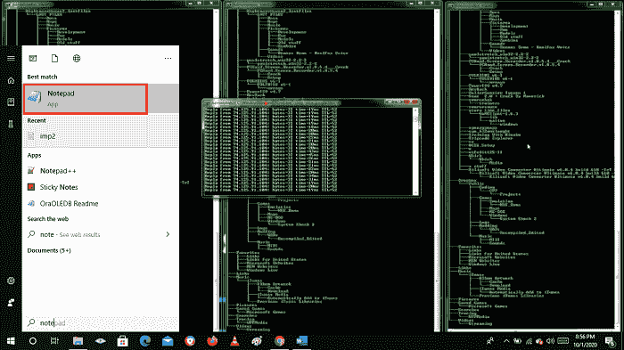
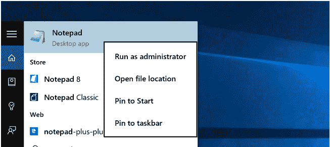
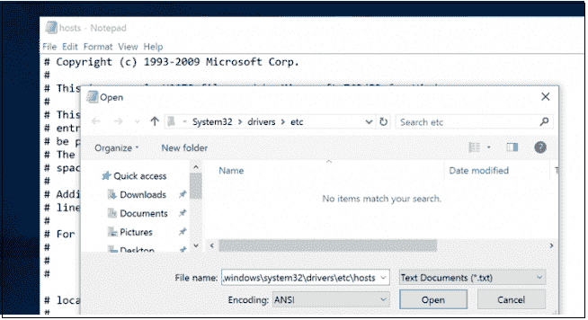
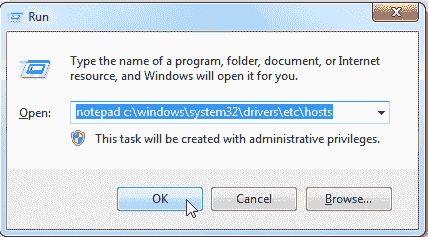
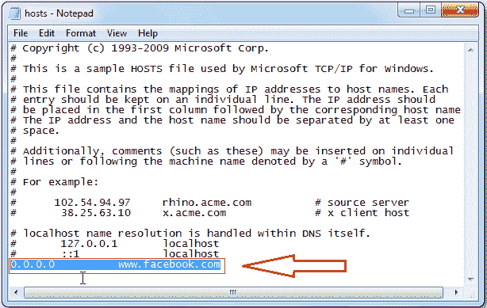
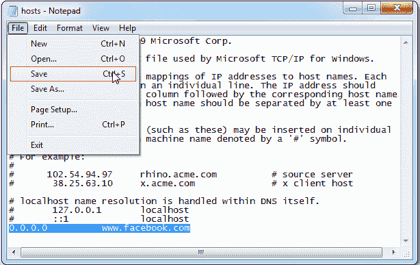

# 如何在 Windows、Linux 和 MacOS 上编辑您的文件

> 原文：<https://www.javatpoint.com/how-to-edit-your-file-on-windows-linux-and-macos>

主机文件通常用于将网址(主机名)链接到 IP 地址。它是一种用于 Windows、Linux 和 mac OS x 操作系统的数据结构。主机文件必须优先于域名系统文件。当您输入希望使用的网站的网址时，域名必须转换为相应的 IP 地址。软件系统首先扫描其名称服务器以寻找相应的域名，并且在没有主机提交的情况下，要求指定的域名系统服务器协调所识别的域名。这只会影响发生更改的计算机，而不是全局处理域的方式。

当您想在不修改[域名系统](https://www.javatpoint.com/computer-network-dns)域名设置的情况下验证您的网站时，使用主机文件将域名链接到 [IP](https://www.javatpoint.com/ip) 地址尤其有用。例如，你想把你的网站转移到一个不同的服务器，在你把域名指向一个新的服务器之前，你想确保它是否完全正常运行。

您也可以使用主机名来禁用计算机的互联网站点。

在这篇文章中，我们将获得如何更改 [Linux](https://www.javatpoint.com/linux-tutorial) 、MacOS 和 [Windows](https://www.javatpoint.com/windows) 主机文件的指导。

## 什么是主机文件

主机文件是一个文件集合，几乎可以在所有设备和操作系统上使用它来绘制 ip 地址和域名之间的关系。这是一种 ASCII 文本格式。它由一个用空格分隔的 IP 地址和一个域名组成。每个地址都有自己的行。

## 主机文件的格式

主机文件包含以下格式:

```

IPAddress DomainName [DomainAliases]

```

至少有一个空格或制表符可以区分 IP 地址和域名。

以#开头的行是反馈并被驳回。

要编辑宿主文件，您需要在文本编辑器中打开文件，并进行以下更改。

```

# Static table lookup for hostnames.
# See hosts for the further details.
127.0.1.1 javatpoint.desktop
127.0.0.1 localhost

```

对主机的文件更新将自动进行，除非应用程序缓存了[域名系统](https://www.javatpoint.com/dns-full-form)条目。要删除更改，只需打开文件并删除您插入的行。

## Windows 中的主机文件编辑

自 ARPANET 以来，主机文件一直在使用。它们还被用来解析主机名，在域名系统主机档案前面会有大型文档用来帮助解决网络名称问题。

微软保持主机文件在 Windows 网络中是活动的，这就是为什么当它在 Windows、MacOS 或 Linux 中被发现时变化很小的原因。对于所有门户网站

语法可能是相同的。许多主机文件可能有很多环回条目。这可以用于标准语法的简单定义。

### Windows 8、8.1 或 10 中的主机文件编辑

不幸的是，Windows 8 或 10 让作为管理员打开应用程序变得令人沮丧——但这并不难。

Windows 上文件的完整路径是 c:\ Windows \ System32 \ Drivers \ etc \ hosts。要编辑主机文件，您需要遵循 Windows 8 或 10 中的上述说明。

**第一步:**按 Windows 键，在搜索面板中搜索记事本。如下图所示。



**步骤 2:** 现在，您必须右键单击记事本按钮，然后选择以管理员身份运行。



**步骤 3:** 完成后，使用文件- >打开功能打开以下文件。



**第四步:**在记事本中打开文件后，可以编辑宿主文件。

**第五步:**保存更改，需要点击保存选项。

### Windows 7 中的主机文件编辑

对于 Windows 7 中的主机文件编辑，您可以遵循下面给出的说明。

**第一步:**首先需要打开命令提示符，输入以下命令，点击确定，在记事本中打开文件。



**第二步:**打开记事本后，需要提供想要进行修改的网页的[网址](https://www.javatpoint.com/url-full-form)或链接。

例如:如果你想阻止脸书网站，那么输入给定的网址。

```

0.0.0.0	www.facebook.com

```

现在，在 **#** 标志后进入具体站点的链接，如下图所示。



**设置 3:** 现在可以修改文件并保存，如下图截图所示。



## 在 Linux 中托管文件编辑

在 Ubuntu 10.04 等 Linux 外部存储设备中，可以在终端显式修改域名。可以使用自己喜欢的编辑器，也可以打开自己喜欢的 [GUI](https://www.javatpoint.com/gui-full-form) 文本文件。我们将在这个案例中使用 VIM。

与 Windows 7 一样，Ubuntu 主机文件存储在/etc /文件夹中，但它位于驱动器的根目录中。

**步骤 1:** 你需要以 root 身份启动它才能编辑文件，这就是我们在这里使用 sudo 的原因。

**步骤 2:** 现在，它可用了，我们可以修改它以将脸书重定向到零。你会发现 Linux 也有 IP6 的细分市场。对于大多数用途，您需要更新顶部并跳过 IP6。

**第三步:**现在需要保存文件，尝试前往**Facebook.com**。就像在屏幕上一样，我们会看到我们被传送到一个不起作用的地方。

## 在 MacOS 中托管文件编辑(任何版本)

对于 MacOS 中的主机文件编辑，可以遵循以下步骤。

在 MacOS 中获取 hosts 文件有点类似于 Ubuntu。

**第一步:**从终端开始，使用自己喜欢的编辑器；即使您想调用 GUI 文本编辑器，从终端进行调用也更容易。

**第二步:**目录会显得更像 Windows，但描述会少一点。我们将再次切换脸书。

**第三步:**这样，0.0.0.0 似乎是一个回环，因此，将有助于引导您的大型机主要在 Apache 测试页面上运行。

* * *