# 如何在 Windows 中设置 SSH SOCKS 隧道进行私人浏览

> 原文：<https://www.javatpoint.com/how-to-set-up-ssh-socks-tunnel-for-private-browsing-in-windows>

很多时候，你想秘密搜索互联网，访问地理限制信息，或者绕过你的网络可能实施的任何临时防火墙。

一种选择是使用代理服务器，但这包括在您的计算机上下载客户端软件并建立自己的私有[虚拟专用网络(虚拟专用网络服务器)](https://www.javatpoint.com/vpn-full-form)或订阅虚拟专用网络程序。

另一个更安全的选择是将本地网络流量重定向到加密的 SOCKS 代理网关。通过使用这种方法，所有代理程序将链接到 SSH(安全外壳)API，并且 [API(应用程序编程接口)](https://www.javatpoint.com/api-full-form)将向其最终目的地转发所有流量。您的互联网服务提供商(ISP)和其他第三方将无法检查您的流量并限制您与网站的链接。

在本教程中，我们将启动构建加密 SSH 隧道的过程，并将谷歌 Chrome 和火狐网络浏览器配置为使用 SOCKS 代理。

## 什么是 SSH SOCKS 隧道

SSH SOCKS 代理功能具有与 VPN 相同的工作功能，您可以使用它将网络流量从本地计算机匿名隧道传输到远程 SSH 服务器。SSH 隧道是一种通过加密的 SSH 链路传输任意网络信息的方式。它可用于对传统软件进行保护。它还可以用来引入虚拟专用网络(VPN)和通过防火墙导航内部网资源。

SSH 是不可信网络上安全远程登录和文件传输的规范。它还提供了一种使用端口转发控制任何给定程序的数据流量的方法，实际上是通过 SSH 隧道传输任何 TCP/IP 连接。这确保了应用程序的数据流量在安全的 [SSH](https://www.javatpoint.com/ssh-linux) 链路中流动，从而在传输过程中不会被窃听或截获。SSH 隧道帮助您将网络保护应用到非本地的过时程序。

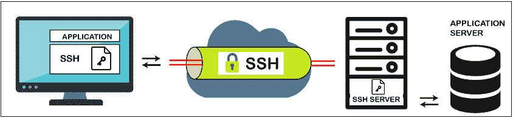

该图给出了 SSH 隧道的简化描述。不可信网络上的安全连接在 SSH 客户端和 SSH 服务器之间形成。这个 SSH 链接是安全的，保持秘密和诚实，并验证各方的通信。

## SSH SOCKS 隧道的使用

SSH 连接被程序用来连接到程序的服务器。在允许隧道的情况下，程序会联系 SSH 客户端监听的本地主机端口。SSH 客户端然后通过其加密隧道将应用程序转发给服务器。然后，服务器连接到主应用服务器——通常与 SSH 节点位于同一台计算机或同一数据中心。

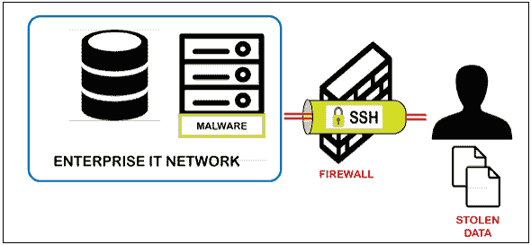

## SSH SOCKS 隧道的优势

SSH SOCKS 隧道的优势如下:

1.  SSH 隧道广泛应用于一些使用大型机结构作为程序后端的企业环境中。在这种情况下，程序本身几乎没有本地安全保护。
2.  通过使用 SSH 隧道，可以实现与 SOX、HIPAA、PCI-DSS 和其他需求的兼容性，而无需更改程序。
3.  SSH 隧道有助于您仔细检查防火墙后面的资源。
4.  它还向互联网公开了本地服务器。
5.  它还帮助信息技术专业人员和网络管理员通过他们的系统在内部网络中使用它进行后门打开。
6.  它为你提供了一些免费的选择。他们是-
    *   服务器
    *   恩格罗克

## 为私人浏览设置 SSH 隧道

系统中使用 Windows 的用户，可以借助 **Putty SSH 客户端设置 SSH 隧道。**要下载和设置 SSH 隧道，您需要遵循以下步骤。

**第一步:**首先，你需要点击下面给出的链接。点击链接后，您会看到下面的屏幕。

[https://www . chiark . greenend . org . uk/~ sgtatham/putty/latest . html](https://www.chiark.greenend.org.uk/~sgtatham/putty/latest.html)

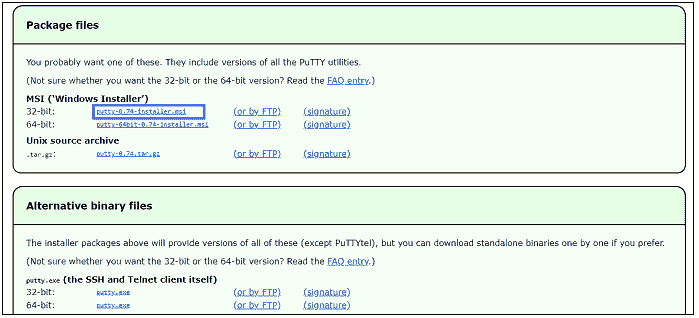

**第二步:**可以根据自己系统的系统需求选择下载链接。启动安装程序后，您会看到以下屏幕。

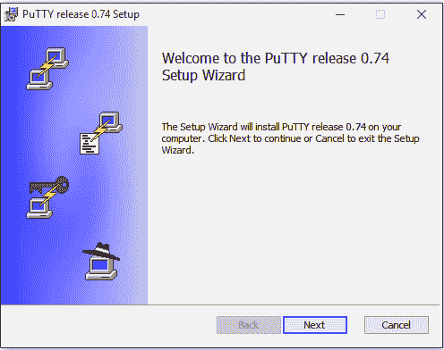

**第三步:**点击下一步按钮后，得到下面的片段。

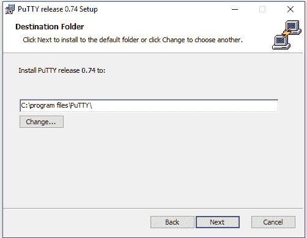

在上面的屏幕中，您可以选择要安装 Putty 软件的位置。您也可以通过单击更改按钮来更改位置，单击下一步进行下一步操作。

**第四步:**点击下一步后，出现如下画面。现在，您需要单击安装按钮，在您的系统中安装 Putty 的产品功能，以实现 SSH 隧道。

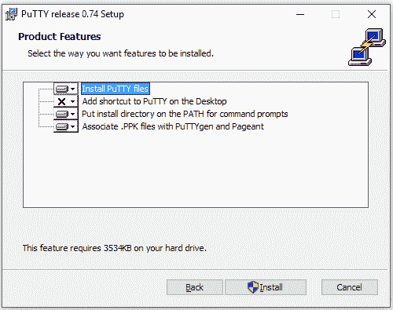

**第五步:**点击安装后，得到如下片段。


现在您的整个设置已经安装完毕。您可以创建 SSH 隧道用于私人浏览。

## 腻子的配置

让我们借助以下步骤来看看 Putty 配置。

**第一步:**首先，你需要启动**。exe 文件，**你会看到下面的屏幕。

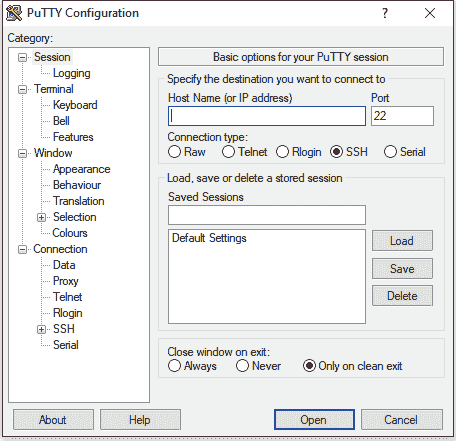

**第二步:**现在需要在具体的文本字段中输入**主机名或服务器 IP 地址**，如下图。

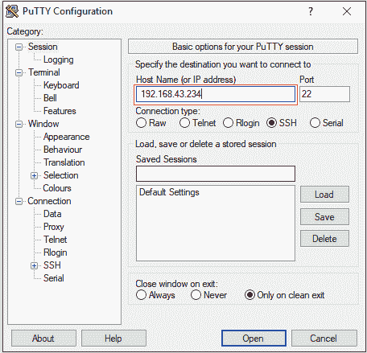

**步骤 3:** 现在，您必须支付出现在下面提到的片段中显示的**连接**菜单中的 **SSH** 选项。

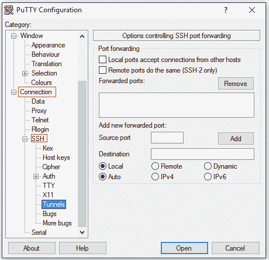

**第 4 步:**现在，在源端口字段中，您必须输入端口号 **9090** ，并选择名为**动态**的单选按钮。下面的截图就体现了这一点。

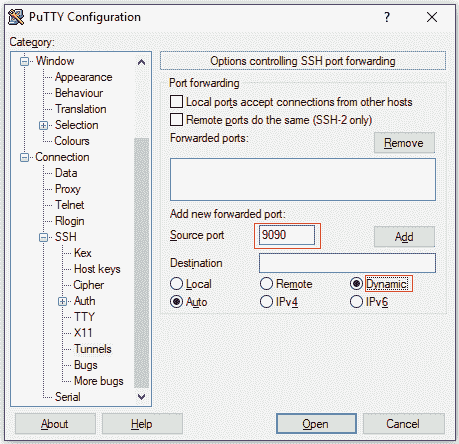

**第五步:**现在，您需要点击**源端口**字段旁边的**添加**按钮，如下图所示。


**第 6 步:**点击**添加**按钮后，在上述文本字段中得到输入的端口号。它在下面的代码片段中定义。

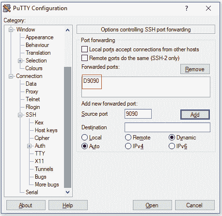

**第 7 步:**现在，您转到**会话选项卡**来存储设置，这样您就不需要每次都更新它们。然后在保存的会话字段中插入会话名称，并点击**保存**按钮。它显示在下面的代码片段中。

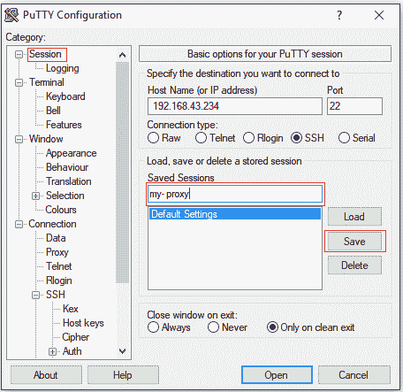

**第 8 步:**现在，您需要选择保存的会话，然后点击**打开**登录**到远程服务器的**按钮。它显示在下面的代码片段中。

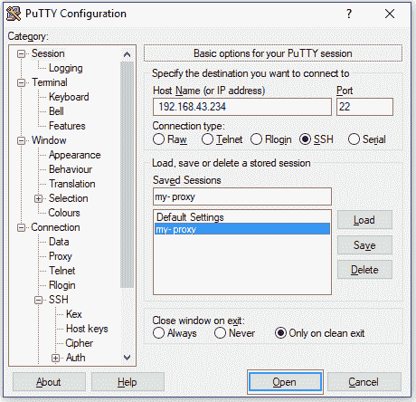

**步骤 9:** 出现一个窗口，询问用户名和密码。您将登录到您的帐户，直到您输入用户名和密码，SSH 隧道将被启用。

创建公钥身份验证有助于您在不插入密码的情况下连接网络。

## 使用代理服务器的浏览器配置

代理设置允许在您的 web 浏览器和服务器之间放置一个间接代理来调用另一个设备。代理是一种基于软件的计算机设备，其功能类似于中间人。在您的设备上，您需要代理设置来连接代理服务器。

既然您已经解锁了 SSH SOCKS 隧道，那么配置您最喜欢的浏览器来使用它就是最后一个阶段了。

这里，我们已经解释了不同浏览器的代理服务器配置。

### 火狐浏览器的 SSH SOCKS 配置

SSH SOCKS 配置的一些步骤如下。这些步骤同样适用于 Linux、MacOS 和 Windows。

**第一步:**首先，你需要打开火狐浏览器，然后点击右上角的 **☰(汉堡图标)**。它可以帮助您扩展浏览器的菜单，如下图所示。

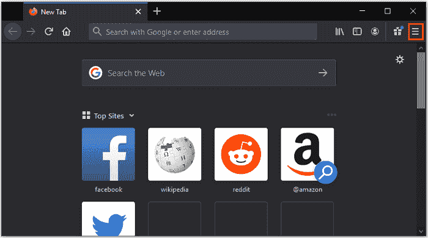

**第二步:**现在，点击**选项选项卡，**即可获得以下片段。

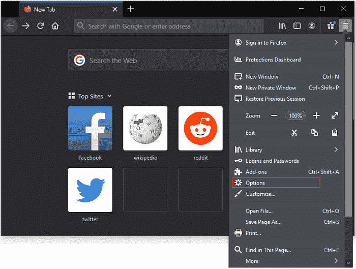

**第三步:**点击菜单选项卡中的**选项**后，得到如下截图。

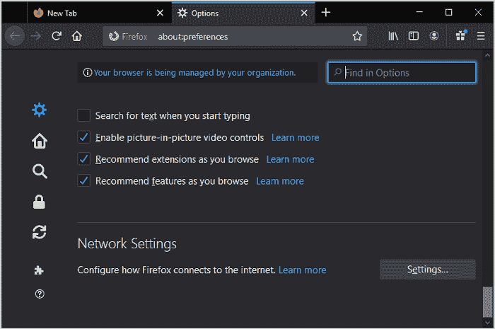

**第 4 步:**现在，您需要向下滚动到**网络设置**区域，并选择**设置**按钮。如下图所示。

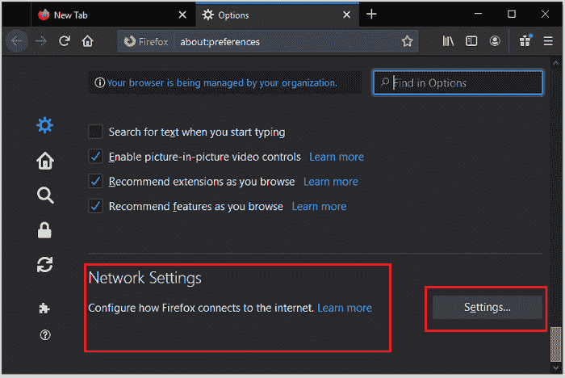

**第五步:**点击**设置…选项后，**会打开一个新窗口，出现如下画面。

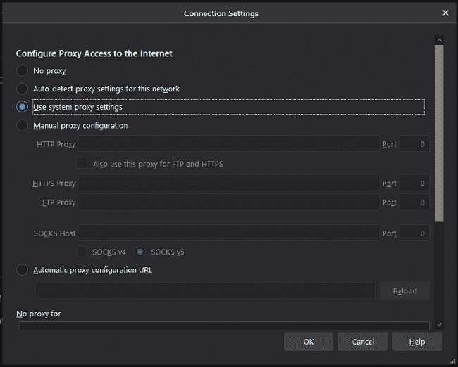

**第 6 步:**现在，您需要点击**手动代理配置**的单选按钮，并在 **SOCKS 主机文本字段**中输入 **127.0.0.1** 。它显示在下面的代码片段中。

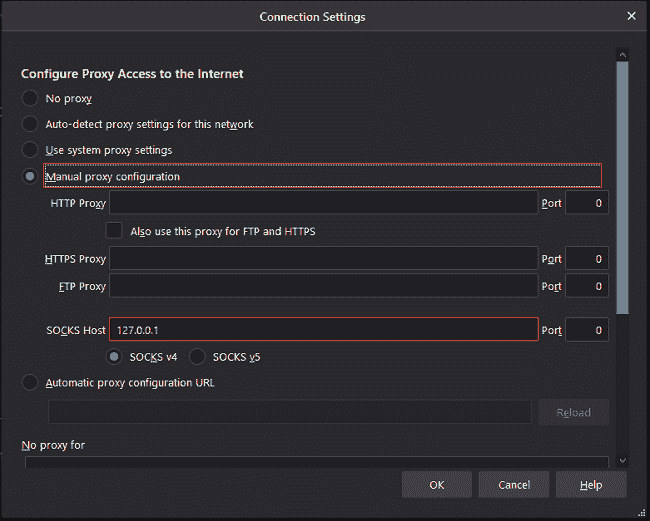

**第 7 步:**现在，在 SOCKS 主机旁边的端口字段中输入端口号 **9090** ，如下图所示。

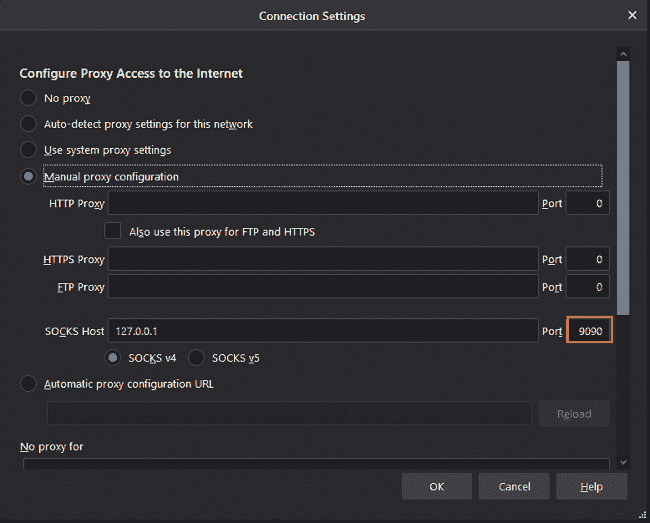

**第 8 步:**输入端口号后，点击**确定**按钮保存这些设置后，需要选择 **SOCKS v5 域名服务器复选框**。它在以下屏幕中定义。

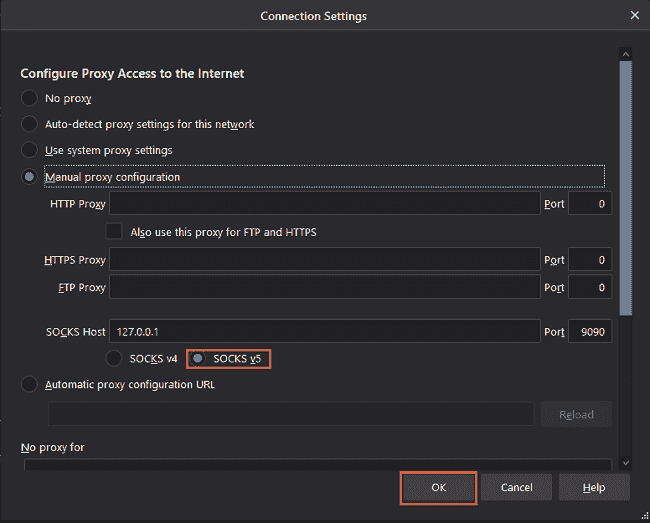

**第九步:**点击**确定**按钮后，你的浏览器配置到代理服务器。

如果你想检查这个，那么你可以在网址中输入**<u>【Google.com】</u>**，搜索你自己的 IP 地址为**我的 IP 是什么**。浏览器将返回您设备的 IP 地址。它显示在下面的代码片段中。

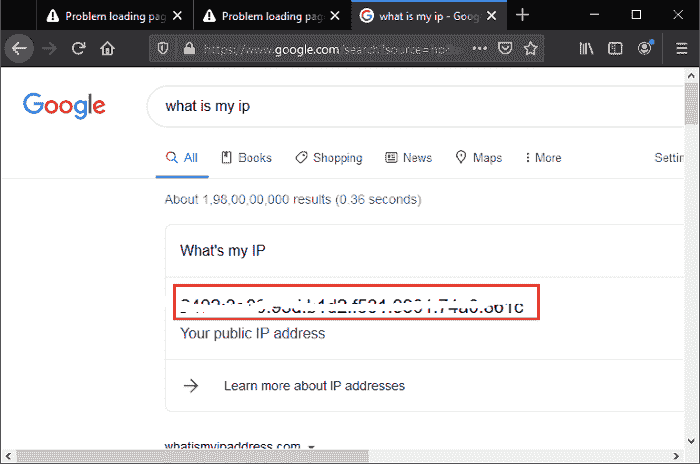

如果想回到之前的设置，那么进入**网络设置，**选择**系统代理设置的单选按钮，**点击**确定**保存设置。

还有很多扩展可以让你自定义火狐的代理设置，比如**foxproxy。**

### 谷歌 Chrome 浏览器的 SSH SOCKS 配置

谷歌浏览器使用默认的设备代理设置。您可以使用像 SwitchyOmega 这样的插件，或者从命令提示符启动 Chrome 互联网浏览器，而不是修改您的操作系统代理设置。

您也可以在谷歌浏览器的命令提示符的帮助下，使用下面给出的命令来使用 SSH 隧道。

```

"C:\Program Files (x86)\Google\Chrome\Application\chrome.exe" ^
    --user-data-dir="%USERPROFILE%\proxy-profile" ^
    --proxy-server="socks5://localhost:9090"

```

如果不存在，将自动生成配置文件。这有助于您同时运行 Chrome 的几个迭代。“启动 google.com 并搜索”“我的 IP 是什么”以验证 SSH 隧道是否运行正常。浏览器中显示的 IP 地址应该是服务器的 [IP](https://www.javatpoint.com/ip) 地址。

* * *