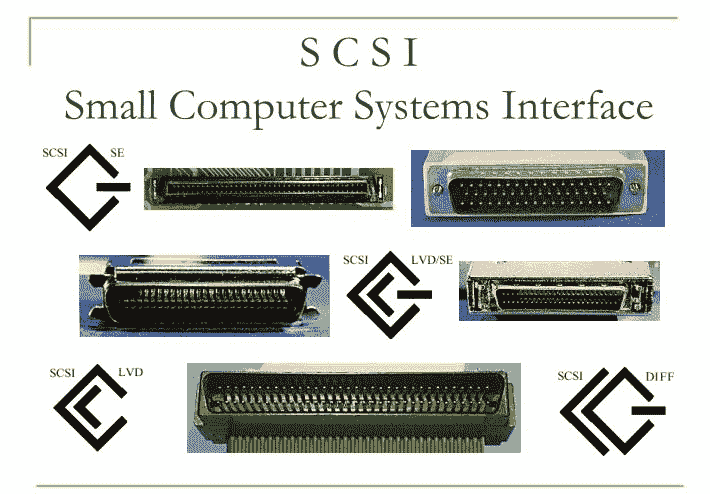

# 小型计算机系统接口

> 原文：<https://www.javatpoint.com/small-computer-system-interface>

将外围设备连接到电脑的基本接口是小型计算机系统接口。根据规范，它通常可以使用一条路由和一个主机适配器来响应多达 16 个外部设备。小型计算机系统接口用于提高性能，提供快速数据传输，并为光盘驱动器、扫描仪、 [DVD >](https://www.javatpoint.com/dvd-full-form) 驱动器和 [CD](https://www.javatpoint.com/cd) 写入器等机器提供更广泛的扩展。小型计算机系统接口最常用于 [RAID](https://www.javatpoint.com/dbms-raid) 、服务器、高效台式计算机和存储区域网络。小型计算机系统接口具有控制功能，负责通过小型计算机系统接口总线和计算机传输数据。可以固定在 [**主板**](https://www.javatpoint.com/motherboard) 上，也可以通过电脑主板上的扩展安装一个客户端适配器。控制器还集成了一个简单的 SCSI 输入/输出系统，这是一个小芯片，为访问和控制设备提供必要的软件。SCSI ID 是他的号码。使用串行存储体系结构启动器，新的串行 SCSI 标识(如串行连接的 SCSI)使用分配 7 位数字的自动过程。

### 串行连接的 SCSI

SAS 产品与使用以前 SCSI 技术的设备兼容。如果 SCSI 性能不合适，可以使用串行存储体系结构标准，iSCSI 也可以，它通过在 [TCP/IP](https://www.javatpoint.com/tcp-ip-full-form) 上嵌入 SCSI-3 来保留 SCSI 命令集。在企业环境中，SAS 已经成为并行 SCSI 的常见替代方案。串行和并行小型计算机系统接口都基于 SCSI 命令集。

**与并行 SCSI 相比，SAS 具有以下独特优势:**

外围设备通过总线和接口连接到 [CPU](https://www.javatpoint.com/cpu-full-form) ，连接这些设备最常用的接口是 SCSI。与早期使用的并行数据传输接口相比，SCSI 在数据传输和兼容性方面是革命性的技术。当系统符合以前的 SCSI 版本时，SCSI 还提供向后兼容性。SCSI 的现代变体也可以连接到这些机器，尽管数据传输速率会更高。原始 SCSI 使用了一条 SCSI 并行总线。

2008 年，实现了比并行 SCSI 总线更快、更稳定的串行 SCSI 架构。互联网 SCSI 使用互联网协议。这种设计没有任何物理特征。它通过 TCP/IP 传输数据。舒加特联合机器接口公司于 1978 年开发了 SCSI，并于 1981 年将其产业化。这项技术的创始人是拉里·鲍彻(Larry Boucher)，他曾受雇于舒加特联合公司，后来又受雇于 Adaptec，一家生产 SCSI、串行连接 SCSI 和支持主机适配器的公司。为了传输数据，SASI 被开发为硬盘和主机之间的接口。利用 8 位奇偶校验总线，它有一个 50 针带状插头，最多支持 8 个设备。SASI 以 5 兆赫的时钟速度分块发送数据，并以 3.5 兆字节/秒或 5 兆字节/秒的同步模式异步运行。

到 2000 年，Ultra 640 SCSI 的时钟速度达到了 160 兆赫，这就产生了并行布线问题。已更改串行 SCSI 以修复错误。对于串行高级技术附件，设备链接现在是可热插拔的，并且成本更低。使用仲裁光纤通道环路和光纤电缆，时钟速度提高到 4 千兆赫。使用一个插槽，SCSI 可以支持外部和内部 SCSI 设备。内部并行 SCSI 带状导线通常有两个或三个 50、68 或 80 针插座。端口由外部设备使用。根据 SCSI 总线标准，外部电缆始终是屏蔽的，每端有 50 或 69 针插座。还有一个单一的连接器附件，它包含内部连接的两种变体。

SCSI 设备和主机适配器都支持单个菊花链。在一系列节点中，菊花链使用硬件设置将模块一个接一个地连接起来。根据 SCSI 版本，SCSI 图形用户界面支持不同的设备。菊花链的优势是能够在链的任何地方添加额外的节点。一个或多个信号在被发送到下一个单元之前可以被链中的每个单元修改。SCSI-2 支持 16 台计算机，超级 SCSI 支持 5 到 8 台，超 320 SCSI 支持 16 台。

* * *