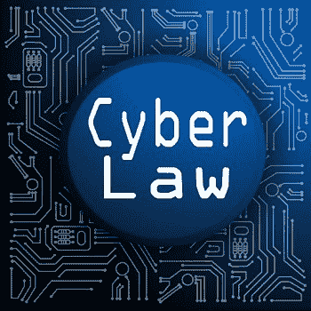
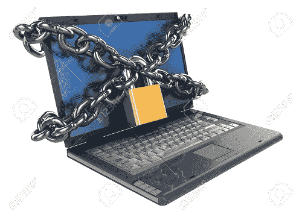
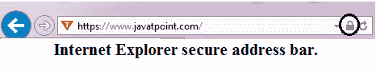

# 什么是网络法？

> 原文：<https://www.javatpoint.com/what-is-cyber-law>

网络法，也称为互联网法或网络法，是整个法律体系的一部分，与法律信息学有关，监督信息、电子商务、软件和信息安全的数字流通。它与法律信息学和电子元素相关，包括信息系统、计算机、软件和硬件。它涵盖许多领域，如互联网的接入和使用，包括各种分主题以及言论自由和在线隐私。

网络法律有助于减少或防止人们进行大规模的网络犯罪活动，这有助于保护信息免受未经授权的人的访问，与使用[互联网](https://www.javatpoint.com/internet)相关的言论自由，隐私，通信，电子邮件，网站，知识产权，硬件和软件，如数据存储设备。随着互联网流量与日俱增，这导致全球法律问题的比例越来越高。由于不同国家和司法管辖区的网络法律不同，恢复原状的范围从罚款到监禁不等，执行起来具有挑战性。

网络法为使用互联网和经营在线业务的人提供法律保护。对于互联网用户来说，最重要的是了解他们所在国家的地区和网络法律，这样他们就可以知道网络上哪些活动是合法的，哪些是非法的。此外，它们可以防止我们进行未经授权的活动。

《计算机欺诈和滥用法案》是 1986 年颁布的第一部名为《CFFA》的网络法律。这项法律有助于防止未经授权访问计算机。它还描述了违反该法律或从事任何非法活动的惩罚阶段。

## 为什么需要网络法律？

使用互联网有许多安全问题，也有不同的恶意者试图未经授权访问您的计算机系统来实施潜在的欺诈。因此，类似地，任何法律，网络法都是为了保护在线组织和网络上的人免受未经授权的访问和恶意的人。如果有人从事任何非法活动或违反网络规则，它会让人们或组织对这些人进行处罚或采取行动。

## 如果有人违反了网络法律会发生什么？

如果有人违反了网络法律，将根据他违反的网络法律的类型、他居住的地方以及他违法的地方对该人采取行动。有很多情况，比如如果你在网站上违法，你的账户将被禁止或暂停，并封锁你的 [IP(互联网协议)](https://www.javatpoint.com/ip-full-form)地址。此外，如果任何人从事非常严重的非法活动，例如造成另一个人或公司的痛苦、黑客攻击、攻击另一个人或网站，可以对该人采取预先行动。

## 网络法的重要性

制定网络法律是为了惩罚在网上从事任何非法活动的人。它们对于惩罚与这些类型的问题相关的行为非常重要，例如在线骚扰、攻击另一个网站或个人、数据盗窃、扰乱任何企业的在线工作流程以及其他非法活动。

如果有人违反了网络法律，将根据他违反的网络法律的类型、他居住的地方以及他违法的地方对该人采取行动。最重要的是惩罚罪犯或将他们绳之以法，因为大多数网络犯罪超越了不能被视为普通犯罪的犯罪界限。

这些犯罪可能对个人信息或一个国家失去可靠性和保密性非常有害。因此，这些问题必须依法处理。

*   当用户在互联网上申请交易时，网络法律涵盖了每一笔交易并保护他们。
*   它触及网络空间的每一个反应和行动。
*   它捕捉互联网上的所有活动。

## 网络法律涉及的领域

这些法律涉及发生在网上的多种活动和领域，有多种用途。有些法律是为了描述组织中使用互联网和计算机的策略而制定的，有些法律是为了保护人们免受未经授权的用户和恶意活动的侵害。网络法律下有各种各样的类别；其中一些如下:

**欺诈**

制定网络法律是为了防止金融犯罪，如身份盗窃、信用卡盗窃和其他发生在网上的犯罪。如果一个人犯了任何类型的身份盗窃，他可能会面临联邦或州的刑事指控。这些法律解释了针对使用互联网的指控进行起诉和辩护的严格政策。

**版权问题**

互联网是包含不同类型数据的来源，可以随时随地访问。但是复制任何其他人的内容是任何人的权力。如果有人违反保护个人和公司创造性工作的版权，网络法律中会有严格的规定。

**骗局/背叛**

互联网上有各种各样的欺诈和骗局，对任何公司或个人都是有害的。网络法律提供了许多方法来保护人们，防止网上发生的任何身份盗窃和金融犯罪。

## 网络侮辱与人格退化

有多个在线社交媒体平台是与任何人自由分享你的想法的最佳资源。但是如果你在网上发言和诽谤某人，网络法律中有一些规定。网络法律解决和处理许多问题，如种族主义、网络侮辱、保护个人名誉的性别目标。

**网络骚扰和跟踪**

骚扰是网络空间的一个大问题，它违反了刑法和民法。在网络法律中，有一些硬性的法律来禁止这种卑鄙的罪行。

**数据保护**

使用互联网的人依靠网络法律和政策来保护他们的个人信息。公司或组织也依赖网络法律来保护其用户的数据以及维护其数据的机密性。

**合同和就业法**

当您访问一个网站时，您点击一个按钮，该按钮会发出一条消息，要求您同意条款和条件；如果你同意，这就确保你使用了网络法律。对于每个网站，都有与隐私问题相关的条款和条件。

**商业秘密**

有许多从事在线业务的组织经常依靠网络法律来保护他们的商业秘密。例如，像谷歌这样的在线搜索引擎花费大量时间来开发生成搜索结果的算法。他们还花费大量时间开发其他功能，例如智能辅助、航班搜索服务等。网络法律通过描述保护其商业秘密的必要法律来帮助这些组织采取法律行动。

## 如何在网络上保护自己

虽然互联网是一个包含多种不同类型内容的资源，但有许多黑客或未经授权的用户可能会对您有害，以窃取您的个人信息。下面给出了所有可能有助于您在使用互联网时保护个人信息和计算机安全的步骤。所有给定的步骤或建议对所有计算机用户都是有益的，即使他们使用的是什么类型的计算机、设备或操作系统。

### 验证数据是否加密

当您发送任何机密信息时，如借记卡号、信用卡号、用户名或密码，请安全地发送这些类型的信息。在互联网浏览器中，寻找一个小锁(互联网浏览器安全锁)来验证这一点；浏览器地址栏或浏览器窗口底部的右上角将显示一个图标。如果您看到图标，它应该处于锁定状态，而不是解锁位置。此外，确保[网址](https://www.javatpoint.com/url-full-form)以 [https(超文本传输协议安全)](https://www.javatpoint.com/https)开头，如下图所示:

如果锁定图标处于锁定位置，并且数据被拦截，数据将被加密，这有助于保护您的数据安全，并防止其他人理解它。如果锁处于解锁位置或看不到锁，任何人都可以读取数据，因为所有信息都是纯文本形式。例如，一个在线论坛是不安全的，使用密码，但你不会像网上银行网站那样使用受保护网站的密码。

### 使用安全的密码

像网上银行网站或者其他含有机密信息的网站，需要使用非常强的密码，也是推荐的；对于所有需要登录 id 和密码的网站，您必须使用不同的强密码。如果您需要帮助来记住密码，可以使用密码管理器。

### 让您的软件和操作系统保持最新

为了在互联网上保护自己，最好定期更新安装在计算机和操作系统上的软件。这是必要的，因为许多更新是由操作系统的开发人员发布的，与计算机安全相关的问题有关。因此，您应该在最新更新发布时更新您的系统。

### 如果可用，请始终启用双因素身份验证

您可以使用双因素身份验证功能来使您的帐户更加安全，如 Gmail 或其他需要登录并包含您的私人数据的帐户。它通过在登录时添加额外的验证步骤来提供高级保护。如果您启用了双因素身份验证，并且该服务在验证您的密码后没有验证您的计算机或其他设备，它会在您的手机上发送带有验证码的文本消息。它包括更强大的安全性；例如，如果有人知道您任何帐户的密码，并试图访问您的帐户，但他没有您的电话，即使使用有效的密码，他也无法访问您的帐户。

### 请务必小心电子邮件链接和附件

通过电子邮件发送的电子邮件附件和超链接是传播病毒和恶意软件的最常见资源。建议始终极其谨慎地打开任何附件和超链接，这些附件和超链接是您通过电子邮件从其他人那里收到的，即使它们是由朋友或家人发送的。

### 注意网络钓鱼诈骗

有许多网络钓鱼诈骗和技术，可以更有害的方面失去你的秘密信息。因此，有必要熟悉这些类型的技术。黑客主要针对需要登录的网站，如贝宝、易贝、亚马逊、网上银行网站和其他热门网站。

### 电子邮件没有加密

如果您通过电子邮件发送任何机密信息，未经授权的用户可以阅读或理解，因为电子邮件没有加密。因此，借记卡信息、信用卡信息、密码等机密数据不应通过电子邮件传输。

### 使用替代浏览器

为了保护您的系统，互联网浏览器也发挥了重要作用。例如，早期版本的 Internet Explorer 并不更安全。如果你使用的是像[互联网浏览器](https://www.javatpoint.com/internet-explorer)这样的[浏览器](https://www.javatpoint.com/browsers)的 lass 安全浏览器，你应该切换到另一个浏览器，像 *[Mozilla Firefox](https://www.javatpoint.com/mozilla-firefox)* 或 *[Google Chrome](https://www.javatpoint.com/google-chrome)* 。此外，如果您在计算机上使用微软视窗 10 操作系统，并想继续使用微软互联网浏览器，您可以切换到微软边缘，而不是在保护您的系统方面更安全的互联网浏览器。

### 接受或同意提示时要小心

当指示您安装附加组件或任何程序时，在单击“确定”按钮之前，您需要仔细阅读并理解协议。如果您不理解协议或觉得没有必要安装，您不应该安装这种程序，取消或关闭窗口，这可能对您有害。

此外，当您安装附加组件或任何程序时，您需要注意询问该第三方程序是否可以安装的任何复选框。这些通常会导致更多的问题，并且不选中这些框，因为它们从来都不是必需的。

### 在您登录的地方要小心

**业务**

如果您在任何组织中工作，您的工作地点可以通过安装键盘记录器或使用其他方法来监控您的计算机。在这种情况下，如果某人可以访问这些信息，他可以收集用户名和密码并读取这些日志。丢失个人信息会更有害。此外，如果您的计算机与其他同事共享，请不要在浏览器中存储任何密码。

**无线网络**

当您使用无线网络时，您必须小心从您的计算机发送到您的计算机的所有信息都可能被任何未经授权的人读取和拦截。您可以在使用 WPA 或 WEP 的帮助下安全地登录网络，并防止丢失您的机密信息。此外，如果是家庭无线网络，请确保网络安全。

**朋友家**

有时，您可能会使用朋友的计算机，并在该计算机上登录到您的帐户，这可能不完全安全。有意或无意地，您可以在朋友的电脑或不熟悉的电脑上输入您的用户名和密码。最后，当您登录朋友计算机上的任何网站时，切勿将密码信息保存在朋友的计算机浏览器上。

### 分享东西之前一定要先思考

有许多社交媒体网站，如脸书的 Instagram，可以让你在网上结交朋友，并与他们建立联系。社交网站也是与朋友、家人或其他人分享个人信息的最佳场所。当你在社交网站或互联网上分享一些东西时，确保你没有发送任何可能对你有害的信息，如果每个人都看到的话。社交网络或互联网上发送的信息应该是公开的。另外，确保你分享的东西不会冒犯任何人或让你尴尬，而且你不能上传到互联网上。

### 更新互联网浏览器插件

您应该更新互联网浏览器插件或安装最新的插件，以便在计算机联机时保护自己。由于像 Adobe Flash 这样的浏览器插件，攻击者可能会发现一些攻击任何系统的简单性或安全性漏洞。因此，您需要定期检查您安装的所有互联网插件是否是最新的。

### 注意你周围的人

如果你在任何公共区域、学校、图书馆等使用电脑，请确保没有人在看你的屏幕，因为你周围会有很多人。另一方面，如果有人在看你的系统屏幕，那就要小心了，这叫做肩部冲浪。如果您需要系统屏幕保密，您可以使用隐私过滤器进行显示。

### 保护保存的密码

有许多用户习惯性地在系统上保存登录信息和密码，但这可能是不安全的。因此，请确保将您的个人详细信息(如信用卡详细信息和帐户密码)存储在安全的地方。建议每个人都使用密码管理器来保存密码。

密码管理器是一种保存所有安全加密和登录信息的软件，密码保护这些信息。如果您将密码保存在浏览器中，并且任何人都可以访问您的互联网浏览器，则该人可能会看到密码信息。例如，在火狐浏览器中，如果您没有设置主密码，任何人都可以看到所有存储的密码。

### 不要总是相信你在网上读到的东西

你应该知道任何人都有可能在互联网上发布网站。有各种各样的创作者，他们可能只是为了恶意目的而创建一个网站。例如，可以创建一个网站来获得未经授权的访问，并传播恐惧、谎言或恶意软件。

* * *