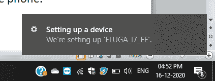
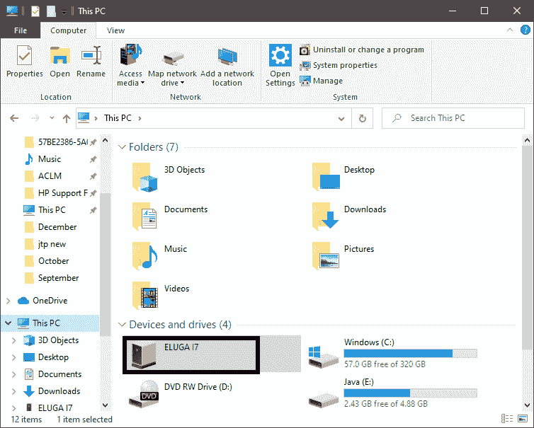
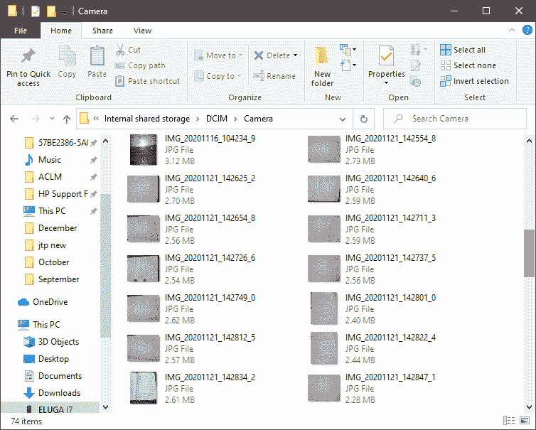
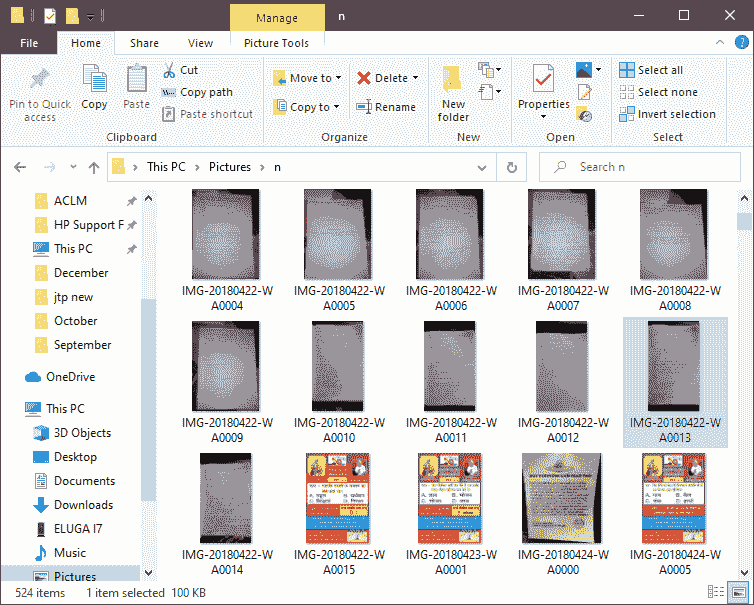
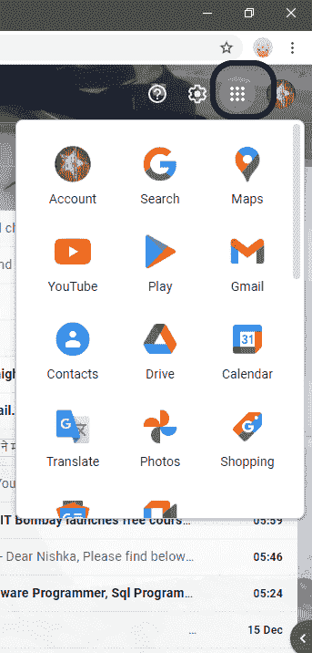
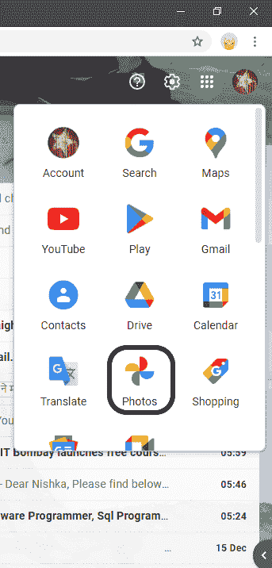
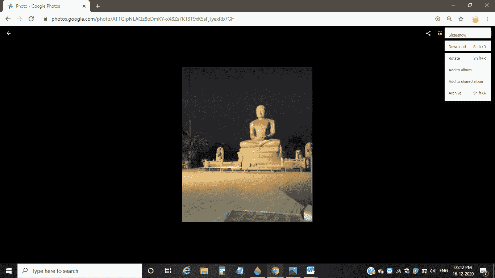

# 如何将照片从安卓系统传输到电脑

> 原文：<https://www.javatpoint.com/how-to-transfer-photos-from-android-to-computer>

照片是人们在生活中发生的事件中收集的记忆。如今，每个人都曾经拥有摄像头质量很好的安卓智能手机，通过它，人们点击图片。但是，制造记忆意味着对手机的存储要求更高。当内存填满时，会出现两种选择，即要么删除一些图片以增加存储空间，要么将其转移到另一个位置。删除有时似乎是一个不想要的选项，但将照片转移到另一个位置是一个很好的选择。所以，人们肯定会选择把照片转移到另一个地方。

在这里，我们将学习如何将照片从安卓手机传输到计算机系统，以及其中包括的步骤。

## 将照片从安卓手机传输到电脑

我们可以通过各种方法将手机照片传输到计算机系统。我们将逐一讨论这些方法。

### 通过通用串行总线传输照片

这是用于将照片/文档从安卓系统传输到计算机系统的最重要的方法。我们需要一根 [USB](https://www.javatpoint.com/usb-full-form) 线将照片从手机传输到电脑。

按照以下步骤将照片从 android 传输到电脑:

1)将 USB 线与手机和电脑连接。将电缆的宽引脚连接到计算机插槽，将细引脚连接到移动插槽。

2)在手机上启用文件传输，这样就可以进行文件传输。

3)当电脑识别到手机时，名称会显示在系统上。快照如下所示:

4)单击您可以在其他电脑驱动器上看到的移动名称，如下所示:

5)点击内部存储，你会看到很多文件夹。您需要选择“DCIM”并移动到要将照片传输到计算机的文件夹。下面显示了一个快照，其中我们选择了“相机”文件夹:

6)选择要从手机转移到 PC 的照片，按 **Ctrl+X** 。它会从你的手机上剪下图像。

7)现在，在您的电脑上选择或创建一个位置来保存这些照片。移动到想要的位置，按 **Ctrl +V** ，你剪切的照片会在这里得到粘贴，如下图快照所示:

8)照片传输完成后，从手机和电脑上拔下 USB 电缆。

这样，手机存储也将免费，照片的传输也将在您的电脑上完成。

### 通过谷歌驱动器传输照片

[Google Drive](https://www.javatpoint.com/gdrive) 是一个 Google 平台，可以让我们将文档、图像和其他东西从一个地方传输和上传到另一个地方，或者从一个人传输和上传到另一个人。有了这个，谷歌提供了“谷歌照片”，也允许我们保存照片并与人和朋友分享。不用担心，当我们创建我们的 Gmail 账户时，我们还会获得谷歌的某些其他应用程序，其中谷歌照片就是其中之一。只是我们需要启用同步您的移动设备的照片。因此，使用谷歌照片和谷歌驱动器，我们也可以在我们的计算机系统上有照片。在这里，我们将讨论将照片从手机共享到计算机系统的步骤:

1)在电脑的互联网浏览器上打开 **Gmail** ，登录自己的账户。然而，如果你没有谷歌账户，通过完成要求的细节创建一个账户。然后登录您的帐户。

2)当 Gmail 打开时，你会看到右上角“设置”图标旁边有 9 个正方形的点组合(称为谷歌应用程序)，如下图所示:

3)当你点击这些点时，你会看到各种其他谷歌应用，如上图所示。

4)在谷歌应用列表中，“谷歌驱动”和“谷歌照片”是最受欢迎的。由于您必须与您的系统共享照片，您需要打开谷歌照片，因此单击谷歌照片图标，该图标在应用程序列表下被命名为“照片”。快照如下所示:

5)如果您已经在移动设备上的谷歌照片上启用了同步，您手机的图像将保存到谷歌云，您也可以在电脑上看到这些照片。但如果没有这样做，登录谷歌照片，它将允许在谷歌照片上同步照片。

6)现在，选择要转移到电脑上的照片，单击三个垂直点，然后单击“下载”或按“Shift + D”。所选照片将被下载到您的计算机上。

7)在 Google Drive 的情况下，你需要在上面上传你的照片，然后你可以在你的电脑上打开 Google Drive，查看或下载照片到你的电脑上。

#### 注意:您同步或上传手机照片的谷歌帐户，您也应该登录到系统上的同一帐户。

但是，谷歌照片是一种分享照片到我们电脑的方法，但是谷歌照片是一个存储的地方，所以建议如果我们想保留照片仅供查看，就不需要将照片传输到系统。在系统上打开谷歌照片并查看。

与谷歌照片和谷歌驱动类似，也有其他软件可用，如微软照片或 Dropbox，方便我们随时随地存储、传输和查看照片。

## 将照片传输到计算机的其他方法

*   **蓝牙:**由于每一个电脑系统都有蓝牙功能，对于那些支持蓝牙的系统来说，这是一种替代方法。然而，几乎每个键盘和智能安卓手机都支持蓝牙。因此，如果您的设备具有蓝牙功能，您可以将您的照片从移动设备共享到电脑。一个好处是不需要进行任何有线连接，因为蓝牙共享是无线的。使用蓝牙传输图像的过程缓慢但方便。你需要在两个设备(安卓和电脑)上打开蓝牙并配对，最后继续传输。
*   **USB-OTG:** 它是外部存储介质，我们可以通过它将照片传输到计算机系统。通用串行总线-OTG 是移动的通用串行总线，它同样属于通用串行总线协议。每个安卓系统都支持 USB-OTG。一个通用串行总线 OTG 有两个连接器引脚，其中一个是**小型**，另一个是**大型**。要使用通用串行总线 OTG 传输数据，请将手机充电针插槽中的微型连接器针和另一个连接到合适的电脑插槽。现在，轻松地将数据传输到计算机。因此，将它连接到设备，并开始将照片从手机传输到计算机。
*   **电子邮件传输:**也可以使用电子邮件帐户传输手机图像。但是，当需要将四到五张照片传输到计算机时，这是一个选项。否则，传输图像会消耗大量时间。电子邮件帐户链接到谷歌照片或谷歌驱动也没关系。此外，它可以是雅虎邮件帐户或 Gmail 帐户。没关系。要使用电子邮件帐户传输照片，我们需要撰写一封邮件，选择您想要传输的图像，并添加另一个邮件 id(收件人)，您将向其共享图像。最后，发邮件。然而，撰写电子邮件的过程可能因电子邮件提供商而异，但使用起来太简单了。

因此，上面讨论的所有这些都是一些方法，通过这些方法，我们可以将照片从移动设备共享或传输到计算机系统。需要根据设备的规格选择一种兼容且合适的方法。

* * *