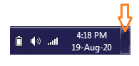

# 什么是桌面？

> 原文：<https://www.javatpoint.com/what-is-a-desktop>

桌面是个人计算机的基本元素，代表不同类型的对象，包括项目文件夹、参考源、绘图工具、文档、书写工具、电话簿、电话。它是计算机的主要用户界面，可以在物理桌面上找到。桌面显示是默认显示，在系统启动时启动过程完成后显示。

存储到桌面的文件和文件夹的图标以及桌面壁纸都会显示在桌面上。在 [Windows 操作系统](https://www.javatpoint.com/windows)中，它包括一个位于显示屏底部的任务栏。在 Mac OS X 中，屏幕顶部包含底部的 Dock 和菜单栏。Windows 和 Macintosh 计算机都有一个桌面，但是如果显示屏没有被应用程序或文件和文件夹图标填满，它将是可见的。

就像文件夹一样，用户可以将项目拖放到桌面上。从桌面屏幕访问项目非常容易，可以快速访问，而不是在几个目录中导航。因此，如果您将常用的应用程序快捷方式、文件和文件夹存储在桌面上，可能会对您有所帮助。

两种操作系统(Windows 和 Macintosh)都为用户提供了自定义桌面显示的选项。在 Windows 7 中，借助“个性化”控制面板，您可以选择默认桌面图标并更改桌面背景。此外，在 Mac OS X 10.6 中，您可以借助“桌面和屏幕保护程序”系统偏好设置来更改桌面背景。通过选择 Finder →偏好设置，您可以选择哪些项目应该显示在桌面屏幕上。

自个人电脑开发以来，桌面一直是设计中的一个常见概念，从基于命令行的操作系统到更高级的图形用户界面设计。最新的桌面设计包括桌面即服务和桌面虚拟化，其中桌面远程控制可能是所提供的技术服务的一部分。远程接口与云服务一起工作，在云服务中，所有数据、文件供应和更多的计算机程序安全地存储在外部位置。此外，微软首次将微软视窗桌面引入视窗 95，从那以后，它包含在每个版本的视窗中。例如，下图是微软视窗 95 桌面。

## Windows 桌面上有哪些项目和图标？

桌面包括一些最常见的图标，如互联网浏览器、回收站、我的文档和我的电脑。还有，在 Windows 桌面上，你会看到任务栏上有一个开始菜单按钮，还有 Windows 通知区；“开始”按钮包含许多基于 Windows 版本安装的应用程序和其他功能。此外，日期和时间包含在任务栏或通知区域中。此外，如果日期和时间不正确，桌面允许您进行更改。

## 如何快速进入 Windows 桌面

Windows 首先在启动时加载桌面。但是，当您开始打开系统上的文件时，桌面会隐藏起来。但是有各种方法可以在桌面上返回而不关闭任何打开的文件。下面给出了返回桌面的方法；你可以遵循任何你认为最简单的方法。

### 桌面快捷键

要返回到 Windows 桌面，您可以一起使用 Windows 快捷键和 D(Windows+D)。如果您想恢复隐藏的窗口，请再次按相同的键。还有，可以使用 *Windows 键+M；*会最小化所有打开的文件，显示桌面。恢复所有最小化的窗口，可以使用快捷键:*窗口键+ Shift + M* 。

### Aero Peek(航空电子游戏)

Windows 7、Windows 8 或 Windows 10 中有一个功能，叫做 Aero Peek。这是一个简单的功能，使您能够迅速回到桌面。您只需要将鼠标指针移动到任务栏的右下角，然后单击选项卡。您可以重复相同的步骤来撤消打开的窗口。

### 最小化所有打开的窗口

最小化所有打开的窗口是进入桌面的另一个选项，如果您只打开了一两个窗口，这可能是返回桌面的最快解决方案。但是，如果您打开了多个程序，可能需要更多时间来最小化所有打开的窗口。在这种情况下，您可以使用前面的方法之一，它比这个方法更合适。

## 一些与桌面相关的术语

### 桌面虚拟化

桌面虚拟化是一种技术，允许您将个人的电脑应用程序与其桌面分开，也称为客户端虚拟化。远程中央服务器用于托管虚拟桌面，而不是托管在个人计算机的硬盘上。在单一的中央服务器上，它为用户提供了维护其个人桌面的好处。借助局域网、广域网，在[互联网](https://www.javatpoint.com/internet)上，用户可以连接到中央服务器。此外，它允许用户通过远程连接从任何位置访问他们的桌面。

虚拟桌面接口是桌面虚拟化的一种常见方法，代表虚拟桌面接口或基础架构。在硬件和软件的帮助下，这种类型的桌面虚拟化得以实现；因此，它使用服务器计算模型。在虚拟机(VM)中，VDI 托管桌面环境，该环境运行在远程或集中式服务器上。桌面虚拟化提供了多种优势，包括集中管理、提高安全性、降低总体拥有成本、减少停机时间和能源成本。它也有一些缺点，例如，它增加了网络故障时的停机时间。此外，打印机驱动程序的维护和设置也很困难，如果网络管理不当以及虚拟数据接口部署涉及的成本，还存在安全风险。

### 桌面管理

桌面管理可以定义为客户端工作站部署流程和技术。它涉及跟踪、配置、安装和维护。DA 为用户提供了安全管理方面的优势，并为没有桌面系统管理员员工的组织提高了性能。DA 支持和结果是根据以下关键工作站组件确定的:

*   数据管理
*   用户设置
*   应用程序管理
*   安全
*   支持
*   资产管理

如果不执行适当的数据助理流程和程序，投入的计算机、软件和网络可能会很快演变成一个钱坑。

### 桌面即服务(DaaS)

桌面即服务是一种云计算，其中 VDI(虚拟桌面基础架构)外包给第三方提供商。DaaS 的功能依赖于虚拟桌面，它是一台专用机器或用户控制的会话，为世界各地的组织和用户转变云服务。这是一种最佳模式，允许服务提供商管理应用软件提供的所有后端职责。存储、网络资源和所有其他必要的支持基础架构也存在于云中。

DaaS 为笔记本电脑、台式机、手持设备、瘦客户机以及各种计算机资源的管理提供功能。DaaS 根据实现类型使用远程执行或分布式执行。组织和企业使用 DaaS，因为它们需要高水平的性能和可用性，这是传统 IT 解决方案的经济高效的替代方案。DaaS 有以下多重优势:

*   可靠性
*   数据安全
*   个性化
*   提高性能
*   最小化复杂性
*   灾难恢复
*   轻松的平台迁移
*   不间断连接
*   总成本降低

### 桌面出版系统

就桌面出版而言，使用数字桌面打印和构建文档被称为桌面出版。文档在打印时会被发布。当计算机还没有普及时，出版过程需要复制页面的大型印刷机。用于打印文本和图形；他们需要先剪下来，放在一张纸上，然后用胶带固定，最后复印打印出来。因为他们要分开打印。

当您使用计算机创建可打印文档时，可以将其视为桌面出版。为了创建文档的页面布局，桌面发行商使用像 Adobe InDesign 和 QuarkXpress 这样的程序。这些程序还可以用于创建小册子、传单、杂志、书籍、报纸和多种其他类型的打印文档。此外，像 Illustrator 和 Adobe Photoshop 这样的程序被出版商用来创建可打印的图像。

在现代，有许多技术支持桌面出版。例如，文字处理器使用户能够创建越来越复杂的通信模板和信函文档。随着时间的推移，文字处理器中还包含了一些其他工具，允许用户直接插入图形、图表、图片、表格和其他不同的增强功能，以标记功能元素或文本文档，如作者、标题等。政府或商业文件。如今，随着新的进步，桌面出版变得越来越受欢迎，比如 DocuSign 技术，其中 DTP 提供了远程签名的功能。

* * *