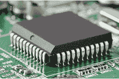
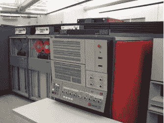

# 第三代计算机

> 原文：<https://www.javatpoint.com/third-generation-of-computer>

第三代计算机使用集成电路，而不是第二代计算机中使用的晶体管技术。它的时间大约在 1964 年到 1970 年。集成电路是一种小型芯片，是第三代计算机的标志。第三代计算机中使用的集成电路可以用作计算机存储器、微处理器甚至放大器。最早提出集成电路想法的是 1959 年飞兆半导体的罗伯特·诺伊斯和德州仪器的杰克·基尔比(美国电气工程师)。20 世纪 60 年代的集成电路彻底改变了计算的面貌，集成电路是一个有多个晶体管的单一电路。集成电路如下图所示:

与第一代和第二代计算机相比，第三代计算机中使用的技术使它们更可靠、更高效、体积更小。另外，与前两代计算机相比，第三代计算机采用集成电路，具有以下特点:例如更快的速度、可靠性、产生的热量更少、维护更少。他们消耗较少的电力；仍然很贵，需要空调。

可以说，第三代最重要的机器是 IBM-360 系列，它的功能更强大，在当时使用速度最快。有人说第三代计算机就是这台机器引进的，1966 年引进的 IBM System/360。这台机器的开发成本约为 50 亿美元，由 IBM 花费。特别是，这台机器是由 IBM 设计的，用于管理科学用途的高速数据处理，如全球天气预报、理论天文学、空间探索和亚原子物理。在一系列设备上，它提出了一种单一的计算机体系结构，这不是计算机设计的创新观点。

IBM System/360 型号 50 的速度大约是 ENIAC 的 263 倍。以今天的美元价格 4，140，257 美元计算，这种型号的 IBM 每秒可以执行 500，000 次添加。据国际商用机器公司估计，模型 91 将能够解决 1000 多个问题以及大约 2000 亿次计算。下图是一个 IBM System/360 的实例。介绍的时候看起来像下图。

在第三代计算机时代，需要多个集成电路来构建中央处理器。将整个处理器放在单个硅片上的想法直到第四代才出现。此外，第三代计算机采用了多道程序操作系统、分时和远程处理。在这一代中，使用了高级编程语言，如 ALGOL-68、FORTRAN-II TO IV、BASIC、COBOL、PASCAL PL/1 等。第三代计算机的其他例子有 PDP、霍尼韦尔-6000 和 DEC 系列。

## 第三代计算机的特点

因为第三代计算机是通过使用集成电路制造的，这种集成电路产生了如下各种特性:

*   第三代制造的计算机没有使用单个晶体管，而是使用了集成电路技术。
*   与第二代计算机相比，第三代计算机价格更便宜，体积更小，重量更轻，速度更快，效率更高。
*   使用了高级编程语言，如 ALGOL-68、FORTRAN-II 至 IV、BASIC、COBOL、PASCAL PL/1。
*   这些计算机被引进了磁存储器。

## 第三代计算机的优缺点

因为第三代计算机是在集成电路的帮助下制造的，这给计算机世界和用户带来了许多好处和限制。例如，与前两代计算机相比，第三代计算机在质量和性能方面一直很好，这意味着它们更可靠。此外，它们产生的热量更少，消耗的能量也更少。第三代通勤者的缺点是，即使产生的热量较少，他们仍然需要空调。

第三代计算机优势的其他一些例子包括:与前两代计算机相比，第三代计算机速度快(计算数据快)，功能多样，价格便宜，存储容量高，而且更精确。然而，第三代计算机的生产和制造过程更昂贵；因为制造集成电路芯片需要太多的资金。特别是，对于第三代计算机的制造商来说，它们非常昂贵。第三代计算机的优缺点如下:

| 优势 | 不足之处 |
| 

*   These computers need less space because they are smaller than the previous two generations of computers.
*   As integrated circuit technology is used to manufacture these computers, it makes them more reliable.
*   They don't need much energy when fighting; In addition, they generate less heat.
*   Because it is portable and faster, it is widely used.
*   These computers use fans to discharge their heads without manual calculation.
*   Due to less hardware failures, the maintenance cost is low.
*   They are used for general purpose and have high storage capacity to store information.
*   The third generation computer is more accurate.
*   In addition, in the third generation computers, the process of accepting input has changed. They changed the input process, using the mouse and keyboard instead of punching in.

 | 

*   One of the biggest limitations of the third generation computers is that even if they generate less heat, they still need air conditioning.
*   The manufacture of integrated circuit chips may be accomplished by highly precise technology.
*   For the third generation computers, formal training is required before they can be used.
*   Similarly, it is not easy to maintain integrated circuit chips.

 |

* * *