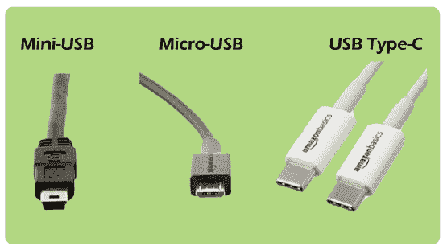

# 什么是 USB？

> 原文：<https://www.javatpoint.com/what-is-usb>

通用串行总线是一种常见的计算机端口，它短接通用串行总线，允许计算机与外围设备或其他设备之间的通信。它是当今电脑中最常用的接口，可以用来连接[打印机](https://www.javatpoint.com/printers)、扫描仪、[键盘](https://www.javatpoint.com/keyboard)、鼠标、游戏控制器、数码相机、外接硬盘和闪存盘。通用串行总线取代了并行和串行端口等多种接口，因为它用途广泛，并为电力提供了更好的支持。通过一个通用串行总线端口，在几个通用串行总线集线器的帮助下，最多可以连接 127 个外围设备，尽管这需要相当大的灵活性。

通用串行总线旨在允许热插拔和增强即插即用。无需重新启动计算机，即插即用使其能够操作系统来不自觉地发现和配置，热插拔允许更换和移除新的外围设备。在智能手机和平板电脑等设备中，一个 [USB](https://www.javatpoint.com/usb-full-form) 也可以用来供电和给电池充电。其第一个版本 1.0 于 1996 年 1 月在**推出**。随后，英特尔康柏、微软等公司迅速采用了这一行业标准。

[USB](https://www.javatpoint.com/usb-flash-drive) 连接器有很多种类型，但 A 型和 B 型是两大类型之一。A 型为 [USB 2.0](https://www.javatpoint.com/usb-2-0-vs-usb-3-0) ，包含一个扁平矩形接口。并且，为了供电和传输数据，它被插入到一个 USB 或集线器主机中。输入设备、键盘和鼠标是众所周知的 A 型通用串行总线连接器的例子。B 型通用串行总线使用像打印机一样的可移动电缆，并连接到上游端口。一些 B 型连接器不能提供数据连接，它们只能用作电源连接。

阿杰伊·巴特是一名计算机架构师，他共同发明并建立了通用串行总线，并且一直为英特尔工作。NEC 公司、北电、英特尔、康柏、数字设备公司(DEC)、IBM 和微软等七家公司于 1994 年开始开发 USB。这些公司的主要目标是消除大量连接器，使外围设备更容易连接到计算机。它涉及的因素有

*   它创建了大带宽和流配置。
*   对于当前的接口，它解决了利用率问题。

*USBIF* 是一个标准化 USB 设计的 USB 实现者论坛。它包括许多推广和支持 USB 的公司。USBIF 不仅仅是关于 USB 设计，还支持合规计划并维护规范。在 2.0 版本中，规格是在 2005 年为 USB 创建的。2001 年，USBIF 引入了包含早期版本 0.9、1.0 和 1.1 的向后兼容标准。通常，它是为热插拔、更高质量的布线、易于安装和更快的传输速率而设计的。体积更大的并行和串行端口最终被通用串行总线取代。

热插拔是通用串行总线的最佳优势之一，它允许从系统中移除设备，而无需重新启动系统。因为旧端口需要在添加或移除新设备时重启电脑。通过重新启动系统，设备将被重新配置，并可以防止静电放电。像集成电路这样敏感的电子设备可能会因为不必要的电流而严重受损。尽管存在硬件故障，但热插拔具有持续运行的能力，因为它是容错的。但是，在热插拔这些设备时，有些设备(如相机)需要小心。因为如果一个引脚意外短路，端口、摄像头或其他设备可能会损坏。

USB 版本 1 提供了两种最适合慢速 I/O 设备的速度:速度为每秒 1.5 Mb 和每秒 12 Mb。对于速度较慢的 USB 设备，USB 版本 2 向后兼容，最高可提供 480 Mb/s。

## USB 设备列表

在现代，为了与计算机连接，有许多不同的 USB 设备。一些常见的如下:

*   [键盘](https://www.javatpoint.com/computer-graphics-input-devices#keyboard)
*   智能手机
*   药片
*   网络摄像机
*   小键盘
*   麦克风
*   老鼠
*   [操纵杆](https://www.javatpoint.com/computer-graphics-trackball#joystick)
*   跳跃驱动又称拇指驱动
*   扫描仪
*   打印机
*   外部激励
*   iPod 或其他 MP3 播放器
*   数码相机

## USB 端口在哪里？

在现代，所有的计算机在不同的位置至少包含一个 USB 端口。下面给出了一个列表，其中包含设备上的 USB 端口位置，可能有助于您找到它们。

**笔记本电脑:**一台笔记本电脑的左侧或右侧可能包含 1 到 4 个端口，有些笔记本电脑的背面有。

**台式电脑:**通常一台台式电脑正面有 2 到 4 个 USB 口，背面有 2 到 8 个。

**平板电脑:**在平板电脑上，一个 USB 连接位于充电口，有时是 USB-C，通常是微型 USB。

**智能手机:**采用微型 USB 或 USB-C 的形式，一个 USB 端口既用于数据传输，也用于充电，类似智能手机上的平板电脑。

## USB 连接器类型

通用串行总线连接器有不同的形状和尺寸。此外，还有许多版本的通用串行总线连接器，如迷你通用串行总线、微型通用串行总线等。

1.  **Mini -USB:** Mini USB 用于数码相机和电脑外设，分为 A 型、B 型和 AB 型。它也被称为 mini-B，是最常见的接口类型。在最新的设备上，微型 USB 和 USB-C 电缆已经在很大程度上取代了微型 USB。它由同轴电缆制成，可以在两个设备之间传输数据和电力。此外，它还适用于 MP3 播放器、数码相机和移动硬盘。在迷你 USB 电缆中，一端是小得多的四边形集线器，另一端是标准的平头 USB 集线器。因此，它很容易插入移动设备。迷你 USB 也可以用来在至少有一个 USB 端口的电脑之间传输数据，但主要用于给设备充电。它有两个优点:防水性和便携性。
2.  **微型 USB:** 是 USB(通用串行总线)的缩小版。它于 2007 年宣布，旨在取代 mini-USB，并开发用于连接紧凑型和移动设备，如数码相机、智能手机、全球定位系统设备、Mp3 播放器和照片打印机。
    **Micro A、micro B** 和 **micro USB 3 是**Micro-USB 的三个品种。微型 A 型和微型 B 型连接器的尺寸为 6.85 x 1.8 毫米，尽管微型 A 型连接器的最大过层尺寸更大。USB 3 micro 更类似于 micro B，但与 micro B 相比，它具有更好的速度，因为它在侧面包括一组额外的引脚，用于两倍的导线。微型版本是热插拔的，像标准 USB 和微型 USB 这样的即插即用仍然广泛应用于电子设备。
3.  **USB Type-C:** 在大多数现代较新的安卓智能手机和其他 USB 连接设备上，USB Type-C 电缆是一种相对较新的连接器类型。它用于向计算设备传送数据和电力。与其他形式的 USB 连接相比，USB-C 电缆是可逆的；无论是上下颠倒，它们都可以插入设备。

## usb 传输速度

*   **USB 1.0** 能够支持多达 127 个外围设备，并且作为外部总线标准，还能够支持 12 Mbps 的数据传输速率。
*   2001 年， **USB 2.0** 由飞利浦、朗讯、微软、惠普、英特尔、NEC、康柏开发，也就是大家熟知的高速 USB。它能够支持 60 兆字节每秒或高达 480 兆比特每秒的传输速率。
*   2009 年 11 月，布法罗科技首次推出 USB 3.0，也被称为超高速 USB。但直到 2010 年 1 月，第一批认证设备才问世。USB 3.0 的性能和更高的速度也有助于改进 USB 2.0 技术、电源管理和更高的带宽能力。
    它包括一个特性，提供两条单向数据路径，一次发送和接收数据。它可以支持每秒 640 兆字节的传输速率，或高达每秒 5.0 千兆位(Gbps)。在发布了 USB 3.1 之后，为了制作的目的，它的名字被改成了 USB 3.1 Gen1。第一批认证设备是用千兆字节和华硕技术的主板设计的。2011 年 4 月，戴尔开始在其戴尔 XPS 和 Inspiron 系列计算机中引入 USB 3.0 端口。
*   **USB 3.1** 是 2013 年 7 月 31 日前提供的 USB 协议的最新版本，也被称为 SuperSpeed，它可以支持高达 10 Gbps 的传输速率。如今，USB 3.0 和 3.1 版本被各种设备用来提高速度和性能。

## USB 版本兼容性

每个版本的 USB 端口都可以支持任何版本的 USB(通用串行总线)，因为它具有向后和向前兼容的能力。例如，设备能够在使用 USB 1.1 和 2.0 技术的 3.0 设计中工作。尽管 USB 3.0 能够实现更高的速度，但版本较低的设备会以其本机传输速度运行。因此，如果 USB 3.1 设备与 USB 2.0 端口连接，其最大传输速率仅限于 2.0 端口。

## USB 的历史

| 年 | 事件 |
| **1994** | USB 0.8 的 USB 第一版发布于【1994 年 12 月。但它在市场上没有，被认为是预发布版本。 |
| **1995** | 【1995 年 4 月发布了 USB 0.9。和 USB 0.8 一样，它没有商用版和预发行版。在【1995 年 8 月，另一个版本的 USB 也作为 USB 0.99 发布。 |
| **1996** | 1996 年 1 月，推出了 USB 1.0 的第一个商业版本，以 12 Mbps 的数据传输速率发布。 |
| **1998** | 下一个版本 USB 1.1 要好得多，是 1998 年 8 月推出的。随着 USB 1.1 的发布，各种 USB 设备被出售。同年，1998 年，第一台只有 USB 端口的电脑——苹果 iMac G3 发布。但是它没有用于外部设备连接的并行端口和串行端口。 |
| **2000** | 2000 年 4 月，为了拥有高达 480 Mbps 的数据传输速率，USB 2.0 被发布。然而，总线限制的最大数据传输速率高达 280 Mbps。 |
| **2008** | USB 3.0 的下一个版本于 2008 年 11 月 12 日推出，数据传输速率高达 5 Gbps。 |
| **2013** | 2013 年 7 月，下一个 USB 3.1 版本发布，提供高达 10 Gbps 的数据传输速率。 |
| **2017** | 2017 年 9 月，提供高达 20 Gbps 数据传输速率的 USB 3.2 发布。它引入了通用串行总线连接器。 |

* * *