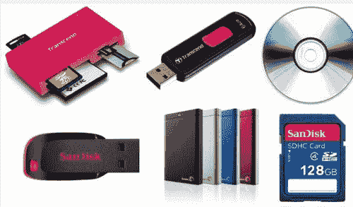
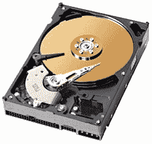
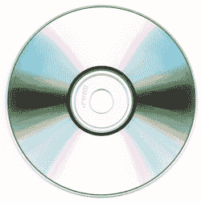
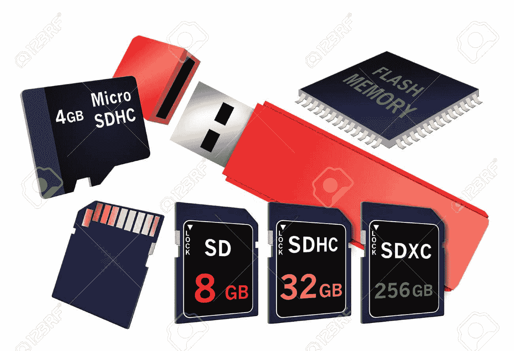
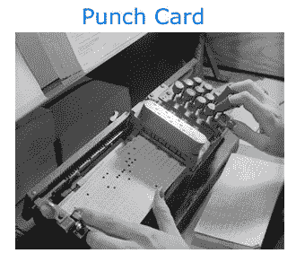

# 什么是存储设备？

> 原文：<https://www.javatpoint.com/what-is-a-storage-device>

存储设备是一种硬件，也称为存储器、存储介质、数字存储器或能够临时或永久存储信息的存储介质。通常，它用于保存、移植和提取数据文件。它可以在计算机系统、服务器或任何类似的计算设备的内部或外部使用，以保存信息。

对于任何计算设备，存储设备都是核心组件之一，根据需求和功能，它有多种结构和大小。除了硬件固件之外，它几乎将所有数据应用程序都存储在计算机中。存储设备有多种形式；例如，计算机设备包括不同的存储介质，例如[硬盘](https://www.javatpoint.com/hdd)、[内存](https://www.javatpoint.com/ram)、高速缓存。他们还有光盘驱动器和外部连接的 [USB](https://www.javatpoint.com/usb-full-form) 驱动器。有两种类型的存储设备，主存储设备和辅助存储设备可用于存储数据。

**主存储设备:**它们内置于计算机中，访问数据文件的速度非常快。[随机存取存储器](https://www.javatpoint.com/ram-full-form)和[高速缓冲存储器](https://www.javatpoint.com/cache-memory)是主存储设备的例子。

**二级存储设备:**硬盘、 [USB](https://www.javatpoint.com/what-is-usb) 存储设备和光盘驱动器都是二级存储设备的例子，旨在永久存储数据。与主存储设备相比，它们具有较大的存储容量。

## 为什么计算机需要存储？

计算机将被认为是没有存储设备的哑终端。如果没有存储设备，它就不能存储或保存任何类型的信息或设置。尽管您的计算机可以在没有存储介质的情况下运行，但您只能查看或读取其上的信息，除非它是连接到另一台具有存储功能的计算机的计算机。此外，需要一个存储设备来存储有关此类任务的信息，如浏览互联网。

## 什么是存储位置？

当您在计算机或其他类似设备上存储任何类型的信息时，它可能会询问您要存储信息的存储位置。默认情况下，您的计算机硬盘上存储着各种类型的数据。如果你想把这些信息移动到另一个设备，你需要把它转移到另一个存储媒体，像[u 盘](https://www.javatpoint.com/usb-flash-drive)使你能够把它移动到任何其他电脑。

## 为什么有这么多不同的存储设备？

随着计算机的使用迅速增加，由于对存储容量的需求越来越高，用于存储数据的技术也日益增多。随着存储设备的使用日益增加，人们希望随身携带，因此有必要发明新技术。随着新存储设备的发明，人们用新的存储设备替换旧设备。因此，不再需要较旧的设备，不再使用。

[光盘](https://www.javatpoint.com/cd)光驱用软盘的引入取代了它们，光盘被 [DVD](https://www.javatpoint.com/dvd-full-form) 光驱取代。然后闪存驱动器被设计来代替 DVD 驱动器。IBM 推出的第一个仅含 5 MB 的硬盘驱动器的价格为 5 万美元。在现代，我们的智能手机以更低的价格包含了更多的存储容量，这也可以很容易地在口袋里进行。此外，存储设备的每一次改进都使计算机系统能够存储大量数据，包括快速访问数据。

## 计算机存储的例子

### 磁性存储设备

如今，磁存储通常建立在混合硬盘或超大硬盘上。

**磁存储设备列表如下:**

*   **软盘:**软盘驱动器(FDD)为用户提供了将数据保存到可移动磁盘的好处。FDDs 已经被网络文件传输和 USB 等其他存储设备所取代。
*   **硬盘:**硬盘驱动器(HDD)是一种非易失性计算机存储设备，用于永久存储数据，并直接连接到计算机主板的磁盘控制器。通常，它安装在计算机内部，称为辅助存储设备。
*   **磁卡:**磁卡是一种可能包含个人信息的卡，例如进入安全建筑的密码或信用卡上可用的识别信息。
*   **超级磁盘:** Imation 公司开发了磁盘存储技术。超级磁盘也被称为 LS-240 和 LS-120。该驱动器最受原始设备制造商计算机的欢迎，能够在一个磁盘上存储高达 120 兆字节的数据。后来，它能够存储 240 兆字节，并且向后兼容 1.44 兆字节的磁盘。
*   **磁带盒:**磁带是一种能够存储数据的矩形扁平容器。与其他存储介质相比，它更便宜，通常用于备份大量数据。
*   **Zip 软盘:**Zip 驱动器是一种硬件数据存储设备，是软盘的高级版本。它的功能像软盘和标准的 1.44 英寸软盘驱动器，由 Iomega 开发。它在 20 世纪 90 年代后期变得非常流行，能够存储普通软盘无法存储的数据。

### 光学存储设备

另一种类型的存储设备如下所示:

*   蓝光光盘
*   CD-ROM 光盘
*   激光唱盘和激光唱盘。
*   DVD-R、DVD+RW、DVD+R 和 DVD-RW 光盘。

### 闪存设备

闪存既便宜又便携。由于解决方案变得更加可靠和高效，大多数磁性和光学介质已经被闪存设备所取代。

*   **闪存驱动器:**USB 闪存驱动器是一种用于数据存储的便携式存储设备，也称为笔驱动器、拇指驱动器、数据棒、钥匙扣驱动器。它们通过一个通用串行总线端口连接到一台计算机上，通常有人类拇指那么大。
*   **内存卡:**内存卡常用于数码相机、打印机、MP3 播放器、掌上电脑、数码摄录机、游戏机、掌上电脑。多年来最常见的存储卡格式是 CompactFlash，但现在有 CFexpress、SD、MicroSD 和 XQD。
*   **紧凑型闪存(CF):** 紧凑型闪存是一种常见于数码相机、掌上电脑和其他便携式设备中的闪存。它是一个 50 针连接存储设备，能够存储从 2 MB 到 128 GB 的数据。
*   **2:** M.2 是固态硬盘，2014 年推出。有两种类型的 m2 设备；SATA M.2 和 PCIe m2
*   **多媒体卡:**多媒体卡或 MMC 是一种集成电路，用于汽车收音机、打印机、掌上电脑、MP3 播放器和数码相机。它充当数据的外部存储。MMCP 和 MMCM 是 MMC 卡的变体。
*   **SDHC 卡(安全数字高容量):**它采用了新技术和标准 SD 卡的改进版本。它与标清格式设备不向后兼容，能够存储 4 GB 至 32 GB 范围内的数据。
*   **NVMe(非易失性内存高速):**这是一个为数据中心设计的设备规范，它规范了固态硬盘等设备连接到计算机 PCI Express 总线的方式，英特尔于 2007 年推出了该规范。
*   **索尼记忆棒:**索尼记忆棒是闪存卡家族，于 1998 年 10 月由索尼首次推出。它是为相机和其他索尼产品中的数字存储而设计的。
*   **智能媒体卡:**智能媒体卡是东芝开发的存储卡，也称为固态软盘卡。
*   **xD-Picture 卡(EXtreme Digital Picture Card):**xD-Picture 卡是奥林巴斯和富士在 2002 年推出的闪存卡。在 **2003** 中，直到迷你 SD 卡推出，xD 卡是市场上最小的闪存卡。xD-Picture 卡的 h 和 M/M+版本的容量高达 2 GB，原始版本高达 512 MB。
*   **固态硬盘:**固态硬盘是一种类似于硬盘的存储介质。即使没有电源，它也有能力将存储的数据保持在永久状态。它具有更高的可靠性、无噪音运行、更低的功耗和更快的访问时间，因为它没有移动部件，不像硬盘。
*   **SD 卡:**sd 卡代表安全数字卡，最常用于设计用于提供小尺寸高容量存储器的电子设备。它通常用于小型便携式设备，如手机、数码相机、数码摄像机、mp3 播放器等。它被 400 多个品牌的电子设备使用。

### 在线和云存储

在线和云存储中存储数据的需求正在快速增长。

*   **云存储:**云存储是一种在远程存储系统上传输和保存数据的云计算模式，云计算提供商通过网络在远程存储系统中管理、维护数据并使数据对用户可用。它为用户提供了可靠性、保密性、持久性和“随时访问数据”的能力。
*   **网络媒体:**网络媒体在互联网等计算机网络上使用，因为它是任何音频、视频、图像或文本。

### 纸张存储

最初，计算机无法在任何存储技术上存储数据，如闪存设备、光存储设备；他们不得不依赖纸张。在现代，纸张存储数据的方法很少被使用或发现。

*   **穿孔卡:**穿孔卡也称为霍尔瑞斯卡或 IBM 卡，能够以小穿孔的形式存储数据。这是一种简单的纸张，广泛用于向早期计算机输入数据。
*   **OMR:** 代表光学标记识别或光学标记读取。这是一种从人类身上提取数据的方法，通过识别文档上的某些标记，如打印表单上的复选框和填充字段。一般来说，OMR 过程是通过扫描来完成的，扫描借助于一张纸来检测反射或透射。这项技术为选票、回复卡、调查和问卷等应用程序提供了优势，因为它们需要大量手工填写的表格来快速准确地处理。

## 现在使用哪些存储设备？

虽然有各种各样的存储设备，但上面解释的大多数存储设备今天都没有使用。在现代，大多数电脑主要使用 [SSD](https://www.javatpoint.com/ssd) 来保存数据，包括闪存和云存储。一些笔记本电脑和大多数台式电脑使用磁盘驱动器，它具有读写光盘和数字视盘的能力。

## 存储设备是输入和输出设备吗？

存储设备不视为输入和输出设备；但是，它们有能力以存储数据的形式转发和接收信息，这些设备不是输入或输出设备。更适合将这些设备视为存储设备，而不是输入或输出设备，因为它们能够读取和存储数据。

## 最新的存储设备是什么？

[NVMe](https://www.javatpoint.com/what-is-nvme) ，代表[非易失性存储快车](https://www.javatpoint.com/nvme)，是最新的存储设备技术之一。云存储和固态硬盘也正在成为最近开发的存储设备。此外，一些较旧的存储设备技术(如磁带驱动器和硬盘驱动器)也在引入新技术来保存大量数据。

## 如何访问存储设备？

要访问计算机或笔记本电脑上的存储设备，它取决于系统中使用的操作系统。例如，如果您使用的是[微软视窗](https://www.javatpoint.com/windows)，您可以在作为其默认文件管理器的计算机上使用视窗浏览器。要打开窗口资源管理器，您需要双击桌面屏幕上显示的我的电脑，或者您可以使用快捷键窗口键+ E。此外，Finder 被认为是苹果电脑上的默认文件管理器。

## 什么存储设备的容量最大？

[固态硬盘](https://www.javatpoint.com/ssd-full-form)或硬盘是大多数电脑最大的存储设备。此外，具有网络连接的计算机可能能够通过云计算、网络连接存储设备或云计算访问更大的存储。

虽然有几种存储设备具有不同的容量，例如，在开发硬盘时，它只有 5 MB 的容量。但是现在，它可以存储高达几兆字节的数据。因为随着硬盘的发展，它的存储容量已经增加了。

* * *