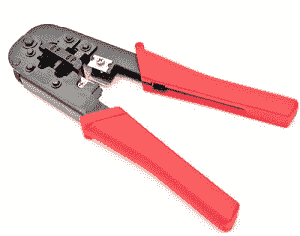

# 什么是压接工具？

> 原文：<https://www.javatpoint.com/what-is-a-crimping-tool>

压接工具是一种用于通过使电线和连接器中的一个或两个变形以保持另一个而在电线和连接器之间形成冷焊接接头的装置。一种特殊的连接器用于将金属连接在一起。当工具工作时，焊接接头性能(机械和电气)与母材一样强，并提供一些结果，这就是所谓的压接。压接的一个例子是将连接器固定到电线的末端。例如，压接工具用于创建电话电缆和网络电缆，以将 RJ-11 和 RJ-45 连接器结合到电话或第 5 类电缆的两端。下图是 RJ-11 (6 针)和 RJ-45 (8 针)压接工具的示例。

## 如何使用压接工具？

首先，你要压接的电线，用绷带包扎，然后连接连接器。然后，在匹配线规额定值的帮助下，连接器的正确模头将必须选择具有可互换模具的压接工具。对于无模卷曲机，凹槽必须适当匹配。最后，在施加压力的帮助下取出新压接的连接器。并且，为了检查你的连接是否安全，拉几下。

## 卷曲工具的目的

压接工具的主要目的是将连接器与网络电缆或电话端连接起来。最常见的连接器，RJ-11 和 RJ-45，可以连接到电缆的一端。这些连接器对电缆更为重要，可以通过压接工具连接到电缆上。许多房主使用扁平的石头、锤子或其他临时工具将连接器连接到电缆上，但这可能会导致质量差或故障。压接的主要功能是借助其中一个零件的变形将两个零件结合在一起。使用时，在电线上连接一个连接器的帮助下，它可以准备电话线或网络。先前用另一种特殊工具撕开的电线。

连接器是压接非常重要的一部分，它可以防止电线脱落，并有助于将数据传输到电线。如果任何人使用了错误的工具，就会成为造成更多伤害的原因。有许多不同种类的压接工具，但它们都有相同的功能。内置棘轮压接工具被认为是最好的压接工具，有助于防止钳口断裂。当棘轮获得所需的压力时，它会释放卷曲的部分-棘轮确保施加足够的压力，有助于显著提高效率。

此外，设计具有更宽钳口的压接工具的主要目的是覆盖更大的表面积。操作人员需要匹配电线尺寸和端子尺寸，以便通过压接来压接电缆。一旦端子尺寸和电线尺寸匹配，操作者将能够剥去电线。

根据连接器的长度，决定将移除多少导线。在将电线撕开并安装到连接器中后，将电缆和连接器插入压接工具中。为了将连接器和电线挤压在一起，操作者按压手柄，最后，它们牢固地连接在一起。

连接器和电缆将在一个很大的力拉动它们的地方保持在一起，并执行压接程序。如果连接被拉开，确保压接没有正确完成。安装前，操作人员需要检查压接是否良好，这有助于防止连接器和电缆安装不完整。

## 卷曲工具的使用

在金属加工中，压接工具使用最广泛。它在许多应用中发挥着重要作用，例如校正子弹、快速但持久的电气连接、固定金属食品罐的盖子以及多种其他应用。此外，它还用于非金属部件和工件之间，以形成强有力的结合。

使用压接工具，当连接管状金属板管段时，如安装通风管道或木质炉灶的烟管时，管的一端被处理成与管道的下一部分滑动接合。接头不会是液密的，但可以防止污垢堆积。

卷曲管或卷曲珠在珠宝制造中起着至关重要的作用，可以在细金属丝中形成牢固的连接。卷曲的导线在固定公用事业仪表或作为货物集装箱的密封时，提供了干扰的图形指示。

* * *