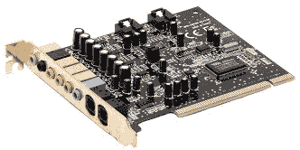
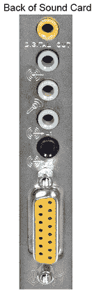

# 什么是声卡？

> 原文：<https://www.javatpoint.com/what-is-a-sound-card>

在计算机内部，声卡是一种扩展组件，也称为音板、音频输出设备或声卡。它在计算机中提供音频输入和输出功能，可以在扬声器或耳机的帮助下听到。虽然计算机不一定需要声卡，但每台机器都将其内置于主板(板载)或扩展槽中。通过设备驱动程序和软件应用程序，声卡可以进行配置和利用。

通常，连接输入设备(麦克风)来接收音频数据，而扬声器或耳机通常用于输出音频数据。大多数耳机使用 3.5 毫米的迷你插孔，这是连接器的大小。通过光学音频端口(如 Toslink 连接器)或借助标准 TRS(尖环套)连接，一些声卡支持数字音频输入和输出。将输入的数字音频数据转换为模拟音频是声卡的主要功能，扬声器通过声卡发出声音。在相反的情况下，从麦克风，模拟音频数据被声卡转换成数字数据。这些数据可以保存在计算机设备上，也可以借助音频软件进行修改。

虽然许多机器可能包含存在于 PCI 插槽中的实际卡，但声卡在某些计算机中也是主板的一部分。此外，如果您真的需要增强电脑的音频功能，可以安装新的声卡(专业声卡)。专业声卡可能有更多的输入和输出，并具有支持高级采样率的能力，如 192 千赫而不是 44.1 千赫。有些声卡可能包含 1/4 英寸，而不是 3.5 毫米。适合大多数仪器输出的连接器。

但是，要增强计算机的更多音频功能，您可以安装专业声卡。对于多声道录音，您也可以使用另一个选项转接盒。通常，这个盒子包括许多音频连接和一个内置声卡；它被称为外部盒子。例如，一个转接盒支持 16 个声道的音频，但它无法安装在一张卡上。有些转接盒是专门设计来与接线盒连接的，尽管大多数转接盒都连接到火线或 [USB](https://www.javatpoint.com/usb-flash-drive) 端口。

## 声卡描述

声卡是一种矩形的硬件，侧面包含不同的端口来连接音频设备，如扬声器，卡的底部也有多个触点。作为主板，外设卡和机箱的设计都考虑到了兼容性；因此，在安装声卡时，它正好安装在机箱背面的外面。这使得它能够方便地使用。您还可以选择声卡将麦克风、耳机和其他音频设备插入电脑；因为也有 [USB](https://www.javatpoint.com/usb-full-form) 声卡可用。此外，您可以借助一个小适配器将其直接插入[通用串行总线](https://www.javatpoint.com/what-is-usb)端口。

在过去，当使用窄范围的频率时，计算机最初只能发出哔哔声。这些哔哔声主要是以警告警报的形式使用的。

随着时间的推移，出于专业和娱乐的原因，对高质量声音的需求随着多媒体的增长而增加。为了满足这一需求，我们创建了声卡 AdLib。在 AdLib 声卡中，敲击模式和 9 音模式功能使可编程音频成为可能。

对于电脑，大多数主板制造商都提供内置声卡。但是，高级用户通常使用为满足其特定要求而选择的扩展卡，而不是通用的内置卡。

## 声卡的类型

声卡是计算机中的一个扩展组件，使您能够听到来自视频文件、mp3 文件等的声音。80 年代末 90 年代初，声卡首先开始进入主流。在现代，几乎所有的电脑都配有一个。主要是声卡有三种类型，都有各自的优点。

### 主板声音芯片

声卡首次推出时是昂贵的附加卡。它的成本是数百美元。当计算机声音技术以低价出现时，小型化技术允许计算机硬件制造商将声音生产到单个芯片中。在现代，很少有机会找到不含主板声音芯片的电脑。即使它们只包含一个单独的声卡。主板声音芯片使声卡负担得起所有计算机所有者。您可以识别您的系统是否有主板声音芯片。

### 标准声卡

在计算机内部，标准声卡连接到其中一个插槽。使用声卡而不是主板声音芯片，提供了一个好处，因为它包含自己的处理器芯片。并且，主板声音芯片在计算机处理器的基础上产生声音。玩游戏时，标准声卡的性能更好，因为它对主处理器的负载更小。

### 外部声音适配器

外部声音适配器具有所有与标准声卡相同的功能。它是一个小盒子，可以通过 USB 或 FireWire 端口连接到计算机，而不是内部扩展槽。有时，它包含标准声卡没有的功能，如物理音量控制旋钮和额外的输入和输出。与标准声卡相比，将外部声音适配器移动到新计算机要容易得多。此外，有了 USB 或 FireWire 扩展槽，这是升级笔记本电脑声音的唯一方法。

## 声卡的用途

声卡的主要用途是提供您在播放不同格式和不同控制程度的音乐时听到的声音。声音的来源可以是流式音频、文件、 [CD](https://www.javatpoint.com/cd) 或 [DVD](https://www.javatpoint.com/dvd-full-form) 等形式。计算机有许多可以使用声卡的应用，如下所示:

*   游戏。
*   语音识别。
*   看电影。
*   创建和播放 MIDI。
*   教育软件。
*   音频和视频会议。
*   商业演讲。
*   记录口述。
*   音频光盘和听音乐。

## 声卡的历史

这款声卡能够进行 4 音音乐合成，古奇合成木管乐器被认为是第一款声卡。它被柏拉图终端使用，这是舍温·古奇在 1972 年发明的。

AdLib 是最早开始制造声卡或 IBM PC 兼容电脑的公司之一。1987 年，在雅马哈 YM3812 声音芯片的基础上，AdLib 开发了音乐合成器卡。

尽管直到 1988 年，声卡对于 IBM 个人电脑来说还是非常少见的。对于大多数生产声音和音乐的 IBM 个人电脑用户来说，内置个人电脑扬声器是唯一的方法。因此，基于“哔哔声和嘘声”，声音被描述为导致了共同的昵称“哔哔声”。播放声音时，需要停止所有其他处理。

1988 年，一个电脑游戏首席执行官小组指出，消费电子展表明，个人电脑无法成为领先的家用电脑，因为它们只有有限的声音。与目前的产品相比，它需要一个 49-79 美元的声卡，具有更好的性能。在 **1989** 年，在一次电脑游戏世界调查中发现，AdLib、六个 Roland 和 Covox，以及七个 Creative Music System/Game Blaster 计划由 25 家游戏公司中的 18 家提供支持。

## 声卡连接

图像显示在右侧，描述声卡音频端口或音频插孔，这些接口位于您的计算机后面。这张图片是声卡音频端口的一个例子。

*   对于环绕声或扬声器，使用数字输出(白色或黄色；单词:“数字”或“数字输出”)。
*   连接外部音频源，如录音机、录音机或光盘播放器，声音输入或线路输入(蓝色；指向波浪的箭头)。
*   连接耳机或麦克风、麦克风或话筒(粉色)
*   对于您的扬声器或耳机，主声音连接、声音输出或线路输出(绿色；指出波浪的箭头)。第二个(黑色)和第三个(橙色)声音输出接口也包含在此声卡中。
*   对于数码摄像机和其他设备，使用一些高质量的声卡，FireWire(未显示)。
*   为了连接 MIDI 键盘或游戏杆，MIDI 或游戏杆(15 针黄色连接器)用于旧声卡。

## 声卡和音频质量

许多现代卡没有声音扩展卡，而是将相同的技术直接集成到主板上。这些卡被称为车载声卡。但这种配置使音频系统的功能稍弱，并允许使用更便宜的计算机。几乎，这种方式适合所有计算机用户。通常，对于严肃的音频专业人士来说，专用声卡是必要的。因为大多数台式电脑都是为前置耳机插孔和端口设置的。因此，如果您也插入了 USB 设备，您可能会在耳机中听到静电声。

### 电脑没有声音

尽管如此，声卡或扬声器可能不再相互通信，因为它们可能已断开端口/电源。通常，这可能是与阻止声音播放的软件有关的问题。首先，你要确定歌曲、电影、视频或你要听的内容的音量。

声音可能来自丢失或损坏的设备驱动程序，这可能是无法传送声音的另一个原因。借助使用任何免费的驱动程序更新工具，安装声卡驱动程序是克服这个问题的最好方法。

如果您已经检查了上述所有内容，并且您的计算机仍然无法播放声音。现在，您需要检查是否安装了正确的媒体播放软件。

## 购买声卡

有许多声卡，但流行的卡是海龟滩、创意实验室(声霸)和钻石多媒体。安装声卡的过程相对容易。但是，与外围设备相反，如果声卡没有正确连接，它会在内部连接。

* * *