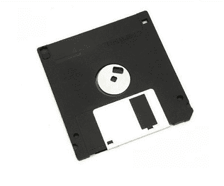

# 什么是软盘？

> 原文：<https://www.javatpoint.com/what-is-a-floppy-disk>

软盘是一种读取数据存储信息的存储介质，也称为软盘、软盘或软盘，用于存储电子数据，如计算机文件。它非常昂贵，因为它是 IBM 在 1967 年创建的第一种硬件存储类型之一，可以读写便携式设备。

它刚发明时，用户无法向其写入数据，就像光盘一样，直径为 8 英寸。这个磁盘只能存储 80KB 的数据，但是后来的版本可以存储 800KB。软盘被 [USB](https://www.javatpoint.com/usb-full-form) 和网络文件传输等设备取代；但是，这些磁盘现在已经过时了。

随着技术的进步，软盘变得越来越小，有三种尺寸，8 英寸、5.5 英寸和 3.5 英寸。与以前的软盘相比，新版本可以存储更多的数据，而不是使用更先进的技术。

另一个版本的软盘，5.25 英寸，能够容纳 360 千字节的数据，并于 1978 年推出。后来，通过修改 5.25 英寸软盘，可以存储高达 1.2 兆字节的数据。早期的台式电脑，如苹果 IIe，使用这些磁盘驱动器。3.5 英寸[高清](https://www.javatpoint.com/hd-full-form)(高密度)软盘能够存储 1.44MB，于 1987 年推出。与 5.25 英寸磁盘相比，这些版本更便携，也更耐用。为了备份个人数据和分发商业软件，3.5 英寸软盘成为未来十年的标准。

随着时间的推移，软盘能够读写数据。当时，它包含四个基本组成部分:

*   磁性读/写头
*   包含所有的电子设备，它包括一个电路板。
*   它包括一个带有框架的杠杆，有助于打开和关闭设备。
*   它通过主轴夹紧装置放置，因为它每分钟旋转 300 到 360 圈。

读写头用于读写，可以读取磁盘的两面。为了擦除数据，使用了更宽的磁头，这保证了数据被擦除。20 世纪 90 年代末，软盘开始被光盘取代。后来，消费者也开始使用可刻录光盘来备份他们的数据。第一台主流电脑，苹果最初的 iMac，于 1998 年推出。它不包括软盘驱动器。最终，各种个人电脑制造商纷纷效仿，因为这需要几年的时间。

现在很多人用可录光盘或者[u 盘](https://www.javatpoint.com/usb-flash-drive)来备份数据，大部分软件都是分布在光盘和 DVD 上。最后，软盘已经成为过去存储数据的好东西。因为它是数据存储介质，很多人都是伴随着它长大的；因此，软盘在资深电脑用户中仍有重要作用。在现代，随着 ZIP 驱动器，光盘和 u 盘被引入。

## 软盘是如何使用的？

在计算机早期，软盘只是备份信息和在计算机上安装新程序的选项，因为计算机上没有光驱、 [USB](https://www.javatpoint.com/what-is-usb) 和软盘。如果程序大小小于 1.44 MB，程序可以从一张软盘安装。同样，如果软盘的大小大于 1.44 MB，大多数程序都需要多张软盘。

## 软盘的类型

市面上有好几种软驱，由于用得不多，而与时俱进。

### 8 英寸驱动器

在 20 世纪 70 年代早期，8 英寸是第一个被用作只读格式的软盘设计，随后变得可以读写。正是软盘的物理特性赋予了整个软盘驱动器系列一个名字。

### 5 英寸驱动器

在 20 世纪 80 年代，一个 5 英寸的软盘驱动器被生产出来，并在个人电脑上广泛使用。在 20 世纪 90 年代早期，计算机上还包括了 5 英寸软盘驱动器，能够存储 360 千字节到 1.2 兆字节之间的数据。一些 5 张软盘能够将数据写入磁盘的两面，也允许修改数据。此后，软盘制造商开始开发双面驱动器。

### 3 英寸驱动器

另一种软盘是塑料包装的 3 英寸软盘驱动器，在高密度磁盘上可以容纳 1.44 兆字节，在双密度磁盘上可以容纳 730 千字节。在计算机的旧时代，必须使用多个磁盘来安装程序，例如 Windows 3.0。

### 拉链驱动

20 世纪 90 年代中期，Iomega 公司推出了 zip 驱动器。主要是，zip 驱动器可以作为外围设备添加到现有系统中。zip 驱动器的使用受到限制，因为它非常昂贵，这使得它无法成为流行的存储介质。

## 软盘的优点

软盘没有更大的存储容量，导致它们无法用于存储高分辨率照片、音乐、视频等。软盘虽然有缺点，但也有一些显著的优点，如下:

### 轻便

它们相对较小且便于携带，这是软盘的主要优点之一。与光盘相比，3.5 英寸软盘的尺寸更小。此外，在运输的情况下，它们不需要放置。软盘设计有一个塑料外壳，使其更坚固，并从内部保护磁盘。与光盘和数字视盘相比，刮擦光盘的机会较低，因为它总是被外壳包围。

软盘还可以防止数据被意外擦除或覆盖，因为它内置了写保护。它们的便携性为用户提供了将文档等小文件从一台设备移动到另一台设备的好处。

### 和睦相处

这也是旧计算机在数据存储设备方面的一个重要优势。因为旧计算机可能不接受其他数据存储设备；它们通常与软盘兼容。例如，在 20 世纪 90 年代初，计算机可能根本不包括[光盘](https://www.javatpoint.com/cd)或 [DVD](https://www.javatpoint.com/dvd-full-form) 驱动器。软盘只是将文件从计算机上转移出去的选择。虽然许多较新的个人电脑都有软驱，但这些驱动器并不包含在现代个人电脑中，并且正在逐步淘汰。当计算机制造商在制造定制的个人电脑时，他们可能会提供软驱作为一种选择。

### 启动磁盘

在引导顺序中，软盘驱动器通常设置在主硬盘驱动器的上方。计算机尝试引导至操作系统，这称为引导序列。如果设备处于启动顺序的高位，软盘、光驱或其他磁盘没有启动程序。但是在引导列表中，系统将访问下一个设备。软盘还有一个好处，就是可以在加载的帮助下变成引导盘，把一个方便的程序保存到磁盘上。与从操作系统引导不同，从磁盘引导允许各种任务，如排除其他系统错误和检查内存错误。

## 软盘的缺点

### 速度

软盘中的数据传输速度非常慢。当数据从软盘或计算机传输到软盘时，传输数据需要很长时间。

### 储存空间

软盘驱动器容纳信息的空间有限。与现代存储介质相比，它提供的存储容量非常低。

### 文件损坏

文件损坏是软盘的主要缺点之一。FDDs 受外部因素如热和磁场的影响。因此，存储的文件可能会损坏。此外，与任何其他存储介质相比，软盘并不能提供更多的安全性，因为它们更容易受到可能导致文件损坏的病毒的攻击。

### 可靠性

随着时间的推移，软盘的使用已经减少或停止，直到 2000 年。因此，许多电脑制造商被叫停了，包括一张装有电脑的软盘。过了这段时间，它就成了不可靠的存储来源。

### 身体伤害

塑料外壳被用来制作非常精致和灵活的软盘。如果有人不小心抓住它，它可能很容易折断。

## 软盘和驱动器的历史

### 8 英寸软盘

在 **1971** 中，引入了第一个直径为 8 英寸的圆盘，称为 23FD。容量为一兆字节，被装在一个硬纸盒里。与硬盘不同，磁头接触磁盘。例如，随着时间的推移会磨损媒体的盒式磁带或视频播放器。1972 年，阿兰·舒加特团队运送了第一个读写软盘驱动器，Memorex 650。后来，舒加特联合公司在 **1973** 成立舒加特。第一个微型计算机操作系统 CP/M 已经发货。

然而，那个时代的大多数机器使用盒式磁带而不是软盘，因为驱动器更贵。一般来说，在早期，它们比电脑贵。1978 年底，一张软盘的价格是每张 5 美元(相当于 2019 年的 20 美元)到 8 美元。为了启动和停止电机，其他型号使用了 DC 电机，并对界面进行了相应的更改。

### 5.25 英寸软盘

5.25 英寸软盘被广泛用于许多早期的微型计算机，最早于 1976 年开始开发。它采用 34 针接口，后来在 1978 年成为标准。它的第一个价格是 400 美元，一盒 10 个磁盘的价格是 60 美元，这些磁盘最初发布时只有 160 KB 的磁盘空间。到 1978 年，10 家不同的制造商生产了 5.25 英寸驱动器。舒加特一天生产约 4000 个驱动器。20 世纪 80 年代初，该公司的产量减少了。竞争的加剧，可靠的 80 轨道，以及几个利润丰厚的合同的丢失是这部分的主要原因。到 1982 年，国际商用机器公司选择坦登作为他们个人电脑磁盘驱动器的唯一供应商，苹果公司转而在他们的电脑中使用更便宜的阿尔卑斯驱动机构。

后来，施乐在 1977 年收购了舒加特，舒加特将该品牌出售给第三方，并于 1985 年关闭了运营。对于文字处理器和微型计算机来说，软盘驱动器是 20 世纪 70 年代和 80 年代的主要存储设备，因为当时机器没有硬盘来存储信息。通常，操作系统是从一张软盘启动的。有些机器使用两个磁盘驱动器，为用户提供将操作系统磁盘留在原位并将数据从一张软盘复制到另一张软盘的好处。四通道密度“每英寸 96 磁道”驱动器于 20 世纪 80 年代初推出，存储容量增加到 720 KB。

过了一段时间，有了新的 IBM AT 机器，IBM 在 1984 年推出了 5.25 英寸高密度磁盘格式。5.25 英寸驱动器成为大多数现代计算机的可选设备。

### 3.5 英寸软盘

索尼在 1981 年推出了 312 英寸的软驱，单面无格式容量为 218.8 KB。其格式化容量为 161.2 KB。索尼的 SMC 70 是 1982 年第一台使用这种格式的电脑。

此外，该驱动器是不规则的矩形，不允许用户错误地将磁盘插入侧面，这在旧格式中是可能的。与较旧类型的驱动器相比，3.5 英寸驱动器具有多种其他优势，例如不需要索引孔，也不需要终端电阻组件。

* * *