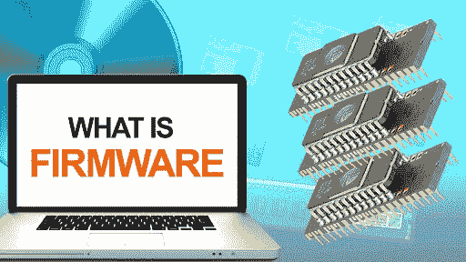

# 什么是固件？

> 原文：<https://www.javatpoint.com/what-is-a-firmware>

固件是硬件设备上的软件程序，它执行基本输入/输出任务等功能，并为设备与其他计算设备通信提供必要的指令。它是一组被编程的指令，永久地蚀刻在硬件设备中，如显卡、 [BIOS](https://www.javatpoint.com/bios-full-form) 、[键盘](https://www.javatpoint.com/keyboard)或[硬盘](https://www.javatpoint.com/hdd)。不使用特殊程序，它不能被最终用户修改或删除，不像普通软件。不管它是开着还是关着，它都在那个设备上。但是固件通常存储在闪存 [ROM](https://www.javatpoint.com/rom) 中，这实际上是一种闪存，允许用户擦除和重写信息。

一般来说，它是为高级软件设计的，可以被认为是“半永久的”，因为它保持不变，除非它没有更新。为了使用新的操作系统，您需要更新某些设备的固件，如显卡和硬盘。 [CD](https://www.javatpoint.com/cd) 和 [DVD](https://www.javatpoint.com/dvd-full-form) 驱动器制造商使驱动器具有读取更快介质的能力，通常会为用户提供固件更新。有时制造商会发布固件更新，这有助于使系统更加强大，能够快速工作。固件制造商的网站包含固件更新；您可以在网站的“支持”或“下载”选项的帮助下找到它们。

虽然让系统固件保持最新是一个好主意，但通常没有必要。是需要参加的；一旦启动固件更新程序，您就可以让更新完成。因为如果无法识别固件，系统将无法正常工作。此外，它还提供了一些好处，以便为更新的设备更换它，因为它可以在不需要更换硬件的情况下进行更改。

如果硬件设备没有固件，它将无法工作。最初，设计它的主要目标是永久的，它有只读存储器和可编程只读存储器的简称。最后，EPROM 代表可擦除可编程只读存储器，已经发布，可以更新。但是使用电子顺磁共振很有挑战性，更新也很耗时，而且成本更高。

最终，固件从只读存储器演变为闪存，变得用户友好且更容易更新。通常，视频卡、调制解调器和基本输入输出系统很容易更新。但是没有更新固件的标准化系统；因此，在存储设备中，固件被忽略了。幸运的是，存储设备通常不需要更新。

## 固件更新

在设备中，固件更新用于更新固件，因为它是软件程序。例如，当您的设备制造商发布新的固件更新来帮助设备以最高效率工作并通过在设备上更新来增强安全性时，网络路由器用户可以通过下载其路由器设备的固件更新来修复问题或增强路由器的功能。硬件制造商可以提供固件更新。更新软件是数字生活的事实。如果创建了新的安全补丁或需要解决已知故障，您安装的固件将不再适用。

固件更新的发生取决于设备；这种情况很少发生，并且在设备的整个生命周期中只发生一次。但是，它们通常可用于需要不断更新最新安全功能的设备，或者更频繁访问互联网的设备。

当一个设备没有得到任何固件更新时，可能是制造商已经停止支持一个设备，或者已经让这个设备退出他们的开发团队。例如，如果您有一台较旧的路由器，您的路由器可能会在一段时间内正常工作。但当你的制造商正式停止支持它时，它最终可能会变得一团糟或不稳定。

如果制造商已停止支持该产品或未进行最新固件升级来解决持续问题，则该产品将被视为过时。由于这个事实，许多非常好的产品在软件方面变得不可用，但在硬件方面功能良好。因此，固件更新对于提高设备性能或增强新的安全性至关重要。在某些情况下，与设备制造商相比，计算机爱好者网站会发布固件更新，以使设备更强大。

## 固件更新的类型

固件的分类取决于设备功能及其支持的设备。例如，如果您正在使用计算机打印机制作硬拷贝，您可能需要对其进行固件更新。打印机固件更新旨在提供安全性，以保护打印机免受新病毒的侵害。此更新被构建为简单地向您发送垃圾传真，或者将打印机作为进入您网络的后门。有许多使用固件的设备，包括:

*   调制解调器
*   照相机
*   一些游戏系统
*   计算机的基本输入输出系统
*   流式设备
*   路由器
*   打印机
*   连接 USB 的外围设备，如鼠标、键盘等。

## 固件更新从何而来？

为了增加硬件或设备与新媒体的兼容性，光盘、DVD 制造商和 BD 驱动器通常会定期发布固件更新。例如，您试图将视频刻录到几张空的 BD 光盘上，但您无法做到这一点。更新驱动器可能有原因，因为蓝光驱动器制造商建议更新/刷新驱动器上的固件。更新的固件可能会包含一组新的驱动器计算机代码，它描述了解决您正在使用的光盘的 BD 光盘问题的解决方案。

智能手机(像 iOS 和安卓)，数码相机制造商提供相同的功能，固件更新设备。

Linksys WRT54G 是无线路由器；下载该路由器的固件时，您可以看到一个示例。例如，要找到下载部分，您需要访问路由器公司网站上的路由器支持页面，在那里您可以轻松下载固件。

## 如何检查可用的更新

它基于设备来检查可用的固件更新；检查可用固件更新的方法可能因设备而异，因为有些设备会自动更新。例如，如果您使用的路由器被互联网服务提供商租用，路由器设置可能会自动更新，因为互联网提供商已经为您设置了路由器设置。

另一方面，你可能会从其他设备得到某种通知。你可以从你的产品制造商那里得到一封电子邮件，在你的网络浏览器窗口中弹出消息，灯可能会亮起。此外，当您不知道您的产品是否有更新可用于您的设备时，您可以查看手册。

还有另一种检查更新的方法。如果固件与[视窗](https://www.javatpoint.com/windows)相关，操作系统会自动处理更新。例如，基本输入输出系统更新发生在窗口自动更新的时候，作为更大更新的一部分。

## 如何应用固件更新？

所有设备都不一样，因为要给出如何在设备上安装固件更新的适当答案并不容易。有些固件更新的过程很像常规的软件更新，有些是无线应用的。另一方面，其他人需要手动安装；他们可以先复制到另一个便携式驱动器，然后将其加载到设备上。

例如，在游戏控制台上，您也可以通过接受任何更新软件的提示来更新固件。不能说设备的设置方式可以通过下载固件手动更新。要更新固件，如果设备经常需要固件更新，对于普通用户来说会困难得多。

安卓手机和平板电脑也是如此，像 iPhones 和 iPads 这样的设备也需要固件更新。在这些设备中，您不需要手动下载和安装固件，因为它们允许您从设备下载和安装固件。

但是，有些设备，如路由器，允许用户从其包含的管理控制台应用固件更新。一般来说，这是一个包含“打开”或“浏览”按钮的部分，使用户能够选择他们已经下载的固件。尽管查看设备的用户手册很重要，但请确保您已经阅读了所有警告，并且您正在采取的步骤是正确的。

## 为什么自动更新是最好的

自动更新固件是最好的，因为固件对您的计算机性能以及最喜欢的技术小工具起着最重要的作用。自动处理可能有助于您减少对消费者的要求，并且可以适应您忙碌的生活方式，及时更新固件。此外，如果您每天检查每个设备的更新，您可能会浪费很多时间或感到疲劳。

当您的软件需要更新时，它将自动获得更新，并且您将通过对设备设置应用自动固件更新来确保您的软件更新。有时，新的更新伴随着它们的小故障，包括在一个可能不值得第一的地方；但是，安全风险可能会增加，设备可能会因应用自动关闭固件设置而出现故障。

## 关于固件的重要事实

最重要的是，设备在接收固件更新时不会关闭，因为部分固件更新会严重损害设备的工作方式。此外，请确保您正在应用正确的固件更新，因为错误的更新可能会导致设备损坏。硬件不能正常工作；如果你给那个设备一个属于不同设备的软件。

通常，如果你下载了正确的固件，你可以很容易地检查它。为此，您需要检查正在更新的硬件的型号以及该固件对应的型号；它们一定是一样的。

正如已经讨论过的，当您要更新固件时，您应该首先仔细阅读与该设备相关的手册。由于设备不一样，因此有不同的方法来恢复或更新每个设备的固件。

此外，您可能需要手动检查固件更新，因为有些设备不会提示您更新固件。如果新的更新已经发布，您可以在制造商的网站上注册设备，通过该网站您可以在新的更新可用时获得电子邮件，或者查看制造商的网站。

* * *