# 什么是计算机电缆？

> 原文：<https://www.javatpoint.com/what-are-the-computer-cables>

电缆，也称为电线、插头或连接器，在设备或位置之间传输电力或数据，由一根或多根电线覆盖在塑料中。电源线和数据线是计算机电缆的主要类型。在设备之间建立通信的电缆称为数据线。例如，DVI、HDMI 或 VGA 都是用于连接到计算机显示器并使其能够在计算机显示器上显示图像或图片的数据线。 [USB > /a >、](https://www.javatpoint.com/what-is-usb) [SATA](https://www.javatpoint.com/sata-full-form) 、CAT5 和 IDE/EIDE 电缆是其他流行的数据电缆示例。为设备供电的电缆称为电源线。例如，在计算机内部，一根 Molex 式电缆和连接到计算机的电源线。

## 计算机电缆的类型

计算机中有多个与系统相关联的部件，这些部件要么直接连接，要么需要一些电缆将计算机部件连接到系统。计算机系统中的部件可以是鼠标、数码相机、硬盘或其他。市场上有几种不同用途的电缆；这些线缆是电脑电源线、以太网线缆、DVI 线缆、 [HDMI](https://www.javatpoint.com/hdmi-full-form) 线缆、PS/2 线缆、 [USB](https://www.javatpoint.com/usb-full-form) 线缆、3.5 mm 音频线缆、VGA 线缆。下面列出了最常见的计算机电缆:

### HDMI 电缆

[HDMI](https://www.javatpoint.com/what-is-hdmi) 是一种计算机电缆，具有传输原始图像质量的音频和视频信号的潜力。它代表高清多媒体接口，可以发送清晰的图像。HDMI 电缆的用途是连接电视、有线电视盒、高清电视、投影仪、媒体流、DVD 播放器等电子设备。HDMI 电缆是一种标准电缆，可用于连接所有类型的 Av 设备。此外，它还能够一次性传输音频和视频信号。下图是一根 HDMI 电缆。

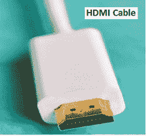

### 数字视频接口电缆

DVI 线是视频显示接口，用于连接显卡和液晶显示器，代表数字可视接口。在没有任何干扰的情况下，用户可以在使用该电缆的帮助下看到高质量的图片。它能够以高分辨率(2560 x 1600 分辨率)将视频内容传输到显示设备，主要用于具有 VGA 连接的阴极射线管显示器。开发它的主要目的是成为向计算机系统传输数字和模拟信号的行业标准。

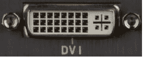

由于有些 DVI 电缆只能传输音频信号，HDMI 更常见于电视，但 DVI 甚至可以广泛用于一些电视。根据支持的信号，三个名称之一可能包含在 DVI 连接器中:DVI-I(数字和模拟)、DVI-D(仅数字)或 DVI-A(仅模拟)。很容易区分 DVI 电缆是模拟的还是数字的。如果电缆上只有一个扁平引脚，则称为数字视频接口。如果有一个扁平引脚，并且一个引脚周围包含四个引脚，则称为 DVI 模拟。

### VGA 电缆

另一种电脑电缆是 [VGA](https://www.javatpoint.com/vga-full-form) 电缆，由 IBM 开发，1987 年推出。它代表视频图形阵列或视频图形适配器，用于连接显示器和计算机的中央处理器并传输视频信号。高清电视也使用 VGA 线，如果分辨率降低到 320 x 200 会显示 256 种颜色；但是，它提供 640 x 480 分辨率的彩色显示屏。在现代，电脑，甚至电视和投影仪都有 VGA 电缆和连接器。然而，DVI、HDMI、显示端口电缆和连接器正在成为取代 VGA 电缆的原因。VGA 电缆的图片如下所示。

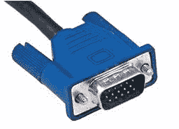

### 以太网电缆

以太网电缆通常用于有线网络，连接质量由以太网电缆的长度和耐用性来描述。它可以用来连接局域网内的个人电脑、路由器和交换机等设备，如果电缆不耐用且太长，连接质量不会达到最佳。这有时可能会造成问题；因此，有几种以太网电缆可供选择，您可以从市场上轻松购买。以太网端口位于主板上，用于插入以太网电缆。这种电缆看起来像电话线，但与电话相比，它有更多的电线。此外，用户可以购买不同颜色的以太网电缆，它包含八根电线。下图是以太网电缆。

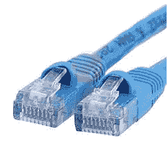

### PS/2 电缆

PS/2 电缆为标准电缆，包含一个圆形连接器，共 6 个引脚，市场上一般有两种尺寸的 PS/2 电缆。它用于将鼠标和键盘连接到计算机系统上，长度足够长。它代表由 IBM 开发的个人系统/2。最常见的电缆尺寸较小，但也有一些适配器可用于增加其尺寸。但是 USB 电缆正在取代它们，因为它们可以很容易地插入，并且是通用电缆。PS/2 电缆示例如下:

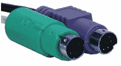

### 5 毫米音频电缆

3.5 毫米音频电缆是一种计算机电缆，仅用于将耳机和头戴式耳机连接到系统。通常，它们用于将微型立体声音频设备、个人电脑声卡或任何便携式光盘播放器连接到任何多媒体扬声器。

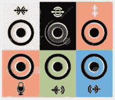

### USB 电缆

通用串行总线电缆是一种流行的标准电缆，使计算机设备能够与外围设备和其他设备交互。它代表通用串行总线，有各种通过 USB 电缆连接的设备，如键盘和鼠标、音乐播放器和闪存驱动器等。它的第一个版本 1.0 于 1996 年 1 月发布，后来被微软、康柏、英特尔等公司采用。通用串行总线端口出现在计算机系统上，用于连接通用串行总线电缆。例如，鼠标和键盘有一根连接到计算机的 USB 电缆。每当设备通过 USB 电缆连接，并且您需要在设备运行时拔下 USB 电缆时，首先您应该安全弹出，然后您可以将其从系统中拔下。下图是 USB 电缆的示例。

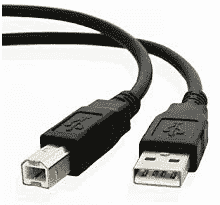

### 迷迪

MIDI 是连接不同品牌的两种不同音乐成分的简单程序；它最早是在 20 世纪 80 年代开发的。它代表乐器数字接口，可以承载摇摄、音乐数据、事件消息、颤音等。通常，它是一个标准，充当音乐设备的遥控器，并以数字方式表示和传输声音。在声音模块上，用户可以使用键盘来更改音符的速度、音高和音量。MIDI 电缆提供了对其他设备的更多控制，因为它不传输音频信号，也不以数据形式传输消息。

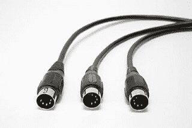

有许多早期的计算机系统，其中声卡包含连接电子乐器和计算机的 MIDI 端口。像 MIDI 键盘或合成器这样的设备可以通过 MIDI 电缆连接到计算机。

### Molex

它是计算机内部使用的电源线。Molex 不是电缆名称。它是开发计算机和其他相关设备的公司的名称。它也被称为 4 针连接器或 Molex 电源连接器，用于将 DC 电源连接到计算机内部的驱动器和设备。在电脑内部，几乎所有设备都使用 Molex 连接器。常见的设备有视频卡、硬盘和光盘驱动器(如光盘、DVD、蓝光)。

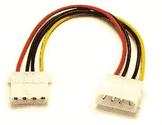

### 萨塔（人名）

SATA 是一种接口，旨在取代 IBM 兼容计算机中使用的并行 ATA 接口，也称为“串行 ATA”这是一个用于硬盘的接口，它的第一个 1.0 版本于 2001 年 8 月发布。它提供了一个小而薄的电缆解决方案，传输速率从 150 兆位/秒开始。它与 ATAPI 和 ATA 设备向后兼容，与早期的带状电缆相比，它在计算机中提供了更好的气流。与过时的 PATA 标准相比，它是一个更有效、更好的接口。

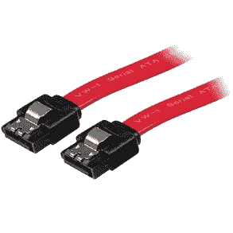

### 小型计算机系统接口

SCSI 的发音为“Scuzzy”，代表小型计算机系统接口，支持 8 个设备或 16 个宽 SCSI 设备。它于 1982 年首次完成，旨在将设备连接到计算机。它通常与光盘、硬盘和磁带驱动器一起使用，所有设备都“菊花链”连接在一起，并连接到中央总线，因为它是一种总线技术。

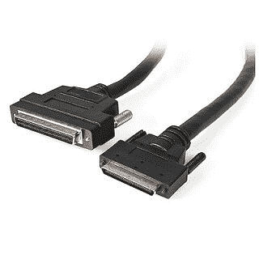

根据 SCSI 总线的位置，它的要求是依赖的，SCSI 连接器可以是外部的，也可以是内部的。SCSI 使用三种不同的信号类型，如 LVD(低压差分)、单端(SE)和差分(可能是 HVD 或高压差分)。此外，SCSI 连接也可以在更高级的主板上使用。

### 雷电

迅雷是一种相对较新的技术，用于将外围设备连接到计算机，主要用于苹果显示器和设备。它为用户提供了通过菊花链软线向他们的计算机添加几个设备的好处。通过使用带有电缆的一个端口，它允许用户使用一根电缆来访问高分辨率和高速媒体，这些媒体可以访问 PCI Express 和 DisplayPort。迅雷是苹果和英特尔开发的一种相当新的外设连接技术。

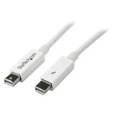

### 一些其他常见类型的计算机电缆

*   **串行(RS-232):** 计算机上的异步端口，与鼠标和调制解调器一起使用，能够一次传输一位。
*   **S/PDIF:** 它在家庭影院系统和音频设备之间传输数字音频，并以压缩形式传输信号。它通常与代表索尼和菲利普斯数字互联格式的 DVD 和环绕声一起使用。
*   **Firewire(IEEE-1394):**Firewire 最早由苹果在 1995 年开发，支持 PnP(即插即用)设备。设备数码相机和外部驱动器通常使用这种电缆，也称为 IEEE-1394。
*   **迷你插头:**迷你插头是一种 3.5 毫米的公插头，广泛用于扬声器、麦克风和耳机。声卡上迷你插头的位置由您使用的设备决定。例如，电脑扬声器和麦克风插孔插入声音输出插孔，耳机插入线路输出。
*   **同轴:**同轴电缆包含高传输和带宽容量，广泛用于电视和投影仪。这种电缆也用于网络，大多数用户将电视连接到有线电视服务。
*   **Composite:** 主要用于电视、投影仪，每端配有黄、红、白接口。游戏系统、录像机、DVD 播放器或其他音频/视频设备通过复合电缆连接到电视。
*   **显示端口:**是数字音视频接口，自带两种不同的连接方式；较小的迷你显示端口和标准显示端口。但是这两种连接类型都传输相同的信号。

## 计算机电缆的优点

电缆对于计算机连接计算机系统内部或外部的多个设备非常重要。为了执行不同的操作，计算机电缆用于传输数字和模拟信号。像通用串行总线电缆一样，一些计算机电缆具有传输电力的能力。用户还可以通过使用计算机电缆做更多的事情，例如听音乐、看电影、玩游戏等等。

* * *