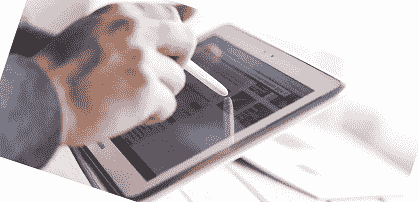

# 什么是光笔？

> 原文：<https://www.javatpoint.com/what-is-a-light-pen>

光笔，基本上是手写笔，是一种光敏导向计算机输入设备。它通常用于突出显示计算机屏幕或监视器上的文本、对象或更改数据。与触摸屏类似，它允许用户与屏幕上可用的用户界面对象进行交互，但位置精度更高。它与任何基于阴极射线管的显示器一起使用。这些设备最初是为了突出显示和操纵显示器上的对象。阴极射线管监视器扫描屏幕；因此，光笔在阴极射线管显示器上运行良好。

光笔的[液晶](https://www.javatpoint.com/lcd-full-form)显示器的使用能力不清楚。然而，在日本，日立和东芝在“显示器 2006”上展示了类似的想法。此外，作为麻省理工学院旋风项目的一部分，1955 年首次发明了一支光笔。同样，它可以被认为是触摸屏的前身；当阴极射线管被电子束扫描时，它检测到附近屏幕像素的亮度变化。最终，输入设备消亡了，因为使用液晶显示器的能力与现代液晶屏幕不兼容。

## 光笔的历史

第一支光笔最初是在 1955 年左右和 20 世纪 60 年代作为麻省理工学院旋风项目的一部分开发的。对于军事空域监视，它用于安/FSQ-7 的态势显示控制台，这是光笔的常用用途之一。对于光笔来说，与旋风项目的关系并不令人震惊。

20 世纪 60 年代，光笔可用于纯文本终端，并在 IBM 2250 等图形终端上变得普遍。在 20 世纪 80 年代，光笔的使用扩展到了像 Fairlight CMI 这样的音乐工作站，以及像雅达利、康茂德 8 位计算机、MSX 计算机和阿姆斯特拉德 PCW 家用计算机这样的设备；因此，它在这个时期变得流行起来。一些显卡和设备也提供了连接光笔的连接，比如 BM PC 兼容的 CGA 和 HGC，早期的 Tandy 1000 电脑也是如此。

此外，三洋还为 MSX 电脑生产了一款光笔接口墨盒。但是，由于用户需要使用倾斜显示器的桌子，或者长时间将手臂放在设备屏幕前，光笔作为通用输入设备的使用被放弃了。此外，由于触摸屏的发明，光笔在现代不再使用。

## 光笔的优点

在某些情况下，光笔可能比鼠标更强大。一个专用的笔允许你直接从你的显示器上与电脑桌面交互，它的界面将传统的鼠标从方程中移除。当您使用专用笔和屏幕时，它可以正常工作。与其他输入设备相比，光笔变得不那么普遍，因为它们是相当专业的利基工具。然而，光笔有以下各种优点:

### 精度选择工具

用光笔，你直接点击光标在屏幕上的位置；因此，它为用户提供了与显示屏精确交互的优势。因此，光笔在需要快速、精确选择的地方更有用。

### 光的艺术应用

与鼠标相比，光笔非常适合艺术和设计作品。如果你从事与设计相关的工作或在电脑上工作，这可能会非常尴尬，导致实践效率低下，缺乏吸引力。光笔具有执行功能的能力，非常像绘图板，它允许用户在自然绘图动作的帮助下开发平滑、干净的线条。然而，与图形平板电脑相比，由于滞后问题，光盘被认为对绘图应用不太精确。

### 桌面空间高效

如果您的桌面空间有限，光笔系统可以非常高效，因为它们不需要鼠标垫。实际上，计算机塔、键盘和显示器获得了更多的空间。光笔可以放在装有显示器的夹子里，这样可以减少对桌子空间的需求。而且，书桌上的空间将被节省。

## 光笔的缺点

光笔有一些限制，如下所示:

### 尴尬的定位

对于光笔来说，定位是导致手腕劳损的最大缺点之一。由于与屏幕的交互，光笔需要一些笨拙的定位才能有效使用。例如，为了最大限度地提高你的精度，在大多数情况下，你将不得不稍微倾斜，这破坏了你的身体姿势。可能有条件或取决于监视器的大小和方向；你需要长时间使用光笔，这也会导致手腕劳损。

### 需要专门的监视器

为了与笔交互，光笔系统需要一个专用的监视器。就几乎所有的光笔系统而言，为了使显示器格外笨重，它们采用了阴极射线管技术。此外，为了确定阴极射线管监视器中屏幕元件的位置，监视器中使用的电子射线由笔检测。与图形平板电脑和触摸屏显示器相比，光笔系统实在是模棱两可；因此，获得一个可能也很困难。

### 一般用途效率低

虽然光笔系统能够很好地处理特殊任务，但其他界面更适合一般桌面计算。与光笔相比，标准触摸屏、鼠标和键盘接口的物理压力更小，更容易操作。此外，光笔的部署成本可能更高，主要是在大规模或企业部署中。

## 光笔的其他术语

*   术语光笔可以在演示时频繁使用，因为它是利用光的直接输入设备。光笔有助于在演示时引导观众观看特定区域，例如图像、标题或其他文本，因为它是一种非常聚焦的激光指示器或设备。

*   对于图形输入板(绘图板或笔输入板)，也可以使用光笔来定义笔(手写笔)。图形输入板转换来自手持手写笔的信息，因为它是一种自然的输入设备。

* * *