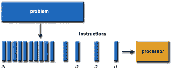

# 什么是并行计算？

> 原文：<https://www.javatpoint.com/what-is-parallel-computing>

并行计算是指多个处理器同时执行一个应用程序或计算的过程。一般来说，这是一种计算架构，其中大问题分解成独立的、较小的、通常相似的部分，可以一次处理。它是由多个 CPU 通过共享内存进行通信来完成的，共享内存在完成时会合并结果。它有助于执行大型计算，因为它将大型问题分配给多个处理器。

通过增加系统的可用计算能力，并行计算还有助于加快应用程序处理和任务解决。大多数超级计算机使用并行计算原理进行操作。需要大量处理能力或计算的操作场景，通常在那里使用并行处理。

通常，该基础设施位于服务器机架中安装各种处理器的位置；应用服务器将计算请求分成小块，然后在每台服务器上同时处理这些请求。最早的计算机软件是为串行计算编写的，因为它们能够一次执行一条指令，但并行计算不同，它一次执行几个处理器、一个应用程序或计算。

使用并行计算的原因有很多，比如省时省钱、提供并发、解决更大的问题等。此外，并行计算降低了复杂性。在并行计算的现实例子中，有两个队列来获得任何事物的票；如果两个收银员同时给两个人送票，这有助于节省时间并降低复杂性。

## 并行计算的类型

从开源和专有的并行计算供应商那里，通常有三种类型的并行计算可用，下面将对其进行讨论:

1.  **位级并行:**并行计算的形式，其中每个任务都依赖于处理器的字大小。就对大规模数据执行任务而言，它减少了处理器必须执行的指令数量。需要将操作分成一系列指令。例如，有一个 8 位处理器，您想对 16 位数字进行运算。首先，它必须操作 8 个低位，然后操作 8 个高位。因此，需要两条指令来执行操作。16 位处理器只需一条指令即可执行该操作。
2.  **指令级并行性:**在单个 CPU 时钟周期内，处理器在指令级并行性中决定同时执行多少条指令。对于每个时钟周期阶段，指令级并行处理器能够处理少于一条指令的数据。指令级并行的软件方法基于静态并行，计算机决定同时执行哪些指令。
3.  **任务并行性:**任务并行性是将任务分解为子任务的并行形式。然后，每个子任务被分配执行。并且，子任务的执行由处理器并发执行。

## 并行计算的应用

并行计算有以下各种应用:

*   并行计算的主要应用之一是数据库和数据挖掘。
*   系统的实时模拟是并行计算的另一种用途。
*   网络视频和多媒体等技术。
*   科学与工程。
*   协作工作环境。
*   增强现实、高级图形和虚拟现实使用了并行计算的概念。

## 并行计算的优势

下面讨论并行计算的优势:

*   在并行计算中，更多的资源被用来完成任务，从而减少了时间和可能的成本。此外，廉价的组件被用来构建并行集群。
*   与串行计算相比，并行计算可以在短时间内解决更大的问题。
*   与串行计算相比，并行计算更适合模拟、建模和理解复杂的现实世界现象。
*   当本地资源有限时，它可以为你提供比非本地资源更多的好处。
*   有多个非常大的问题，在一台计算机上解决它们可能不切实际或不可能；并行计算的概念有助于消除这些问题。
*   并行计算的最佳优势之一是，它允许您通过使用多种计算资源在一段时间内完成多项任务。
*   此外，并行计算适合硬件，因为串行计算浪费了潜在的计算能力。

## 并行计算的缺点

并行计算有许多限制，如下所示:

*   它解决了难以实现的并行架构。
*   在集群的情况下，并行计算需要更好的冷却技术。
*   它需要托管算法，可以在并行机制中处理。
*   多核架构消耗高功耗。
*   并行计算系统需要低耦合和高内聚，这是很难创建的。
*   基于并行的程序的代码可以由技术最熟练、最专业的程序员来完成。

*   虽然并行计算有助于您通过使用多个处理器来解决计算和数据穷举问题，但有时它会影响系统和一些控制算法的结合，并且由于并行选项而无法提供良好的结果。
*   由于同步、线程创建、数据传输等等，额外的成本有时会相当大；甚至由于并行化，它可能会超过收益。
*   此外，为了提高性能，并行计算系统需要针对不同的目标体系结构进行不同的代码调整

## 并行计算机体系结构基础

并行计算机体系结构根据硬件支持并行的级别进行分类。并行计算机体系结构有不同的类别，如下所示:

### 多核计算

包含两个或更多不同处理核心的计算机处理器集成电路被称为多核处理器，其具有同时执行程序指令的能力。内核可以实现类似于 VLIW、超标量、多线程或向量的架构，并且被集成在单个集成电路管芯上或单个芯片封装中的多个管芯上。多核体系结构被分类为由不同内核组成的异构，或者被分类为仅由相同内核组成的同构。

### 对称多处理

在对称多处理中，单个操作系统处理具有两个或多个同类独立处理器的多处理器计算机体系结构，这些处理器平等地对待所有处理器。每个处理器都可以处理任何任务，而无需担心该任务的数据在内存中是否可用，并且可以借助片上网状网络进行连接。此外，所有处理器都包含一个专用高速缓冲存储器。

### 分布式计算

分布式系统的组件位于不同的联网计算机上。这些联网的计算机在通过 HTTP、类似 RPC 的消息队列和连接器进行通信的帮助下协调它们的动作。组件的并发性和组件的独立失效是分布式系统的特点。通常，分布式编程以对等、客户机-服务器、n 层或三层体系结构的形式进行分类。有时，术语并行计算和分布式计算可以互换使用，因为两者之间有很多重叠。

### 大规模并行计算

在这种情况下，多台计算机同时并行执行一组指令。网格计算是另一种方法，其中许多分布式计算机系统同时执行，并在互联网的帮助下进行通信，以解决特定的问题。

## 为什么是并行计算？

我们需要并行计算有各种各样的原因，如下所述:

*   并行计算处理更大的问题。在现实世界中，有多个事物在某个时间运行，但同时在许多地方运行，这很难管理。在这种情况下，并行计算有助于管理这种广泛庞大的数据。
*   并行计算是使数据更具建模性、动态模拟性以及实现这一点的关键。因此，现实世界也需要并行计算。
*   借助串行计算，并行计算实现实时系统并不理想；此外，它还提供并发性，节省时间和金钱。
*   只有并行计算的概念才能组织大数据集、复杂数据集及其管理。

*   并行计算方法保证了资源的有效使用，并保证了硬件的有效使用，而串行计算中只使用了硬件的某些部分，某些部分被闲置。

## 并行计算的未来

从串行计算到并行计算，计算图已经完全改变。像英特尔这样的科技巨头已经开始将多核处理器纳入系统，这是朝着并行计算迈出的一大步。为了更美好的未来，并行计算将给计算机的工作方式带来一场革命。并行计算在连接世界方面发挥着前所未有的重要作用。此外，随着多处理器计算机、更快的网络和分布式系统的出现，并行计算的方法变得更加必要。

### 串行计算和并行计算的区别

串行计算是指使用单个处理器执行一个程序，也称为顺序计算，将程序分成一个指令序列，对每个指令进行逐一处理。传统上，软件提供了一种更简单的方法，因为它是按顺序编程的，但是处理器的速度大大限制了它执行每一系列指令的能力。此外，单处理器机器使用顺序数据结构，其中并行计算环境的数据结构是并发的。

与并行计算中的基准相比，在顺序编程中，衡量性能远没有那么重要和复杂，因为它包括识别系统中的瓶颈。在基准测试和性能回归测试框架的帮助下，可以在并行计算中实现基准测试。这些测试框架包括许多测量方法，如多次重复和统计处理。借助于在内存层次中移动数据，避免这种瓶颈的能力主要体现在并行计算中。并行计算的成本更高，而且可能更复杂。然而，并行计算处理更大的问题，有助于更快地解决问题。

## 并行计算的历史

在整个 60 年代和 70 年代，随着超级计算机的进步，对并行计算的兴趣可以追溯到 20 世纪 50 年代末。关于分支、等待和并行编程的需要，斯坦利·吉尔(费兰蒂)在 1958 年 4 月讨论过。此外，关于在数值计算中第一次使用并行，IBM 研究人员丹尼尔·斯洛特尼克和约翰·科克在 1958 年讨论过。

1962 年，四处理器计算机 D825 由巴勒斯公司发布。1967 年举行了一次会议，即美国信息处理学会联合会，会上阿姆达尔和斯洛特尼克发表了关于并行处理可行性的辩论。非对称多处理器系统，霍尼韦尔的第一个 Multics 系统，于 1969 年推出，能够并行运行多达 8 个处理器。

20 世纪 70 年代，卡内基梅隆大学的一个多处理器项目 C.mmp 是第一批拥有多个处理器的多处理器之一。在这个项目中，针对来自 64 个英特尔 8086/8087 处理器的科学应用，推出了一台超级计算机，并启动了一种新型的并行计算。1984 年，带有窥探缓存的 Synapse N+1 是第一个总线连接的多处理器。对于劳伦斯·利弗莫尔国家实验室来说，建立在大规模并行计算机上是斯洛特尼克在 1964 年提出的。伊利亚克四号是 SIMD 最早的并行计算系统，由美国空军设计。

* * *