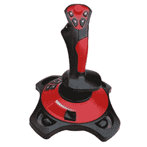
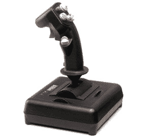
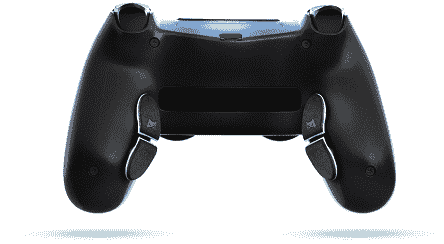
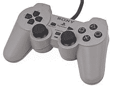

# 什么是操纵杆？

> 原文：<https://www.javatpoint.com/what-is-a-joystick>

操纵杆是一种输入设备，通常用于控制游戏应用程序，有时也用于图形应用程序。它最早是由美国海军研究实验室的 C. B .米里克发明的，并于 1926 年获得专利。通常，使用操纵杆是为了管理计算机程序中的机器或角色。它包括一个底座和一个可以向左或向右移动的操纵杆，还可以旋转不同的角度来控制光标在计算机设备中的移动。通过操纵操纵杆上的控制杆，可以控制指针或光标的移动。它们由附加功能的额外按钮组成，看起来类似于街机游戏中的控制设备。下图是操纵杆的一个实例。

与键盘上的按键相比，由于其灵活的移动，它可以提供更好的控制。操纵杆在输入设备方面对残疾人也更有好处。至少一个按钮包含在操纵杆前部的大部分操纵杆中，用于触发，另一个按钮位于操纵杆顶部。底座上有多个带有其他按钮的操纵杆。这些按钮可以在不引导操纵杆的手的帮助下使用。

通常，操纵杆通常带有软件，使用户能够分配每个按钮的功能。此外，使用串行端口或基本的 USB 连接，操纵杆连接到您的计算机。对于飞行模拟器和飞行动作游戏，操纵杆更合适，因为它们模拟飞机和其他飞机的控制。然而，操纵杆也被一些游戏玩家用于其他类型的电子游戏，例如第一人称射击游戏和格斗游戏。此外，一些用户使用他们已经习惯的鼠标和键盘。

此外，当需要特定功能或需要完成直接指向时，主要需要操纵杆。操纵杆有多种类型，如手动等轴操纵杆、手指操纵杆、位移操纵杆、拇指/指尖操纵杆、手动操纵杆等。

操纵杆还包括类似于鼠标的按钮，有时称为触发器。操纵杆和鼠标之间的区别主要基于这样一个事实，即在鼠标移动之前，它阻止光标进一步移动，而在操纵杆上，除非它保持直立，否则光标会继续沿操纵杆的方向移动。

在游戏应用中，非常需要由操纵杆提供的快速交互。与其他输入设备相比，操纵杆提供了更好的游戏体验。它易于学习和使用，而且通常不会更贵。然而，当需要从屏幕上选择选项时，它不是一个合适的设备，并且在这种情况下不容易处理。

一些操纵杆不具备对角或横向移动的能力，并且将移动方向限制为向左、向右和向前、向后。此外，与其他输入设备相比，操纵杆并不坚固。有时，用户发现与鼠标等输入设备进行比较时很难控制。

## 操纵杆的类型

操纵杆有以下不同类型:

最常见的操纵杆类型之一，也称为“雅达利式”数字操纵杆，广泛用于家用电脑。它最早出现在雅达利 2600 电子游戏中，使用简单的左、右、上、下和发射命令，后来被家庭电脑采用。这种操纵杆的优点是，它们可以从许多制造商那里获得，并且是标准配置。下图是一个数字操纵杆的实例。

### 桨控制器

桨式操纵杆是一种用于控制游戏的普通控制器设备。它是最古老的操纵杆之一，包括一个旋钮和一个击发按钮。随着第一个家用电子游戏机的出现，它被引进来处理显示器上的球拍。下图是一个桨式控制器的实例。

### 模拟操纵杆

模拟操纵杆结合了数字和桨式操纵杆的思想。阿米加、苹果和 IBM 个人电脑都使用了模拟操纵杆；它们只包含模拟操纵杆输入。像数字操纵杆一样，模拟操纵杆也不那么标准化。所有的制造商都生产自己的型号，并有自己的规格。下图显示了模拟操纵杆的外观。

### 电脑模拟

在现代，个人电脑模拟操纵杆是最常见的操纵杆类型，最初是由 IBM 与他们的个人电脑一起推出的。它通常通过一个 USB 端口连接，它只是一个基本的模拟操纵杆，有多个按钮。操纵杆接口卡尽可能便宜。如今，为了更快地访问游戏程序的游戏杆，避免一些常见的电脑游戏杆问题，与通过电脑游戏杆卡接口相比，这些游戏杆已经以其他方式得到应用。那些数字电脑操纵杆与电脑通信的方式并不标准化。此外，可能的方法是串行端口、键盘连接器或借助旧操纵杆接口的专有串行协议。

## 计算机操纵杆端口

在现代，使用一个 USB 端口，操纵杆连接到计算机的大部分。下面给出了操纵杆支持的各种端口。

*   **游戏端口:**最早发现于 1981 年的 IBM 电脑上，是一个 15 针的连接器端口，最初被称为模数端口。它也被称为操纵杆端口、游戏端口或游戏控制适配器，允许用户连接方向盘、操纵杆、游戏手柄等设备。某些主板包含内部 ISA 或 PCI 卡。如果主板没有此功能，可以在主板上安装操纵杆端口。
*   **蓝牙:**蓝牙描述了设备如何相互通信，因为它是一种计算和电信行业规范。有各种使用蓝牙的设备，如数字助理、智能手机、计算机、键盘和鼠标。蓝牙的有效范围为 32 英尺(10 米)，传输速率为 1 Mbps。
*   **串口:**用于将串行设备连接到计算机，也称为异步端口。它通常位于计算机背面，能够一次传输一位。通常，这类端口在 IBM 兼容的计算机系统上被识别。
*   **USB:** USB 允许电脑与外设等设备进行通信，代表通用串行总线。它是一个即插即用的接口，覆盖范围很广；它使各种设备能够与计算机或其他设备连接，如键盘、鼠标、闪存驱动器和音乐播放器等。

## 操纵杆简史

**公元前米里克**在美国海军研究实验室发明了第一个双轴电子操纵杆，并于 1926 年获得专利(美国专利号 1，597，416)。设计它的主要目的是遥控飞机，它的设计看起来和今天使用的操纵杆一样。操纵杆可能是用来支持遥控飞机的，这是由 NRL 开发的。

大约在 1944 年，德国人开发了一种电动双轴操纵杆，它被用作德国人的芬克热(Fug)203 Kehl 无线电控制发射机系统的一部分，以引导无动力的开创性精确制导弹药 Fritz-X 和火箭助推反舰导弹 Henschel Hs 293。

代替模拟传感器，这个操纵杆包括开关。此外，将电信号转换成无线电信号的工作是由瓦瑟法尔转向设备完成的，然后传输给导弹。

在无线电控制的模型飞机系统中，操纵杆的使用在 20 世纪 60 年代有所增加。例如，操纵杆控制月球着陆器测试模型。

对于“侧杆”形式的飞行控制，操纵杆在许多现代客机上获得了新生。侧杆是指类似游戏操纵杆的控制器，用来控制飞行，以取代传统的轭架。与传统的控制轭相比，侧杆在许多领域可能更有用，例如在事故中更安全，提高运动和驾驶舱的可见性，并节省重量。

## 操纵杆的优势

当涉及视频游戏时，操纵杆与控制面板相比具有多种优势。它在控制游戏中起着重要的作用，可以用来玩家用游戏机或电脑游戏。下面给出了操纵杆的许多好处，可以帮助你描述操纵杆和控制面板之间的区别，并确定哪一个更适合你。

### 经典感觉

与控制面板相比，经典的手感是 PlayStation 3 和 Xbox 360 使用它时的最佳优势之一。此外，在玩经典的街机游戏时，使用起来会舒服得多，这些游戏都有操纵杆。在 Pac-Man 中，一个操纵杆用于两种功能，站立和坐下版本，这是另一个例子。如果你是玩吃豆人长大的，你可能更喜欢用操纵杆。《挖挖》和《金刚驴》都在其他经典操纵杆游戏的列表中，这些游戏都可以在下一代游戏机上使用。

### 战斗时间到了

操纵杆被设计成包含两个按钮和尺寸范围，其他操纵杆被设计成具有许多适合于格斗游戏的按钮。更大的操纵杆不需要你握着它们，因为它们可以放在平坦的表面上。当使用控制面板时，它会限制你主要使用拇指。此外，你可以用一个更大的操纵杆或游戏手柄同时使用多个手指，这是格斗游戏的理想选择。例如，如果你正在玩一个格斗游戏，就需要创建需要同时按下多个按钮的组合动作。

### 飞行模拟器

不同种类的控制器，像飞行模拟器，受到一些游戏的鼓励，这些游戏可以是个人电脑，也可以是控制台。这些游戏允许用户插入飞机式控制器；举个例子，After Burner 就是在经典街机游戏上找到的控制你飞机的工具。控制器可以用一只手握住，放在底座上的按钮可以用另一只手按下。这些按钮控制机枪和导弹等武器。如果你使用飞行模拟器控制器，而不是只玩游戏，你会觉得你在飞机的驾驶舱里。

### 直觉的

与控制面板相比，使用操纵杆的另一个优点是，当您玩视频游戏时，操纵杆更直观，可以控制角色的移动。如果你必须向左或向右移动，你只需要向左或向右推操纵杆。要向左或向右移动一个角色，方向板需要你按下它。

## 操纵杆的缺点

操纵杆有各种缺点；下面将讨论一些问题:

### 兼容的

操纵杆的主要缺点之一是兼容性。它与大多数计算机不兼容；例如，旧的操纵杆可能不支持所有系统，这些操纵杆只与它们附带的游戏系统兼容。此外，有些可能无法在 Macs 上工作；然而，有些人会在电脑上工作。您的操作系统无法识别该设备，这可能会导致将其与设备连接时出现错误。购买游戏杆游戏控制器时，请确保游戏杆与您的计算机系统兼容。除了仿真器之外，如果你想使用旧的操纵杆，你需要在你的电脑上有一个 USB 或操纵杆端口。仿真器使计算机系统能够识别控制器并允许输入。

### 控制问题

操纵杆有按钮和旋转杆来控制动作。玩家大部分时间都在使用操纵杆来发射像飞机这样的物体，或者在游戏中操纵。一些使用旧版本操纵杆的玩家可能会面临如何移动控制器的问题。如果他们长时间使用它，操纵杆的按钮可能会卡住。因此，他们可能只能用操纵杆上下或左右执行动作。如果你陷入这个问题，只有你能移动控制，不能操纵游戏中的物体，在这种情况下，你可能需要重新布线你的游戏系统。有时，它可能会在操纵杆意外折断时发生。

### 操纵杆导致手部受伤

如果你经常或长时间使用操纵杆，会导致重复性压力损伤，如腕管综合征。当你对身体的某个特定部位施加太大压力时，会有很多重复压力伤害的机会。持续使用操纵杆的玩家可能会感觉到他们的上风区域疼痛、刺痛或麻木。此外，一些玩家更容易出现这种症状，用操纵杆玩起来特别粗暴。他们的手部受伤表现为压痛、组织损伤或肌肉拉伤。如果你感到任何不适或疼痛，你应该与医生联系以减轻你的压力。您还可以通过限制或停止使用操纵杆来帮助防止严重问题。如果您因操纵杆而感到紧张，并且不寻求医疗帮助，您的问题可能会变得更加严重，这可能会妨碍您完成日常任务，或者您可能需要手术。

### 有限游戏类型

操纵杆更适合某些类型的游戏，如射击游戏、格斗游戏、飞行模拟器等。除非你不使用操纵杆，否则你真的不会体验到控制面板和操纵杆之间的区别。此外，游戏杆限制了你使用很少的游戏类型，购买一个高质量的游戏杆需要很高的价格。

* * *