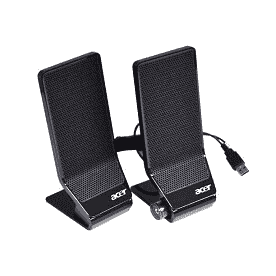

# 什么是扬声器？

> 原文：<https://www.javatpoint.com/what-is-a-speaker>

扬声器用于连接计算机产生声音，是最常见的输出设备之一。有些扬声器是为连接任何一种音响系统而设计的，而有些只能连接电脑。有了电脑扬声器，电脑的声卡就会产生一个用来发声的信号。扬声器的主要目的是为听众提供音频输出。电磁波通过扬声器转换成声波，因为它们是换能器。这些设备，如音频接收器或计算机，向扬声器提供音频输入，可以是模拟或数字形式。模拟扬声器的作用只是将模拟电磁波放大成声波。

声波是以模拟形式产生的，但首先，数字输入由数字扬声器转换成模拟信号，然后产生声波。振幅和频率决定了扬声器产生的声音。频率决定了声音的音调有多高或多低。例如，低音吉他或踢踏鼓产生低音波，而女高音歌手的声音产生高频范围内的声音。音质有多清晰，取决于扬声器系统的能力；如果它能够准确地再现声音频率，它可以是确定音频质量的最佳指标。

有许多扬声器由不同的扬声器锥体组成，这使得它们能够为不同的范围提供更准确的声音。三向扬声器通常包含低音炮、中音扬声器和高音扬声器，而双向扬声器包含中音扬声器和高音扬声器。扬声器声波产生的气压决定了响度或振幅。

就像计算机的声卡和其他一些音频源产生的信号低，这可能需要通过扬声器来增强。这就是原因，为了放大信号，大部分外接电脑扬声器都用电；因此，它们被放大了。能够增加声音输入的扬声器通常被称为有源扬声器。如果扬声器可以插入电源插座或由音量控制组成，您可以轻松确定扬声器是否处于活动状态。无源扬声器是没有任何内部放大的扬声器；这些扬声器需要高水平的音频输入，因为它们不会增加音频信号。

通常，扬声器成对出现，从而产生立体声。这意味着，在两个独立的通道上，左右扬声器产生音频。当你使用两个扬声器时，音乐听起来自然得多，因为在这种情况下，我们的耳朵同时听到来自左侧和右侧的声音，这使得声音更加自然。此外，环绕声系统可以产生更逼真的声音，因为它们可能包括四到七个扬声器，包括一个低音炮。

## 给演讲者打分

扬声器的额定失真、瓦特、频率响应和总谐波。

*   **频率响应:**由扬声器产生，是声音高低的速率。
*   **瓦:**对于扬声器来说，就是放大量。
*   **总谐波失真(THD):** 是在放大信号的帮助下产生的失真量。

## 需要电脑扬声器

有许多任务或事件可以通过扬声器完成。它们用于产生听众可以听到的声音，创建环绕声，用低音炮添加更多的低音。市场上也有需要连接到计算机或其他设备才能发出声音的外置扬声器。如果您不需要更大的声音、更响的声音、更低音，或者您有智能手机、笔记本电脑或其他带有内置扬声器的设备，则不需要外置扬声器。

## 扬声器是如何工作的？

外壳、锥体、磁铁、铁被用来制造扬声器；它们在将电能转化为机械能的帮助下工作。机械能用于压缩空气并将运动转化为声压级或声能。当一个设备给扬声器提供电输入时，电流通过线圈传送，线圈产生电场。它与附着在扬声器上的磁场相互作用。当扬声器接收到来自设备的电输入时，音圈被连接以来回移动。这种前后运动使我们感知为声音的外锥体振动。

## 说话人类型的分类

扬声器根据其拥有的驱动器和使其与众不同的其他组件进行分类。市场上有许多类型的扬声器，下面给出了它们更专业的术语。然而，直接定义扬声器的实际类型可能更困难；因此，下面先简单概述一下*说话人类型的分类*。

*   **动态:**这些类型属于无源扬声器，它有一个或多个低音扬声器驱动器。这是最常见的类型，包含一个或多个高音驱动器，也是众所周知的产生低频声音。
*   **低音炮:**这种类型负责产生低频声音，因为它包括一个低音端口。他们有一个大的低音扬声器驱动器。在不影响音质的情况下，它们有可能提高其他辅助扬声器的基础。
*   **喇叭:**这些与动态扬声器非常相似，包括将驱动器排列在波导结构中的方式。与高灵敏度和大面积声音传输相比，这些扬声器带有喇叭，为用户带来更多享受。
*   **静电:**如果你在寻找清脆细致的声音，它可以是你的最佳选择。这些包含一个精细的膜和一个放置在两个导电面板上的驱动器。在大多数情况下，这些振膜扬声器用于高频，并且总是插在外部电源插座上。此外，如果您正在寻找低频扬声器类型，它们并不适合此目的。
*   **平面磁性:**平面磁性扬声器有一个薄的金属带，而不是振膜。它不同于静电，因为不需要外部电源来操作它们。此外，这些扬声器可以使用很长时间，具有很高的实用价值。

## 不同类型的扬声器

首先，最重要的是确定哪些扬声器类型最适合您的需求，以及您将如何使用它们。下面，我们将讨论一种不同类型的扬声器，它可能会帮助您了解您应该购买什么类型的扬声器。

### 低音炮

低音炮是扬声器的一种，是非常低频声音的理想选择。它是一款全向扬声器，包含 20 到 200 赫兹左右的频率范围，主要特点是低音洪亮。这意味着你可以把它放在任何地方，因为人类感觉耳朵并没有真正听到 20 到 200 赫兹的声波。在现代，桌面扬声器系统中包含了某种低音炮。通常，这些扬声器可以在一些汽车音响系统中找到；然而，它们是非常理想的家庭影院。如果你通过结合高质量的全环绕系统来观看电影，它将真正改变观看电影的体验。超重低音扬声器也有类似于录音室监听音箱的有电和无电变体。

### 计算机扬声器

当电脑第一次内置扬声器时，微型小扬声器被固定在主板上。很快，当他们从声卡毕业时，他们开始插入小型桌面扬声器或您的耳机。通常，这一代电脑扬声器包含两个扬声器和一个低音炮，采用 2.1 风格，适合休闲听众。此外，还有 5.1 或 7.1 风格的环绕系统呈现给游戏爱好者。这些通常是需要通过 USB 连接到计算机的外部扬声器。

### 扬声器

自从有了收音机，扩音器就成了家庭生活的必需品；这些是一些最常见的家用扬声器。这些扬声器用于为老一代人从电视或立体声中获取声音。在现代，它们也有小尺寸，以产生高质量的声音；甚至它们可以装进你的口袋。另外，你可以带一个便携式扩音系统。这些扬声器主要用于卡拉 ok 或舞台表演。此外，它们可以安装在室外、墙上或天花板上。

### 演播室监视器

这些类型的扬声器是专业发烧友的理想选择，非常适合休闲聆听。他们有潜力清晰地再现人声和音乐。有两种显示器，有电源的和无电源的。电动显示器确实有给扬声器增加嗡嗡声的趋势，并且是内部供电的；他们只是插在墙上玩。与电动扬声器相比，它们不需要附近的插座来放置，也不像电动扬声器那样嗡嗡作响。确保在购买录音室显示器时，它们总是分开来的。然而，有些扬声器是成套的。

### 落地式扬声器

落地式扬声器更适合家庭工作室类型的设置或家庭影院系统，以满足您的聆听乐趣。在房间里，他们将是完全可见的，因为他们有大约 4 英尺高。它们根据您想要的配置提供各种声音。它们包含一个高音扬声器、中音扬声器和一个低音扬声器。为了混合全范围的声音，一些风格包括低音炮。此外，这些类型的扬声器需要一个放大器或接收器，大多数落地式扬声器都没有电源。

### 书架扬声器

这些是用于家庭影院设置的中型扬声器。它们可以作为环绕扬声器放在电视机的后面或侧面，为了获得完整的体验，它们必须面向您，因为这些扬声器是定向扬声器。通常，它们有一个中音扬声器和一个高音扬声器(2 个扬声器)，高约 5 英寸，通常称为双向扬声器。此外，他们需要一个接收器或放大器来像落地式扬声器一样运行。

### 墙内/天花板扬声器

这些类型的扬声器并不完全符合预算，安装起来可能有点困难。但是当你在家里从一个房间走到另一个房间的时候，让你的音乐跟着你，它们确实是值得一看的东西。可以说，在地板空间非常宝贵的地方，墙内/天花板扬声器非常适合家庭使用。这种扬声器需要专业安装，比如将电线穿过墙壁、天花板，防火墙不适合心脏虚弱的人。它们在内置扬声器的基础上有不同的尺寸，因为它们可以有 2 个到 10 个或更多的双向扬声器。当它们被放置在座位水平时，它们提供高质量的声音，并且大多数带有盖子，以将扬声器隐藏在墙壁中。

### 卫星扬声器

与大多数落地式或书架式扬声器相比，这些类型的扬声器通常尺寸较小。它们需要供电，并且作为系统的一部分进行布线。通常，这种扬声器包括一个带有高音扬声器的中低音扬声器，因为它已经包含一个低音炮。低音炮对卫星扬声器起着重要作用，因为它是卫星扬声器的电源。有许多配置可用；因此，这取决于你将决定哪一个更好的音质。

### 蓝牙扬声器

蓝牙扬声器为您提供了便携性，可以将它们放在任何地方，因为它们没有电线，可以通过蓝牙功能进行连接。这些扬声器产生高质量的声音，可以连接到您的手机或立体声接收器。虽然这些扬声器是无线的，但它们可能有一个缺点，即它们可能需要充电，并且大多数扬声器需要插入插座。

### 户外扬声器

这些类型的扬声器是为了隐藏在你的院子里作为岩石和防风雨。根据您想要的外部，您可以购买它们作为单个或系统扬声器。为了覆盖整个院子和露台，一些系统有许多中音区、低音炮和高音扬声器。在室外扬声器中，电线被插入一个耐候外壳中。

## 计算机扬声器的发展

在旧时代，计算机最初发布时，机箱内置了板载扬声器。这些扬声器能够发出一系列不同的嘟嘟声和音调。1981 年，IBM 发布了第一个内部计算机扬声器，它产生基本的低质量声音。

随着技术的进步，板载扬声器逐渐获得了产生音乐、声音和其他音效的能力，并从机箱移动到计算机显示器。通常，显示器前面的显示器扬声器位于左下方和右下方。然而，在一些显示器中，扬声器位于左侧和右侧。

当计算机在游戏、数字音乐和其他媒体领域变得流行时，外部扬声器开始由制造商生产。这些外置扬声器能够产生高低音和更高质量的声音。1991 年，阿比纳万·普拉基达斯(Abinawan Puracchidas)发布了第一款外部计算机扬声器，这种扬声器仍然是计算机的主流扬声器。

* * *