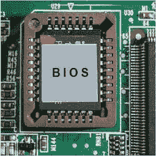

# 什么是 BIOS？

> 原文：<https://www.javatpoint.com/what-is-bios>

基本输入输出系统是一个程序，代表基本输入输出系统，存储在非易失性存储器中，如只读存储器或闪存，允许您在最基本的水平上设置和访问您的计算机系统。虽然大部分人没有必要乱动电脑上的 BIOS，但是了解一下 [BIOS](https://www.javatpoint.com/bios-full-form) 就可以更好了。它可以在主板上找到，主板是基于 Windows 的计算机上预先安装的程序，在计算机通电时执行。在加载操作系统之前，[中央处理器](https://www.javatpoint.com/cpu-full-form)访问基本输入/输出系统。然后，BIOS 的下一个功能是检查所有硬件连接并检测您的所有设备。

BIOS 的主要功能是设置硬件和启动操作系统，它包含控制显示屏、键盘和其他功能所需的通用代码。基本输入输出系统是管理硬盘的内置软件，不能在硬盘上运行。它不能驻留在[随机存取存储器](https://www.javatpoint.com/ram)中，因为它在计算机系统启动前是可访问的。实际上，它位于计算机系统的 [ROM](https://www.javatpoint.com/rom) 上，主要位于 EPROM(可擦除可编程只读存储器)芯片上。因此，当你打开电脑时，[中央处理器](https://www.javatpoint.com/central-processing-unit)访问 EPROM，并提供对 BIOS 的控制。

设计基本输入输出系统系统的主要目的是与众多设备一起工作，从而形成一个互补的系统芯片组。BIOS 库包含一些操作和控制系统外围设备的功能，它们可以通过外部软件启动。

用户可以使用 BIOS 用户界面执行不同的功能，这将在下面讨论:

*   用户可以执行硬件配置
*   他们可以选择引导驱动器
*   他们可以设置系统时钟
*   基本输入输出系统允许用户启用和禁用某些系统组件
*   对于 BIOS 用户界面功能，它为安全访问提供设置密码提示

基本输入输出系统作为输入输出设备和中央处理器之间的媒介，在计算机启动后使用。基本输入输出系统作为输入输出设备和中央处理器之间的媒介，在计算机启动后使用。由于基本输入输出系统，您的操作系统和程序不需要知道连接到您系统的输入/输出设备的详细信息。您可以在系统启动时通过进入基本输入输出系统设置来相应地更改这些设置。此外，如果您想进入基本输入输出系统设置，您可以在计算机启动时按住删除或 F2 键。

在一些现代电脑中，基本输入输出系统存储在可重写存储器中，允许信息被替换或重写。这种内容重写是在系统制造商提供的特殊程序的帮助下执行的。

## 基本输入输出系统可用性

基本输入输出系统软件适用于所有现代计算机主板。由于 BIOS 是主板的一部分；因此，BIOS 在 PC 上的访问和配置独立于任何类型的操作系统。基本输入输出系统不依赖于任何人，这意味着无论计算机上运行的是哪种类型的操作系统，如视窗 7、视窗 8、[视窗 10](https://www.javatpoint.com/what-is-windows) 、视窗 XP、 [Linux](https://www.javatpoint.com/linux-tutorial) 、视窗 Vista、Unix，或者根本没有操作系统，基本输入输出系统都在操作系统环境之外运行。

## 基本输入输出系统包括什么？

加载基本计算机硬件的说明包含在基本输入输出系统软件中。其中还包括一项称为开机自检的测试。开机自检有助于计算机正确启动，并验证计算机是否符合要求。如果测试时开机自检失败，您的计算机会发出各种形式的蜂鸣音。

## 基本输入输出系统功能

BIOS 有加载硬件所需的不同指令，它负责加载操作系统。基本输入/输出系统的主要功能讨论如下:

*   **BIOS 开机自检(POST):** 它确保计算机硬件正常运行，因为它是一个内置的诊断程序，可以。在系统中，它验证计算机是否满足必要的部件和功能。开机自检可以有效地完成此功能。它确保计算机成功加载任务，例如启动时使用内存、键盘和其他部件。如果开机自检测试在测试时失败，计算机会发出蜂鸣声组合来显示错误类型，当开机自检测试完全通过时，系统会继续启动。
    通过自检并加载基本指令后，计算机开始将操作系统从一个连接的驱动器加载到系统中。计算机用户也可以在计算机配置屏幕的帮助下更改基本输入输出系统设置。基本输入输出系统信息也可以存储在闪存中，计算机用户可以在供应商发布更新后进行更新。BIOS 实际上可以位于外部设备和计算机之间，因为它的名称描述了它用于读写硬盘和软盘、在屏幕上显示值、读取击键等。
*   **引导加载程序:**开机自检成功运行时，BIOS 识别并定位操作系统。程序引导加载程序包含在 BIOS 中，它搜索并启动操作系统引导程序。当基本输入输出系统检测到一个，它转移对操作系统的访问，这就是所谓的引导。
*   **BIOS 驱动程序:** BIOS 驱动程序存储在非易失性存储器中，其主要功能是提供基本的计算机硬件信息。
*   **BIOS 设置实用程序:**它是一个配置软件，也称为 CMOS 设置，允许用户配置硬件设置以及设备设置、时间和日期、计算机密码。非易失性存储器用于存储内存、磁盘类型和计算机系统信息的设置；该信息不存储在 BIOS 芯片中

用户在系统安装期间运行基本输入输出系统设置程序，并输入正确的参数。互补金属氧化物半导体是构建非易失性随机存取存储器的必要材料。这些互补金属氧化物半导体芯片以非常低的电流值存储和维护数据。因此，系统的配置也称为 CMOS 设置。借助于使用电容器、保持备用电池，或者通过内置在 NVRAM 芯片中的电池，可以保持 CMOS 设置。此外，该芯片还包括一个系统时钟。如果没有电池，该设置会保持一小段时间。并且有必要重置系统。通过它的基本输入输出系统设置程序是受保护的，因为有基本输入输出系统密码丢失。

对于计算机，基本输入输出系统作为固件内置在主板的芯片上。相比之下，操作系统(如 iOS 或 Windows)可以由用户安装，也可以由供应商或制造商预装。

当 BIOS 启动计算机时，它会验证计算机是否满足启动所需的附件。这些文件包含在计算机启动所需的任何硬件中，这种硬件被称为引导设备。

## 不同类型的基本输入输出系统

每个电脑用户都可以看到基本输入输出系统屏幕，无论他每次打开电脑系统时是否知道。计算机制造商显示的屏幕称为基本输入/输出系统。BIOS 主要有两种类型，如下所示:

1.  **UEFI:**UEFI 可容纳 2.2 TB 或更大的驱动器，代表统一可扩展固件接口。它在使用主引导记录而不是 GPT 技术(更现代的 GUID 分区表)的帮助下处理驱动器。此外，苹果的苹果电脑从未使用过基本输入输出系统。
2.  **传统基本输入输出系统:**传统基本输入输出系统在旧主板上用于打开电脑。传统 BIOSes 有局限性，因为它们无法处理或识别大于 2.1 TB 的驱动器。但是，它控制着中央处理器和组件之间的通信方式。

## BIOS 与 UEFI

最有可能的是，你会在大多数现代电脑中看到 UEFI，而不是 BIOS。但是 UEFI 和 BIOS 有什么区别呢？很难区分两者，因为它们几乎执行相同的功能。UEFI 与 BIOS 相同，代表统一可扩展固件接口，充当硬件和操作系统之间的中间程序。

与基本输入输出系统相比，UEFI 提供了更多的功能，并且可以广泛定制。为了加载操作系统，它不需要单独的引导加载程序。它能够管理超过 2tb 的硬盘，因为它提供 GPT 本地支持，而基本输入输出系统无法提供这种支持。

## 升级基本输入输出系统

经常会发现，当计算机需要用最新的硬件升级时，它并不支持最新硬件的所有功能。它需要升级硬件，比如更多的内存、更大的硬盘或新的显卡。升级 BIOS 芯片是解决这个问题比较容易的办法。通常，要升级系统上的基本输入输出系统，文件和信息可以在计算机或主板制造商的网站上找到。

不幸的是，最重要的是要知道升级基本输入输出系统可能是一个激烈的步骤。如果要升级 BIOS，最好从硬盘备份所有数据。此外，确保有一个恢复跳线，使您能够恢复原始的基本输入输出系统。虽然升级基本输入输出系统没有问题，但通过升级基本输入输出系统，系统可能会导致计算机不可用，损坏或破坏基本输入输出系统芯片。

## 基本输入输出系统简史

基本输入输出系统一词最早出现在 1975 年的 CP/M 操作系统中，是由加里·基尔代尔创造的。它用于描述在引导期间加载的 CP/M 的机器特定部分。这些想法在 DOS 的最初版本中被微软 DOS 采用，其中包括类似的。CP/M 中使用的文件非常接近 COM 和。系统文件。

个人电脑的基本输入输出系统保存在可编程只读存储器或只读存储器芯片上，这些芯片在 20 世纪 90 年代初一直放在电脑主板上。一些公司，如凤凰科技，逆转了最初属于 IBM 个人电脑的基本输入输出系统，创造了兼容的系统。此外，在 20 世纪 90 年代中期，随着对基本输入输出系统的更新，基本输入输出系统被转移到存储在计算机的 EEPROM 芯片或闪存驱动器上，对复杂性的需求增加了。在现代，有些电脑可以有 BIOS，大小可以超过 16 兆字节。

当引入 PS/2 机器时，系统基本输入输出系统被 IBM 分成实模式和保护模式两部分。实模式部分主要负责提供与现有操作系统(如 DOS)的兼容性，这就是为什么它被命名为 CBIOS，而新接口由 ABIOS 提供，特别适合操作系统/2 等多任务操作系统。

## 如何检查 BIOS 的版本？

如果您想检查计算机系统上的基本输入输出系统的类型或版本，您需要访问基本输入输出系统设置。您将在主基本输入输出系统显示屏上看到基本输入输出系统版本或类型，如凤凰、奖励、急性心肌梗塞和更多其他类型的基本输入输出系统。

## BIOS 安全性

某处的 BIOS 安全是网络安全的独特组成部分。但是，仍然需要管理它，因为有各种黑客可以在操作系统上运行恶意代码，这可能更有害。2017 年，在一个主板的 UEFI 中，安全组织 Cylance 展示了现代 BIOS 安全缺陷如何支持 ransomware 程序。而其他电脑则受益于 BIOS 漏洞。

## 基本输入输出系统制造商

一开始，BIOS 基本上归 IBM 所有。然而，IBM 的原始版本被凤凰科技等其他公司逆向工程，以创建自己的版本。为此，其他公司有权创建凤凰公司的 IBM 个人电脑的克隆。此外，重要的是，他们可以创建使用基本输入输出系统的非 IBM 计算机。康柏就是这样做的一家公司。现代有各种厂商的主板都带有 BIOS 芯片；其中一些如下:

*   富士康
*   高级材料情报(Advanced Material Information)
*   惠普(惠普)
*   理光
*   华硕

了解主板制造商可能非常重要，因为用户有时需要更新他们的基本输入输出系统和芯片组驱动程序。操作系统通过驱动程序与计算机中的其他设备一起工作。例如，一个显卡到最近的版本。当您更新驱动程序时，该补丁可能会导致最近的 BIOS 级别的安全漏洞，或者可以提高计算机性能。

## Macs 有 BIOS 吗？

操作系统(OS)有一个 BIOS 这是 Mac 用户的误解，因为 Mac 不使用电喷。传统上，他们使用 G4 Mac Minis、eMacs、iBooks、iBooks、Dual G5s 以及 PowerBooks 的 OpenFirmware 等。如果声音打开，将会有一声蜂鸣声。

* * *