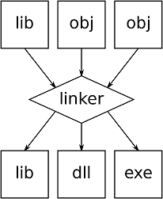
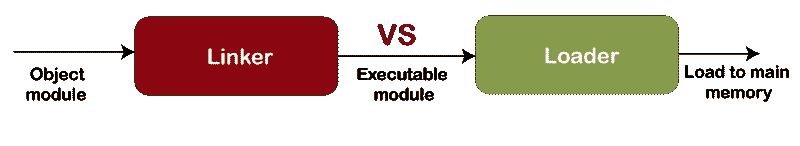

# 什么是链接器？

> 原文：<https://www.javatpoint.com/what-is-a-linker>

链接器是系统中的程序，也称为链接编辑器和绑定器，它将对象模块组合成单个对象文件。一般是执行链接过程的程序；它需要一个或多个由编译器生成的目标文件。然后，将这些文件组合成一个可执行文件。为不同的代码段调用模块，这些代码段是用编程语言编写的。链接是一个过程，有助于将不同的代码段收集和维护到一个可执行文件或单个文件中。在链接器的帮助下，特定的模块也被链接到系统库中。

链接器的主要功能是将汇编程序中的对象作为输入，并为加载器创建一个可执行文件作为输出，因为它有助于将一个大问题分解成一个小模块，从而简化编程任务。通常，计算机程序由各种模块组成，其中所有模块都是经过编译的计算机程序，并跨越不同的目标文件。整个程序借助于使用符号来引用这些不同的编译模块。这些单独的文件由链接器组合成一个可执行文件。源代码转换成机器码，在编译程序的最后一步进行链接。

Source code -> compiler -> Assembler -> Object code -> Linker -> Executable file -> Loader

这些对象可以由链接器从库中或运行时库中收集。大多数链接器只由输出中被其他库或目标文件引用的文件组成，它们不包括整个库。库链接的过程需要额外的模块与一些被引用的模块链接；因此，这可能是一个迭代过程。通常，默认情况下会链接一个或多个系统库，这些库可用于不同的目的。

在程序的地址空间中，对象的排列也由链接器处理。编译器通常假定一个固定的基本位置(如零)，因为它很少知道它将驻留的对象位置。绝对跳转的加载、存储和重新定位可能涉及机器代码的重新定位。当链接器生成的可执行输出最终加载到内存中时，可能需要其他重定位过程。通常，在硬件上省略这个过程，硬件提供虚拟内存。即使在所有程序都在同一个基址加载的时候也没有冲突，因为每个程序都被放入自己的地址空间。如果可执行文件是与位置无关的可执行文件，则在该文件上也省略此过程。

由链接器在像 SINTRAN III 这样的 Unix 类操作系统上执行的过程(将目标文件组装成一个程序)被称为加载。此外，在某些操作系统上，程序的链接和加载都是由链接器处理的任务，称为动态链接。

## 链接的类型

链接有两种类型，如下所示:

1.  静态链接:静态链接是在编译源程序期间执行的一种链接，其中链接是在文件或对象执行之前执行的。另一方面，链接器在将所有库例程复制到可执行映像时产生一个结果，这就是所谓的静态链接。与动态链接相比，它可能需要更多的内存存储和磁盘空间。但是，当它在系统上运行时，它不需要库的存在，这使得它更具可移植性。它生成一个能够加载和运行的完全链接的对象文件，并收集可重定位的对象文件和命令行参数。静态链接器执行两个主要任务，如下所述:
    *   符号解析:在这种情况下，每个符号都有一个预定义的任务，它将每个符号与它们所属的一个符号定义精确关联。
    *   重定位:其功能是修改对重定位内存位置的符号引用，并重定位代码和数据部分。
2.  动态链接:另一种类型的链接是动态链接，它在运行时执行，其中多个程序可以共享库的单个副本。这意味着，具有相同对象的每个模块可以与其他模块共享一个对象的信息，而不是将同一对象重复链接到库中。

这些动态链接库是在程序执行时加载的；然后，它执行最后的链接。此外，动态链接不需要链接器。

虽然它需要更少的内存空间，但出错和失败的机会更多。在链接中，所需的共享库保存在虚拟内存中，这有助于节省随机访问内存。该链接在运行时修复地址；此外，它还允许用户重新定位代码，以保证代码的平稳运行。但是，它不能对所有代码进行重定位。使用动态链接方法有两个好处，如下所示:

*   在动态链接中，常用的库不需要存储在每个可执行文件中；它们只需要存储在一个有助于节省内存和磁盘空间的位置。
*   在库函数中，如果一个 bug 在替换库的帮助下被修正，所有使用它的问题动态地出现，在重新启动它们之后都会从修正中得到好处。否则，如果程序通过静态链接包含此功能，则必须首先重新链接。

动态链接也有如下缺点:

*   一个不兼容的更新库在 Windows 平台上被称为“DLL 地狱”。如果较新的版本不正确地向后兼容，这个库将根据较早形式的库的性能来中断可执行文件。
*   与库一起使用的程序可能会以文档要求、正确性、性能和包的形式得到认证，但是如果组件可以被替换，它们可能不会得到认证。

## 重新安置

编译器将无法利用更短或更高效的指令，因为在最终输出中，它没有布局上对象的信息。例如，从当前位置的偏移或绝对地址可以通过跳转指令来寻址，并且基于到目标的距离，偏移可以用不同的长度来表示。它也被称为自动跳转大小，以便跳转优化。

地址由链接器松弛传递重新分配，这有助于更多潜在的松弛。通常，在执行链接时会发生指令松弛，但在编译时，内部模块松弛能够作为优化过程的一部分发生。此外，在某些情况下，在加载时也会发生松弛。

## 链接器和加载器之间的区别

在程序的执行中，链接器和加载器(两个实用程序)起着重要的作用。在执行程序之前，它的代码要经过编译器、汇编器、链接器、加载器。下表包含了链接器和加载器之间的主要区别。链接器是系统中的一个程序，也称为链接编辑器和绑定器，它将目标模块组合成单个目标文件，而加载器是一个特殊的程序，它加载由链接器生成的程序的可执行模块，并准备该代码供计算机执行。

| 连接物 | 装货设备 |
| 链接器生成源程序的可执行文件。 | 加载器的主要功能是将可执行模块加载到主内存中。 |
| 汇编程序生成目标代码，链接器将它作为输入。 | 链接器创建可执行模块，该模块由加载器获取。 |
| 为了生成可执行代码，链接器将所有的目标模块和源代码结合起来。 | 在主内存中，它加载可执行代码以供进一步执行。 |
| 链接编辑器和动态链接器是链接器的两种类型。 | 绝对加载、动态运行时加载和可重定位加载是三种加载器。 |
| 组合所有对象模块是链接器的另一种用途。 | 加载程序将地址分配给可执行文件。 |
| 此外，在程序的地址空间中，它还负责排列对象。 | 程序中使用的引用由加载程序处理。 |

* * *