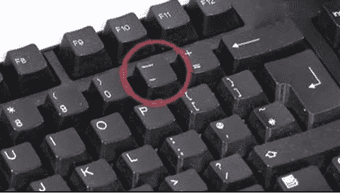
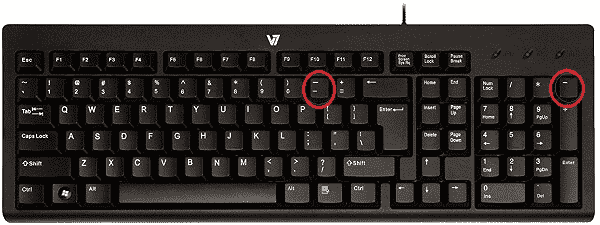
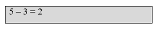
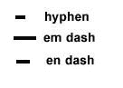
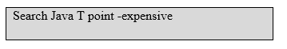

# 什么是连字符？

> 原文：<https://www.javatpoint.com/what-is-a-hyphen>

连字符(？)是一个标点符号，也称为负号、破折号、减号或减号。此外，它通常用于连接单词和单个单词的不同音节。它的用法叫做断字。例如，非连字符是连字符的一个简单例子。有时你可能会与横条――横条、横线、数字横线、横线――混淆，横线有各种用途。所有这些破折号(横条―、em 破折号、数字破折号、en 破折号)看起来都一样，这就造成了混乱。而且，负号在某些字体中更垂直居中。下图中提供了连字符和下划线键，可以帮助您识别连字符符号。

根据正字法的概念，连字符被认为是一个单一的实体。根据使用的上下文，实体借助不同的字符和字形来表示，例如不中断的连字符、连字符符号、Unicode 连字符和软连字符(可选连字符。

## 键盘上的连字符键在哪里？

下面是一张电脑键盘的图片，包括键盘顶部的连字符键，并用红色圈起来。一个位于数字键盘上，另一个位于主键盘上。

## 如何创建连字符符号

**在美国键盘上创建连字符(-)符号**

您需要按美国键盘上的连字符键来创建连字符符号。它位于零键的右侧，与下划线(_)是同一个键。有一种更简单的方法来使用连字符键；你可以在数学公式的数字键盘上使用它。

**在智能手机或平板电脑上创建连字符(-)符号**

您需要打开智能手机或平板电脑上的键盘，进入符号(sym)部分或数字(123)并点击“-”符号以创建连字符。

## 电脑上连字符的用法是什么？

在计算机上，连字符在数学和编程中被广泛用于从一个数字中减去另一个数字。下面给出了一些使用连字符的例子:

### 数学公式中的连字符

在数学公式中，连字符用于减(减)。举个例子，下面有一个例子，你可以看到 5 <minus>3 等于 2。</minus>

电子表格或计算器可以用来在智能手机或电脑上减去数字。

### 文字处理器中的连字符

在许多字处理器中，当一个字被一行的末尾切断时，连字符会自动插入。

### 搜索中的连字符

连字符在搜索引擎中用作布尔运算符。下面给出了一个在搜索中使用连字符的例子。如果使用此示例，搜索引擎将返回包含“search”、“Java”、“T”、“point”的结果，但不会返回任何包含“point”的结果

### 英语中的连字符

在一些复合词中，连字符用于使单词更容易阅读，也有助于澄清一起使用的单词。好看、思维敏捷、嘴巴张开、高风险、t 恤、旋转木马等词汇都是带连字符的词汇，是英语中连字符的例子。

### 其他带减号的地方

水平线或减号通常用于在硬件设备和软件程序上上移、下移、减少或缩小。您还可以在微软视窗的右上角看到减号或下划线，这通常用来表示最小化功能。

### 我应该什么时候用连字符连接单词？

在一些复合词(连词)中，连字符用于使单词更容易阅读，也有助于澄清一起使用的单词。好看、思维敏捷、嘴巴张开、高风险、t 恤、旋转木马等词汇都是带连字符的词汇，是英语中连字符的例子。下面给出了一些常用的连字符规则，在某些情况下使用连字符时，需要记住这些规则。

1.  连接的两个或两个以上的单词，有新的含义或当用连字符连接时充当新单词。就案例而言，与“知道”和“如何”相比，专有技术具有不同的含义。
2.  用连字符连接在一起的单词被用来改变许多单词。例如，让我们用“满刻度”这个词来修饰“文本”，使这个词成为“满刻度测试”然而，用作形容词的单词不能连字符。
3.  有一个规则，如果第一个单词以“ly”结尾，它不能用连字符连接。
4.  当你写一个复合数字时，使用连字符。例如，二十二和八十二需要一个连字符，因为它们都是复合数字。因此，它们应该写成“二十二”和“八十二”
5.  在大多数情况下，当您书写带前缀的单词时，请避免使用连字符。
6.  在行尾拆分一个单词，在这类单词中一定要使用连字符。

* * *