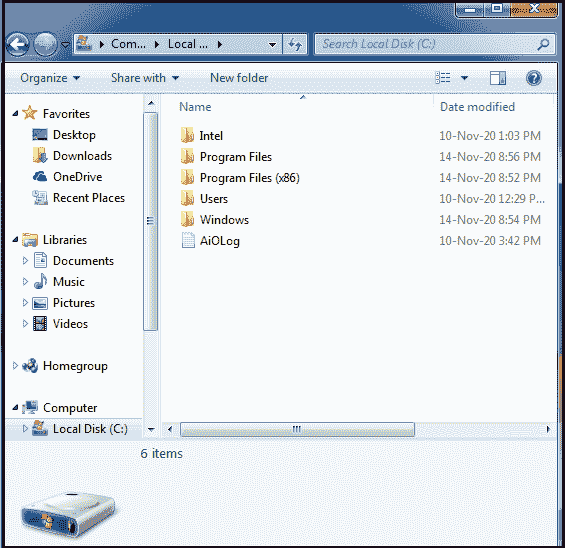
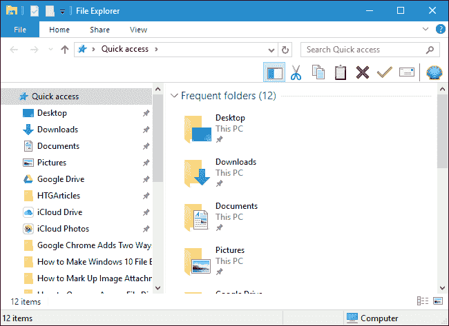

# 什么是文件资源管理器？

> 原文：<https://www.javatpoint.com/what-is-file-explorer>

文件资源管理器是自视窗 95 以来所有版本的微软视窗中的图形用户界面组件，以前被称为视窗资源管理器。它是一个文件管理器应用程序，使用户能够在其计算机或移动设备上导航和管理数据、驱动器、文件夹和文件。对于访问文件系统，它提供了一个图形用户界面，允许用户访问存储在计算机上的文件、文件夹或内容。它在屏幕上呈现多个用户界面项目，如桌面和任务栏，因为它也是操作系统的一个元素。下面的截图是 Windows 7 中文件资源管理器窗口的一个例子。

不需要运行 Windows 资源管理器来控制计算机系统。为了查看数据，文件资源管理器为用户提供了计算机上的一个集中位置。作为附加功能，它还允许用户在垂直功能区栏中查看管理功能。它还支持在单个窗口/屏幕内复制两个或更多文件，这是它的另一个重大改进。作为一项高级功能，它具有搜索功能，允许您根据不同的属性轻松快速地找到文件。

此外，在库内创建和添加文件夹、SkyDrive 集成以及多媒体文件的可操作性也可以在文件资源管理器中轻松实现。这里需要注意；在微软 Windows 8.1 及其早期版本上，文件浏览器是默认的网络浏览器；因此，不要将文件资源管理器与 Microsoft Internet Explorer 混淆。在 Windows 95 上，首次引入了文件资源管理器。它被包含在 Windows 中，以便替换文件管理器。通过双击“我的电脑”桌面图标，可以访问文件资源管理器来导航文件或文件夹。

而“文件资源管理器”或“窗口资源管理器”负责显示任务栏、开始菜单、控制面板和桌面图标。下图是 Windows 10 中文件资源管理器窗口的示例。

## 文件资源管理器历史

1995 年，微软首次发布了 shell 刷新的测试版本，其名称是 Shell 技术预览版，通常被非正式地称为“NewShell”此次更新的主要目的是取代基于 shell 的 3.x 程序管理器。开罗发展小组开始处理整个项目。

**Windows 98 和 Windows 桌面更新**

随着 Windows 桌面更新的推出，Windows 资源管理器与 Internet Explorer“集成”在一起。它还集成了导航箭头和互联网浏览器的收藏夹菜单。在 Windows 资源管理器中，还添加了另一个功能，地址栏，允许用户通过直接键入目录路径来访问任何目录位置。窗口资源管理器在文件夹中显示的内容由隐藏在自定义文件夹中的网页控制。

**Windows 8 和 Windows Server 2012**

在 Windows 8 和 Windows Server 2012 上，文件管理器被更改为文件资源管理器的名称。它重新设计了一个功能区工具栏，允许暂停和恢复文件操作。但是，通过将鼠标悬停在文件名上，可以显示其他详细信息。

**Windows 10 和 Windows Server 2016**

在 Windows 10 和 Windows Server 2016 中，文件资源管理器进行了重新设计。就像，图标的形状被改变了，使它们在设计上更加扁平和简单。此外，新的通用文件资源管理器包含在 Windows 10 创建者更新和更高版本中。

在 Windows 10 中，初始文件资源管理器窗口包含以下部分:

*   **文件资源管理器功能区:**功能区包括用于管理计算机上的文件和文件夹的按钮，它看起来像 Microsoft Office 中的功能区。
*   **导航窗格:**它为用户提供对其存储设备以及文档、图像或其他数据库的访问。它还包括经常使用的网络设备和文件夹。
*   **常用文件夹:**常用文件夹功能允许用户访问最近使用过的文件夹。
*   **最近文件部分:**包括你最近打开的文件和文档。

## 如何打开窗口资源管理器

打开新的资源管理器窗口完全取决于您在计算机系统上使用的是哪个版本的窗口。在系统上打开资源管理器窗口的方法有很多，下面将对此进行讨论，如果您重复以下任一选项，您可以打开一个或多个文件资源管理器窗口。

**在所有版本的 Windows 中**

*   要打开新的窗口资源管理器，您只需要按下窗口键+E。为此，按住窗口键并同时按下 E。
*   您也可以按 Windows 键+R 或单击开始并选择运行，然后您将看到一个对话框，您需要键入资源管理器或 explorer.exe 并按回车键。

**在 Windows 10 中**

*   首先，您需要打开超级用户任务菜单，可以通过按 Windows 键+X 来打开。然后，按 E 或选择文件资源管理器。
*   您也可以选择另一个选项来打开文件资源管理器；您需要单击开始并选择程序；然后，选择附件和窗口资源管理器或浏览器。

**在 Windows 8 和 8.1 中**

要在 Windows 8 和 8.1 中打开文件资源管理器，首先，您需要打开超级用户任务菜单，通过右键单击屏幕左下角可以打开该菜单。然后，按 E 或选择文件资源管理器。

**在 Windows 7 及更早版本中**

要在 Windows 7 及其早期版本中打开 Windows 资源管理器，只需右键单击“开始”，然后单击“打开 Windows 资源管理器”选项。

## 如何使用视窗浏览器的例子

下面给出了一些示例，描述了在文件资源管理器中可以执行的操作:

### 打开文档

在创建“我的文档”文件夹的帮助下，在窗口中查找您的文档要简单得多。要打开文档，首先需要打开文件资源管理器，然后打开“我的文档”，双击要打开的文件。

### 打开程序

在“开始屏幕”或“开始”菜单中，几乎所有程序都创建了打开程序的快捷方式，这使得快速打开程序变得容易。但是，在资源管理器的帮助下，您也可以打开一个程序。此外，您可以浏览到要在资源管理器中打开的文件或文件夹；首先，你需要打开 C:驱动器，双击程序文件或文件夹。将打开包含文件的文件夹，然后双击要打开的程序的文件夹。最后，要运行程序，一旦您打开了程序文件夹，现在您需要找到可执行文件并双击该文件。

### 搜索文件或文件夹

在您的计算机上，在“搜索”选项卡中，“文件资源管理器”允许您查找任何文件或文件夹。在窗口资源管理器中，按键盘上的 F3 键打开搜索选项卡。

## 其他系统任务和功能

下面给出了一些其他的系统任务，可以使用 Windows 资源管理器来执行。

*   创建快捷方式
*   更改和查看驱动器
*   重命名文件
*   复制文件
*   移动文件
*   删除文件

* * *