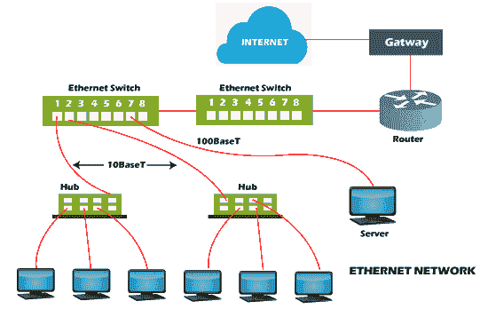
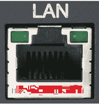

# 什么是以太网？

> 原文：<https://www.javatpoint.com/what-is-ethernet>

以太网是一种通信协议，由罗伯特·梅特卡夫和其他人于 1973 年在施乐 PARC 公司创建，它通过有线连接在网络上连接计算机。它是一种广泛使用的局域网协议，也称为 Alto Aloha 网络。它连接局域网和广域网中的计算机。许多设备，如打印机和笔记本电脑，可以通过建筑、家庭甚至小社区内的局域网和广域网连接。

它提供了一个简单的用户界面，有助于轻松连接各种设备，如交换机、路由器和计算机。借助一台路由器和几根以太网电缆，可以创建一个局域网，从而实现所有链接设备之间的通信。这是因为您的笔记本电脑中包含一个以太网端口，电缆的一端插入其中，另一端连接到路由器。以太网端口稍宽，看起来类似于电话插孔。

使用低速以太网电缆和设备，大多数以太网设备都是向后兼容的。然而，连接的速度将和最小公分母一样快。例如，如果您将一台带有 10BASE-T 网卡的计算机连接到 100BASE-T 网络，则该计算机只能以 10 Mbps 的速度转发和接收数据。此外，如果您有一个[千兆位](https://www.javatpoint.com/gigabit)以太网路由器并使用它来连接设备，最大数据传输速率将为 100 Mbps。

无线网络在许多领域取代了以太网；然而，以太网对于有线网络来说仍然更常见。无线网络减少了对电缆的需求，因为它允许用户在不需要电缆的情况下将智能手机或笔记本电脑连接到网络。与千兆以太网相比，802.11ac 无线标准提供了更快的最大数据传输速率。尽管如此，与无线网络相比，有线连接更安全，更不容易受到干扰。这是许多企业和组织仍然使用以太网的主要原因。

## 不同类型的以太网

带有 CAT5/CAT6 铜缆的以太网设备通过光纤介质转换器连接到光缆。光缆的这种延伸大大增加了网络覆盖的距离。以太网有几种类型，下面讨论:

*   快速以太网:这种类型的以太网通常由双绞线或 CAT5 电缆支持，它有可能以大约 100 Mbps 的速度传输或接收数据。如果任何设备(如相机、笔记本电脑或其他设备)连接到网络，它们在链路光纤端的 100Base 和 10/100Base 以太网上工作。快速以太网使用光缆和双绞线来建立通信。100BASE-TX、100BASE-FX 和 100BASE-T4 是快速以太网的三个类别。
*   千兆以太网:这种类型的以太网是快速以太网的升级，它使用光纤电缆和双绞线电缆来创建通信。它可以以 1000 Mbps 或 1Gbps 的速率传输数据。在现代，千兆以太网更加普遍。这种网络类型还使用 CAT5e 或其他高级电缆，可以以 10 Gbps 的速率传输数据。

开发千兆以太网的主要目的是完全满足用户的需求，例如更快的数据传输、更快的通信网络等等。

*   10 千兆位以太网:这种类型的网络可以以 10 千兆位/秒的速率传输数据，被认为是一种更先进、更高速的网络。它使用了 CAT6a 或 CAT7 双绞线电缆以及光纤电缆。在使用光纤电缆的帮助下，这个网络可以扩展到近 10，000 米。

*   交换机以太网:这种类型的网络包括添加交换机或集线器，这有助于提高网络吞吐量，因为该网络中的每个工作站都可以有自己的专用 10 Mbps 连接，而不是共享介质。当在网络中使用交换机时，使用常规网络电缆而不是交叉电缆。对于最新的以太网，它支持 1000 兆位/秒至 10 兆位/秒，对于快速以太网，它支持 10 兆位/秒至 100 兆位/秒。

## 以太网的优势

*   组建一个以太网的成本并不高。与其他连接计算机的系统相比，它相对便宜。
*   以太网为数据提供了高安全性，因为它在数据安全方面使用了防火墙。
*   此外，千兆网络允许用户以 1-100 千兆位/秒的速度传输数据。
*   在这个网络中，数据传输的质量确实得以保持。
*   在这个网络中，管理和维护更容易。
*   最新版本的千兆以太网和无线以太网有可能以 1-100Gbps 的速度传输数据。

## 以太网的缺点

*   它需要确定性服务；因此，它不被认为是实时应用的最佳选择。
*   有线以太网限制了您的距离，最好在短距离内使用。
*   如果您创建一个需要电缆、集线器、交换机、路由器的有线以太网，它们会增加安装成本。
*   在交互式应用程序中，数据需要快速传输，而且数据非常小。
*   在以太网中，接收方在接受数据包后不会发送任何确认。
*   如果您计划建立无线以太网，如果您没有网络领域的经验，可能会很困难。
*   与有线以太网相比，无线网络并不更安全。
*   100Base-T4 版本不支持全双工数据通信模式。
*   此外，在以太网(如果有)中发现问题非常困难，因为不容易确定是哪个节点或电缆导致了问题。

## 以太网的历史

20 世纪 70 年代初，以太网是由夏威夷大学的 ALOHAnet 经过几年的发展而成的。然后，进行了一项测试，这项测试在 1976 年以一篇科学论文达到顶峰，由梅特卡夫和大卫·博格斯共同发表。1977 年末，施乐公司申请了这项技术的专利。

以太网作为一种标准是由施乐、英特尔和数字设备公司(DEC)建立的；首先，这些公司在 1979 年联合起来改进以太网，然后在 1980 年发布了第一个标准。其他技术，包括 CSMA/光盘协议，也是在这个过程的帮助下发展起来的，后来被称为 IEEE 802.3。该过程还导致创建令牌总线(802.4)和令牌环(802.5)。

1983 年，IEEE 技术成为标准，在 802.11 之前，802.3 诞生了。许多现代个人电脑开始在主板上包括以太网卡，因为由于单芯片以太网控制器的发明，以太网卡变得非常便宜。因此，以太网在工作场所的使用开始于一些小公司，但仍在基于电话的四线线路的帮助下使用。

直到 20 世纪 90 年代初，通过双绞线和光纤电缆建立以太网连接还没有建立。这导致了 100 兆字节/秒标准在 1995 年的发展。

## 以太网标准

以太网有不同的标准，下面将讨论每种标准的附加信息。

### 以太网 ii/10/802.3

以太网的研究版，以太网二，也称为 DIX。DIX 代表数字、英特尔和施乐。802.3，由数字设备公司、施乐和英特尔重写。

### 快速以太网/ 100BASE-T / 802.3u

快速以太网(100BASE-T 或 802.3u)是一种通信协议，通常由双绞线或 CAT5 电缆支持。

100BASE-T 标准有两种类型。100BASE-T 是第一个使用 CSMA/光盘的标准。

**100 base-t 提供三种不同的电缆技术。**

1.  100BASE-T4:用于在 100 Mbps 以太网上需要低质量双绞线的网络。
2.  100BASE-TX:它采用的是双线数据级双绞线，由 ANSI 100BASE-TX 开发，也叫 100BASE-TX 和 100BASE-X。
3.  100BASE-FX:采用 2 根光纤电缆，由 ANSI 开发。

### 千兆以太网/ 1000BASE-T / 802.3z / 802.ab

千兆以太网有可能传输高达 1 Gbps 的数据，它利用了类别 5 中的所有四根铜线，也称为 1000BASE-T 或 802.3z / 802.3ab。

### 10 千兆以太网/802.3 以太网

万兆以太网(10GE 或 10 GbE 或 10g be)是一种新标准，仅定义了全双工点对点链路。它支持 2002 年发布的高达 10 Gb/s 的传输，也称为 802.3ae. The 中不存在集线器、CSMA/光盘和半双工操作。

## 如何连接或插入以太网电缆

无论您是将以太网电缆连接到计算机还是设置家庭网络，过程都是一样的。如下图所示，它似乎是一个大的电话线插孔。找到它后，在听到咔嗒声之前，您必须将电缆连接器推入端口。如果在另一端正确建立了连接，您将看到一个绿灯，表示找到了信号。

## 为什么使用以太网？

以太网仍然是一种常见的网络连接形式，它以其高速、安全和可靠性而被使用。它用于连接网络中的设备，这些设备由特定组织用于本地网络、学校校园和医院等组织、公司办公室等。

与 IBM 的令牌环网等技术相比，由于以太网的低价格，它最初越来越受欢迎。随着网络技术的逐渐进步，以太网确保了它的持续普及，因为它有潜力开发和提供更高水平的性能，同时保持向后兼容性。20 世纪 90 年代中期，以太网最初的每秒 10 兆比特增加到 100 兆比特。此外，当前版本的以太网支持高达每秒 400 千兆位。

## 以太网是如何工作的

在开放系统互连模型中，以太网促进了物理和数据链路层的操作，并且位于开放系统互连的较低层。 [OSI 模型](https://www.javatpoint.com/osi-model)有七层，如下:

*   物理层
*   [数据链路层](https://www.javatpoint.com/data-link-layer)
*   [网络层](https://www.javatpoint.com/network-layer)
*   [传输层](https://www.javatpoint.com/computer-network-transport-layer)
*   会话层
*   表示层
*   [应用层](https://www.javatpoint.com/computer-network-application-layer)

应用层是使用户能够从邮件客户端或网络浏览器下载和访问数据的最顶层。用户在应用程序的帮助下输入他们的查询；然后，它被发送到下一层，在那里请求被称为“数据包”数据包中包含关于发送方和目的网址的信息。在数据包到达底层(称为以太网帧)之前，数据包是从应用层传输的。最靠近设备的层是第一层或底层。

* * *