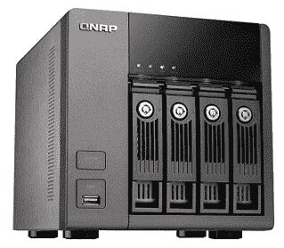

# 什么是网络驱动器？

> 原文：<https://www.javatpoint.com/what-is-a-network-drive>

网络驱动器是一种计算机驱动器或存储设备，也称为映射驱动器，在同一网络(如局域网)上的另一台计算机上共享。例如，在网络驱动器上，如果使用公司网络，您可能可以访问公司或客户信息。它为客户提供了与传统光盘驱动器相同的数据存储和服务访问。它通常存储在网络连接存储或公司内的服务器上。

## 本地驱动器、网络驱动器和映射驱动器

映射驱动器、网络驱动器和本地驱动器各有其特点，但它们都被称为驱动器。

本地驱动器连接到您的计算机，可以是内置或外置驱动器。这些光盘只对计算机用户可用；但是，默认情况下可以共享它们。以下是 c 盘(主硬盘)上 Windows 目录的本地驱动器路径示例。

网络驱动器是一种计算机驱动器，只能通过网络访问。除非映射，否则在输入网络路径的帮助下，网络驱动器只能访问。网络路径可能类似于下面在 Windows 计算机上给出的示例。在本例中，服务器名为“brown”，cat 是该服务器上的一个共享文件夹。

最后，映射的驱动器会被分配一个驱动器号，因为它是一个网络驱动器。例如，在 Windows 中，H:驱动器可能映射到网络驱动器。映射驱动器后，H:驱动器看起来将与计算机上所有其他可用驱动器相同。并且，当您访问 H:驱动器时，网络路径将会打开。

## 网络驱动器有什么用？

共享软件、云文件存储和网络驱动器之间存在一些竞争，在商业环境和家庭中，哪一个有更重要的用途。事实上，两者极其相似，它们之间的区别完全取决于你打算如何使用它们。

### 家里的网络驱动器

在单个网络中，网络驱动器可以被视为云存储。在家里，当您想在伴侣的平板设备或台式电脑上访问笔记本电脑上的可用文件时，可以使用它们。此外，该网络上的所有设备都有可能访问这些文件。在网络驱动器上，网络驱动器可以成为无与伦比的大型媒体库。例如，任何人都可以为他的家庭网络设置一个网络连接存储驱动器，在那里他可以保存千兆字节的音乐、图片、电影和电视节目。任何时候，他们都可以在登录网络驱动器的帮助下找到家庭照片、观看喜爱的剧集或电影、收听特定的专辑，并且可以轻松访问所有内容。

如果你有一家公司，只有几个人在同一个地方的一个小网络上工作，你可以应用一个类似的理论，用大量特定于业务的数据和文档来代替个人媒体。

### 工作中的网络驱动器

同样的原则，尤其是中小型企业，可以在更大和更多样化的规模上应用于企业。大多数企业公司都有可能使用过多的不同网络，并且有多个位置导致难以使用网络驱动器。因此，这类公司转向云存储。网络存储可以为在一个位置仅使用一个网络的中小型公司提供重要的优势。

一旦网络驱动器设置好，您就可以开始存储文件和数据。用户应该能够根据可以授予他们的访问权限来处理数据，如编辑、查看和删除。从驱动器，没有必要复制文件到您的设备。但是，该文件可以直接在您的设备上打开、编辑或删除，因为它保存在网络驱动器上。这里有一个关于网络驱动的需要注意的地方；不同的设备可以访问完全相同的文件。借助最新版本，您不需要通过电子邮件来回发送不同的文件。

## 网络驱动器的优势

下面给出了为什么应该使用网络驱动器而不是本地驱动器的一些原因。

*   网络驱动器的主要优点之一是它允许用户与许多人共享文件。
*   权限在指定您希望允许哪些人查看或编辑文件方面为您提供了好处。
*   因为网络驱动器是一个中央存储位置，所以它们易于备份和镜像。
*   添加存储可以通过网络连接存储和存储区域网络解决方案变得更加容易。

## 网络驱动器的缺点

尽管与网络驱动器的局限性相比，网络驱动器有更多的优势，但它们仍然很少，下面将对此进行讨论:

*   网络驱动器需要网络。它的缺点是，如果网络中断，您将无法访问网络驱动器上的任何文件。
*   由于中心位置有多个用户，黑客入侵、修改、感染或意外删除的可能性更大。
*   任何可以访问该光盘的人都可以将其所有数据迁移到另一个位置。

* * *