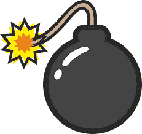

# 什么是逻辑炸弹？

> 原文：<https://www.javatpoint.com/what-is-a-logic-bomb>

逻辑炸弹是一种包含恶意代码的恶意软件，这些恶意代码被谨慎地安装到软件、计算机网络或操作系统中，目的是在满足特定条件时对网络造成危害。它在特定事件时触发，用于通过清除硬盘、删除文件或损坏数据来摧毁系统。事件可以是导致启动受感染软件应用程序或从系统中删除特定记录的特定日期或时间。

为了在被注意到之前最大化伤害，逻辑炸弹主要用于特洛伊木马、蠕虫和病毒。逻辑炸弹的主要目标是重新格式化硬盘，修改或损坏数据，并从系统中删除重要文件。逻辑炸弹造成的破坏可能是巨大的。

逻辑炸弹攻击的目的是对公司或组织中被授权访问重要信息的人进行网络破坏，而其他形式的恶意软件会侵入安全系统。如果员工认为自己可能被公司解雇，逻辑炸弹可能是他们报复公司的一种方式。借助逻辑炸弹，每天扩散，对他们来说可能是一个理想的方法，因为他们是唯一能够拖延的人。因此，攻击可以在预定时间段内的任何时间点开始，也可以在他们离开组织时开始。

## 逻辑炸弹是恶意软件吗？

逻辑炸弹是由其他程序包含的一小段代码。它们在技术上不是恶意软件；然而，它们可能是恶意的。恶意软件种类繁多；常见类型包括蠕虫和病毒，就其攻击策略而言，它们可能具有逻辑炸弹。

与病毒和蠕虫相反，病毒和蠕虫有可能自己感染系统，而另一方面，一个逻辑炸弹被对系统有内部了解的人秘密地插入到软件应用程序、计算机网络或操作系统中，例如，一个不满意的员工将它插入到他们系统的网络中。由于逻辑炸弹是在特定事件下触发的，它们不能触发，并且可能在很长一段时间内不被发现。

## 逻辑炸弹是如何工作的？

有两种情况会引爆逻辑炸弹:积极和消极。具有正触发的逻辑炸弹是那些一旦满足条件就被引爆的炸弹，例如关键公司事件的日期或当你打开特定文件时。当条件不满足时发射的逻辑炸弹被称为负触发逻辑炸弹。当不满足条件时启动的逻辑炸弹被称为具有负触发的逻辑炸弹，例如当炸弹没有按时停用，或者员工无法在特定时间停用代码时。

逻辑炸弹造成的攻击可能是巨大的。有多个逻辑炸弹的例子描述了它们是如何摧毁一些主要金融机构的组织和服务器的。任何有可能摧毁一个组织或机构的服务器的东西，对它所服务的普通人来说都可能更强大，同时也会摧毁公司本身。

为了执行各种未经授权活动，逻辑炸弹可以由某人编程；一些恶意活动如下:

*   消耗系统资源
*   删除数据
*   限制或阻止用户访问
*   为黑客制造后门
*   损坏数据
*   窃取数据

## 逻辑炸弹病毒的特征

逻辑炸弹有多个特征，如下所示:

1.  它会休眠一段时间:逻辑炸弹就像定时炸弹一样，不会马上爆炸。因此，在特定时间有目标攻击系统的人，往往会使用逻辑炸弹。逻辑炸弹可以长时间不被发现，而且很微妙。
2.  它的有效载荷是未知的，直到它触发:有效载荷执行恶意活动，因为它是恶意软件的一个组成部分。一般来说，它会执行恶意软件编码的破坏类型。有效载荷造成的破坏可以是被感染的系统、垃圾邮件的传播或有价值的数据被窃取。
3.  由一定条件触发:要求是逻辑炸弹的雷管，必须完成。这种特性使得逻辑炸弹多年来一直未被发现。它是在特定事件中触发的，例如组织重大事件的日期或公司工资单上的员工被解雇。逻辑炸弹的触发器与特定的日期和时间有关，也称为定时炸弹。

## 如何防范逻辑炸弹

你必须使用多层网络安全来保护自己免受逻辑炸弹的攻击，而不是只依赖任何杀毒软件。防病毒软件可能无法捕获恶意软件的所有实例；然而，它绝对强大，可以抵御恶意软件和逻辑炸弹。因为逻辑炸弹是在特定时间触发的；因此，他们不会立即执行恶意代码。这就是为什么反病毒软件可能无法处理它们，直到很晚。

如果你把防火墙和杀毒软件结合使用，你可以更好地抵御逻辑炸弹。使用防火墙意味着逻辑炸弹将无法进入你的计算机系统，因为它扫描所有的流量。此外，定期备份企业数据是防范逻辑炸弹的最佳方法，即使您使用的是多层网络安全。

虽然创建数据备份的过程需要时间，但它会让你放松，如果你已经成为逻辑炸弹的受害者，你仍然可以将数据恢复到原始状态。然而，网络安全的最佳实践可能是保护自己免受逻辑炸弹攻击的好方法，其中包括:

*   始终使用最新版本的防病毒软件。
*   不时扫描系统上所有可用的文件以及压缩文件。
*   在网络中，单独保护所有计算机。
*   确保所有用户都激活了电子邮件屏蔽和自动防护等功能。
*   应向所有员工提供安全使用政策。此外，向他们提供授权，以维护他们可以访问的数据的完整性和安全性。

## 逻辑炸弹与定时炸弹攻击

一种逻辑炸弹，定时炸弹，在特定的日期或时间执行。下面是一些描述逻辑炸弹和定时炸弹的流行例子:

### 逻辑炸弹示例

它被认为是冷战期间美苏之间的第一次逻辑炸弹袭击，发生在 1982 年。中央情报局收到的证据表明，一名克格勃间谍从一家加拿大公司窃取了一套复杂控制系统的计划及其软件，该系统必须在西伯利亚管道上使用。显然，在系统中，中央情报局已经编写了一个逻辑炸弹来破坏敌人。自从计算机病毒出现以来，逻辑炸弹攻击开始出现在电视、电影和现实生活中。

在西门子公司内部，又发生了一起流行的逻辑炸弹事件。合同雇员大卫·廷利向西门子的一个办公室提供软件。他为西门子工作了大约十年，是公司值得信赖的资产。他负责提供电子表格软件来管理设备。但是 Tinley 在其中一个电子表格中的任何一点都计划了一个逻辑炸弹。

软件会出错，每次满足编码逻辑条件时，都会调用 Tinley 来纠正错误。廷利计划的实施时间是两年。在 Tinley 出城的另一次撞车事故中，当 Tinley 将软件密码交给西门子的信息技术人员时，逻辑炸弹被发现了。渣码是逻辑炸弹的另一个名字。有时，逻辑炸弹也被称为网络炸弹和代码炸弹。

### 定时炸弹的例子

2006 年，投资银行公司瑞银发生了一起事件，这被认为是计算机定时炸弹的一个常见例子。瑞士联合银行集团的系统管理员罗杰·杜罗尼奥组织了这次定时炸弹。杜罗尼奥计划设置一个定时炸弹恶意软件攻击，因为他对自己的奖金不满意。这颗定时炸弹摧毁了 400 个分支机构的 2000 台服务器，并在杜隆尼奥描述的特定日期爆炸。

他还制定了一个降低瑞银股票价值的计划，但这个计划没有成功。杜罗尼奥不得不向瑞银支付 310 万美元，并被判处 8 年监禁。1998 年，CIH 病毒，另一个流行的定时炸弹事件发生了，这就是所谓的切尔诺贝利。切尔诺贝利核灾难发生的时间是 4 月 26 日，即切尔诺贝利的触发时间。

CIH 病毒被许多人认为是最具破坏性的恶意软件攻击。这是最早的恶意软件攻击之一，被认为是破坏硬件，包括通常的软件。一些主板上的基本输入输出系统被损坏，系统硬盘上的所有信息都通过 CIH 被销毁。

## 如何防范逻辑炸弹攻击？

有不同的方法来防止逻辑炸弹攻击，因为逻辑炸弹会造成严重的损害，而且是偷偷摸摸的；但是，没有办法完全阻止它们。但是，通过采取以下必要步骤，您可以让攻击者的生活更加艰难，并避免逻辑炸弹攻击以及其他恶意软件威胁:

### 1.使用可信的防病毒软件

从计算机系统中移除恶意软件毫无乐趣。如果你使用可信的反病毒软件，你将不再考虑恶意软件感染。在它感染你的设备之前，可信的反恶意软件将帮助你阻止恶意软件进入系统。您可以采取这一主动措施来获得更安全的在线体验。

### 2.不要下载任何你不知道或不信任的东西

当你在网上下载软件或文档时，你必须运用你最好的判断力，就像你购买任何大型产品并做出其他重大决定一样。你应该知道声名狼藉的免费软件或盗版软件。此外，始终使用可信安全公司的防病毒程序。黑客是通过利用漏洞造成伤害的专家。注意电子邮件附件或可疑链接；甚至远离他们。

### 3.定期执行操作系统更新

有一个完整的恶意软件武库，如间谍软件，勒索软件，逻辑炸弹。而且，这种恶意软件经常试图获取利益，在操作系统上形成新的漏洞。感激地，为了避免这些类型的威胁，开发者更新他们的软件。最好不断更新操作系统来对抗这些威胁。

还有其他要点可以防止在你的系统中使用逻辑炸弹。

*   不要变得太贪婪，对你的用户有很大的权力。只给他们需要的权力。这可能有助于限制特定用户攻击的机会。
*   时刻保持最新。如果用户没有足够的访问权限，他可以尝试借助权限提升技术来获得访问权限。此外，定期修补您的系统可能会非常困难。
*   完整性检查器帮助您确定是否有任何软件被修改为包含逻辑炸弹。您可以使用名为“Tripwire”的程序来检查完整性。
*   定期检查您的调度程序，如果有任何未知的作业没有被调度。
*   最好使用安全的系统配置。此外，对于大多数平台，你可以在网上找到强化指南。在不同的主机上，您必须为每个帐户使用唯一的密码。

这些预防技术不仅有助于防止逻辑炸弹攻击，而且有助于防止其他类似的攻击，如特洛伊木马、rootkits、滥用系统等。

* * *