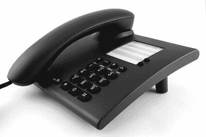
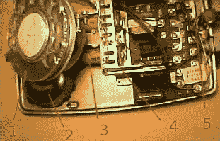

# 什么是电话？

> 原文：<https://www.javatpoint.com/what-is-a-telephone>

电话或简称电话，是一种跨越一定距离发送和接收声音的设备。电话的主要工作是将模拟声音转换成电信号，然后传输给其他电话用户。电话这个名字来自希腊语词根 tele，它有电话的意思，afar 的意思是声音。发明电话的主要功臣是 1876 年的亚历山大·格雷厄姆·贝尔。它使人们能够在几乎任何距离上与他人交流。

电话通信是最即时、最广泛的通信形式之一。为了在人类生活的各个领域交换信息，电话被证明是无价的。它可以用于许多不同的领域，如社会交往、商业、科学、个人服务、政府或公共卫生。

1887 年，全世界约有 20 万部电话，1928 年约有 3000 万部，1958 年约有 1.18 亿部，1995 年超过 3.3 亿部。根据加州大学伯克利分校的数据，2004 年全球使用的主要电话线约为 13 亿条。

电话作为一个系统的概念需要许多要素。电话设备本身是第一要素。还有几种远距离传输电磁信号的装置。第三，因为传输线是以多层结构组织的，它们可以根据要求互连任何所需的电话机。最后，信令设施可用于通知被联系的个人，控制交换操作，并在呼叫完成后清除电路。电话是一门科学和技术学科，有助于电话系统所有部分的发展。

## 电话网

电话网络的结构可以用电话交换机之间的全厂连接来描述。电话网络包括三大类:长途网络、交换区和本地网络。本地网络的功能是将商业和住宅中的电话连接到中心局，以便为特定的地理区域服务。城市和乡村的大小可能不同。在城市，可以是 11.5 平方英里，在农村可以是 123.5 平方英里。

本地线路或环路是连接用户和中心局的电话线。中心局通过交换区域网连接。将一个电话交换机连接到另一个电话交换机的电话连接在北美被称为中继线，在欧洲被称为交叉点。为了指示系统中的位置，每个电话都被分配了一个号码。交换网络识别呼叫是从哪个电话发起的，以及从哪个电话接收呼叫。对于信号路径，它根据该信息建立电路连接。

## 电话的零件

电话是一个完整的系统，而不仅仅是一个东西，它只放在家里的桌子上。一大堆通讯设备，包括穿过墙壁的电缆和你那端的手机，它可以向全国发送电话信号。此外，一些交换设备有助于呼叫的正确路由。

让我们举一个典型手机的例子。在这个听筒里，一个位于顶部的扬声器，你把它压在你的耳朵上。麦克风位于电话系统底部靠近用户嘴巴的位置。两对铜线包含在一根从手机中伸出的粗而盘绕的电缆中。输出对负责将电信号从麦克风传输到电话系统。输入对负责接收来自电话系统的输入信号，并将它们发送到扬声器。

## 古董电话里面是什么？

*   **拨号机制:**当拨号盘旋转并通过中断交换机和电话之间的电路产生拨号脉冲时。例如，如果你拨号码“4”，你会产生四个脉冲，如果你拨“8”，你会产生八个脉冲，以此类推。
*   **铃声:**为了指示来电，早期的手机内部装有真正闪亮的金属铃声。另一方面，传呼机或蜂鸣器包含在现代手机中，但它们提供的声音几乎没有那么好听。
*   **电磁铁:**这个电磁铁在电话铃响的时候快速地通断；铃片被放在铃之间，使它们成为一个环。
*   **倾斜开关机构:**该机构有助于探索何时拿起或放回手机。如果手机放在交换机上，它还会断开电话与本地交换机的连接。将交换机连接到电话的电路只有在您提起手机时才完成。
*   **电路板:**所有的小线都汇聚在这块电路板上，控制着手机的几个方面。

## 电话通信质量

高质量电话传输的基本要求是可听度、自然度和所传递语音的可懂度。这些标准本质上是人声的谐波成分。网络结构对电话服务质量有很大影响，因为它完全依赖于用户所连接的网络结构。

与用户总数相比，一次性拨打电话的用户数量总是较少。这就是为什么当比较中心局服务的用户数量和商业电话系统中的频道数量时，中心局服务的客户数量要少得多的根本原因。由于这种设计，当电话流量高时，连接可能会被阻塞。

为了防止信道过载的发生，使用基于统计分析的良好规划。增加单个底层介质可以承载的信道数量是另一种提高网络质量的技术。例如，在 1940 年，一根同轴电缆可以承载 600 个语音频道。到 20 世纪 50 年代初，语音频道的数量已经上升到 1860 个，到 20 世纪 80 年代，已经上升到 13200 个。微波无线电系统的带宽有了相当大的扩展；50 年代有 2400 个频道，80 年代扩大到 4.2 万个频道。在这个方向上，光纤技术有望提供更快的进步。

## 电话的发明

亚历山大·格雷厄姆·贝尔的故事在发明电话方面是有争议的；然而，人们普遍认为他发明了电话。贝尔的母亲是聋子；这是贝尔对声音和语言产生兴趣的原因。他的父亲和祖父有丰富的教授聋人的经验，因此，他们被认为是该领域的专家。此外，在贝尔以发明家的身份成名之前，他成为了聋人的一员。

但与此同时，像贝尔一样，其他一些发明家也在研究制造电话的想法。例如，就在贝尔提交自己的专利申请几个小时后，伊莉莎·格雷(1835-1901)提交了一项类似创新的专利。第三位发明家安东尼奥·梅乌奇比贝尔或格雷先。据说他在 19 世纪 40 年代发明了电话。当美国国会通过一项法案来纪念他时，他的贡献终于在 2002 年得到了认可。

## 电话类型

智能手机、无绳电话或无线电话、普通移动电话和经典有线电话是四种主要类型的电话(使用旋转拨号盘或带有按钮)。手机和智能手机在现代已经取代了固定电话。这是因为智能手机和手机提供了更好的服务，价格也大幅下降。

## 如何连接座机

标准家庭电话通过 RJ-11 连接器连接到墙上。将电话连接到调制解调器时，电话会连接到“线路输出”连接器。从那里，座机连接到调制解调器的“线路输入”连接器。

## 电话交换机是做什么的？

“电话交换机”一词已被多次使用，但没有详细说明它们的功能或工作方式。

假设，在街上，有五个人。他们想互相聊天；因此，他们需要电话。实际上，给一些烤豆罐头装电线更容易。所有人都需要一种联系来与其他人联系，但这意味着有一个非常复杂的混乱；以下是每个家庭对四条线拉伸和四个烤豆罐的要求。我们也许能忍受它，但它并不理想。假设你的社区里有 5000 个人都希望互相交谈。每栋房子需要 4999 条线路。而且，想想如果这个城市有 1000 多万人，他们都想互相交谈。

这就是电话交换机开始使用的原因。每个人都与自己的本地交易所相连，而本地交易所又与其他交易所相连，而不是与其他人相连。在上面的例子中，四个人只需要一条线路，交换机有可能在他们中的任何一对之间提供连接。再比如，1000 万人仍然只需要一条线路。但是当人数增加时，需要增加更多的本地交流。而且，现在一个人不再与另一个人联系，而是一个人通过他们的本地交易所(一个潜在的一系列交易所)与另一个本地交易所联系。

一条线和另一条线之间的任何连接都不是永久的。当使用电话的人不那么拥挤的时候，电话交换机的操作员更容易手动跟踪电话；他们过去常常通过将导线插入和拔出配电盘来实现这一点。但随着人们开始期待更快的通话，以及系统的规模迅速扩大，这变得很困难。此外，如果有人认为电话的发明首先是在交流之前，那他就错了。电报交换是在贝尔的电话获得专利的几年前实现的，因此中央交换局的基本概念在此之前就出现了。这个概念有助于地点之间的电子信息交换。

## 拨打国际电话

曾经，从一部电话到另一部电话，所有的通话都是通过电线进行的。这是一个原因；打长途电话更贵，路由时间也更长。打国际电话时，你和另一端的人之间的延迟时间很长；这就是为什么国际电话要花这么长时间路由。这是因为信号需要时间沿着电线传输。

现在，有各种不同的方式来传递这些呼叫；然而，大多数电话仍然是用老式铜线从家里打到本地交换机。但是电话有可能通过超高速电缆在交换机之间传输。此外，在微波塔的帮助下，长途电话经常在城市中心之间传输。通常情况下，在太空卫星的帮助下，国际电话在世界各地被转接。

微波塔、光纤和卫星以光速传播的电磁辐射脉冲而不是电脉冲的形式发送和接收电话。因此，与以前相比，现代国际电话更可靠、更便宜、更快。此外，现在通话只需要很少的时间。

* * *