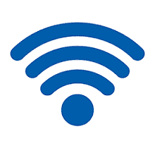

# 什么是热点？

> 原文：<https://www.javatpoint.com/what-is-a-hotspot>

热点是人们可以使用无线局域网或无线网络访问互联网的特定位置。通常，热点一词与无线网络连接同义。创建热点的网络包括无线路由器和调制解调器。大多数人将这些区域称为“无线热点”或“无线连接”简单来说，热点让用户可以将他们的移动设备(如电脑、平板电脑和智能手机)无线连接到互联网。

无线网络发送从其中心位置向不同方向延伸的射频波。由于干扰或远离中心位置，这些信号传播导致它们变弱。因为它可以在公共或私人场所，热点可以在机场、酒店、咖啡店甚至飞机上找到。一些公共热点需要付费才能提供无线接入；然而，许多提供开放网络上的免费无线连接。

在现代，大多数智能手机都可以用来建立 Wi-Fi 热点，让平板电脑和电脑借助智能手机产生的 Wi-Fi 信号连接网络连接。一些移动电话运营商还提供了一种称为移动热点的设备，使用户能够将非电话设备连接到移动电话运营商的数据网络。有各种各样的运营商，如威瑞森、美国电话电报公司、ad Sprint，提供移动热点，每月收取额外费用，起价约为 29 美元。

移动热点连接到 3G、4G 或 5G 运营商的数据网络。该功能用于将信号转换为无线信号，其他设备(如平板电脑或计算机系统)可以通过该信号连接到互联网并使用互联网。此外，移动热点可以插入电源插座，并有可能使用电池运行。

## 热点类型

热点有两种，讨论如下:

1.  **免费 Wi-Fi 热点:**有了密码要求，本质上去掉了 Wi-Fi 路由器，使得能够让用户在有限的范围内从同一个网络接入互联网。
2.  **商业热点:**这些接入点收费提供无线覆盖。为了请求登录信息或支付细节，用户通常在使用商业热点连接到互联网时被重定向到屏幕。

热点地区充斥着安全问题，但它们为数百万互联网用户提供了便利。例如，黑客和身份窃贼经常成为未经授权访问免费公共热点的目标。攻击者非常聪明；他们创建假热点或流氓热点，让人们在获取敏感数据方面上当受骗，因为他们创建的假热点或流氓热点看起来与合法热点完全相同。如果用户在不知情的情况下通过使用这种假冒热点连接到互联网，并使用他们的重要信息登录任何帐户，黑客或攻击者可以借助各种技术获得用户的秘密信息。

## 如何连接到无线热点

无论您是在家中、办公室、商店还是机场和咖啡店等任何公共场所，您都可能通过使用不同的无线热点将平板电脑、笔记本电脑或智能手机连接到互联网。借助使用热点将互联网连接到设备是一种更简单的方法，这有助于在繁忙的生活中保持设备与互联网的连接。

将设备与互联网连接是一个简单的过程。我们以你的智能手机为例。您正在等待您的航班，并且想在不使用手机数据的情况下查看您的电子邮件。您可以在手机设置中搜索无线网络，如果在一个范围内，可以将智能手机连接到互联网。

将设备连接到无线热点的步骤可能不同，这取决于设备的类型；它可以是任何品牌，如安卓、iPhone 或任何其他品牌。但是，下面给出了一个概述:

1.  首先，您需要查看附近无线网络的名称，这可以通过单击设备上的无线图标来完成。现在，您需要选择一个无线网络。在某些情况下，您还需要单击“连接”
2.  要将设备连接到互联网，请输入密码或安全密钥(如果网络是安全的)。要接受连接，大多数无线网络需要安全密钥或密码。一些无线网络不需要密码，因为它们是开放的或不安全的；当您将设备与这些网络连接时，您应该小心这些网络，因为它们会带来安全风险。

1.  如果您在 Windows 设备上，请选择网络类型，如公共、家庭或工作，这将设置适合您所在位置的安全级别。如果您选择“家庭”或“工作”作为您的网络类型，您的设备将对其他设备可见。此外，如果您在公共场所，如机场、餐厅、酒店、咖啡店和任何其他公共场所，请确保选择“公共”网络类型。

根据您附近热点的类型和您所在的位置，您可能会看到不安全、开放或付费/商用无线网络无线。有一些付费服务，如 iPass 或 Boingo，它们根据您使用互联网的时间为您提供大量的 Wi-Fi 接入计划。

## 将您的智能手机用作移动热点

您可能会发现自己处于需要将笔记本电脑连接到互联网但无法访问热点的情况。在这种情况下，您的手机可以通过一种称为“共享”的过程用作移动无线热点这个过程共享您的智能手机的数据连接，并允许您的笔记本电脑和平板电脑访问互联网。此外，您可以通过此过程将另一部智能手机连接到互联网。

设置过程因您的互联网服务提供商和智能手机而异。通常，您可以在“管理连接”菜单或电话设置中找到为另一台设备提供互联网连接的步骤。在这里，为了安全起见，您需要使用无线密码，这样附近的其他互联网用户将无法访问您的手机或笔记本电脑。此外，热点设施存在一些安全风险。

## 热点安全

当你已经连接到互联网，这些技术帮助你保持你的个人生活，你的工作可以不受攻击者或黑客，以及身份窃贼的保护。浏览公共无线热点(如咖啡店或酒店房间的无线网络)时，请确保将笔记本电脑或智能手机等设备连接到信誉良好的提供商。

有时黑客会创建一个虚假或流氓热点；例如，他们使用看似无辜的名字，比如 Bongo，而不是 Boingo。因此，请注意这类存在拼写错误的热点网络，因为黑客利用这些网络获取与他们创建的网络连接的用户的个人信息。攻击者也很容易通过不安全的无线连接传播恶意软件，尤其是在使用文件共享工具的情况下，通过同一网络传播恶意软件。

## 虚拟专用网络

如果您在使用公共无线热点时担心安全问题，可以考虑创建一个虚拟专用网络。虚拟专用网允许用户通过加密连接使用互联网。此外，这有助于阻止黑客，因为数据是加密的。此外，加密和解密传输的数据需要处理能力，这导致您的互联网访问速度变慢。

## 热点简史

1993 年 8 月，亨里克·赛登首次引入了公共接入无线局域网。它是在旧金山举行的网络世界+互操作会议上提出的。当时它被称为可公开访问的无线局域网，Sjoden 没有使用“热点”这个术语

一家名为 PLANCOM 的公司在德克萨斯州的理查森成立；这是第一次尝试创建公共局域网。PLANCOM 代表公共局域网通信。1998 年，公司由创始人布雷特·斯图尔特、格雷格·杰克逊和马克·古德解散。然而，移动卫星网络是由古德和杰克逊创建的。这家公司被认为是希尔顿酒店、美国航空公司和星巴克等公共场所的首批标志之一。后来，在 2001 年，德国电信将该公司改为“T-Mobile Hotspot”，因为该公司被出售给了德国电信。我记得当“热点”这个词第一次应用于一个有公共无线局域网的网站时。

据 ABI 研究报道，2012 年，全球共有 490 万个无线热点可用。无线宽带联盟曾在 2016 年预言，公共热点每年将从 2012 年的 520 万个增加到 2018 年的 1050 万个。

* * *