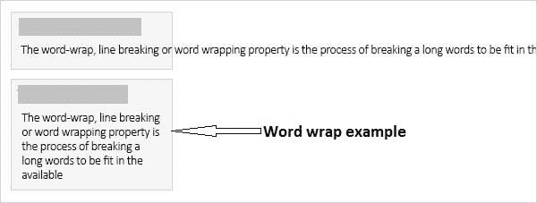
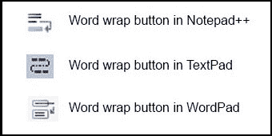

# 什么是自动换行？

> 原文：<https://www.javatpoint.com/what-is-word-wrap>

文字处理器或文本编辑器中的一种功能，它使所有文本都被限制在规定的边距内，这种功能称为自动换行。有时候。它被称为环绕和运行，当一行文本被填充时，它将光标移动到下一行；因此，用户不需要在每行后都按回车键。当文档的页边距改变时，就会出现自动换行。为了将文本保留在页面的指定边距内，大多数文字处理程序都使用自动换行功能。在用户按回车键换行之前，文本将在一行中继续，没有换行。

例如，您可以在下图中看到，由于没有自动换行，文本会移出框的边框，而使用自动换行，文本会自动放入框中；因为当一行文本被填充时，它会将光标移动到下一行。

使用换行时，当换行出现在行尾时，称为软回车，而硬回车则创建新的段落。软返回跟在句子最后的标点符号后面，或者放在完整单词的最后。此外，使用软连字符，没有连字符的单词可以换行到下面一行。

此外，算法用于执行单词换行。通常，它是在最小字长的基础上实现的，以提供最佳的可读性和外观。自动换行允许文本显示动态灵活地适应不同大小的显示。

## 为什么要使用换行？

文字换行是一种防止文本被忽略或剪切的技术，同时还可以将文本保持在特定区域内。此外，当光标结束一行时，您不需要按回车键，因为当一行文本被填充时，它会自动将光标移动到下一行。类似地，网站发布者通过使用 HTML div 标签上传网站上的内容，该标签包装了页面的所有文本，使其更容易阅读。如果任何长文本行不使用自动换行功能，您必须水平(从左到右)滚动，而不是垂直(上下)滚动。

## 关闭自动换行

通常，可以在启用断字的帮助下关闭自动换行功能；但是，它通常是默认设置的。如果你真的想关闭自动换行功能，你需要点击自动换行按钮，或者调整程序的设置来关闭它。下面给出的图片可以帮助您识别包含该选项的程序的自动换行按钮的外观。

这里需要关注的是，如果自动换行功能被关闭或禁用，当您键入时，文本行会在同一行水平继续，并且光标不会移动到下一行，直到按下回车键。

## 为什么有人会关掉自动换行？

有时，关闭自动换行功能可能会更好。例如，当您处理具有长文本行的文件时。在这种情况下，禁用自动换行功能后，查看和查找文本可能会更容易。此外，如果禁用自动换行，并且. csv 文件每行包含不同的值，则很容易看到每行的开头。

## 单词边界、断字和硬空格

软返回通常用在句子结尾或整个句子结尾的标点符号之后。另一方面，当一个句子或单词包含连字符时，就会出现换行。有时，这种情况不会发生，可以通过使用硬连字符或无断连字符而不是常规连字符来阻止。

通过在单词中包含软连字符，没有连字符的单词可以被包装。单词未换行时，软连字符不可见。但是，如果单词被换行，它就会被软连字符换行。有时，在相邻单词之间，自动换行是不可实现的。在这些情况下，通常可以通过在单词之间使用非中断空格或硬空格来阻止自动换行，而不是使用常规空格。

## 如何以一定的字符数换行

文本工具可用于以一定长度换行。例如，如果您有一个 100 个字符长的文本，并且想要换行，您可以使用工具换行；您需要将长度为 100 个字符的文本粘贴到工具中，并在“自动换行”部分输入“100”。

## 历史

1955 年，西联开发了一种“页面打印机控制单元”，其中首次使用了原始的断线功能。该系统依赖继电器，而不是可编程数字计算机，因此有必要开发一种无需使用数据缓冲器即可执行的算法。在这个系统中，如果没有发现空格字符，则每一行在第 70 个字符处断开，如果没有发现空格字符，则在第 58 个字符之后的第一个空格字符处断开。

唐纳德·克努特在 1977 年的一份未发表的备忘录中提出了贪婪算法，在此之前有一种动态编程方法——换行。唐纳德·克努特(Donald Knuth)在描述他的 TeX 排版系统时概述了这一点。后来，克努特&普拉斯在 1981 年发表了更详细的文章。

* * *