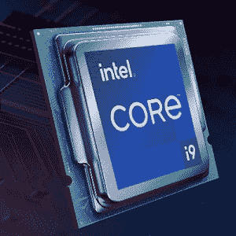
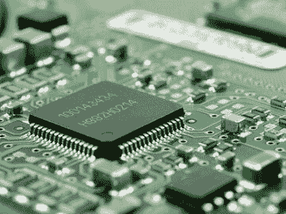
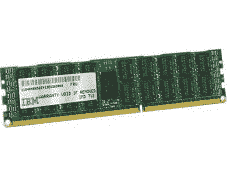
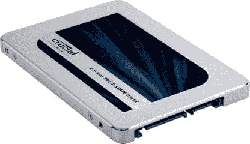
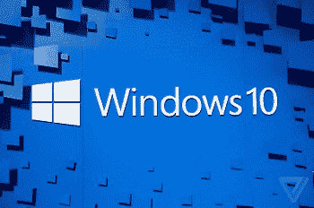

# 是什么让电脑变得又快又强大？

> 原文：<https://www.javatpoint.com/what-makes-a-computer-fast-and-powerful>

如果你在电脑上做设计师，玩很多游戏，或者只是想让你的电脑尽可能流畅地运行，那么一台快速而强大的电脑是必备的。计算机的速度受到各种不同因素的影响。在计算机中，存在多个组件，它们协同工作，使计算机更快、更强大。下面列出了在提高计算机速度和性能方面发挥重要作用的主要硬件组件，通过这些组件，您还可以选择最适合您需求的计算机。

### 处理器

中央处理器(CPU)或处理器控制计算机的整体速度或时钟速度，因为它是使计算机快速运行的最重要组件之一。一个好的处理器是指每秒可以执行更多指令，从而加快处理速度的处理器。这是计算机中处理数据处理的部分，如读取和执行程序指令。

计算机的“时钟速度”指的是它完成这项活动的速度。你的电脑越快，中央处理器每秒能处理的指令就越多。例如，英特尔 4004，一个 740 千赫的处理器，是第一个有潜力每秒处理大约 92，000 条指令的计算机处理器。在现代，处理器具有每秒处理超过 1000 亿条指令的能力，因为它们是多核千兆赫处理器，并且速度比过去快得多。

确定什么样的中央处理器最适合你完全取决于你打算使用它的目的。如果您只在日常工作中使用双核中央处理器，如查看电子邮件或浏览网页，它是一个节能且低成本的选择。

### 躲藏

缓存是影响计算机速度的另一个因素。处理器通常必须等待来自计算机较慢存储器的指令；然而，计算机有可能在一秒钟内执行数十亿条指令。计算机主板和处理器使用高速缓存在内存、处理器等组件之间传输数据，因为硬盘和内存比中央处理器慢。它存储数据，以便更快地响应未来的数据请求。

包含二级高速缓存或三级高速缓存的计算机能够容纳更多的指令，并更快地将它们发送到中央处理器，因为高速缓存是计算机系统中最快的内存类型。

### 内存

内存是一种短期数据存储器，计算机利用它来存储当前在内存中执行的数据。计算机上有额外的内存是有益的，因为当内存耗尽时，它会将不需要的数据从内存转移到主存储设备，直到再次需要它。如果您在处理过程中增加一个额外的步骤，由于硬盘是计算机内存中最慢的类型，如果没有足够的内存，您的计算机将变得非常慢。

如果您同时运行更多的应用程序，您将需要更多的内存。如果你想让你的电脑运行一系列的程序，同时保持速度，那就找一台内存尽可能多的机器。要求更高的游戏，对于专业工作，建议 16GB。爱国者蝰蛇钢 DDR4-4400 是这方面的最佳选择。总内存为 16GB，该系统配有两个 8GB 内存模块。

### 总线速度

总线的速度也会影响计算机的速度。在早期的系统中，主板的总线速度提高了数据在所有硬件组件之间传输的速度。例如，66 兆赫的前端总线与 400 兆赫的前端总线相比要慢得多。如果计算机总线速度缓慢，导致机器变慢，中央处理器必须等待更长时间的指令。

总线是连接计算机主板上各种组件的电路，例如中央处理器和内存。前端总线的频率可以从 66 兆赫变化到 800 兆赫以上。为了确保你的电脑速度快，去寻找一个最快的速度的主板。总线一次可以处理的数据越多，这些组件之间的信息传递就越快。因此，您的计算机将更有效地工作，因为它将不得不等待更少的指令时间。

在现代，采用英特尔处理器的计算机使用的是 QPI(快速路径互连)，而不是前端总线。与金融稳定委员会相比，QPI 的效率更高、速度更快。AMD 处理器使用的是超传输，而不是 FSB。与金融稳定委员会相比，像 QPI 这样的超传输速度更快、效率更高。QPI 和超传输有助于使计算机更快，因为它们能够在硬盘、内存和其他硬件之间实现更快的通信。

### 硬盘驱动器

硬盘也对电脑的运行速度有影响。移动元件存在于传统硬盘驱动器中。这些移动元素对计算机的性能有影响，即这些部件的旋转速度，以每分钟转数(RPM)衡量。例如，与 7200 转/分的硬盘相比，5400 转/分的硬盘会慢一些。因此，硬盘驱动器的各种组件会影响计算机的整体性能。

由于内部的移动元件，硬盘(传统硬盘)会降低计算机性能，从而降低读写速度。另一方面，固态硬盘的读写速度更快，因为它没有移动部件。

下面列出了影响硬盘速度的几个因素。

*   与标准硬盘驱动器(HDD)相比，固态硬盘不包含移动部件，因此速度大大加快。
*   硬盘的每分钟转数是指光盘内的盘片旋转的速度。速度为 5400 转/分的硬盘明显慢于速度为 7200 转/分的硬盘。
*   与现代系统中使用的 SATA 电缆和端口相比，旧计算机中用于连接驱动器的 EIDE (ATA)电缆和端口的传输速率要慢得多。

如果您希望您的计算机尽可能快地运行，请选择具有尽可能多存储空间的固态硬盘。推荐使用关键的 MX502TB，它提供了巨大的 2TB 容量。

### 视频卡

显卡还会影响计算机的速度，计算机是最后一块硬件，也称为图形处理单元(GPU)。如果你想玩最新的电脑游戏，你需要一个有自己的内存和处理器的显卡。这些显卡通过处理 3D 渲染和其他耗时的活动来提高计算机速度。显卡呈现 3D 视觉效果的速度越快，功能就越强大。

显卡的性能也受到显卡接口的影响。例如，与较新的 PCI Express 显卡相比，较旧的 AGP 显卡要慢得多。为了在显示设备上显示，图形处理器是一种专门的电子电路，有可能快速操纵和改变内存，以加快图像的生成。如果你经常处理照片或玩很多游戏，你可以理解为什么你需要一个快速的图形处理器来为你的屏幕生成图形。

如果您不知道为了提高计算机的性能需要哪种图形处理器(也称为独立显卡)，建议购买单独的显卡。这是因为图形处理器需要内存才能工作。独立的图形处理器有自己的内存，而集成显卡使用主计算机的内存。这意味着你的主系统的内存将可以自由地专注于其他活动，因为你将有专门的内存用于图形处理。

### 最新操作系统

操作系统是提高计算机速度的另一个重要因素。操作系统使得所有上述计算机硬件能够与计算机软件进行交互并起作用。没有操作系统，您的计算机将无法运行。当新技术被开发时，操作系统必须被构建来与它们接口，以便它们能够被计算机完全支持。

为了支持新技术，今天的操作系统提供更新；但是，这些更新可能不适用于早期的操作系统。因为它支持并优化了所有最新的硬件，所以运行 Windows 10 的机器比运行 Windows XP 的机器更快。Windows 10 是目前个人电脑的操作系统。Windows 10 更新定期发布，以解决安全漏洞或错误，这两者都会降低您的计算机速度。为了确保您的计算机同样快速、安全和高效，请保持您的操作系统是最新的。

### 软件

术语“软件”指的是安装在计算机上的程序，它也会对计算机的速度产生影响。如果软件存在问题或开发不完善，可能会导致您的计算机在这些应用程序运行时变慢。如果您的计算机在运行软件时速度较慢，请确保定期更新您的软件，以解决任何效率问题或 bug。

另一个建议是定期检查你的软件，删除任何你不需要的东西。如果你已经在你的电脑上安装了很多程序，或者你的电脑附带了很多预装的应用程序，你很有可能没有完全利用它们。这些程序可以卸载，使您的计算机运行更快。

当您打开电脑时，电脑上的几个程序也可能被设置为自动打开。如果这些文件太多，您的计算机可能需要很长时间才能启动。但是，您可以阻止应用程序自动启动。为此，您需要在可以通过同时按下 Ctrl、Shift 和 Esc 键来访问的窗口上打开任务管理器。然后，您需要转到出现的窗口的“启动”部分，并为您不希望自动启动的应用程序选择“禁用”选项。当你打开电脑时，这样的程序将不再自动打开。

### 使用最新技术

与使用较旧技术的计算机相比，使用最新技术的计算机速度要快得多。例如，在现代，计算机中使用 SATA 固态硬盘，这与 5400 转/分的 IDE 硬盘相比要快得多。同样，与配备 AMD 锐龙 7 或酷睿 i7 处理器的计算机相比，英特尔酷睿 2 双核或 AMD Athlon 64 X2 处理器将会更慢。

### 你的电脑需要多快？

在现代，计算机更强大。他们中的大多数人拥有的能量远远超过普通用户的需求。不过，我们都希望电脑有最好的性能。拥有一台迅捷的电脑让我们的生活变得更加轻松。大多数现代计算机系统功能强大，足以处理我们的日常任务，如检查电子邮件和访问互联网。当你正在进行一个项目或灵感来袭时，我们不想等待。

您可能需要电脑从许多开箱即用的设置中升级，尤其是如果您是游戏玩家，并且使用电脑编辑照片和电影或制作音乐。虽然某些进程需要计算机更加努力地工作，并且可能需要更新，但是计算机现在已经足够快，可以执行我们交给它们的大部分任务。

* * *