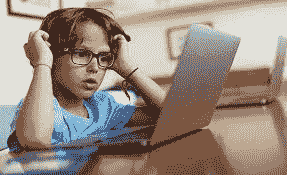

# 保护儿童免受互联网上有害物质和人员的侵害

> 原文：<https://www.javatpoint.com/protect-children-from-harmful-material-and-people-on-the-internet>

互联网上有各种各样的信息，但有些网站和资料并不适合所有的观众。以下是您可以采取的一些措施，以保护您的孩子在线安全，避免潜在的有害或不适当的内容。

### 讨论

当你的孩子开始使用互联网时，有必要和他们开诚布公地谈论他们在网上观看、阅读和交谈的内容，不要随着他们年龄的增长而中断与他们的对话。列出你孩子最喜欢的网站或应用，并和他或她一起浏览。和孩子讨论你觉得可以接受的事情，提醒他们其他家长和孩子可能有其他观点。

你需要关注你的孩子，想出什么对你和你的家人最好。因为总有一天你的孩子需要在自己家以外的地方安全地使用互联网，所以你现在应该准备好或教授关于在线活动的重要课程。

同样至关重要的是，要教会他们正确的行为，如何在网上与人互动，以及如何在如此突出的平台上表现自己。他们必须时刻记住，互联网是一个公共空间。

以下是您可能希望与孩子讨论的基本主题列表。

*   **个人信息:**千万不要在聊天室、网站或通过网络形式泄露个人信息。个人信息包括位置、身体描述、年龄、网络摄像头地址、自拍、电话号码、电子邮件地址和用户名等。密码、互联网服务提供商的名称、你在哪里上学以及你的年级都应该保密。
*   **永远不要遇见某人:**如果没有父母或监护人在约定的见面地点，永远不要遇见你在网上认识的人。
*   **网上购物:**千万不要进入询问你的信用卡号、个人信息或密码的商店。此外，如果您被告知在没有家长同意的情况下挂断并拨打另一个号码，请不要输入。
*   **下载:**接受他人的文件或下载从来都不是一个好主意。
*   **网页:**在没有监护人在场或家长的情况下，不要浏览通过即时消息、电子邮件或聊天等方式传递给你的网页。
*   **礼物:**你在网上遇到很多可能是陌生人的人，不要接受这类用户的任何礼物。
*   **好友:**如果分享好友的联系方式，可以帮助追踪你。因此，不要在网上把你朋友的信息透露给任何人。
*   **个人照片:**通过智能手机或互联网，永远不要给别人发私人照片。
*   **谈论性或挑逗性画面:**在网上的时候，不要在网上挑逗别人；聊一聊张贴性照片或性。
*   **和你说话:**确保你的孩子知道，如果他们看到了打扰他们或让他们感到不安的事情，可以和你说话。

### 教你的孩子保持他们的位置隐私

地理标记是大多数应用程序、网络和设备中存在的一项功能，它允许您与其他人共享您的位置，并可能将它们带给您。一些，但不是全部，社交网络平台有能力自动隐藏或删除这些信息，所以做好你的功课，注意你分享了多少信息。

### 记录在线时间

根据《澳大利亚身体活动和久坐行为指南》，5 至 17 岁的儿童每天在屏幕前的时间不应超过两个小时。因此，关注你的孩子在网上做什么是至关重要的，尤其是如果他们还年轻，以确保他们不会养成坏习惯。为每节课设置 30 分钟的时间，让你的孩子同意一个时间范围。请记住，这是一个没有商量余地的最后期限。

此外，如果你家里安装了 Wi-Fi，你应该在每天晚上的特定时间(最好是在睡觉前)关掉它，这样每个人都可以远离电脑。让一些日子在你的家里“无屏幕”，以鼓励每个人参与更多的身体和/或较少的技术为基础的活动。

### 监控使用

将电脑放在公共区域，和孩子一起监督或浏览互联网。在孩子的房间里放一台电脑不是一个好主意。如果您需要在远离孩子时监控他们的使用情况，请考虑安装第三方过滤器，以保护您的计算机免受不合适网站的影响。

注意:使用平板电脑和智能手机等移动设备跟踪孩子的在线活动可能会更加困难。考虑将所有充电电缆放在公共区域，如厨房，或者在晚上关闭无线网络，以帮助保护这些设备上的充电电缆。

如果您运行的是较新版本的 Windows，我们强烈建议您尝试 Windows 附带的家庭安全设置应用程序。在运行 Microsoft Internet Explorer 的旧版本 Windows 上使用 Internet Explorer 内容顾问的帮助下，用户可以保护家人免受有害内容的侵害。

### 查看互联网历史记录

定期检查孩子的浏览器历史记录，以确保他们没有访问任何不适当的网站，或者删除历史记录以隐藏他们看到的内容。浏览器地址栏或地址栏可以提供有关地址内容的附加信息。

### 知道你孩子的在线朋友是谁

作为成年人，我们意识到互联网上的一些人并不是他们声称的那样，但是如果他们从小没有被教导要精通网络，儿童和青少年可能会危险地不知道他们在和谁交流。

### 观看学校网站

关注孩子的学校网站，了解他们的任何个人信息，如学生照片、完整的姓名、地址等。如果掠夺者知道你孩子的全名、学校或年级，他们可以使用搜索引擎来找到这些信息。

查看即时消息好友

如果您的计算机系统有即时通讯程序，您需要检查孩子的好友列表或朋友列表，以保护他们免受不必要的活动。

*   **社交网站**
    有多个社交网站可用，如 MySpace、Snapchat、Instagram 和脸书；这些网站允许用户通过互联网与他人交流。因此，年轻用户选择这些社交网站。不幸的是，因为许多参与其中的个人发布在线照片和个人信息，这些位置经常被在线掠夺者访问。如果您的孩子正在使用这类网站，您需要确保他们不会发布个人信息，如用户标识、密码、出生日期、完整姓名、地址等。父母或在社交媒体网站上创建该帐户的孩子，我们强烈建议他们将个人资料保密，只有他们的朋友和亲戚才能通过这些资料看到他们的个人资料。
*   **成为他们的朋友**
    成为孩子的朋友是一个很好的主意，可以跟踪孩子在做什么，并在社交媒体上分享。加入您的孩子正在使用的同一社交网站，将他们添加为朋友或关注他们。

### “共享意识”保护您的隐私

如果你的孩子花很多时间在社交媒体上，他们应该意识到照片和个人信息可能会被公开..让你的孩子向你展示他们在社交媒体上分享的内容，或者让你的哥哥姐姐在照片公开之前检查一下。如果你的孩子使用社交媒体分享照片或帖子，请他们向你展示正在发布的内容，或者让一个年长的兄弟姐妹在照片公开之前与你一起检查任何照片。

### 懂行话

在互联网上，代码、俚语、首字母缩略词和其他语言比比皆是，所有这些都是为了掩盖正在交流的内容。

### 在游戏中保护他们

Twitch 是儿童和成人的热门平台，用来看别人玩网络游戏。孩子不应该用游戏内产品换取游戏内服务或现实生活中的个人信息，也不应该与其他玩家分享个人信息，就像他们不应该在网上泄露个人信息一样。

### 掌控家人的数字足迹

一个人的数字足迹是由社交媒体和互联网上发布的每一张照片和个人细节形成的。这里的主要风险是，如果信息被公开发布，它可能会以不可预测和不可管理的方式被使用。你还需要认为你在互联网上的帖子是永久的，因为有时别人看到你的帖子也会在你删除之前保存它。

因此，儿童和青少年在保护他们的照片和个人信息时必须谨慎。你还必须教你的孩子如何通过只与他们熟悉和有信心的人分享来控制他们的数字足迹。在社交媒体平台上，激励你的孩子有选择性，使用他们使用的隐私设置，而不是与他们所有的朋友分享。

* * *