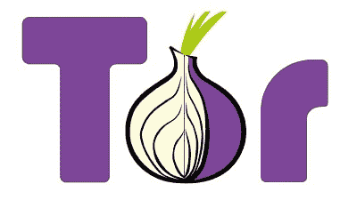

# 如何在网上匿名

> 原文：<https://www.javatpoint.com/how-to-be-anonymous-on-the-internet>

这个页面是为那些担心别人看他们的网络活动或者想匿名的人准备的。请记住，匿名级别各不相同，即使采取这些预防措施也不能确保 100%匿名。此外，在互联网上匿名的过程需要各种修改，比如您可能需要更换您的电子邮件提供商、消息应用程序、浏览器、操作系统和搜索引擎。

此外，如果您试图在互联网上隐藏自己或身份以进行一些非法活动，此页面不适合您。下面列出了不同的策略，以便在使用互联网时保护您的身份。

### 隐私基础知识

遵循一些简单的原则可以在很大程度上帮助你维护你的在线隐私。

*   除非绝对必要，否则不要在网上透露任何个人信息。在其他情况下，只填写不完整的信息，如您的姓氏首字母，当它被要求时，如您的姓氏。
*   避免成为电子邮件和网络钓鱼计划的受害者。了解如何发现网络钓鱼诈骗，永远不要通过电子邮件提交敏感信息。
*   了解恶意软件，并确保您的设备上至少安装了一个反间谍软件工具来保护它(如果您使用的是微软视窗系统)。

### 公共匿名代理

当您使用互联网时，分配给您的计算机或网络的 IP 地址可以跟踪您的位置并帮助识别您的访问。您可以通过使用基于网络的代理来访问网络，以帮助保持您的机器匿名。您可以使用基于 web 的代理在单独的计算机上加载页面，然后在自己的计算机上的浏览器中查看结果。以下是当前可访问的一些匿名网络代理的列表。

[https://proxify.com/](https://proxify.com/)

[https://www.freeproxy.ca/](https://www.freeproxy.ca/)

如果您认为您的连接已被黑客攻击或嗅探，请不要使用它(例如，在无线热点连接到互联网)。借助使用 HTTPS 代理，可以帮助加密从代理传输到您的计算机的未加密数据，这有助于防止窃听。如果您使用的是代理网络服务，如代理，也可以使用 HTTPS 连接。

如果您经常需要代理并使用 Mozilla Firefox 作为您的浏览器，有各种好的代理附加组件可用。

您用来访问互联网的代理服务器可能会记录访问的用户。法律权威也许能够获得识别信息来定位你。如果您将敏感信息(如信用卡号、用户名或密码)提交到代理中，代理的控制者可以捕获并使用您的信息。

### 使用安全的电子邮件服务

我们利用 Gmail 作为我们的个人电子邮件提供商，因为我们如此沉浸在谷歌生态系统中。虽然我们欣赏它使用起来有多简单，但我们不喜欢谷歌将我们所有的个人电子邮件保存在它的服务器上。然而，也有一些安全的解决方案，比如质子邮件，它是由创建质子 VPN 的同一家公司拥有的。不能命令质子邮件向政府传递客户数据，因为它总部位于瑞士，而瑞士不是五眼监控联盟的一部分。相反，所有的电子邮件从头到尾都是使用开源代码加密的，这项服务在安卓、iOS 和网络上都是免费的。

### 不要使用语音助手

在您的智能家居中，语音助手使家庭自动化变得简单。然而，他们以侵犯人们的隐私而闻名。例如，与谷歌助手兼容的 Nest Secure 安全系统包含一个隐藏的、未报告的麦克风，亚马逊的员工已经承认收听了 Alexa recordings3。不要使用语音助手，而是使用您的应用程序来手动控制您的物联网设备，如智能灯、智能车库、智能锁等。

### 检查 HTTPS

如果可行的话，只访问以“HTTPS”(超文本传输协议安全)而不是 HTTP 开头的网站。HTTPS 加密你的浏览器和你访问的网站之间的所有通信，因为它使用安全套接字层(SSL)，而 HTTP 没有。

### 从匿名启动。OS LiveCD

匿名。操作系统是一个 LiveCD，允许用户匿名访问网络，因为它从光盘启动并运行在 OpenBSD 的变体上。你可以访问匿名。操作系统网站，可通过以下链接下载。

[https://sourceforge.net/projects/anonym-os/](https://sourceforge.net/projects/anonym-os/)

### 突岩

Tor，代表洋葱路由器，是一种允许用户在线匿名的技术。Tor 的创建是为了保护美国海军的政府通信。Tor 通过虚拟隧道网络在互联网上传输数据，保护您的匿名性。

该软件(通常是网络浏览器)通过路由器将流量路由到服务器网络，让用户在线时保持匿名。Tor 是一种免费网络，它使用分层加密来防止原始数据在传输过程中被解密。您可以使用以下链接下载 Tor。

[https://www.torproject.org/download/](https://www.torproject.org/download/)

### 无名镇

Whonix 是一个重视隐私、安全性和匿名性的操作系统。它分为两部分，一部分运行 Tor 并充当网关，另一部分位于完全不同的网络上。

### 备用计算机或连接

备用计算机或连接也有助于在互联网上保持匿名。例如，如果你借助他人的网络连接到互联网，比如咖啡馆、图书馆、学校或企业，它可以帮助你保持匿名。当您使用他人的连接时，您是以他们的 IP 地址登录，而不是您的 IP 地址。

但是，请记住，如果您使用登录名来访问计算机或网络，该登录名可能会链接到您。

### 使用虚拟专用网络

VPN 加密来自浏览器和其他网络程序的所有在线流量，这与 Tor 不同，Tor 只加密来自浏览器的网络流量。您的互联网服务提供商(ISP)将无法观察到您的任何在线活动，因为虚拟专用网隐藏了您的浏览器历史记录以及您的 IP 地址。

### 使用加密消息应用程序

不要在你的安卓系统上给一个好友发短信，而是使用一个像 Signal 这样的加密信息应用。Signal 的开源技术从头到尾加密所有消息。没有广告或跟踪，公司也无法访问您的消息或电话对话。

### 使用广告拦截器

广告软件是在您的设备(如平板电脑、电话或计算机系统)上显示广告的程序，大多数网站和应用程序都包含广告，即使您没有广告软件。这些广告可能会令人恼火。除了移除广告软件之外，还可以使用 AdBlock 或 Adblock Plus 等广告拦截器。

### 私人模式或隐姓埋名模式

在大多数当前的浏览器中，可以访问私有模式，通常称为匿名模式。隐姓埋名模式，通常称为私人浏览、InPrivate Browsing 或私人窗口，是一种阻止存储浏览历史的浏览器功能。当您查看网页时，它需要的文本、图片和 cookies 通常保存在您的计算机本地。虽然这种模式确实可以保护您在本地所做的事情，但不能保护您免受其他人访问服务器或搜索记录的影响。任何已完成的搜索或表单也可以保存在自动完成区域。当您在隐姓埋名模式下关闭浏览器窗口时，数据要么被遗忘，要么根本不存储。

### 禁用 cookies

Cookies 是关于你的在线行为的小块信息，用于制作有针对性的广告；在某些情况下，它们被匿名化和聚合，但并不总是这样。

### 远离社交媒体

根据对社交媒体和育儿的研究，超过四分之三的父母使用社交媒体，在社交媒体上分享他们孩子的故事、照片或视频。更糟糕的是，这些家长的帖子中超过 80%使用了孩子的真名。这不是在社交媒体上分享孩子信息的好习惯；这使他们的孩子面临儿童身份被盗的风险；此外，社交媒体公司会将这些数据保存很长一段时间。

### 阻止和管理跟踪器

有许多网站跟踪并收集访问者的冲浪活动信息。因为这些追踪器无法检测到，大多数人都不知道自己被跟踪了。Ghostery 是一个免费的浏览器插件，可以显示这些追踪器，通常被称为网络 bug。，并且适用于所有主要的 web 浏览器。然后，你可以选择你想预防的和你想追踪的网页漏洞。Ghostery 总共监控着大约 1，900 家企业。在 Ghostery 知识库中，每个企业都有一个配置文件，可以帮助您找出谁在监视您，为什么，以及您应该采取什么行动。

### 加密电子邮件

Hotmail、Outlook、Gmail 和 Yahoo Mail 是流行且广泛使用的电子邮件服务，但这些服务对隐私并不友好。考虑切换到更安全的服务，为完全相当好的隐私(PGP)加密电子邮件。Hushmail 是一种流行的电子邮件服务，它为用户提供一个私人账户，该账户有无限的电子邮件别名，没有广告，内置加密。有一个基本的免费服务提供，额外的功能可按月付费。另一方面，Hushmail 已经被法院强制将用户数据移交给美国当局。用户的 IP 地址也被公司记录下来。虽然 MyKolab 是一个类似的网站，从未披露过任何用户信息，但他们被要求提供访问真正的拦截请求；因此，这仍然是一种可能性。

### 代理服务系统

代理服务器是一台计算机，它充当计算机和互联网之间的管道，允许处理您的在线活动。因此，因为代理会用自己的 IP 地址替换您的 IP 地址，所以这可能是保护您的在线身份安全的一个很好的方法。如果代理人与你所在的国家不同，你可以欺骗网站和追踪者，让他们以为你是在另一个大陆冲浪。代理可以以多种方式使用，既有免费服务，也有商业服务。

### 沟渠收纳箱

云存储提供商 Dropbox 被爱德华·斯诺登戏称为“对隐私不友好”。这真是一个毁灭性的声明。如果您担心借助这种方法共享数据，有几个可行的选项可以提供更多的隐私。斯诺登推荐了 Spideroak，它标榜自己是一种零知识加密数据备份、共享、同步、访问和存储服务。这是他们免费试用的一部分，可以在他们的网站上找到。一个全功能会员每月花费 12 美元。如果你只是想免费匿名快速交换小文件或大文件，不妨试一试。它完成了工作；然而，它没有 Spideroak 那样功能丰富。

### 避免 javascript

JavaScript 可以给每个使用它的网站提供关于你的系统的详细信息，这是一种编程语言，在互联网上广泛使用。它经常被用来为你提供更个性化和相关的广告，或者增强你的冲浪体验，而且它几乎总是以一种完全良性的方式被利用。然而，这种系统或个人信息中的一些，以前可能并已经被泄露。因为许多网站需要你允许 JavaScript 才能正常运行，所以完全禁用 JavaScript 不是一个选项。您可以使用浏览器扩展将 JavaScript 活动列入黑名单或白名单，从而让您更好地控制数据的使用方式和位置。NoScript 和 ScriptSafe 都很容易使用，并且更受欢迎。

### 摧毁所有技术，住在山洞里

最后，保持在线匿名的唯一有效方法是完全避免上网。删除你所有的帐户，如果你已经使用了互联网，关闭并中断你的电脑。希望你能留下数字足迹；然而，它可能不是特别重要。如果你想走这么远，你也应该打碎你的手机、iPad 和智能电视。你可以选择住在一个山洞里，自我放逐，现在你已经从生活中消除了所有的互联技术，并且不想再回到网络世界。

### 其他软件产品

对于发现上述解决方案不能满足其需求的消费者来说，有各种各样的非自由软件选择。下面列出了其中一些服务。

[https://ntrepidcorp.com/home.html](https://ntrepidcorp.com/home.html)

[https://www.ipvanish.com/](https://www.ipvanish.com/)

[https://www.hide-my-ip.com/](https://www.hide-my-ip.com/)

[https://www.purevpn.com/](https://www.purevpn.com/)

* * *