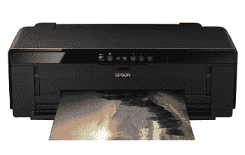
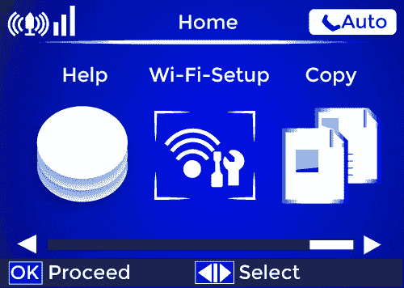
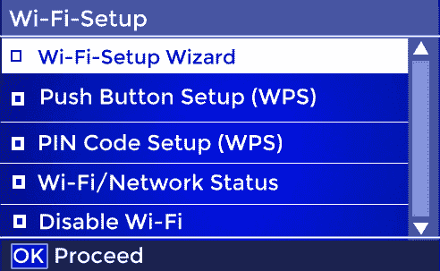
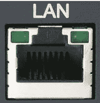

# 如何将打印机连接到家庭网络

> 原文：<https://www.javatpoint.com/how-to-connect-a-printer-to-your-home-network>

许多打印机能够借助无线连接或有线连接连接到网络。在家庭网络中设置打印机的帮助下，您可以连接您的电脑，而无需将它们物理连接到打印机。

打印机必须有有线网络连接端口或内置无线适配器才能连接到家庭网络。从下面的列表中选择您的打印机类型，并在使用说明的帮助下将其连接到您的家庭网络。

### 将无线打印机连接到网络

如果您的打印机有内置的无线网络适配器，请按照以下说明将打印机无线连接到家庭网络。

#### 注:无线网络连接技术因打印机型号及其类型而异。以下步骤旨在更全面地介绍如何将打印机连接到无线网络。就名称或功能而言，您的打印机选项可能与下面列出的不同，但它们应该相似。

1.  您的打印机应该配备一个小液晶屏，根据其功能显示各种选项。找到网络或无线连接设置选项并选择它。无线网络设置、网络设置或类似的可能是选项的名称。
    爱普生打印机的主液晶屏如下图所示。
    
2.  要连接到网络或无线配置菜单中的无线路由器，应该有一两个选项。无线网络设置向导(通常称为网络设置向导)会引导您完成将打印机连接到无线网络的过程。某些打印机可能支持无线网络的 WPS 连接。
    爱普生打印机上的 Wi-Fi 设置菜单如下图所示。
    
3.  在设置菜单中，选择首选连接选项，然后按照以下步骤进行连接选择。

**使用 Wi-Fi 或网络设置向导连接**

*   打印机的液晶面板显示该区域的无线网络。要连接到无线路由器，请选择您的无线网络名称或 SSI。
*   在液晶屏上，您应该会看到输入密码的请求，以便访问您的无线网络。输入密码后，选择确定或下一步。
*   然后，打印机连接到您的无线网络。通常，您会看到一条消息，指示您的打印机现已连接。

**使用 WPS 连接**

1.  如果您有两个 WPS 选项，您可以尝试按钮设置或类似命名的选项，如上图所示。
2.  在大多数打印机的液晶屏上，您会看到通知，通知您在路由器上开始 WPS 连接过程。您必须首先前往您的路由器，并按下 WPS 按钮开始该过程。返回打印机的液晶屏界面，然后选择“确定”或“下一步”，以检查路由器的 WPS 信号。
3.  打印机连接到无线网络，如果它有可能检测到由您的路由器传输的 WPS 信号。通常，您会看到一条消息，指示您的打印机现已连接。

### 将支持网络的有线打印机连接到网络

如果您的打印机有有线网络连接端口，但没有无线网络，请遵循以下步骤。

*   继续之前，如果打印机已打开，请将其关闭。
*   找到打印机上的有线网络端口，该端口可能位于打印机背面，如图所示。
*   在打印机上，5 类网线的一端需要连接有线网络端口。
*   将网线的另一端连接到网络路由器的可访问有线网络端口。
*   现在，您需要打开打印机，并需要等待它完成启动过程并加入网络，这应该需要几分钟。
*   检查打印机的液晶屏，看它是否有一个 IP 地址，表明它已连接到网络。

* * *