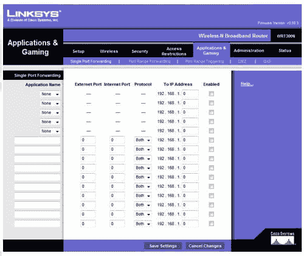
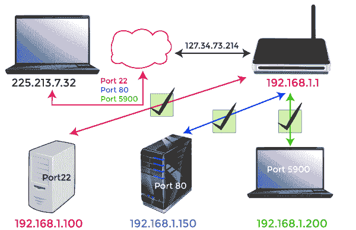

# 如何打开或转发路由器上的端口

> 原文：<https://www.javatpoint.com/how-to-open-or-forward-a-port-on-a-router>

某些游戏和程序可能要求您打开家庭路由器上的一个或多个端口，或者设置端口转发。这里列出了大多数路由器的必要步骤，以及对调试问题的进一步支持和提示。

为了理解端口转发，首先需要理解“什么是端口转发”以及“路由器如何工作”。

### 什么是端口转发？

路由器的端口转发设置告诉它通过特定端口与特定设备交互。当您为设备设置特定端口时，您告诉路由器始终接受特定端口的请求，并将数据传输到设备的专用 IP 地址。

路由器的主要功能是通过局域网向您的所有设备发送互联网信号。您的路由器通过为局域网中的每台设备分配唯一的本地 IP 地址来实现这一点。例如，10.0.2 或 192.168.0.2 的私有 IP 地址将被分配给您的计算机。

每个设备的应用和服务都有一个端口号。IP 地址和端口号(如 10.0.0.2:80 或 192.168.0.2:80)将被分配给计算机上的程序。

由于这个唯一的 IP 地址和端口号，您的路由器知道将数据传输到哪个软件或服务。在广域网上的局域网上，这允许您和其他人使用局域网的设备和程序。

**警告**

在路由器上，端口经常关闭，以帮助防止非法访问您的家庭网络。路由器上的任何额外端口都可能危及网络的整体安全性。

#### 注意:确保真正有必要打开端口来访问游戏或程序，如 BitTorrent。在某些情况下，您计算机上的路由器或防火墙可能会限制访问。要确保您的防火墙不是产生问题的根源，请关闭一段时间。

1.  首先，确定计算机的本地 IP 地址，以便利用端口转发。
2.  现在，您需要访问路由器的设置。
3.  在路由器设置中找到端口转发选项，这些选项通常位于名为“应用程序和游戏”或“端口转发”的部分。如果您在这些设置方面遇到问题，我们建议您咨询路由器的说明或查看端口转发网页。
4.  当您导航到端口转发面板时，您将看到类似于以下示例的内容。

### 单端口转发

如下图所示，单端口转发有几个必须填写的字段。

首先，应用程序名称是指您正在打开的端口的名称。该路由器具有空框和下拉选项，如下例所示。如果您选择该选项，您将能够打开一个公共端口，例如 FTP。但是，在大多数情况下，您需要指定应用程序的名称。例如，你可以输入游戏的标题。

还有互联网端口和外部端口需要考虑。在这两个字段中，键入要打开的端口的名称。例如，如果您想打开端口 88，您可以在两个框中都写 88。

下一步是协议，可以是 TCP、UDP 或两者都有。如果您不确定需要哪种协议，请同时使用这两种方法。如果没有两个选项，请为 TCP 和 UDP 创建两个开放端口。

计算机或网络设备的 IP 地址“收件人 IP 地址”是下一个字段。在网络上，此端口被路由到。

最后，选中“已启用”框，并在设置完所有这些设置后单击“保存更改”按钮。

### 端口范围转发

如果你的程序或游戏需要一系列端口，比如 6112-6119，你的路由器应该有一个端口范围转发部分。您将重复上一阶段的过程，但是您将输入起始和终止端口号，而不是输入单个端口号。例如，如果您收到打开端口 6112-6119 的命令，您可以输入 6112 作为起始端口，输入 6119 作为最终端口。

### 非军事区

最后，如果在激活端口转发后，另一个软件或计算机看到您的机器时仍然遇到问题，您可能需要启用非军事区。该选项可以从禁用更改为启用，通常可以在前一个路由器设置的相同部分访问。

### 测试外部网络是否可以看到新端口

各种服务可以测试您新打开的端口是否正常工作。您也可以尝试端口检查工具和来自端口转发的 Canyouseeme。

### 您的路由器如何处理请求和使用端口

该图描绘了一个基本的家庭网络。整个互联网和你的公共或面向前的 IP 地址都用云符号表示。一个 IP 地址，就像一个街道地址，作为你在外面世界的完整家的代理。

红色地址 192.1.168.1 是您网络的路由器地址。其他地址都链接到图片底部的计算机。

这个图表提出了一个有趣的问题，你可能以前没有考虑过。来自互联网的所有数据如何到达网络中的正确设备？当所有设备都有相同的面向公众的 IP 地址时，它是如何在你的笔记本电脑上而不是你儿子的桌面上出现的？

这可以通过网络地址转换来实现，网络地址转换是一种出色的路由技术。NAT 在路由器级别执行这项工作，充当流量 cop，通过路由器路由网络流量，以便路由器后面的所有设备可以共享一个公共 IP 地址。NAT 允许你家庭中的每个人同时请求网页和其他互联网内容，这些内容将被发送到适当的设备。

尽管端口是网络计算早期的遗留物，但它们仍然是有用的。当计算机有可能一次只运行一个应用程序时，链接它们所要做的只是简单地将一台计算机指向网络上的另一台，因为它们都运行相同的应用程序。当计算机变得强大到足以执行许多程序时，早期的计算机科学家面临着确保适当的应用程序与适当的应用程序相链接的任务。结果，港口出现了。

一些端口采用计算行业中常用的专有软件。例如，当您请求网页时，使用端口 80。接收机器上的软件将端口 80 识别为提供 http 文档的端口，因此它会适当地监听和响应。web 服务器将无法识别通过不同端口(如 143)发送的 http 请求，因为它没有侦听该端口(尽管像传统上使用该端口的 IMAP 电子邮件服务器一样)。

您可以随意使用其他端口，因为它们没有预定义的用途。建议对这些变体配置使用更多的数字，以防止干扰其他遵守标准的应用程序。Plex 媒体服务器使用端口 32400，而《我的世界》服务器使用端口 25565，这两个端口都是“公平游戏”号码。

TCP 或 UDP 可用于连接到每个端口。最广泛使用的协议是传输控制协议。一个值得注意的例外是:BitTorrent、UDP 或用户数据报协议，它在住宅应用中的使用不太广泛。它将根据正在监听的内容，期望在这些协议中的一个或另一个中提交查询。

### 为什么需要转发端口

虽然有些程序利用网络地址转换来生成自己的端口，并为您处理所有设置，但许多其他程序没有，您需要帮助您的路由器连接应用程序和服务。

在下图中，我们将从一个简单的前提开始。您在地球上的其他地方使用笔记本电脑(IP 地址为 225.213.7.32)，需要连接到家庭网络才能访问一些文件。

如果您只是将您的家庭 IP 地址(127.34.73.214)插入到您正在使用的任何程序中，并且该产品不支持我们刚刚概述的复杂路由器功能，那么您就倒霉了。什么都不会发生，因为它无法传递您的请求，因为它不知道将请求发送到哪里。

顺便说一下，这是一个完美的安全功能。如果有人试图在没有使用授权端口的情况下加入您的家庭网络，您希望连接被拒绝。那是你的路由器的防火墙在做它的工作，那就是阻止不想要的请求。然而，拒绝并不那么受欢迎，如果敲你虚拟门的人是你，我们需要做一些调整。

你可以通过告诉你的路由器来克服这个问题，“嘿，当我用这个应用程序联系你时，你必须把它传输到这个端口的这个设备上。”一旦这些指令到位，您的路由器将确保在您的家庭网络中，您可以访问正确的计算机和应用程序。

* * *