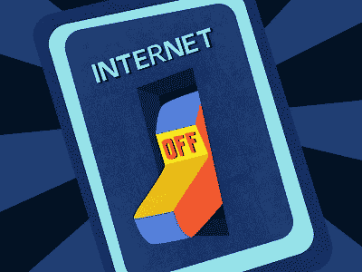

# 整个互联网有可能崩溃或者关闭吗？

> 原文：<https://www.javatpoint.com/is-it-possible-to-crash-or-shut-down-the-entire-internet>

不。互联网由许多不同的网络组成，由许多不同的个人、公司和政府管理和维护。因此，错误或无意中介绍整个互联网是相当艰难的。互联网流量是可靠的，有能力在出现任何问题之前重新路由流量。

没有大的开/关开关。以适当的方式与互联网断开连接是不可能的。它是一个多样化的平台，拥有众多不同的互联网络。它是为了变得没有必要而制作的。即使某个网络中断，用户也应该能够访问所有或部分其他可访问的网络。因此，关闭互联网不是一个选项。

借助推土机和/或潜艇，攻击者可以切断作为互联网核心的一些主要光缆，从而中断大量的互联网流量。要正确关闭网络，必须中断全球所有有线和无线网络。需要一场大规模的灾难性事件，比如一颗流星毁灭了地球的大部分地区。此外，如果发生这种情况，我们最不关心的是互联网是否完全无法访问。

但是，您可能会封锁特定的网站或在线媒体平台。如果从用户的角度来看，这将需要高水平的编码和黑客技术。此外，网站所有者可以选择关闭他们的网站。关闭的原因可能是任何事情，从缺乏流量到沉重的互联网负荷。

### 互联网中断

然而，互联网容易受到中断的影响，而中断往往是由大规模停电和地震等极端事件引发的。当发生重大故障时，它可能会影响互联网的很大一部分或者整个国家。另一方面，即使是最严重的中断也不会导致互联网瘫痪或崩溃。例如，2007 年初，一系列地震袭击了亚洲，一系列地震袭击了亚洲，破坏了海底电缆，并在整个大陆造成了严重的互联网和电话中断。另一方面，全球其他地区继续有互联网接入。

### 互联网被国家封锁

某些国家可以使用防火墙和其他安全措施来阻止人们访问互联网页面或完全禁止访问互联网。例如，在 2011 年埃及抗议期间，埃及当局多次关闭互联网，以防止任何信息渗透到互联网上。然而，公民能够以某种方式使用互联网，即使是在这种严格的关闭期间。

### 网络配置问题

尽管保护措施已经到位，有助于保护有助于运行互联网的网络设备，但负责此类设备的人仍然会犯错误。如果设备设置或升级不正确，部分互联网可能会瘫痪。例如，在 2019 年，威瑞森制造了 BGP(边界网关协议)路由泄漏，影响了多种服务，包括 AWS 和 Cloudflare。数百个服务和网站瘫痪了近两个小时，因为太多的网站和服务依赖于这些公司。另一方面，许多不依赖这些服务的网站和服务继续正常运行。

### 网络攻击

例如，DDoS 攻击会给服务或网站带来很多麻烦。这些攻击的目标是向公司发送大量请求，使其无法运行。这些攻击可以使一个或几个网站在短时间内离线。然而，攻击仅限于互联网上的特定网站或服务，而不是整个互联网。

* * *