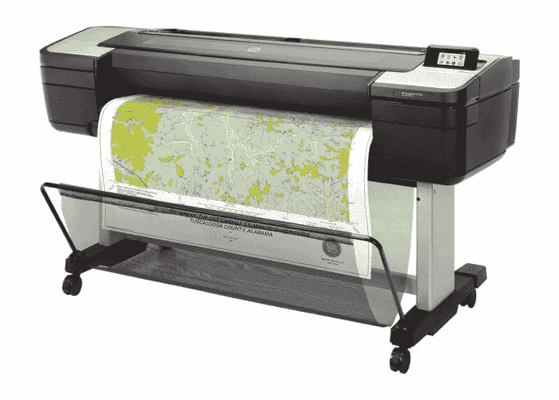
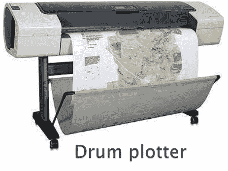
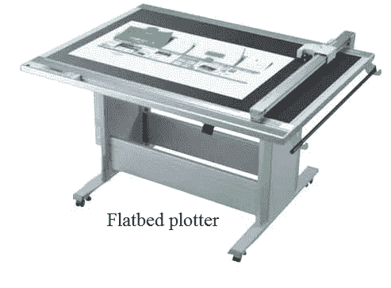
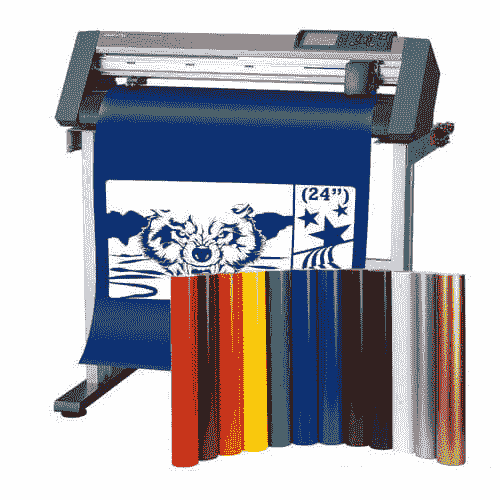
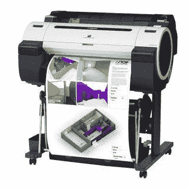
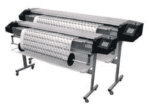
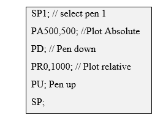
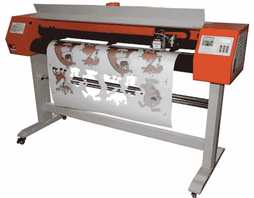

# 什么是绘图仪？

> 原文：<https://www.javatpoint.com/what-is-a-plotter>

绘图仪是一种打印矢量图形的打印机。它是一个计算机设备，可以将计算机命令转换成纸质线条画。它用一只或多只自动笔画线。与传统的打印机不同，绘图仪使用钢笔、记号笔、铅笔或其他书写工具来绘制多个而不是碳粉。它也可以使用矢量图形文件或命令来绘制连续的点到点的线。虽然它以前广泛用于计算机辅助设计，但现在仅用于打印原理图和其他类似应用的硬拷贝。

在工程项目中，绘图仪被广泛使用。因为它们有能力画出连续的线条，而普通的打印机使用密集的点来按常规画出线条。绘图仪以不同的形式设计，他们使用不同的工具在纸上画线。例如，三维绘图仪(切割绘图仪)使用刀具根据计算机的给定输入来设计任何类型的图表或切割一块材料。另一方面，大多数绘图员用笔在纸上画线。

要切割的对象位于绘图仪前面的平面上。计算机将切割设计和尺寸传送给绘图仪，以产生精确的雕刻设计。然后，在数百个对象上重复切割过程，以产生相同设计的相同副本。

### 绘图仪的应用

*   绘制图表
*   计算机辅助设计
*   建筑设计图
*   纺织品印花
*   横幅和广告牌
*   电路布局
*   地理布局
*   建筑平面图
*   艺术线条

### 绘图仪是如何工作的？

绘图仪与计算机上的成像软件协同工作，以创建完成的图像或对象。在使用绘图仪时，第一步是输入合适的坐标在纸上显示图片。使用成像软件绘制线条和图像是使用现代软件实现这一目标的简单方法。当图像的示意图完成后，计算机将坐标发送到绘图仪。然后，计算机对代码进行解码，并计算出使用纸笔的最佳方式。

HPGL2 和 DMPL 是后来分别由惠普和休斯顿仪器公司的绘图仪使用的两种编程语言。最初，绘图仪有两个独立的笔，一个水平移动，一个垂直移动。这些绘图仪在图像复杂性方面受到限制，因为它们的输出速度很慢。现代绘图仪使用一个滑动滚轮，使纸张靠着固定的笔移动。绘图仪笔通常是空心纤维杆，有一个锋利的末端。直到绘图完成，墨水供应通过杆中心的尖锐尖端流动和分配；纸靠着笔垂直和水平移动。

### 绘图仪的类型

绘图仪有多种类型，如下所示:

### 鼓式绘图仪

在缠绕在鼓上的纸上绘图的不同种类的打印机设计被称为“鼓打印机”情节是由鼓在一个方向上产生的，而另一个是由笔在相反的方向上移动产生的。因为它包括刻在物理鼓上的印刷字符和以某种方式影响的纸张，所以打印机的前一个版本今天被称为鼓绘图仪。据《编年史》网站报道，滚筒绘图仪利用滚筒左右移动纸张，同时一只或多只笔上下书写。使用多支笔增强了绘图仪绘制多种颜色的能力。

### 平板绘图仪

平板绘图仪使用放置在平面上固定位置的纸张。在这个绘图仪中，书写笔在 x 轴和 y 轴上移动。平板绘图仪笔有多种尺寸和颜色。与鼓式绘图仪不同，它的工作原理是在纸上移动笔，而不是在手臂下移动纸。纸张的尺寸由放置纸张的平面尺寸决定。较大的平板绘图仪能够在纸上打印长达 60 英寸的内容。

除了在纸上打印，一些平板绘图仪还可以在其他材料上打印，如塑料、纸板甚至金属。平板绘图仪可以一次又一次地精确复制，而不会牺牲打印图形的质量。然而，它们购买起来可能相当昂贵，而且体积相当大。

一个早期的平板绘图仪，CalComp 模型 738，就是一个例子。它有一张大床，可以在上面进行大的设计，它在 20 世纪 70 年代被使用。这个绘图仪也使用磁带输入数据，因为它是一个离线平板绘图仪。

### 切割绘图仪

切割绘图仪是一种大型切割机，使用刀片而不是笔来切割设计。它创造了聚酯薄膜或乙烯基字母和图形，这是预切割。绘图仪的平面用于放置待切割的纸张。绘图仪从计算机接收命令，刀具执行该命令将介质切割成合适的尺寸。

### 喷墨绘图仪

顾名思义，喷墨绘图仪将微小的墨滴喷射到纸上，形成图像、文本或图案。喷墨绘图仪是平面设计师和广告公司的热门选择；它们通常用于大型打印机，如广告牌、横幅和用于路边指示的大标志。热敏和压电都是喷墨绘图仪使用的技术。在热喷墨绘图仪中，墨滴是通过加热来施加的，而在压电绘图仪中则使用带电晶体。平均而言，喷墨打印机比其他绘图仪生成的图形质量更高。

### 静电绘图仪

在静电绘图仪中，图像是通过使用光栅图形而不是矢量图形在纸上产生的。通过使用墨粉墨水，在纸上产生点阵像素。绘图仪在纸上产生高压电荷，这些电荷撞击墨粉墨水，用于绘制计算机辅助设计。静电绘图仪速度更快，价格更便宜，但质量比笔式绘图仪低。

### 绘图仪历史

第一台绘图仪是雷明顿-兰德公司在 1953 年发明的。它与 UNIVAC 计算机结合使用来绘制技术图纸。

已经开发了许多打印机控制语言来运行笔式绘图仪。此外，传输的命令，如将笔放在纸上，将笔从纸上提起，或从这里到这里画线。惠普的惠普-GL、惠普-GL/2 和休斯顿仪器 DMPL 是常见的基于 ASCII 的绘图仪控制语言。下面给出了一个惠普-GL 脚本来画线:

在 20 世纪 60 年代末和 70 年代 T2，泰克公司和惠普公司生产了小型台式平板绘图仪。这些笔排列在一个移动的横条上，y 轴反映横条的长度，x 轴代表横条在绘图台上的移动。这些绘图仪操作迟缓，因为杆太重了。

20 世纪 80 年代，紧凑轻便的惠普 7470 引入了“磨砂轮”机制，与 20 年前的 Calcomp 绘图仪不同，它取消了边缘穿孔的要求。磨砂轮在相对的边缘压在纸张耐用的聚氨酯涂层滚筒上，形成微小的压痕。因为砂粒落入先前的凹痕，砂轮在纸张被前后推动时保持纸张对齐。当笔被安装在一个托架上时，它在砂轮之间以一条直线来回移动，以表示正交轴。

惠普 2647 是当前 Powerpoint 图表的前身，它使用绘图仪在透明度上绘制巨大的字母，惠普的多平台开发了单一类别“文字图表”随着高分辨率喷墨打印机和激光打印机的广泛使用，笔式绘图仪、廉价的内存和足以光栅化彩色图像的计算机都已经不复存在。然而，基于喷墨的大尺寸工程绘图仪仍然具有砂轮机构。此外，在超市的贺卡区，绘图仪也用于使用惠普 7475 六笔绘图仪的创建卡片亭。

绘图仪主要用于计算机辅助设计和技术绘图应用，因为它们可以处理非常大的纸张尺寸，包括高分辨率。它也存在于许多服装店和招牌店，因为它的另一个用途是用刀具代替钢笔。

绘图仪包括改变线条的颜色或宽度来改变笔。在微型绘图仪上，这是手工完成的。此外，有些绘图仪可以自动完成，因为它们自动组织了一个有四支或更多笔的杂志。笔绘图仪的速度可以用加速度和笔速来衡量，而不是页面打印速度。因为使用的笔的类型限制了笔式绘图仪的速度，所以使用的笔是最重要的组件。尽管大多数现代笔绘图仪都有回转速度控制指令，但这些命令会因所用笔的类型而异。

笔式绘图仪有很多种，但有些已经不再大规模生产了。经常使用技术笔尖；它们中的许多可以在手工绘图笔的用品和零件的帮助下更新。早期的砂轮和惠普平板绘图仪使用小型塑料笔尖一次性或专有的纤维尖端笔。

绘图仪笔使用一根纤维素纤维棒，将其放入浸有墨水的泡沫管中，通过该泡沫管，该棒的末端被削尖成锥形尖端。当钢笔在纸上移动时，毛细作用将墨水从泡沫中吸出，顺着杆流下。随着泡沫中墨水供应的减少，墨水向尖端的迁移减慢。随着制图速度的减慢，一只破旧的笔被用来画线，以保持黑暗。但在泡沫完全耗尽之前，褪色将持续下去。

此外，随着纤维尖端笔的使用，尖端在灌注介质上逐渐磨损，导致更宽的涂抹线。它们通常更贵，也不常见，不会像纤维笔那样褪色或磨损。此外，标准圆珠笔可以转换为大多数绘图仪的功能。

### 绘图仪的优点

*   绘图仪可以在很大的纸上工作，同时保持良好的分辨率..
*   除了在纸上打印，它们还可以在各种平面材料上打印，如塑料、纸板、铝、胶合板和钢板。
*   此外，在没有任何图像退化的情况下，绘图仪可以绘制成千上万次相同的图案。

### 绘图仪的缺点

*   与传统的打印机相比，绘图仪的尺寸非常大。
*   此外，与普通打印机相比，它们的成本要高得多。

### 乙烯切割机

乙烯基切割机是一种将乙烯基切割成各种形式的机器，用于 t 恤标志、海报、标志、广告牌和其他材料。这是一个可以通过电缆插入电脑的小设备。它和电脑打印机差不多大。这台机器主要由计算机控制，这保证了乙烯基机的锋利刀片能够适当移动。

锋利刀片的功能是从胶粘的乙烯基材料上切割字母或几个形状。当用乙烯机器切割这些字母或形状时，它们可以粘在你喜欢的任何表面上。像乙烯基切割机的运动是由计算机控制的，所以当乙烯基切割机切割任何你选择的设计时，它的刀片可以从材料的 X 轴移动到 Y 轴。如果你想创建一个特定的形状或符号，你可以粘贴到任何地方，乙烯基切割机是最好的机器来完成这些类型的任务。

* * *