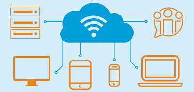
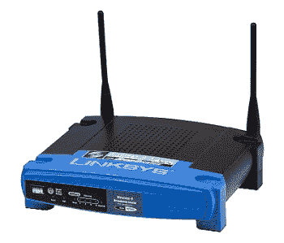
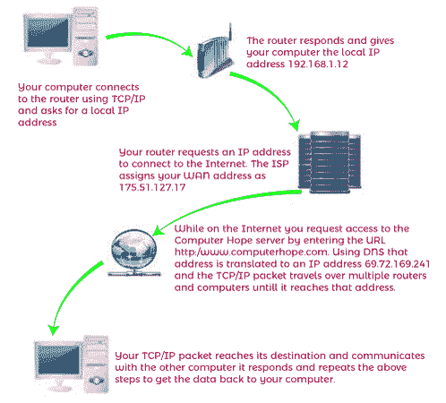

# 电脑如何通过互联网连接？

> 原文：<https://www.javatpoint.com/how-do-computers-connect-over-the-internet>

计算机使用传输控制协议(传输控制协议/互联网协议)来通过互联网相互连接和交互。把 TCP/IP 看作是一个规则手册，一个每台计算机用来学习如何与其他计算机连接的逐步说明手册。这套规则规定了每台计算机传输数据时必须执行的操作，以及数据传输的时间和方式。同样，它也描述了如何接收数据。，如果不遵守规则，计算机将无法连接到其他计算机或发送和接收数据。

计算机需要网络接口卡才能连接到互联网以及网络上的其他计算机。网卡位于将计算机连接到互联网和其他计算机的网络连接的一端，而电缆调制解调器、DSL 调制解调器、路由器或交换机位于另一端。

### 互联网服务提供商

这些指南适用于互联网服务提供商或提供互联网接入和连接的公司。互联网服务提供商(ISP)充当您的计算机和世界上其他连接到互联网的计算机之间的管道。互联网服务提供商使用 TCP/IP 协议来建立计算机到计算机的连接，并在它们之间发送数据。互联网服务提供商(ISP)为您的计算机或网络分配一个 IP 地址，这是一个允许您的计算机或网络通过互联网进行交互的唯一地址。

### 家庭网络

如果你有一个家庭计算机网络，TCP/IP 将被用于个人电脑之间的通信。TCP/IP 协议允许网络上的所有计算机通过网络“查看”并与其他计算机共享文件和打印机。当计算机加入同一个网络时，它们形成局域网或局域网。当许多网络连接在一起时，就形成了广域网。

互联网连接的 IP 地址会传输到您的路由器，然后路由器会将本地 IP 地址分配给网络中的所有设备。一个流行的本地地址是 192.168.1.2-255。当您访问网络上的本地机器时，路由器会在本地 IP 地址之间传输您的 TCP/IP 数据包。另一方面，当您连接到互联网时，您的路由器会利用 ISP 分配给您的 IP 地址。因为分配您的 IP 地址的是您的 ISP，而不是您的路由器，所以它不是 192.168.x.x 地址。

当从像 Javatpoint 这样的网页获取信息时，您可以输入一个易于理解和记住的网址。在您的计算机可以访问包含页面的计算机之前，必须将该网址转换为一个 IP 地址，这是在使用域名系统的帮助下完成的。一旦域名系统将网址转换成一个 IP 地址，互联网上的路由器就会知道如何路由你的 TCP/IP 数据包。

如前所述，下图描述了您的计算机如何与互联网上的其他计算机连接。

Linux、Windows 和 macOS 计算机利用 TCP/IP 协议连接到局域网或广域网上的其他计算机。要连接到局域网或广域网，您需要电缆或无线连接。网线通常用于有线连接(5 类或 6 类网线)。802.11n、802.11g 或 802.11b 无线网卡用于无线连接(Wi-Fi)。使用这两种连接类型连接到其他计算机时，网络路由器通常是必需的。根据您选择的互联网服务提供商，当您想在家连接到互联网时，您将需要电缆调制解调器或 DSL 调制解调器。

* * *