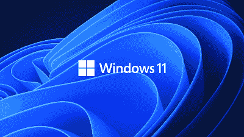
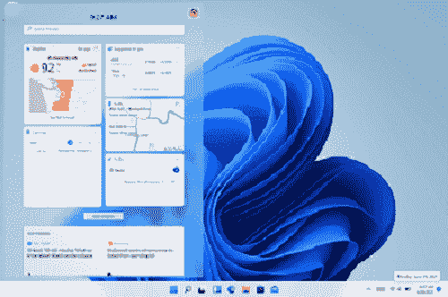
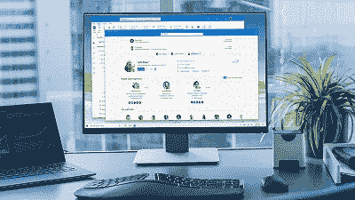
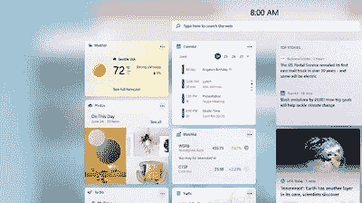
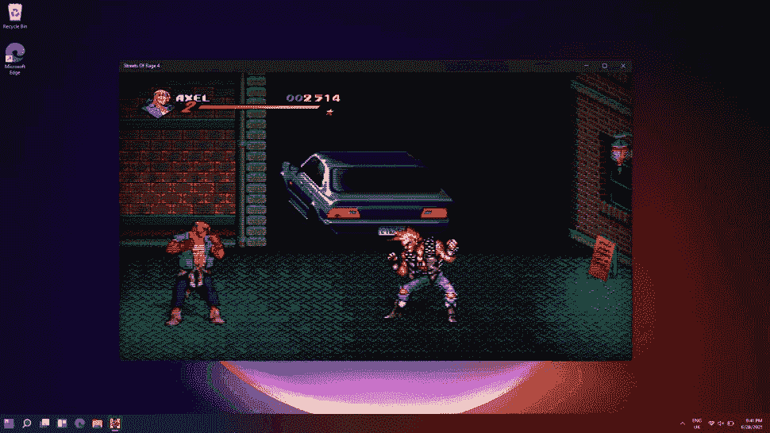
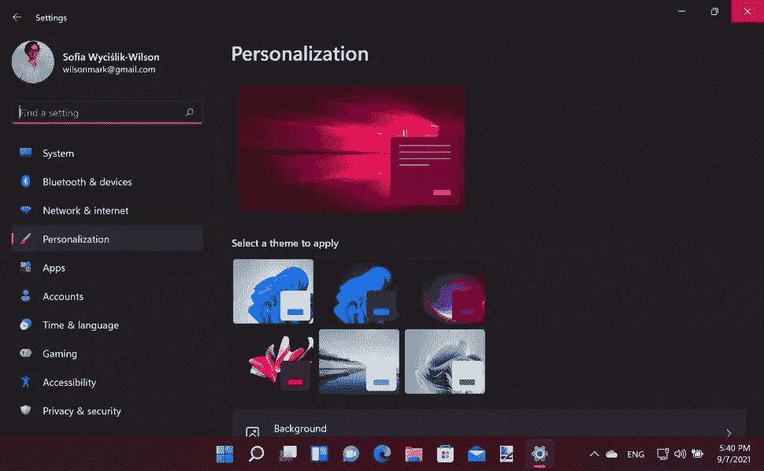

# 什么是 Windows 11？

> 原文：<https://www.javatpoint.com/what-is-windows-11>

微软 Windows 11 现已作为 Windows 10 用户免费升级版推出，于 2021 年 6 月 24 日正式公布，并于 2021 年 10 月 5 日发布。它是微软视窗操作系统的最新版本，并继承了视窗 10。此页面包含有关新操作系统 Windows 11 的所有信息。除此之外，这款新的操作系统具有更具吸引力的现代风格、更高的安全性以及搜索和下载应用程序的新方法。此外，操作系统有一个全新的、精简的、现代的界面，旨在提高生产力和创造力。

### Windows 11 系统要求

设备是否与 Windows 11 兼容的话题引起了很多讨论。其他人只是想知道他们是否需要很快更换他们的电脑或笔记本电脑，而不管是否需要全员生产性维护。

以下是微软宣布的更新要求:

*   **处理器:**合适的 64 位 CPU 或 SoC，至少有两个内核，时钟速度为 1 GHz 或更快
*   **内存:**需要 4GB 内存
*   **存储:** 64GB
*   **显卡:**含 WDDM 2.0 驱动的 DirectX 12 或更高版本
*   **系统固件:** UEFI，支持安全引导
*   **显示:** 720p，每个颜色通道 8 位，对角线至少 9 英寸
*   **TPM:** 需要可信平台模块 2.0
*   **互联网连接和微软帐户:**要在 S 模式下将设备从 Windows 11 Home 中切换出来或完成 Windows 11 Home 的初始首次使用设置，需要一个活动的互联网连接和一个微软帐户。

**提示**使用 WhyNotWin11 程序([https://github.com/rcmaehl/WhyNotWin11](https://github.com/rcmaehl/WhyNotWin11))查看你的电脑是否与 Windows 11 兼容。这个软件可以帮助你弄清楚为什么如果你的电脑不兼容 Windows 11 操作系统。

#### 注意:Windows 11 只支持搭载 X86-64 或 ARM64 处理器的 64 位系统；不再支持 32 位 CPU。此外，在不改变安装的情况下，Windows 11 需要一台带有安全引导和 TPM 2.0 的 UEFI 机器，并且不再支持传统的 BIOS。

### Windows 11 有哪些新功能？

在视窗 11 中，开始按钮被重新设计，利用微软 365 和云来显示最近的文件，而不管它们以前是在什么平台或设备上访问的，比如安卓或 iOS 智能手机。

将快照组、快照布局和桌面添加到微软视窗 11 将是一组新的功能。根据微软的新闻稿，这些“提供了一种强大的多任务处理方法，并保持在你需要完成的事情之上。”有了这些 Windows 11 功能，用户可以管理窗口并优化屏幕空间，以获得更整洁的外观。用户可以为他们生活的不同方面构建和修改不同的桌面，例如一个用于工作，另一个用于个人使用。

微软 Teams Chat 已被整合到 Windows 11 的任务栏中，为用户提供了通过音频、视频、文本、聊天与个人联系人即时交流的能力，无论他们使用的是哪个平台或设备:Android、微软 Windows 还是 iOS。在新操作系统上使用微软团队。用户现在可以静音和取消静音他们的计算机，或者直接从任务栏开始演示。

据微软称，Windows 11 附带了一项新功能，有可能释放系统硬件的全部功能。此外，它可以让一些最前沿的游戏技术以及 DirectX 12 Ultimate 为您服务，使您能够以高帧率获得身临其境的视觉效果。另一个特性是 DirectStorage，它可以加快加载速度，让游戏世界变得更加复杂。微软视窗 11 将继续使用用户最喜欢的电脑游戏附件和外设。

在 Windows 11 中，小部件是由微软 Edge 和 AI 驱动的个性化提要..Windows 11 用户现在可以打开桌面接收类似的定制体验，而不是在手机上查看新闻、天气或通知。Windows 11 中的小部件为艺术家和出版商提供了新的方式来提供定制的内容。

微软商店正在接受翻新，用户将能够从一个安全的位置观看、创建、播放、工作和了解应用程序和内容。根据微软的说法，新的视窗 11 已经“为了速度和全新的外观而重新构建，更加吸引人和易于使用”。我们将利用精心策划的故事和收藏，让所有内容——应用程序、游戏、节目和电影——更容易找到和发现，并为您提供比以往更多的应用程序。Adobe Creative Cloud、Visual Studio、Disney+、Microsoft Teams、Canva 和 Zoom 以及其他受欢迎的第一和第三方产品将很快在 Microsoft Store 中推出。

Windows 11 的 Android 应用程序将于 2021 年末在 Windows 11 上推出。得益于与亚马逊和英特尔的合作，微软商店将首次允许用户搜索可以通过亚马逊应用商店下载的安卓应用。不管使用什么样的应用框架，微软正在让开发者和独立软件供应商更容易在微软商店发布应用。

### Windows 11 要多少钱？

*   新硬件定价取决于制造商
*   合格电脑免费

当然，这是最紧迫的问题之一，但是如果您的系统符合要求，您可以免费获得它。但是，硬件要求已经被微软修改；因此，这并不像将所有 Windows 10 设备升级到 Windows 11 那么容易。

自然，从 Windows 10 升级到 Windows 11 并不是获得它的唯一途径。新的笔记本电脑和个人电脑将预装操作系统，无需单独购买许可证。虽然无法预测每家公司的硬件成本，但预计它可以与 Windows 10 设备相媲美:

*   Windows 10 家庭版- 119.99/$139
*   Windows 10 Pro - 219.99/$199.99

### Windows 11 是什么样的？

微软保留了相同的基本界面，但进行了相当大的改革，以避免通过进行彻底的改变(就像它对 Windows 8 所做的那样)而惹恼数百万人。无论你看哪里都有圆角，还有一个新的位于中央的开始菜单，如果你想的话，你可以把它移到一边。

一个新的小部件面板，据称取代了以前的开始菜单的实时切片，可以显示新闻、天气、股票和其他信息，以及增强的分组和活动窗口的捕捉，这样你就可以专注于你正在做的事情。

一个新的屏幕键盘和包含的手势非常接近你手机上的键盘，极大地增强了平板电脑上的 Windows 11。虽然这在发布时不可用，但您也可以利用亚马逊应用商店下载和运行安卓应用。

尽管有许多表面上的改变，大多数人应该会发现 Windows 11 是 Windows 10 的简单升级。

### 如何获得 Windows 11？

Windows 11 预装在操作系统发布后购买的新计算机上。Amazon.com 和百思买等在线零售商也销售 Windows 11 操作系统。

通过微软的网站，如果你有 Windows 10，你可以免费升级到 Windows 11。从 2021 年秋季开始，一直持续到 2022 年初，当 Windows 11 准备好下载和安装时，用户将收到警报。为了保持设备兼容性，微软建议客户等到收到升级通知后再升级。

如果您希望在收到升级通知之前将系统升级到 Windows 11，请单击下面的链接获取升级包。

[https://www.microsoft.com/en-us/software-download/windows11](https://www.microsoft.com/en-us/software-download/windows11)

### 即将推出的 Windows 11 功能

尽管 Windows 11 正在向年度功能更新过渡，但各种新功能预计要到 2022 年 10 月以后才会推出。最有据可查的功能是第三方应用商店和安卓应用支持；对于它们，我们可能要等到明年年初，但它们目前对 Windows Insider 计划成员是可访问的。

根据视窗最新版本，一个新的任务栏功能也是如此。尽管褒贬不一，微软团队的集成也将很快在边缘浏览器中实现。单个选项卡，以及图形处理器和防撞板信息，现在将显示在任务管理器中。主题名称、站点和图标也将出现在任务栏选项卡上，尽管在私人浏览会话期间，主题名称、站点和图标将被替换为通用图标。

当我们讨论任务管理器时，生态模式即将到来。根据同一份报告，通过将其他应用程序的优先级设置为“低”，这将被用来为一些应用程序提供更多资源。这将在 2022 年初左右准备就绪，它将防止资源密集型程序使用过多的 CPU 或 GPU 资源。

除此之外，备受期待的动态刷新率功能似乎即将推出。根据视窗中心的说法，英特尔最新的通用驱动程序现在包含一个设置，允许显示器根据您正在做的事情在 60Hz 和 120Hz 之间自动切换。当不需要高刷新率时，这有助于保持电池寿命。Surface Pro 8 和 Surface 笔记本电脑工作室都有 120 赫兹的显示屏，将是受益的设备之一。

### 如何下载 Windows 11 ISO 进行全新安装

如果您打算从头开始安装 Windows 11，而不是从 Windows 10 升级，则需要下载 Windows 11 ISO 文件。

如果您已经备份了文件，您将必须重新安装所有应用程序并恢复文件。如果安装干净的 Windows 11，安装时间可能会多一点，但是通过干净的 ISO 文件安装 Windows 11 有几个好处。

首先，你会有一台速度更快的电脑，如果你遇到问题，全新安装的视窗 10 可能会有所帮助。一个干净的安装将会清除所有不需要的应用程序和数据，这些应用程序和数据都是在你的计算机很难发现的时候收集的。

### 应该升级到 Windows 11 吗？

既然 Windows 11 可以免费升级，许多人将会迫不及待地下载并试用它。

在我们看来，许多消费者将从延迟升级到 Windows 11 中受益。这是因为它还处于游戏的早期阶段，有许多问题必须首先解决。一些用户抱怨说，Windows 11 正在成为降低他们互联网连接速度的原因。

微软知道这些问题的大部分，并且正在努力解决它们。将 Windows 11 的安装推迟一段时间将使微软能够提供更新来解决这些问题。当你最终在几周或几个月后安装 Windows 11 时，你会看到一切都运行得更加顺利。Windows 11 家庭版与 Windows 11 专业版

您可能需要根据您已经使用计算机的方式，确定是更新到常规的 Windows 11 家庭版还是更新到微软公司版操作系统 Windows 11 Pro。无论您选择哪个版本，两者都有相同的最低系统要求；因此，无论你选择哪一种，你都需要完全填满它们。

Windows 11 Pro 有许多优势，其中最重要的是对企业和组织的数据保护，这要归功于 Windows 信息保护(也简称 WIP)等技术。

您将在 Windows 11 家庭版和专业版之间看到的另一个区别是，首次安装时，Windows 11 家庭版需要微软帐户和互联网连接，而专业版则不需要。

### Windows 11 的新外观

流畅设计是 Windows 11 外观的新绰号。近年来，随着窗口变圆和像 Snipping Tool 这样的程序获得了相当多的更新，一切似乎都变得越来越新。

“开始”菜单已被移到屏幕中央，现在是“云驱动的”，这意味着它适应一天中的时间和您正在处理的材料。

如果您正在运行内部版本，您已经可以通过向左移动图标来更改开始菜单和任务栏。

也有光明和黑暗模式，以及整个操作系统的统一设计和各种生动的壁纸可供选择。

Windows Widgets 又回到了 Windows 11，可以通过 dock 访问，微软承诺 AI 支持的动态功能可以让 Widgets 根据您正在使用的程序和一天中的时间进行更改，就像“开始”菜单一样。当您在触摸屏的桌面上向左滑动时，会出现小部件。此外，天气、必应地图、新闻和其他服务也在备选之列。

第三方将能够使用它们，因此，可能有和苹果的 iOS 和 iPadOS 一样多的替代品。

许多程序，包括照片、工具、剪切和绘画，正在为 Windows 11 重新设计，以符合流畅的设计语言。

### Windows 11 上的游戏

视窗 10 的 Xbox 软件不方便使用且笨重，将被一个新的游戏通行证工具所取代，该工具允许您购买、管理和卸载游戏，使《末日永恒》和最终的《光环无限》更容易访问。

HDR 现在可以在兼容的个人电脑上使用，无论是玩游戏还是看电影，都可以获得更多的照明和对比度。直接存储也是可用的，它允许你比以前更快地下载和安装主要的游戏资产，给你更多的时间来享受你的游戏。

### Windows 11 中改进的无线网络

高通表示，已与微软以及其他笔记本电脑制造商甚至 Valve 合作，为兼容 PC 提供采用高通 4 流 DBS 技术的 Wi-Fi 双站；因此，Windows 11 可能会带来 Wi-Fi 功能的显著提升。

由于它将同时利用许多无线频段来帮助减少延迟，因此，它似乎对游戏特别有好处；然而，我们将讨论这将如何改善 Windows 11 中的 Wi-Fi。在 Windows 11 中，这可能会改变游戏规则。

### Windows 11 有问题吗？

尽管正在通过 Windows Insider 程序进行测试，但已经出现了一些问题，因为没有一个新的操作系统从一开始就完美无缺。幸运的是，到目前为止透露的并不是主要的，有些只影响极少数人，所以不要让这阻止你在发布日获得操作系统。

根据微软的 Windows 11 状态页面，与英特尔黑仔网络驱动程序的兼容性问题导致网页和视频流缓慢。在 Reddit 上，发现了一个内存泄漏问题，至少有一些人报告说，当他们终止文件资源管理器的一个实例时，它使用的内存没有释放。

### Windows 11 触控改进

自 Windows 8 发布以来，微软展示了 Windows 11 的额外平板电脑功能，这可能是操作系统成功的关键，尤其是微软计划推出的 Surface 设备。对于其未来的平板电脑来说，拥有一个全新的编号操作系统可能是一大卖点。

微软承诺提供更大的触摸目标和更简单的移动窗口的方法，以及改进的旋转优化，比如如何重组窗口，以确保你不会看不到你正在使用的应用程序。

以前只能在 Surface 触控板上使用的手势现在也可以在触摸屏上使用，给体验带来更熟悉的感觉。使用 Windows 11 中的触觉，您将在使用手写笔绘图或绘制草图时获得更好的输入。

在 windows 11 中，触摸键盘也进行了更新，其中有一个更小的键盘可供您随时使用的拇指和表情符号使用。微软承诺听写、语音命令、“删除那个”选项和其他功能都将得到增强。

### 如何在 Windows 11 中管理通知

在你的电脑上，你几乎可能已经加载了许多应用程序，其中许多应用程序使用通知来让你随时了解情况。电子邮件应用程序可以通知您新邮件，新闻应用程序可以通知您突发新闻，聊天应用程序可以向您发送需要您关注的新邮件的通知。

幸运的是，所有这些都很容易在 Windows 11 中设置，如果您不喜欢中断，可以完全禁用它们。如果您喜欢现有的 Windows 10 体验，它在屏幕右下角显示警报，就在任务栏中时钟的上方，您不需要更改任何内容，因为这是微软最新操作系统的默认设置。

### 微软声称 Windows 11 是“个人电脑的新时代”

自 2015 年 7 月推出 Windows 10 以来，值得注意的是，Windows 11 是微软的第一次大软件升级，因此代表了公司历史上的一个分水岭时刻。根据微软视窗和设备首席产品官帕诺斯·帕奈的说法，这款新设备是“视窗历史上一个惊人的里程碑”，“个人电脑的新时代始于现代。”

在一篇企业博客文章中，Panay 表示“无论是创造、工作、玩耍、学习、连接，还是计算机系统将继续在我们的生活中发挥相关且持久的作用”，并补充道“无论是创造、工作、玩耍、学习、连接，还是计算机系统将继续在我们的生活中发挥相关且持久的作用。

无论是创作者、开发人员、学生和教育工作者、企业还是游戏玩家，在满足所有价位和所有外形规格的用户需求方面，没有其他生态系统能与 Windows 生态系统的广度和规模相提并论。

### Windows 11 发布日期

10 月 5 日，微软推出 Windows 11 免费升级，部分客户在 10 月 4 日提前一天收到。

该更新将在未来几个月内推送到符合条件的设备，并在可用时通知用户。

许多笔记本电脑和个人电脑制造商也表示，他们的许多新机型都将预装 Windows 11。微软新推出的 Surface Pro 8、Surface Go 3 和 Surface Laptop Studio 设备都属于这一类，它们都是在 Windows 11 前后发布的。

与苹果在 macOS 上的努力类似，新操作系统将获得年度升级。虽然微软提供了一个工具来评估您的台式电脑或笔记本电脑是否能够运行 Windows 11，但它被发现有缺陷，对能够毫无问题地运行更新的设备给出了误导性的结果。

### 应该安装 Windows 11 吗？

俗话说，好事总会降临到等待的人身上。我们建议您在安装 Windows 11 之前等待几天，如果不是几周的话；尽管如此，现在这样做可能很有诱惑力。

新的操作系统，视窗 11，包含了许多新功能，许多用户将热切地探索。

然而，正如我们已经注意到的，每个主要的操作系统版本都有它自己的一系列挑战，所以拥有最丰富的经验可能需要寻求其他人的帮助来进行早期测试。微软将努力工作，以便在开发过程中识别和解决问题，这就是为什么等待几天或几周是一个明智的想法。

如果您将其安装在您经常使用的系统上，例如用于工作或学校，则此操作系统在这种情况下尤其重要。如果它在 Windows 10 上运行正常，最好暂时推迟。否则，你可能会被一台不能正常工作的电脑卡住，因为你可能会发现 Windows 11 把一些事情搞砸了。

* * *