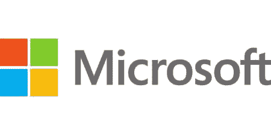

# 微软视窗历史

> 原文：<https://www.javatpoint.com/microsoft-windows-history>

1983 年 11 月 10 日，在纽约市的广场酒店发生了一件虽小但意义重大的事情:微软公司，一家稍有名气的公司，正式宣布为其自己的操作系统(MS-DOS)提供图形用户界面(GUI)，该操作系统自 1981 年以来一直为 IBM PC 和兼容计算机发货。

在 1985 年首次亮相之前，营销专家说服比尔·盖茨，Windows 是新产品更容易接受的名字，它以前的名字是“界面管理器”。

从 1981 年开始，当微软操作系统成为随 IBM 电脑一起上市的计算机系统中非常流行的操作系统时，IBM 一直是微软的主要合作伙伴。因此，1983 年 11 月，微软创始人比尔·盖茨决定为 IBM 管理层演示一个测试版的 Windows。

然而，他们的回答是否定的，因为国际商用机器公司开发了他们自己的操作系统——Top View。

Top View 是一个基于 DOS 的多任务程序管理器，没有图形用户界面，于 1985 年 2 月由 IBM 推出。根据国际商用机器公司的说法，未来版本的俯视图将包括操作系统的图形用户界面。由于承诺从未兑现，这项努力仅过了两年就停止了。

当看到苹果的 Lisa 电脑和后来更成功的 Macintosh 电脑时，比尔·盖茨似乎已经明白了一个好的图形用户界面对一台 IBM 机器来说有多有利可图。这两款苹果笔记本电脑的图形用户界面都非常出色。下面是一个包含微软视窗完整历史的表格。

| 年 | 事件 |
| **1983 年** | 1983 年 11 月 10 日，微软 Windows 被比尔盖茨推出。 |
| **1985** | 1985 年 11 月 20 日，微软花了两年多的时间，以当时 100 美元的价格发布了承诺的软件——微软 Windows 1.0。微软视窗 1.0 版本被认为是不稳定、原始和缓慢的。苹果威胁采取法律行动加剧了该公司糟糕的开局。苹果律师在 1985 年 9 月警告比尔·盖茨，视窗系统侵犯了苹果的版权和专利，并窃取了苹果的商业秘密。 |
| **1987** | On December 9, 1987, Microsoft released Windows 2.0, which cost $100.00 at the time. It was a greatly enhanced version of Windows that incorporated icons to represent programs and files, greater support for expanded-memory hardware, and overlapping windows to make Windows-on the basis of computers resemble Macintosh computers.同样，1987 年 12 月 9 日，微软视窗/386，有时被称为视窗 386，以 100 美元的价格推出。 |
| **1988** | 1988 年 6 月，微软推出 Windows/286(简称 Windows 286)，当时售价 100.00 美元。 |
| **1990** | 1990 年 5 月 22 日，微软推出了 Windows 3.0。微软视窗 3.0 完整版售价 149.95 美元，升级版售价 79.95 美元。更好的程序管理器和图标系统、重新设计的文件管理器、十六色支持、改进的性能和稳定性，以及最关键的是，广泛的第三方兼容性都包含在 Windows 3.0 中。终端客户有购买 Windows 3.0 的动机，因为程序员开始生产与 Windows 兼容的软件。第一年，卖了三百万本，Windows 终于成熟了。 |
| **1991** | Following its choice not to cooperate on operating systems with IBM, Microsoft renamed its version of OS/2, which was formerly known as NT OS/2 3.0, to Windows NT. David Cutler created Window NT, which was based on a different architecture as compared to IBM's OS/2 operating system.1991 年 10 月，微软推出了带有多媒体的 Windows 3.0 或 Windows 3.0a。 |
| **1992** | 1992 年 4 月发布的 Windows 3.1 一炮而红，头两个月就卖出了近 300 万份。它带来了新的功能，如程序重启、对象链接和嵌入(OLE)、TrueType 可扩展字体兼容性以及多媒体支持等。在 1997 年 Windows 95 取代之前，Windows 3.x 是个人电脑上最受欢迎的操作系统。 |
| **1993** | 微软一系列操作系统的初始版本。微软于 1993 年 7 月 27 日发布了 Windows NT 3.1(选择版本号是为了匹配当时微软最流行的操作系统 Windows 31 的版本号)，原因是用户界面的视觉设计类似。1993 年 12 月 31 日，微软发布了 Windows 3.11，这是对 Windows 3.1 的更新，并且进行了从 16 位到 32 位寻址的页面级转换。同年，1993 年，超过 2500 万微软视窗系统的授权用户在那里。 |
| **1994** | 1994 年 2 月，微软推出了面向工作组的 Windows 3.11。1994 年 9 月 21 日，微软推出了 Windows NT 3.5。还有，1995 年 5 月 30 日，微软推出了 Windows NT 3.51。 |
| **1995** | 微软 Windows 95 是在 1995 年 8 月 24 日推出的，它引发了如此大的购买狂潮，甚至那些没有电脑的人也购买了副本。四天之内，它就卖出了 100 多万册。操作系统视窗 95(代号芝加哥)被认为是一个用户友好的系统。它具有许多功能，如扩展的文件名支持、内置的 TCP/IP 堆栈和拨号网络。微软于 1996 年 2 月 14 日推出了 Windows 95 Service Pack 1(4 . 00 . 950 a)。 |
| **1996** | 1996 年 7 月 29 日，微软推出了 Windows NT 4.0。1996 年 8 月 24 日，微软推出了 Windows 95 (4.00.950B)，被称为具有 FAT32 和 MMX 功能的 OSR2。还有，1996 年 11 月，微软推出了 Windows CE 1.0。 |
| **1997** | 1997 年 11 月，微软推出 Windows CE 2.0。1997 年 11 月 26 日，推出了微软视窗 95 (4.00.950C)或 OSR2.5。 |
| **1998** | In June of 1998, Microsoft released an operating system named Windows 98, which was the last Windows version to use the MS-DOS kernel. Microsoft's Internet browser "Internet Explorer 4" was incorporated into Windows 98, which enabled new input methods such as USB. The next version, Windows CE 2.1 was introduced by Microsoft.微软在 1998 年 10 月宣布，Windows NT 的未来版本将不再被称为 Windows NT，而是被称为 Windows 2000。 |
| **1999** | 1999 年 5 月 5 日，微软推出 Windows 98 SE(第二版)。同年，1999 年，微软也推出了 Windows CE 3.0。 |
| **2000** | 比尔·盖茨在 2000 年 1 月 4 日的消费电子展上表示，最新版本的视窗操作系统将被称为掌上电脑。2000 年 2 月 17 日，微软发布了基于微软 NT 技术的 Windows 2000。从 Windows 2000 开始，微软通过互联网提供自动软件升级。同年，2000 年，微软在 6 月 19 日发布了 Windows ME(千禧版)。 |
| **2001** | 2001 年 10 月 25 日，微软发布了 Windows XP，提高了多媒体能力和性能。微软表示，Windows XP 中的 XP 代表“体验”，强调“Windows 可以为个人电脑用户提供的新体验”。“日期是 2003 年 3 月 28 日，微软为安腾电脑推出了 Windows XP 64 位版本。 |
| **2003** | 微软于 2003 年 3 月 28 日推出了 Windows Server 2003。微软于 2003 年 3 月 28 日发布了面向安腾 2 计算机的 Windows XP 64 位版本。(2003 年版)。微软也在 2003 年同一年推出了 Windows XP Media Center Edition 2003。 |
| **2004** | 微软于 2004 年 10 月 12 日发布了 Windows XP 媒体中心 2005 版 |
| **2005** | 2005 年 4 月 24 日，微软推出 Windows XP 专业版 x64。2005 年 7 月 23 日，微软透露，Windows Vista 将是他们下一个操作系统的名字，代号为“Longhorn” |
| **2006** | 对于公司来说，2006 年 11 月 30 日，微软发布了微软 Windows Vista。 |
| **2007** | 微软的下一个桌面操作系统是在其前身推出五年多之后推出的，这标志着 Windows 桌面操作系统版本之间的时间最长。2007 年 1 月，微软发布了 Windows Vista(代号“Longhorn”)。许多新功能和增强功能包括更新后的图形用户界面和视觉风格(称为 Aero)、重写后的搜索功能、多媒体工具(如 Windows DVD Maker)以及全面改造后的网络、音频、打印和显示子系统。2007 年 1 月 30 日，微软也向大众市场发布了微软 Office 2007。 |
| **2007** | 2007 年，Vista 试图利用点对点技术改善家庭网络中工作站之间的通信，从而使计算机和设备之间的文件和视频共享更加容易。The.NET 框架 3.0 包含在 Windows Vista 中，它允许软件开发人员构建程序，而不必使用标准的 Windows APIs。 |
| **2008** | 2008 年 2 月 27 日，微软向普通市场推出了微软视窗服务器 2008。 |
| **2009** | 微软在 2009 年 10 月 22 日推出了 Windows 7。Windows 7 似乎是市场上最畅销的微软操作系统。前 9 个月，它的 1500 万册销量。与其前身有大量新功能不同，Windows 7 旨在成为 Windows 系列更有针对性的增量升级，目标是与使用 Windows Vista 的程序和设备兼容。
一个名为家庭组的家庭网络系统，一个重建的 Windows Shell，带有一个被称为超级工具栏的新任务栏，多点触控支持和速度增强都是其中的一部分。 |
| **2009** | 此外，视窗 7 不再包括某些基本的微软视窗工具，包括视窗照片库、视窗邮件、视窗电影制作机和视窗日历。相反，它们可以作为 Windows Live Essentials 捆绑包的一部分单独免费下载。 |
| **2012** | 2012 年 9 月 4 日，微软推出 Windows Server 2012。2012 年 10 月 26 日，微软推出了他们最新的桌面操作系统 Windows 8。这是第一个在平板电脑和智能手机上可用的微软操作系统。
桌面发生了重大变化，现在被退居幕后，转而支持新的“现代 UI”(用户界面)。因为这个界面是用来和触摸屏以及鼠标和键盘一起使用的，所以它不再有开始按钮，强制为它创建程序。你可以通过开发者网站或新的视窗商店下载这些程序。 |
| **2012** | 微软还夸口说，Windows 8 优雅、快速、令人愉快(有合适的硬件，启动时间明显加快，安全性提高，电池续航时间更长等等)。Windows 8 中新的“混合启动”设置是一个很好的补充，因为它有助于在关机时休眠 Windows 内核，使下一次启动更快..“任务管理器”中增加了一个新的“进程”选项卡，可以显示更多或更少的活动程序和后台进程的数据，还增加了一个不同颜色的热图来反映资源利用率的水平，以及其他功能 |
| **2013** | 2013 年 10 月 17 日，微软宣布推出 Windows 8.1。 |
| **2015** | 2015 年 7 月 29 日，微软发布了 Windows 10。 |
| **2021** | 2021 年 10 月 5 日，微软宣布推出 Windows 11。它继 Windows 10 之后成为微软 Windows 操作系统的最新版本。除此之外，这款新的操作系统具有更具吸引力的现代风格、更高的安全性以及搜索和下载应用程序的新方法。此外，操作系统有一个全新的、精简的、现代的界面，旨在提高生产力和创造力。 |

* * *