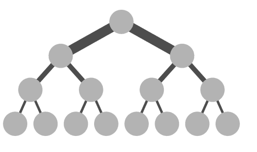
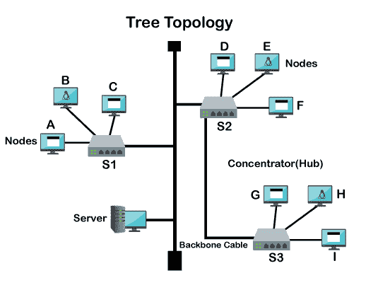

# 什么是树形拓扑？

> 原文：<https://www.javatpoint.com/what-is-tree-topology>

树形拓扑是一种结构，其中每个节点都与层次结构中的其他节点相关联。在拓扑层次结构中，至少有三个不同的层次。有时也称为层次拓扑，因为在这种拓扑中，所有元素都像树的分支一样排列。它很像星型和总线拓扑。树形拓扑通常用于在公司网络的数据库和工作站中排列数据。在树形拓扑中，任何两个链接的节点只能有一个相互连接，因此它们之间只能有一个链接。

定义树形拓扑有几种方法；这些措施如下:

*   树形拓扑通过将几个组件连接到中心节点来组合几个星形拓扑。
*   专家可能会将其定义为树形拓扑，它是总线拓扑和星型拓扑的组合，其中所有节点都在单个中心节点的帮助下连接在一起。
*   该体系结构中的每个节点都在一个层次中一对一地连接，每个相邻节点都在它的较低层次上。每个辅助节点都有一个到父节点的点对点链接，并且在其管辖范围内的所有辅助节点都有到第三节点的点对点连接。从视觉上看，这些系统类似于一个树形结构。

树形拓扑的缺点是，如果主节点损坏，整个系统可能会瘫痪，因为所有其他节点都连接到主节点。

## 计算机网络中的树形拓扑

在计算机网络中，树形拓扑有时被称为星型总线拓扑，因为它结合了星型拓扑和总线拓扑的特点来创建树状结构。在这种拓扑中，每个分支都包含星形网络，其主要结构设计为总线主干电缆的形式。因此，主总线连接到一条或多条总线和交换机，进而连接到一个或多个网络设备和网络节点。这是一种非常灵活的计算机网络方法，允许您通过简单地在树的每个分支扩展星形网络来将网络设备添加到该网络中。但是，您可能需要在某些时候添加或删除设备。

## 现实生活中的树形拓扑示例

如果您有小的子部门或部门和，这种拓扑非常有用。同样，如果你有一个多楼层的团队安置，它也可能是你的最佳选择。如果你试图利用基本的明星网络计划，你可能会遇到很多问题，因为它并不总是合理的；在某些情况下，它可能更贵。同样，您将无法获得基本的总线网络，因为它需要安装总线主干电缆。主干和次主干电缆也需要大量穿孔。然而，它相当昂贵。如果您在一个部门或子部门安装更多的网络节点，您将需要在不同的位置刺穿主干电缆，这可能会降低网络性能。

因此，您需要使用坚固的电缆来连接地板。此外，每个部门和子部门的网络节点将连接到位于两个部门内部的单个集线器。如果这样安排，会更实惠有效。与基本类型的网络拓扑相比，它更加可靠、容错和灵活。如果你使用简单的星形网络或总线网络，你会遇到很多问题。因此，使用混合方案更有利于方便自己。

## 树形拓扑的应用和用途

虽然树形拓扑没有通用的应用，但是，它的使用完全依赖于用户。你可以从中受益，也可以使用它。Zigbee 属于树形拓扑网络的应用。但事实是，Zigbee 不使用树形拓扑。然而，就网络而言，你可以在任何地方使用它。

*   当您拥有多层建筑，并希望在网络的每个部分建立集群时，您可以使用树形拓扑。
*   如果您有部门和子部门，您可以在几台交换机的帮助下隔离整个树形网络，使整个网络易于维护和管理。

## 树形拓扑的特征

*   如果您想在树形拓扑中的某个位置添加更多的计算机，您可以通过扩展连接到主主干电缆的星形网络来实现。
*   如果网络上的一台计算机出现故障，不会影响整个计算机网络的运行。因此，它更加容错和可靠。
*   由于使用了交换机或智能集线器，它的网络性能可能相当不错。
*   对于小型局域网来说，树形拓扑确实是一个不错的选择。
*   此外，它提供了更多的安全性，这也可以通过使用智能集线器来提高。

## 树形拓扑网络是如何工作的？

下图将帮助您理解树形拓扑的工作原理。

例如，如果服务器想要建立到节点 I 的连接，它将摘要或封装目的地址和数据。然后，它将在完成封装过程后将信号传输到主干电缆。封装的包将开始在总线主干网的两个分支上传递。

三拓扑网络中可以使用三种类型的集线器，即智能集线器、主动集线器和被动集线器。它们都包含自己的工作机制。我们只解释智能中枢的工作过程。让我们考虑所有的集线器都是智能的，也就是交换机。数据包将首先到达 S1 交换机，交换机将在收到数据包后检查数据包的目的地址。如果目的地址与该部分不匹配，它将自动丢弃该包。

同样，封装的数据包将到达 S2 交换机，该交换机将检查目的地址。如果它发现目的地地址不匹配，它将把包发送到交换机 S3。然后，S3 将找到连接目的地地址的链接，并将包转发到指定的目的地。

## 树形拓扑的类型

虽然树拓扑的类型并不是专门的，但是人们也应该知道这些类型。这些类型可能会对你的社交生涯有所帮助。

1.  **总线树形拓扑:**它有一根主干电缆，负责通过树形网络进行通信，您可以将电脑链接到集线器或交换机等中央设备。总线主干不是单独连接到每台计算机，而是链接到中央设备。但是，如果用户愿意，他们可以将小工具直接连接到主干电缆。
2.  **集群树拓扑:**在集群树拓扑中，节点之间的父子连接是最重要的概念。中央设备(例如集线器或交换机)只是父设备。
3.  **生成树拓扑:**它是连接图的所有节点的广泛使用的术语之一。最小生成树是另一个常用的术语，它提供了一种连接所有图边的方法。这种拓扑包含许多主干电缆，用于连接整个计算机网络中可用的几个集群。

## 树形拓扑的优点

树形拓扑有许多好处，如下所示:

*   它更具可扩展性和灵活性，因为与总线拓扑不同，它不需要刺穿主主干电缆来添加设备。即使可用空间减少，您也可以轻松地向集线器或交换机添加新设备。你可以通过星网创造更多的空间。
*   如果网络中的一个或多个节点出现故障，它们不会影响整个网络。此外，即使单个交换机或集线器受损，网络仍可继续运行。
*   树形拓扑网络易于管理和维护。
*   在这种拓扑中，节点扩展既简单又快速。
*   它包含一个检测错误的简单过程。
*   由于使用了智能集线器/交换机，树形拓扑比总线网络具有更高的性能。
*   在树形拓扑中，管理和建立很像星形网络。
*   此外，它非常适合小型组织。

## 树形拓扑的缺点

树形拓扑有一些缺点，如下所示:

### 取决于主总线电缆

树型拓扑依靠电缆向整个网络传输数据，因为信息从一个节点传递到另一个节点，从而形成薄弱区域。如果一个节点受损，将影响整个网络，网络的其他部分将无法访问。

如果事件发生在主干电缆上，则变得更加困难。此外，如果缺陷发生在树拓扑的剩余分支之前，整个系统将无法正常运行。即使问题另一端的所有设备仍然可以相互通信。

### 维护网络可能是一项挑战

当有多个节点和树时，保持网络正常运行可能很困难。一旦在树形拓扑中实现了足够的可扩展性，网络的规模可能会开始对其产生不利影响。维护一对一的节点连接、管理单个星形和调查故障会消耗更多时间。当只使用一根主干电缆来提供服务，并且使用大量外围设备和终端时，网络速度可能会受到影响。

### 树形拓扑通常必须遵循 5-4-3 规则

通常，它遵循在以太网协议的帮助下创建树形拓扑网络时出现的 5-4-3 规则。该协议要求传输的信号必须在特定时间内到达网络的每个部分。每个集中器或中继器用来分发数据的信号会增加网络的时间。这意味着在任何两个节点之间最多只能有五个网段可用，它们通过四个集中器或中继器进行连接。如果段由同轴电缆制成，则只能填充三个段。当存在光纤主干或光纤电缆或其他类型的网络拓扑时，不会出现这种缺点。

### 可扩展性取决于所用电缆的类型

在树形拓扑中，用于创建点对点连接的电缆类型和长度可能会成为网络的不利因素。如果您首先创建系统，您自然会被限制在每个段中使用电缆长度和类型。因此，与其他拓扑相比，该选项最难配置和布线。如果你想让系统具有无限的可扩展性，那么追求这种设计的成本会更高。

### 安装困难

树形拓扑的安装可能具有挑战性，因为当设计为具有线性特征时，它使用星形和总线配置原则；因此，这种选择产生了最复杂的安装过程。在决定使用何种拓扑时，成本是一个常见因素。树形拓扑的初始投资可能相当可观，因为树形拓扑的布线需求包括总线和星型拓扑需求。

### 树形拓扑的安全问题

树形拓扑的最大缺点之一是安全问题，因为在树形拓扑网络中连接的所有工作站都可以看到随网络一起发送的数据。当所有连接都启动并运行时，它们都可以相互访问，从而降低了系统的安全性。如果任何未经授权的人可以进入大楼并访问网络，他们可以在几秒钟内摧毁整个网络。

因此，它可能对任何使用树拓扑的企业或其他企业更有害。为了保护他们的信息，他们必须包括基于工作站的安全协议和其他密码保护，以防止信息访问。您还可以通过在前门应用物理安全来防止未经授权的访问。

**树型拓扑缺点的一些关键因素也在下面给出:**

*   它是总线拓扑和星型拓扑的结合。因此，成本更高，因为您需要这两种拓扑的设备来创建网络。
*   如果终结者有任何问题，它可以反射信号。因此，你需要在每一点上非常小心终结者。
*   不适合大型企业。
*   在设备之间建立网络需要大量的网线，难以管理和放置。

* * *