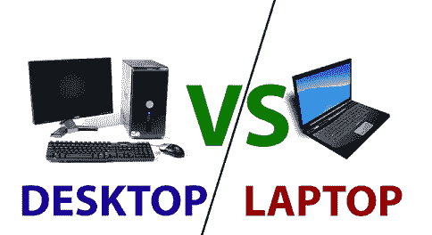

# 台式机和笔记本电脑的区别

> 原文：<https://www.javatpoint.com/desktop-vs-laptop>

### 桌面

桌面是在软件操作系统上运行的带有图形用户界面的物理计算机单元。通常，它由显示器、中央处理器、键盘和鼠标组成。主要是设计在一个地方使用。台式计算机最常见的部件是计算机终端，它由一个被称为墙壁插座的接地电源供电。它不能是便携式的，因为它需要主电源，并且有单独的连接部分来组成桌面单元；因此，它通常位于一个位置。

### 笔记本电脑

笔记本电脑，通常被称为笔记本电脑，是一种体积很小的计算机(一体机)，依靠电池或交流电源运行。一旦电池充满电，它就为笔记本电脑提供几个小时的电源。笔记本电脑在运输方面不同于台式机；它可以很容易地运输到任何地方，并且只要电池持续使用，就可以在旅行中轻松使用。它包括内置显示器(发光二极管或液晶显示屏)、触摸板(或轨迹球)和键盘，使其便于携带。它还允许用户通过提供不同的电缆连接来使用外部外设。

在购买台式机或笔记本电脑时，您需要了解台式机和笔记本电脑的功能、优点或缺点，通过它们可以确定最适合您需求的产品。下面给出了一个表格，其中包含了每种产品的优缺点，以帮助您做出购买决定。

| 主题 | 桌面 | 笔记本电脑 |
| **处理器** | 尽管台式机处理器比笔记本电脑处理器更强大，但它们的尺寸略大。通常在市场上，最新的处理器首先出现在台式计算机上。 | 尽管与台式机处理器相比，笔记本电脑处理器仍然有限，但它们非常接近台式机处理器。然而，游戏笔记本电脑可以拥有与台式电脑相同的性能。但是这些笔记本电脑非常昂贵。 |
| **成本** | 桌面有各种各样的价格，但起点相对便宜。然而，有各种各样的组件可供选择，例如台式机可以从低至 400 美元的全包价格开始，这对用户来说仍然是一个强大的系统。 | 笔记本电脑在市场上也有不同的价格，但与台式机相比，它们更受限制。如果你想买一台功能强大的笔记本电脑，包括更好的图形、更高的速度、更大的存储空间、更好的处理器、更好的显示屏等等，那么它的价格可能会高得多，根据品牌不同，最高可达 1500 美元或更多 |
| **内部存储** | 台式计算机上可能会安装几个内置驱动器。 | 只有一个内部驱动器，笔记本电脑通常包含空间。如果需要更多的内部存储空间，必须更换驱动器。 |
| **外部存储器** | 台式电脑允许用户通过其可用的数据端口(如 USB、Thunderbolt 等)连接到各种外部驱动器。 | 虽然与台式电脑相比，笔记本电脑的端口较少，但它也允许用户连接到多个外部驱动器。 |
| **便携性** | 台式机需要主电源，并连接独立的部件来组成台式机单元；因此，它很麻烦，并且不是便携性的选择，并且通常位于一个位置。它们被设计成不会被移动太多并且在一个地方使用。 | 笔记本电脑体积小，可以方便地运输到任何地方。它包括内置显示器(发光二极管或液晶显示屏)、触摸板(或轨迹球)和键盘，使其体积非常紧凑。因此，它们非常便携。它们被设计成从一个地方带到另一个地方，并用于移动。 |
| **组装方便** | 要启动一台台式电脑，需要额外的工作来连接所有设备，如显示器、中央处理器、键盘、鼠标等。此外，它可能需要一些时间，需要更多的空间来设置。虽然它只需要设置一次，并且设置一切并不难，但与笔记本电脑相比，它仍然更麻烦。 | 笔记本电脑只需要很少的时间就能开始运行，并且设计得很容易使用。他们使用电池或交流电源运行。只要电池能用，旅行时就可以轻松使用。要启动它，只需从盒子里拿出来，按下电源按钮(如果电池已充电)；几分钟内就可以使用了。 |
| **屏幕尺寸** | 桌面显示器的尺寸可能为 19 英寸或更大。因此，屏幕尺寸可能与电视一样大，桌面甚至可以连接到电视上。 | 便携性是笔记本电脑最重要的特点；就显示而言，它们还包括液晶显示器或发光二极管，但屏幕尺寸较小，通常从 10 英寸到 17 英寸不等。但是，外部显示器也可以连接到笔记本电脑，并且它能够支持任何大小的屏幕、显示器或投影仪。 |
| **键盘** | 包括数字键盘在内的全尺寸键盘可用于台式电脑。在这种情况下，没有任何限制。 | 对于笔记本电脑，较小的键盘可以在较小的笔记本电脑上找到，14 英寸和 15 英寸的屏幕没有右侧数字键盘的功能，就像全尺寸键盘一样。然而，也有配备更大键盘和数字键盘的 17 英寸笔记本电脑。但是这些笔记本电脑的重量会更重。 |
| **速度** | 在速度和性能规格方面，尽管笔记本电脑和台式机变得越来越相似。不过，在游戏和视频制作等活动中，桌面被认为更强大。 | 笔记本电脑有几个类别。与台式电脑相比，游戏笔记本电脑可以提供同样的速度和性能。但它可能比游戏桌面贵得多。如果您只需要将电脑用于基本用途，如查看照片、上网，您可以选择一台完全适合您的标准笔记本电脑。 |
| **用电量** | 与笔记本电脑相比，台式电脑耗电更多。它们需要高功率电源，因为它包含一个显示器和多个组件。如果您在台式计算机上工作，并且电源波动或熄灭，如果不保存文档，它可能会丢失。 | 与台式电脑相比，笔记本电脑耗电更少。它需要更少的电力，因为它包含小组件。就功率波动而言，它优于台式机；它们有电池，因此如果电源波动并熄灭，未保存的工作不会丢失。当电量波动或耗尽时，笔记本电脑电池会立即启动。 |
| **游戏** | 大功率显卡可以在桌面上使用，需要更好的散热，对功耗要求更高。几乎任何显卡都可以在桌面上使用，并且可以同时使用两个或多个显卡。因此，它们为游戏目的提供了更好的性能。 | 笔记本电脑的物理空间有限，这限制了图形功能。在笔记本电脑的情况下，散热受到空间的限制，与一般基于计算机辅助设计的应用程序和游戏图形相比，高端笔记本电脑可以提供更好的性能。因为它们的功率有限，所以不允许需要更多功率的显卡运行。 |
| **升级** | 桌面更容易升级，因为大多数组件都是可移动的。桌面为内部使用工具、整理电缆以及添加和移除硬件提供了更多空间。因此，台式机的外壳更大。 | 对于笔记本电脑，唯一可以升级的组件是内存和硬盘。所有其他组件都是内置的，因此无法移除。与台式电脑不同，这款笔记本电脑不是为升级组件而设计的。除了硬盘和内存，如果任何其他组件需要升级，导致需要一台新的笔记本电脑。 |
| **修复** | 作为，有各种硬件需要外部连接，以使桌面单元。独立的硬件使修理台式计算机变得更加容易，因为用户可以从任何本地计算机零售店自行购买大部分硬件。 | 有了笔记本电脑，大多数用户可能很难打开它进行维修。此外，找到一个新零件经常需要打电话给电脑制造商或从另一个网站订购。 |

最终，最终的决定取决于用户的需求。但上表代表；如果你在便携性方面没有问题，台式电脑是最好的选择。另一方面，如果你需要便携性，笔记本电脑是一个更好的选择。为用户选择计算机可能会令人困惑，因为考虑它有一些限制。但是对于大多数用户来说，它们并不太重要。

然而，如果你真的不需要便携性，想要物超所值，台式机可能是最好的选择。对于那些希望更轻松地升级的人来说，台式机是最佳选择。此外，更适合图形密集型游戏和使用计算机辅助设计应用程序。此外，只有有限用途或只需要电子邮件和互联网接入的基本计算机用户可以选择台式计算机；对于这类用户来说，它们非常好。

* * *