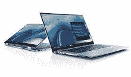

# 我可以在笔记本电脑中升级什么？

> 原文：<https://www.javatpoint.com/what-can-i-upgrade-in-a-laptop>

在升级方面，笔记本电脑不同于台式机。与台式电脑不同，笔记本电脑和其他便携式电脑很少有众多升级选项来获得更好的性能。因此，与台式电脑相比，笔记本电脑更难升级。此外，最新的笔记本电脑越来越难以升级；您仍然可以增加笔记本电脑的内存或固态硬盘。为了以后升级而购买笔记本电脑通常是一个糟糕的决定。为了避免以后的麻烦，请购买您需要的硬件。

有些笔记本电脑允许您以更简单的方式升级它们。以下是关于笔记本电脑和便携式计算机升级的常见问题集，以及每个问题的答案。购买笔记本电脑后，会进行这些增强。

### 我的笔记本电脑可以升级什么？

我可以在笔记本电脑中升级的内容取决于笔记本电脑或便携式电脑的制造商或型号。另一方面，大多数笔记本电脑和其他便携式计算机为用户提供了升级或更换系统内存、硬盘以及电池的选项。

### 我可以升级笔记本电脑中的内存吗？

在几乎每台笔记本电脑和便携式电脑中，您都可以使用随机存取存储器(随机存取存储器)更新设备的内存。这通常是通过打开笔记本电脑底部的隔间，然后安装或更换系统现有的内存来实现的。

很多时候，您必须从授权经销商或笔记本电脑制造商处购买笔记本电脑内存。另一方面，许多内存公司和制造商生产的内存与许多最新的笔记本电脑兼容。此外，如果您对如何更新内存或内存规格有任何疑问，可以联系笔记本电脑制造商。

### 我可以升级笔记本电脑中的处理器吗？

有一些笔记本电脑和便携式计算机制造商可以为他们的客户提供升级其中央处理器速度的设施。但是，当你把钱花在更快的处理器上时，系统的处理器速度几乎不会提高，所以可能不值得。通常，这种升级是由笔记本电脑或便携式计算机的授权维修店或制造商执行的，最终用户无法完成。此外，如果您想了解更多关于更新笔记本电脑或便携式计算机中的中央处理器及其成本的信息，也可以联系您的笔记本电脑制造商了解更多信息。

### 我可以升级笔记本电脑上的显卡吗？

制造商可能会在某些高性能笔记本电脑和便携式电脑型号中包含可升级的显卡或图形加速器。如果您没有这些类型的笔记本电脑或便携式计算机，您将无法升级系统上的显卡。如果您想了解有关显卡更新的更多信息，也可以联系您的笔记本电脑制造商了解更多信息。

如果您的笔记本电脑支持适当的连接，您可能会考虑使用 eGPU，而不是更换笔记本电脑显卡。

如果您的笔记本电脑支持适当的连接，您可能会考虑使用 eGPU，而不是更换笔记本电脑显卡。

### 我可以升级笔记本电脑硬盘吗？

一个硬盘可能会被许多制造商允许更换为更大的硬盘，甚至从普通硬盘升级为固态硬盘。通常有一个容器可以访问笔记本电脑上的硬盘，用户只需更换硬盘即可。或者，您也可以使用使用 USB 或 FireWire 进行通信的外部硬盘。虽然它们可能会慢一点，占用更多空间，但这些解决方案相当便宜，可能是您唯一的选择。

### 我能把笔记本电脑的液晶显示器升级到更大的尺寸吗？

我们不熟悉笔记本电脑或便携式计算机的制造商，他们允许更新机器预装的液晶屏或屏幕。因此，这不是一个可行的升级选项。但是，外部显示器、投影仪或其他大型显示器可以连接到您的笔记本电脑。

### 我可以升级调制解调器或网卡等其他外设吗？

我们不知道允许更新内部调制解调器或网卡的笔记本电脑或便携式计算机的制造商。但是，用户可以通过购买新的 ExpressCard 调制解调器或 PC 卡、网卡和各种其他外围设备并将它们连接到外部来更改笔记本电脑附带的组件。

## 升级笔记本电脑的障碍

如果您打算升级笔记本电脑，以下障碍可能会阻止您升级笔记本电脑。

*   **设计:**市面上有很多笔记本电脑就是不造不开。例如，需要一个吹风机来打开微软的 Surface Pro 2 来熔化显示屏周围的粘合剂。一旦进入，你会发现一堆密集包装在一起的组件——电池也粘在外壳上，这使得更换变得困难。另一方面，打开苹果的 MacBooks 需要一把螺丝刀(理论上使用专有螺丝)；你会发现一堆组件，电池也焊接在适当的位置。
*   **打开它:**一台笔记本电脑包含各种包装在一起的组件，打开起来很困难，即使你可以访问你的笔记本电脑，也可能不是一次愉快的体验。在修复单个组件之前，您可能需要从笔记本电脑上卸下许多其他组件才能完成任务。例如，微软 Surface Pro 2 中有近 90 颗螺钉。
*   **焊接在组件上:**组件焊接在某些设备上。例如，内存、图形处理器和中央处理器被焊接到 MacBooks 的逻辑板上。一块逻辑板，也被 PC 用户称为主板。您不能只安装其中一个组件，然后删除其中任何一个。(焊接是在高温下将熔化的金属附着在两个物体上的技术。这两个东西和金属冷却，在这种情况下，内存和主板-得到金属的帮助连接。换句话说，因为一个组件被融合到你的主板上，你不能仅仅移除它)。
*   **保修:**大多数笔记本电脑制造商认为，如果您打开笔记本电脑并更换了一些组件，将使您的保修无效。如果你的笔记本电脑很容易打开，你可能需要移除一个保修作废标签，以获得进入内部。如果您将笔记本电脑退回，制造商可能会寻找证据证明您对其进行了篡改，如果他们发现任何迹象表明可能是您导致了问题，则会取消您的保修。即使你没有打开你的笔记本电脑，如果问题不是你的错，制造商应该被要求坚持保证。但是，很多 PC 厂商都有客户服务差的名声，所以祝你好运，试着说服他们不要这样！

### 为什么要升级？

有一些迹象表明，如延迟保存、程序启动缓慢、无休止的超时和长启动时间，这意味着您的笔记本电脑已经失去了活力。随着年龄的增长，它变得越来越慢。

但是，如果只是因为你信任的旧电脑总是在慢车道上，现在还不是把你的笔记本电脑搬到电子垃圾箱的时候。在不破坏您的系统的情况下，您可以通过简单的升级来振兴它。有了正确的信息、设备和一点规划，您的旧笔记本电脑可能会像新的一样运行。

**你的笔记本电脑是不是太慢了？**

当你的笔记本电脑速度太慢时，升级笔记本电脑是必要的。如果您的笔记本电脑运行速度比平时慢，这可能是经常磨损的症状。但是，您可以做一些事情来使您的计算机像最初未装箱时一样快速运行。

首先确定你的笔记本电脑上有多少空闲空间。例如，如果您的笔记本电脑硬盘空间不足，访问程序或文件可能是一种痛苦的体验。

用于支持应用程序的内存不足也可能是原因之一。虽然增加内存不会解决所有的速度问题，但它会减轻中央处理器的一些压力，从而加快处理速度。

* * *