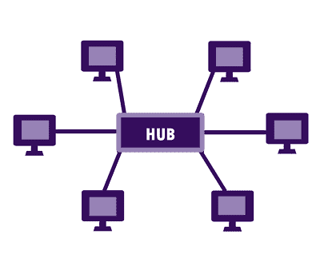
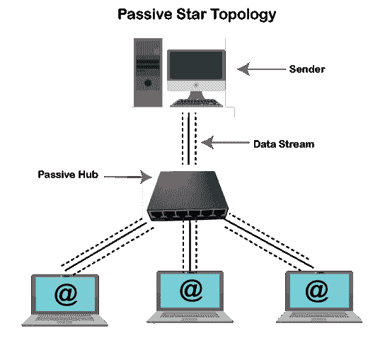
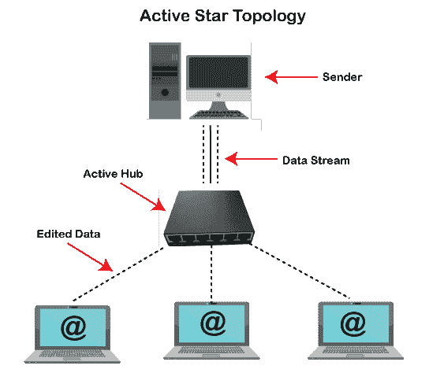
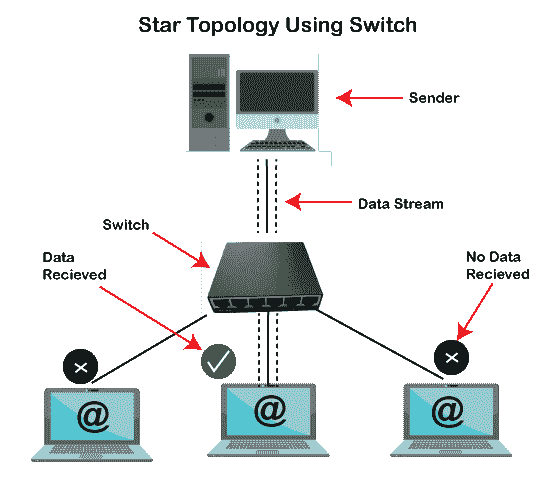

# 什么是星型拓扑？

> 原文：<https://www.javatpoint.com/what-is-star-topology>

星型拓扑，有时也称为星型网络，是一种网络拓扑，其中每个设备都连接到一个中央集线器。这是最流行的计算机网络配置之一，也是迄今为止最流行的网络拓扑。在这种网络布置中，链接到中央网络设备的所有设备都显示为星形。

与 Mesh 拓扑不同，设备不能在星型拓扑中的设备之间直接提供通信；它必须在中枢的帮助下进行通信。外围设备充当客户端，而中央网络设备充当服务器。根据每台计算机中安装的网卡类型，星形拓扑中使用 RJ-45 或同轴电缆。像总线拓扑一样，建立采用星型拓扑的计算机网络非常简单。

现实生活中也有很多星型拓扑的例子，你可以在机场、医院、银行和教育机构中看到星型网络拓扑的例子。交换机也可以代替集线器用作中央设备。配线电缆将用于将客户端、服务器和另一个网络连接到中央集线器。在星型拓扑中，所有连接的设备都完全依赖于中心设备；如果中央设备出现任何问题，整个计算机网络的通信就会失败。

上图是星型拓扑的一个例子，可以帮助你清楚地了解星型拓扑。您可以看到集线器是一个中心设备，所有其他节点(客户端、服务器和其他网络)都通过它进行连接。该图中的每个节点都有一条到中央设备的直接点对点链路，但是没有一个节点可以与其他节点直接通信。因此，在到达目的地之前，每条消息都必须通过这个中央设备(集线器或交换机)。

星型拓扑可以是主动的，也可以是被动的，具体如下:

*   如果数据传输由网络主动控制。
*   如果网络需要电源。
*   如果数据放大或再生等过程由中心节点执行。

此外，无线路由器、以太网/电缆结构和其他组件也可用于实现星型拓扑。

## 星型拓扑的应用

在网络中，星型拓扑可以用于各种场合。由于它的易得性和廉价的星型拓扑设备，你可以发现它的用途无处不在。但是，星型拓扑的一些用途如下:

*   教育机构中的大多数计算机实验室利用这种设计来连接实验室中的节点。
*   我们的家庭网络在此网络拓扑中配置清晰。
*   星型拓扑的另一个用途是银行部门，所有银行用户都在这种拓扑的帮助下相互连接。

## 星形拓扑的特征

星型拓扑的特征如下:

*   易于安装的星型拓扑实际上可以用于任何类型的计算机网络，无论是小型、中型还是大型。
*   与总线拓扑相比，星型拓扑需要更多的电缆。此外，在这种类型的连接网络中，不存在依赖性。
*   在星型拓扑中，为了扩展整个网络，可以使用菊花链排列。
*   与其他类型的拓扑结构相比，星型拓扑结构在丢失数据方面更安全。
*   它提供了一个优势；如果您移除或连接设备，整个网络不会受到干扰。

## 星型拓扑硬件设备

星型拓扑需要特定数量的硬件。但是，所需硬件设备的类型完全取决于您打算构建的计算机网络。

## 星型拓扑中的电缆类型

如果要通过有线方式建立网络，可以选择在星型拓扑中使用多种电缆。该网络可以使用同轴电缆或双绞线电缆。早期网络工程师使用同轴电缆。但是电缆最常见的选择是双绞线电缆。此外，如果你想建立高速计算机网络，你可以使用光缆。

## 星型拓扑是如何工作的？

了解星型拓扑的工作原理非常简单。这种网络拓扑不允许不同节点之间的直接通信；它们可以在网络中可用的中央设备的帮助下相互通信。这个中央设备可能是被动集线器、主动集线器或交换机，负责接收和传递来自发送方的消息。在每个场景中，操作中央设备的过程是不同的。因此，星型拓扑根据工作机制分为三类，分别是:

1.  无源星形拓扑
2.  主动星型拓扑
3.  使用交换机的星型拓扑

然而，每个场景中星型拓扑的布局都是相同的。但是每一种的工作机制使它们不同。下面，对每一个都给出了解释。

### 无源星形拓扑

被动星型拓扑是使用被动集线器创建的，被动集线器是网络的中心设备。计算机网络中的这个中央设备接收来自发送方的信号，并将其发送到其他站点。无源集线器能够使信号在没有任何干预的情况下通过。换句话说，被动集线器无法再生或重新处理通信信号。

如果使用被动集线器设计星形网络，被动集线器将充当中央设备，从发送方接收数据消息，并将其广播到中央设备的所有连接节点。在接收到数据消息之后，所有相关联的节点接受对目的地地址的检查。如果一个节点的地址和目的地址匹配，匹配的节点将保留该消息。如果节点的地址和目的地址不匹配，节点将丢弃数据消息。这种网络不适合大型计算机网络和长途网络。

### 主动星型拓扑

主动星型拓扑中有一个主动集线器，为中央设备服务。就传递通信信号而言，这个集线器执行额外的功能。与被动集线器不同，主动集线器可以重新处理或再生通信信号。更新发送方通信信号后，它会将这些信号广播给计算机网络中的所有其他节点。因此，活动集线器也可用作中继器。

如上所述，它再生导致通信信号强度的信号通信。并且，主动集线器的其余工作过程与被动集线器相同。如果您使用主动集线器创建星形网络，它更适合具有较长的电缆长度和更多的节点。

### 使用交换机的星型拓扑

在星型架构中，交换机可以代替集线器作为中心设备。使用交换机构建的星型网络也可以称为交换机星型网络拓扑。智能设备(交换机)不是主动集线器或被动集线器，而是这类网络中的核心设备。作为智能集线器，交换机可以执行多种功能，但不能传输通信信号。交换机在读取数据消息的目的地址后，将数据消息发送给预期的接收者，还包括执行一些附加功能:

*   选择途径
*   信号的处理或再生
*   桥接
*   网络管理

与集线器类似，交换机接受来自发送方的数据消息。但是它在收到消息后并不广播数据消息，它首先自己检查目的地址，然后将消息发送到特定的目的地。这种传输被称为 Uni-cast。就目的地识别、路由和再生而言，交换机是一种智能设备。因此，使用交换机构建星型拓扑网络应该是您的首选。

## 星型拓扑的优势

当您正在进行设置时，星型拓扑有几个优点值得考虑，如下所示:

### 容错

当一个节点遇到网卡故障或电缆切断时，星型拓扑只影响一个节点。因为每个设备独立地连接到中央核心；因此，它在网络故障方面为用户提供了优势。这些节点通过一根电缆相互连接。然而，与其他设计相比，这种结构可能是昂贵的。但是由于它的好处，通常，成本问题被压倒了。与中央核心妥协是一次性拆除所有节点的唯一方法。这是一个安全的网络，一般人不容易获得。此外，任何规模的企业都可以使用该网络来支持他们的需求。

### 可量测性

向网络添加新设备可能有一些原因。在星型拓扑网络中，添加新设备是一个简单的过程。为此，您只需要借助电缆将新设备连接到中央核心。当您需要用单个内核连接多个设备时，它为您提供了优势。它允许您通过添加新设备来扩展网络，并帮助您继续获得这种结构的好处。

在向中央设备添加设备或从中央设备移除设备时，整个网络都依赖于中央连接点。因此，这些类型的网络具有高度的可扩展性，并通过更换出现故障的单元来帮助保持您的生产力水平。

### 连接多种设备类型

星型拓扑允许用户连接多种设备类型。如果您有一个能够将数据包转发到多种设备类型的集线器或交换机，就各种应用而言，该网络是最佳选择。大多数企业也使用星型拓扑将计算机连接到不同的打印机和其他工作站。

此外，您还可以通过与中央集线器连接的可用服务器，最大限度地扩大星型拓扑中每个连接设备的覆盖范围。此外，您可以使用此配置快速链接整个办公室，直到设备与中央集线器的软件或硬件以及您正在使用的网络连接兼容。

### 数据冲突的可能性低

在星型拓扑中，由于所有节点都用自己的电缆连接到中央核心，这导致数据冲突的机会减少。此外，它能够处理发生数据冲突的情况，并且不会产生瓶颈。这意味着，与其他网络设计相比，这种网络拓扑的性能水平非常高。然而，由于高流量水平，它在某些情况下可能会运行缓慢。

### 多种方法

借助星型拓扑，您可以采取多种方法。这意味着在设计星型拓扑网络时，您可以选择使用主动集线器、被动集线器或交换集线器。如果选择使用被动集线器，则不需要数据包的修改时间。此外，信号在使用无源集线器设计的星型拓扑网络中不受任何干扰地通过。

此外，除了其核心职责之外，使用主动集线器设计的网络还执行其他功能，使其能够充当中继器。如果您使用交换机设计星形拓扑网络，当它读取数据包的目的地址时，它会将数据消息传输到预期的接收器。

### 避免点对点连接

星型拓扑可以保持快速通信，因为它创建了一种更精简的方法。然而，在其他拓扑中，您可能会获得高水平的可靠性。它提供了更多的灵活性；你可以放心地在你的公司安装它。此外，有了中央集线器，您无需担心设备之间的通信。因此，几乎任何规模的网络都可以轻松使用星型拓扑网络并获得其优势。它为用户提供了基于点的连接和单播通信，从而创建了一种安全的方式来传输数据包。此外，使用这种网络，没有信号反射的风险。因此，它有助于避免点对点连接。

## 星型拓扑的缺点

虽然星型拓扑为用户提供了多种好处，但它也有如下缺点:

### 中央核心故障

在星型拓扑中，整个系统依赖于中央设备(集线器或交换机)，这是网络中最重要的一点。如果中心核心出现故障，整个系统都会受到影响，甚至你无法使用计算机网络。虽然在这种情况下，可以线下做工作；可能有机会立即减少合作的机会。如果由于任何原因发生故障，您可能需要更换整个集线器，这可能是一个重要的建议。

### 昂贵的

星型拓扑的安装和扩展成本非常高，因为它需要为设备或系统布线。基本上，这种拓扑最昂贵的方面是它需要额外的集线器或交换机、更多的连接器和电缆。在星型拓扑网络中，每台设备都必须直接连接到中央集线器。然而，它的设计可靠得多。这种拓扑的最大成本是一些小企业寻找这种网络替代方案的主要原因。

虽然成本更高，但它提高了网络生产力，减少了跟踪维护问题所需的时间，从而节省了成本。此外，通常停机时间更少，因为当您断开任何设备与网络的连接时，您需要以某种方式与电缆妥协，因为所有设备都与电缆连接。

### 额外设备的要求

由于星型拓扑需要一个中央核心才能工作，因此中央核心可以是交换机或集线器。如果你需要运行各种各样的恒星，你也需要一个中心核心。这种安装增加了成本，并在某些设计中造成了许多漏洞。如果从多星安装中删除主集线器，则可以更改主通信工具。所有系统将不再能够访问中央数据库进行协作，但它们仍然能够相互通信。

### 对流动性的影响

大多数人仍然依赖有线连接，即使无线星型拓扑系统在现代是可用的。当人们使用有线连接网络时，有限的电缆长度限制了他们的移动。为了保持高效，他们将无法随身携带工作站。此外，如果他们想在网络上打印东西，他们必须离开他们的工作站去取回物品，因为你必须离开中心枢纽一段特定的距离，这导致随着时间的推移生产力水平下降。

### 连接移动设备具有挑战性

虽然使用星型拓扑添加附加设备很简单，但连接智能手机或其他移动设备可能很困难。此外，有些电脑不提供连接到该网络的选项。大部分的中央枢纽都没有一个端口来提供使用互联网的好处。

因此，您可以依靠无线网络或手机连接保持在线。这意味着，如果你有工作人员在移动或远程办公室，你可能会面临许多问题，甚至在项目上很难合作。试图在没有内部访问的情况下连接到您的局域网的人会遇到与那些使用电缆连接在组织外部进行通信的人相同的问题。

### 容易损坏的电缆

用于创建星型拓扑系统的电缆或电线可能容易损坏。电缆到达预期工作站或外围设备的更好方法是，它必须穿过地板下、墙后或其他障碍物。此外，当天气条件变化或野生动物影响时，当局域网需要在建筑物外部进行安装工作时，它可能会变得敏感。一些星型拓扑网络的可靠性会受到这些问题的影响。尽管可能总会发生一些事故，但您可以通过在电缆周围添加保护屏障来避免这些问题。

### 低数据传输速率

无线星型拓扑对于负载较重的网络来说并不好，因为它的数据传输速率较低。如果您需要一个有潜力管理高负载的网络，您应该选择有线星型拓扑网络。无线局域网瓶颈的风险上升，而且总是移动缓慢。如果您想在网络上实施限制，您需要执行手动设置。这意味着，你没有在新项目上提高效率，而是在系统上花费了更多的时间。此外，发现和诊断无线网络中的问题可能很复杂。这就是原因，有时候电缆的投资比有线网络更有价值。

## 什么是扩展星型拓扑？

随着业务在计算资源方面的增长；因此，计算机网络的灵活性非常重要。为了向您的所有员工提供共享设施，您必须扩大您的网络。构建扩展星型拓扑需要多个集线器或交换机，该拓扑在网络中相互连接，并为连接更多节点提供了灵活性。

扩展星型拓扑的事件并不复杂。例如，您有一个包含四个端口的交换机或集线器，这意味着在此计算机网络中，您最多可以连接四个设备。如果由于任何原因需要连接六个设备，您需要购买一个额外的集线器或交换机，能够方便六个用户。仅有的三个设备可以与第一个中央设备(称为 A)连接。与第二个中央设备相同，只有三个设备可以与第二个中央设备(称为 B)连接。请记住，每个中央设备中都有一个空端口。因此，A 的空端口将连接到 b 的空端口。

将需要更多的枢纽来扩展这一基础设施。借助这种方式，您可以扩展网络以充分满足用户日益增长的需求，并可以继续连接集线器或交换机。它通常也被称为菊花链排列。我们对通用串行总线设备使用的概念也是如此。与总线拓扑相比，这种拓扑不仅简单得多，而且非常有利。为了引出引入线，您不需要刺穿电缆。在集线器或交换机中，只需要找到一个空端口来扩展网络。

### 星型拓扑和总线拓扑的区别

星型拓扑和总线拓扑有几个区别。下表显示了星型拓扑和总线拓扑之间的所有区别:

| 星形布局 | 总线拓扑 |
| 星型拓扑是指所有设备都连接到单个中央集线器或交换机的网络拓扑。 | 总线拓扑是一种网络拓扑，其中所有设备都通过单个中央连接进行连接。 |
| 在星型拓扑中，如果中心核心出现故障，整个系统都会受到影响，甚至你无法使用计算机网络。 | 在总线拓扑中，如果网线出现故障，整个网络也会出现故障。 |
| 网络高流量的性能和管理依赖于星型拓扑中的中央集线器。 | 当采用总线拓扑的网络上有大量流量时，网络性能会受到影响。因此，它无法充分管理大量流量。 |
| 星型拓扑中不包括任何终结器。 | 在网络的两端，终结器都包含在总线拓扑中。 |
| 由于需要额外的导线和中央集线器进行连接，实施星型拓扑的成本很高。 | 与星型拓扑相比，总线拓扑的成本更低。 |
| 在星型拓扑中，数据传输速率很快。 | 总线拓扑中的数据传输速率比星型拓扑慢。 |
| 星型架构中的节点通过中央集线器进行通信。消息从发送方到达中央集线器后，被转发到接收方节点。 | 星型拓扑中的数据传输过程有所不同。在总线拓扑中，发送方的消息直接发送给接收方。 |

* * *