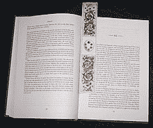

# 什么是书签？

> 原文：<https://www.javatpoint.com/what-is-a-bookmark>

书签是网络浏览器的一个功能，它将您的浏览器发送到某个网页。书签，也称为电子书签，是一种保存相应页面的标题、网址和收藏夹图标以供将来参考的方法。书签允许您快速访问互联网上您最喜欢的网站。书签通常对长网址的网页很有帮助，因为它们可以避免用户快速访问特定页面，从而节省用户和浏览器的时间。您只需点击书签即可访问网页，而无需输入网站的完整网址。

在大多数浏览器中，您需要按键盘上的快捷键 Ctrl+D 来为正在查看的页面添加书签。如果你想用鼠标给一个页面添加书签，点击书签图标或类似的东西，它会显示在地址栏的右边。此外，书签功能在微软互联网浏览器中被称为收藏夹；在此浏览器中，您可以通过单击星形图标打开收藏夹边栏，然后单击添加到收藏夹来添加页面，从而将页面添加到书签中。

大多数网络浏览器都提供书签功能。然而，管理它们的方式可能略有不同。例如，Safari 浏览器在浏览器窗口边栏的列表中显示您的书签，而 Chrome 和 Firefox 在打开的窗口中显示它们。通常，对于相关书签，浏览器提供文件夹选项。对于案例，反复访问的关于股票的网站可能会放在书签菜单的子文件夹中，以便共同基金和财务建议方便参考。如果您添加任何网页的书签，该网页的标题将显示在您的书签列表中。

由于浏览器提供了与书签相关的文件夹选项，当您的书签收藏增加时，该选项有助于将您的书签组织成不同的类别。当您在地址栏中键入时，某些浏览器能够在自动完成下拉菜单中显示书签页面，这使您无需在浏览器中打开书签窗口即可访问书签页面。此外，书签集合可以保存到第三方网站，这些网站可以根据提供的受欢迎程度进行共享，并且可以通过互联网连接在网络上的任何地方访问它们。

## 为什么要创建书签？

经常访问的网站或者想记住的页面做书签很有帮助；它允许您轻松直接地访问该页面。一般来说，通过给网页添加书签，你可以快速访问该网页。不需要在网上搜索，书签页面可以随时访问查看网页。

## 如何管理网页浏览器书签

虽然不组织书签，只是组装它们很有吸引力，但强烈建议不要这样做。您可以轻松管理您的书签列表，因为大多数浏览器都提供了许多高级书签功能，为您提供了一种管理喜爱的网站的方法。为了查看、排序和保存您的书签，下面给出了一些特别有用的书签管理功能。

### 文件夹和子文件夹

当您添加书签网页并制作书签列表时，最好为不同种类的书签创建文件夹，然后将它们全部保存在相关文件夹中，这有助于轻松快速地找到书签。例如，如果你喜欢收集政府工作或任何其他特定术语的链接，可以在浏览器的书签管理器中创建一个文件夹。它有助于轻松搜索这些链接，并节省以后搜索它们的时间。

### 书签栏

整理完所有链接的文件夹后，现在在浏览器的主工具栏上，您可以通过为它们创建图标来使它们更容易访问。启用浏览器的书签栏功能后，请进入书签栏，该功能允许您通过在浏览器主工具栏下方添加新的一行空间来锁定指向书签文件夹的链接。这使您无需打开浏览器设置即可访问书签。

### 在浏览器之间同步您的书签

当你有一个与网络浏览器相关的任务时，如果你一直使用一个新的浏览器会发生什么。你用过的旧浏览器中你最喜欢的链接是什么？您可以同步它们，因为大多数浏览器都有一个将旧书签传送到另一个浏览器的功能，这通常被称为同步您的书签。

## 查找保存的书签

大多数浏览器要么为您的书签文件夹提供单独的图标，要么允许您通过设置菜单访问以前存储的书签。

例如，谷歌浏览器中的书签菜单可以通过设置菜单访问。为此，您需要点击位于浏览器右上角的三个垂直点；然后，您将看到一个包含多个选项的下拉菜单。您必须选择书签选项。现在，您可以轻松地将书签添加到网页中。

在 Firefox 网络浏览器中，浏览器工具栏的右侧有一个符号，形状类似于垂直搁置的四本书的序列；您必须选择它来显示一个以书签为首选的菜单。

在 Microsoft Edge 网络浏览器中，可以通过其设置菜单访问保存的书签。浏览器包括三个水平方向的点；你必须点击位于浏览器右上角的这些点，然后你需要选择收藏夹。

## 如何使用快捷方式查看书签

不同的浏览器有不同的键盘快捷键来访问查看书签，如下所示:

*   **谷歌 Chrome:** Ctrl+Shift+O 或 Command+Shift+B 开启
*   **微软边缘:** Ctrl+Shift+O
*   **Mozilla Firefox:**Ctrl+Shift+B 或 Ctrl+B
*   **互联网浏览器:** Ctrl+I
*   **歌剧:** Ctrl+Shift+B

### 书签也可以指以下内容:

*   书签是像记事本++这样的文本编辑器中的一个功能，它为用户提供了标记一行以便快速查看的能力。例如，您可以使用记事本++中的键盘快捷键 Ctrl+F2 来添加和移除当前行上的书签。当一行被书签标记时，行号旁边会出现一个小蓝点。在一个包含数千行的文件中，书签使得在这种文件中跳转变得很容易。
*   在互联网和 HTML 中描述时，书签也被称为命名锚点的另一个名称。

* * *