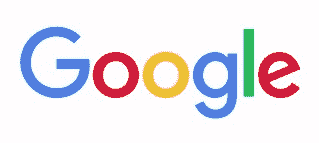
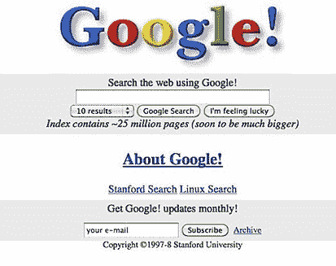
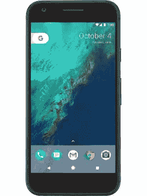
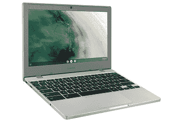
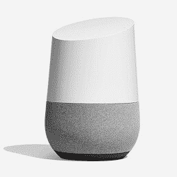
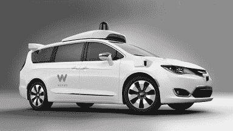

# 什么是谷歌？

> 原文：<https://www.javatpoint.com/what-is-google>

谷歌是全球知名的互联网搜索引擎，最初叫 BackRub。谢尔盖·布林和拉里·佩奇在 1996 年建立了这个搜索引擎。他们在斯坦福大学读博士的时候就开始了在网上查找文件的活动。**拉里和谢尔盖**创建了一种搜索引擎算法，根据连接到网页的其他网页的数量而不是内容和关键词来对网页进行优先级排序。与其他搜索引擎相比，这一策略产生了更多有用的结果，并导致谷歌的网络搜索市场份额迅速增加。

后来谷歌排名的名字改为“PageRank”，于 2001 年 9 月获得专利。由于将其他网页链接到一个页面，谷歌的算法返回了更有用的结果，从而成为谷歌使用最多的搜索引擎。

谷歌的名字是由拉里和谢尔盖选择的，灵感来自谷歌这个词。它宣称的目标是“组织世界上的知识，并使其有用和国际上可访问”，它采用了世界上最顶级的搜索引擎，一种专有算法..这意味着任何人都可以通过互联网连接随时随地访问谷歌上的信息。一般来说，它旨在搜索和检索信息，以便尽可能提供最相关的数据来源。由于其有效性，“谷歌”一词也可以用作动词。当你用谷歌搜索任何东西时，你可能会说“谷歌”。

为了帮助用户获取信息，网络搜索成为谷歌的主要工具；公司还提供其他服务。其中包括:

*   **图像搜索:**帮助在网络上搜索图像
*   **Froogle:** 用于比价购物
*   **谷歌群:**用于在线论坛
*   **博主:**提供免费的博客服务
*   **谷歌地图:**地图和方向
*   **谷歌工具栏:**一个可下载的搜索工具
*   **谷歌答案:**它在竞价系统的基础上提供问题的答案
*   **广告词:**它有助于为广告商提供广告服务
*   **AdSense:** 它有助于为网络出版商提供广告服务
*   **Gmail:** 基于网络的电子邮件，有几千兆字节的存储空间

## 谷歌开端

9 月 15 日，google.com 域名注册。谷歌公司于 1998 年 9 月 4 日注册。下图是谷歌在 1998 年的样子。

截至 2015 年 8 月 10 日，谷歌是 Alphabet Inc .的辅助公司。当谷歌从竞争中脱颖而出时，它得到了持续增长的帮助，并对搜索结果进行分类，因为 PageRank 技术是其头号搜索引擎。在互联网上，谷歌是搜索和检索信息的最佳搜索引擎之一。它还提供多种其他服务，例如，为了提供更相关的搜索结果，它整合了谷歌地图和谷歌本地。

## 谷歌软件

谷歌有各种流行的基于网络的生产力软件；其中一些如下:

*   **Gmail:** Gmail 是谷歌运营的免费电子邮件服务或基于网络的电子邮件服务。在 G Suite 的帮助下，谷歌还为企业提供优质服务。Gmail 手机应用和 Gmail Basic 是 Gmail 的 HTML 版本。Gmail 很可靠，有 15 GB 的存储空间来存放你的信息。它将你的信息存储在网上，这意味着你可以通过互联网访问任何地方。
    T3】
*   **Google Drive:** Google Drive 是谷歌于 2012 年 4 月推出的一款基于云的存储和办公应用。这是一个存储解决方案，您可以在线存储文件，并通过互联网连接在计算机、平板电脑或智能手机的帮助下访问它们。虽然它主要用于在线存储文件，但它也提供了个人、学校和企业项目协作工具方面的功能。
    T3】
*   **谷歌文档:**谷歌文档是一个免费的基于网络的应用程序，允许在线文字处理和文档创建。它是谷歌驱动的一部分，由谷歌提供并与之相关联。它是最流行的在线文字处理器，任何具有网络浏览器和互联网连接功能的计算机都可以在任何地方访问文件。使用谷歌文档处理文档，如创建文档、保存、上传、共享等，非常容易。此外，可以通过令人印象深刻的选择来创建和修改它们，而不是格式化选项。
    T3】
*   **谷歌 Chrome:** 谷歌 Chrome 是一款免费的全功能网页浏览器。截至 2020 年 5 月，它是全球最受欢迎的网络浏览器，用于访问互联网上的网页。2008 年 12 月 11 日，由谷歌开发。它也是一个跨平台的浏览器，包括多个功能，如选项卡式浏览、网页拼写检查、与谷歌服务和账户同步以及自动翻译。此外，它还提供不同的版本，适用于不同的移动设备、计算机和操作系统。
    T3】
*   **谷歌 Play:** 谷歌 Play 是官方安卓应用商店。它还是游戏、音乐、电影和电子书等其他媒体的店面。它允许用户直接在安卓设备上下载内容。谷歌 Play 商店还知道，安卓市场包含数百万个应用和游戏，默认情况下，每个安卓设备上都有。此外，它可以安装在 Chrombases、Chrome box 和其他兼容的 Chrome OS 设备上。
    T3】

## 如何打开谷歌

你需要在你的网络浏览器中打开 google.com 的地址来使用谷歌搜索。然后，在搜索栏中，键入任何查询、单词、句子或短语，并点击输入或点击谷歌搜索按钮。

## 谷歌产品

谷歌也开发硬件和软件。虽然谷歌产品众多，但有些如下:

### 谷歌像素

谷歌 Pixel 是一款安卓智能手机，由谷歌于 2016 年 10 月 20 日发布，运行的是安卓的“股票版”。开发像素手机的主要目标是取代 Nexus。这些手机是官方旗舰安卓设备，一发布就接受更新，而其他安卓手机可能会延迟一段时间更新。像素手机为用户提供了存储无限图片的便利，因为它在谷歌照片上提供了无限的照片存储。下图是谷歌 Pixel 手机的一个例子。

### 铬书

Chromebook 是一款基于云的笔记本电脑或上网本，运行 2011 年首次发布的谷歌 Chrome 操作系统。Chromebooks 需要互联网连接，几乎可以从云中运行所有内容；然而，Chromebooks 的离线功能已经得到了发展。因此，它们不同于其他笔记本电脑或电脑。Chromebook 通常可以完成诸如网页浏览、文档和电子表格、电子邮件和保存文件等活动，但是是通过基于云的方法。总的来说，Chromebooks 不如搭载 Windows 或 macOS 的笔记本电脑功能强大。下图是 Chromebook 的一个实例。

### 谷歌主页

谷歌主页是一个语音激活的智能扬声器，与谷歌助手一起工作。这些任务包括:打电话、设置计时器、回答问题、安排活动或播放音乐。它由谷歌在 2017 年发布，包括谷歌主页、谷歌主页迷你、谷歌主页枢纽等。一般来说，当用户说**“嘿谷歌”**或**“好谷歌”时，会激活一行智能扬声器**更大的*谷歌主页 Max* 和更小的*谷歌主页 Mini* 是扬声器的其他版本。下图是谷歌家庭智能扬声器的示例。

### Waymo 无人驾驶汽车

自动驾驶汽车是一种能够在没有人工输入的情况下在目的地之间行驶的车辆。它使用照相机、传感器、人工智能和雷达的组合来移动。Waymo 是自动驾驶汽车领域的前沿公司，该公司有雄心勃勃的无人驾驶、叫车服务计划。此外，在几十个城市，它正在进行真实世界的测试。下面，给出了一张代表 Waymo 无人驾驶汽车的图片。

## 谷歌服务

通过谷歌，为消费者和企业提供各种服务；其中一些如下:

**谷歌 Stadia:** 谷歌 Stadia 是一款云游戏平台，标志着游戏行业的重大变革。谷歌在今年 11 月首次推出它。它包括两个基本要素；第一:发送输入并显示图形的客户端；第二:后台服务器，将游戏传送给用户。

**Google Fi:** Google Fi 是一家总部位于美国的移动虚拟网络运营商。它提供许多服务，如短信、移动宽带和语音呼叫服务。三家运营商，T-Mobile、Sprint 和美国蜂窝，被谷歌 Fi 使用。主要是，它与美国的手机运营商合作。它可以用于国际呼叫以及国际数据。

**谷歌 AdSense:** 谷歌 AdSense 是一个广告平台，允许发布者通过运行广告并从谷歌 AdWords 中将其内容货币化来赚钱。对于大多数网站所有者来说，这是一个开源平台，广告是根据访问者查看或搜索的内容生成的。它还被统一到 YouTube 平台和谷歌的博客中。如果你有一个网站包含任何类型的内容，这对用户都很有用，你可以使用 AdSense 在你的网站上做任何有助于你赚钱的广告。当任何用户访问您的网站并点击您上传的广告帖子或链接时，您将从谷歌获得资金。你会得到多少钱取决于谷歌对广告收取的百分比。

**YouTube TV:** YouTube TV 是谷歌的产品，是直播电视的在线流媒体服务。在手机、电脑或其他合适的设备上，您可以在 YouTube 电视上观看电视直播。希望切断有线电视并放弃有线电视或卫星电视订阅的人应该使用 YouTube 电视。YouTube 电视为用户提供了一套独特的服务，使其成为一个引人注目的平台。然而，还有其他各种各样的直播服务，很像 YouTube 电视，如 Hulu + Live、Sling TV 和 AT & T TV Now。

## 谷歌在哪里？

一开始，谷歌被赶出了开发者的车库。几十年后，拥有数千名员工的谷歌成为了一家遍布全球的公司。该公司包括一个质量控制专家团队，致力于搜索引擎的算法，并使其能够提供最相关的结果。

随着时间的推移，包括谷歌有限责任公司和 Alphabet Inc .(控股公司)在内，谷歌公司在 2015 年被分成不同的组织。两家公司的总部都在加利福尼亚州的山景城。在世界各地，谷歌运营着数据中心，在每个大洲提供服务；然而，它在 50 多个国家有自己的办事处。

## 其他一些谷歌服务和产品

下面给出了一个包含谷歌服务和产品及其简要说明的列表。

*   **安卓:**安卓是智能手机常用的操作系统。它是一个基于 Linux 的免费平台，最初由安迪·鲁宾于 2003 年 10 月创建。后来，在 2005 年 8 月 17 日，它被谷歌收购。
*   **博主:**用于创建和查看个人博客。
*   **G 套件:** G 套件，原名 Google Apps for Your Domain，是谷歌提供的一项服务。这是一个基于云的企业软件套件。
*   **Chrome OS:** 是一款便携式电脑和笔记本电脑的操作系统，由谷歌于 2009 年 11 月 19 日开发。它主要设计用于在线网络应用程序。
*   **谷歌广告:**它是一个谷歌广告服务，也叫谷歌广告词。在谷歌搜索引擎上，它允许网站发布者在谷歌 AdSense 的帮助下发布广告。
*   **Google Analytics:** 这是一项来自谷歌的免费 mium 服务，用户可以根据自己网站的流量来分析自己的网站。
*   **Google Assistant:** 是一款数字助理服务，能够回答你的语音请求。此外，为了回答问题，它还具有控制家中电气设备的能力。
*   **谷歌图书:**另一个有趣的服务，有很多不同种类的图书。这项服务由谷歌提供，它为用户提供了一个搜索所有可用书籍的选项。
*   **谷歌日历:**这是谷歌提供的一项服务，可以让你整理日程、分享活动、设置提醒以记住生日等事件。
*   **谷歌课堂:**是谷歌在 2014 年发布的免费服务。它让学生和老师有机会参加数字化课堂。学校、大学和机构都使用这种方法。
*   **谷歌 Allo:** 是谷歌发布的一款手机应用。它是为 iOS 和安卓移动操作系统开发的，包括 Opera、Mozilla Firefox 和谷歌 Chrome 上的一个网络客户端。
*   **谷歌 Duo:** 谷歌 Duo 允许用户进行音频和视频通话，因为它是一项针对安卓智能手机以及谷歌和第三方操作系统的跨平台视频通话服务。
*   **谷歌地球:**谷歌地球是一个有用的应用程序，可以帮助用户获得方向，查看地球上几乎所有的地方，找到有趣的地方或商店，等等。
*   **谷歌快递:**是一家在大部分州提供快递服务的电商平台。9 月 25 日，它最初由谷歌发布为谷歌购物快车。
*   **谷歌 Fuchsia:** 这是一个开源操作系统，于 2016 年 8 月 15 日由谷歌在**作为实时操作系统发布。**
*   **Google hangots:**Google hangots 是一个通信平台，允许成员进行视频聊天、消息传递、短信和 VoIP，可以是一对一的，也可以是分组的。它也可用于安卓和 iOS 设备，并内置于谷歌+和 Gmail 中。
*   **谷歌眼镜:**谷歌眼镜最早于 2017 年推出，是一种图像识别技术。在谷歌搜索的帮助下，它识别对象并显示关于它们的信息。识别现实生活中的物体是一种可以与智能手机摄像头一起使用的技术。
*   **谷歌月球:**总的来说，谷歌月球是一个浏览器应用程序，它是由谷歌作为谷歌地球的一部分生产的，上面有我们的月球和每次登月的地图。它允许探索月球，并显示卫星图像。
*   **Google Now:** Google Now 是移动用户常用的 Google Search 的一个功能。它根据用户的搜索习惯和其他因素提供最相关的信息。
*   **Google Play Music:** 非常常见的应用和网站，由 Google 于 2011 年 11 月 16 日推出。用户可以创建和收听广播电台，以及流式传输、下载、购买和上传音乐。但现在它已经停产，YouTube 音乐已经上市，成为谷歌播放音乐的替代产品。
*   **Google Sheets:**Google Sheets 是一款电子表格网络应用，是谷歌提供的在线免费解决方案。它包含了传统电子表格程序的几乎所有功能，如 2006 年 3 月 9 日发布的微软 Excel。
*   **Google Translate:**Google Translate 是谷歌提供的免费服务，允许用户将文本从一种语言转换为另一种语言。例如，如果您想将任何英语句子翻译成印地语，您可以在谷歌翻译页面上复制或书写该句子，以快速翻译它。
*   **谷歌钱包:**它是一项谷歌支付服务，允许用户向他人发送和接收资金。它可用于谷歌开发的安卓智能手机。
*   **Wing:** Wing 是谷歌旗下的一项服务，在无人机的帮助下交付包裹或轻质物品。截至 2019 年 4 月已获批准。在澳大利亚和弗吉尼亚州，它正在特定地点开始运营。
*   **谷歌新闻:**谷歌提供的另一项服务，谷歌新闻呈现了数以千计的出版商和杂志组织的伟大新闻。它可以作为应用程序用于网络、iOS 和安卓。
*   **谷歌购物:**谷歌购物是克雷格·内维尔-曼宁发明的搜索服务。它使用户能够根据位置、价格、类型等找到产品。以前，它也被称为谷歌产品、谷歌产品搜索和 Froogle。
*   **谷歌幻灯片:** s 谷歌为用户提供 Google Sheets 服务，具备微软 Excel 等传统电子表格程序的所有功能。同样，它也提供服务；谷歌幻灯片，这是一个演示程序，包含所有功能，如微软幻灯片。
*   **谷歌街景:**谷歌提供的最好的服务之一是谷歌街景，这是一个交互式的 360 度图片，允许用户开车穿过世界各地的街道。

## 谷歌简史

1995 年，斯坦福大学的计算机科学学生拉里·佩奇和谢尔盖·布林开始研究一个名为 BackRub 的搜索引擎。这是一个利用记录数据和反向链接分析在互联网上进行追踪的计算机程序。一个搜索引擎的名字，BackRub，是受算法排名的启发。一种计算网页中包含多少反向链接的算法。

在此期间，BackRub 程序的结果取决于单词在网页上出现的频率，这允许网页设计师一次又一次地使用相同的关键词来提高他们在搜索结果中的排名。一个数据收集系统，即 BackRub 的皇冠上的宝石，被称为**“page rank”**，用于通过统计页面数量并基于它们与关键词的相关性来提高网站的排名。因此，高质量网站的排名达到了榜首。这项技术成为了创建谷歌的理由；甚至直接导致了谷歌的巅峰。当布林和佩奇在斯坦福大学宿舍外工作时，他们自筹资金。

在太阳微系统公司的联合创始人之前，安迪·贝希托尔斯海姆、布林和佩奇使用打折的电脑部件，主要是他们的信用卡。为了 10 万美元，他们给“谷歌公司”开了一张支票，要求在 1998 年之前经营该公司，同年，1998 年 9 月 4 日，谷歌正式注册成立。在斯坦福大学一位教授的前门廊上，Bechtolsheim 看到了谷歌早期的产品演示，然后据报道写了这张支票。

谷歌的名字是由拉里和谢尔盖选择的，灵感来自“谷歌”这个词在《想象与数学》一书中，这个名字被正式收录。两位谷歌创始人都认为谷歌的名字是收集互联网上所有信息的一个好方法，并开始概括这项艰巨的任务。

随着时间的推移，谷歌在 2002 年发布了 AdWords，并获得了普及。广告词是广告商的广告平台。佩奇和布林联系了这家科技公司，要求获得 30 亿美元的资金，这使得雅虎再次有机会从谷歌身上获利。由于雅虎拒绝提供资金，谷歌在其他地方找到了这笔钱。而且，在过去的 16 年里，广告工具(AdWords)已经成为谷歌的巨大利润中心。

这项技术发展迅速；不久之后，谷歌开始了各种额外的关键公司。谷歌 AdSense 开发于 2003 年，这是一款允许出版商通过运行广告并从谷歌广告词中赚钱的产品。后来，在 2004 年的愚人节，谷歌的电子邮件产品 Gmail 发布了。

## 谷歌复活节彩蛋

谷歌在其服务中还提供了各种隐藏的复活节彩蛋，如下所示:

*   **谷歌克林贡语:**它是一个隐藏的宝石，以克林贡语显示谷歌的搜索页面和结果。例如，您可以点击给定的链接-[https://www.google.com/?hl=xx-klingon](https://www.google.com/?hl=xx-klingon)来重定向到谷歌在克林贡的搜索页面。
*   **谷歌 H4x0r:** 另一个众所周知的隐藏复活节彩蛋，显示谷歌的搜索页面，并在 leetspeak 中显示结果。例如，点击链接-[https://www.google.com/?hl=xx-hacker](https://www.google.com/?hl=xx-hacker)重定向到谷歌在 leetspeak 的搜索页面。
*   **谷歌猪拉丁:**显示谷歌的搜索页面，包括猪拉丁的结果。例如，点击给定的链接-[https://www.google.com/?hl=xx-piglatin](https://www.google.com/?hl=xx-piglatin)重定向到谷歌的猪拉丁语搜索页面。

## 停止的谷歌服务

有各种各样的谷歌服务已经停产、弃用、出售给其他公司，并合并到其他产品中。因此，这不再被支持。下面列出了其中的一些服务:

*   **Google+:** Google+是一个社交网站，也叫 G+。它于 2019 年 4 月 2 日在**关闭。**
*   **谷歌回答:**这是一个在 2016 年 12 月被关闭的网站**。**不过还在线，我只能看，不能编辑。
*   **Google Buzz:** 由 Google+取代，Google Buzz 是一个社交网站，已于 2011 年 12 月 15 日在**关闭。**
*   **谷歌结账:**这是谷歌提供的一项服务，用来互相支付。它被谷歌钱包取代，并于 2013 年 11 月 20 日关闭。
*   **谷歌代码:**这项允许用户在网站上查看源代码的服务于 2015 年 3 月 12 日在**被撤销。**
*   **Google Deskbar 和 Google Desktop:** 它是一款在微软 Windows 任务栏上添加了 Google 搜索的小软件，用户无需打开浏览器即可进行搜索。
*   **谷歌词典和目录:**谷歌提供了一项服务，在线词典搜索。后来它被合并到谷歌搜索中。因此，它被关闭了。谷歌还提供了一项服务，允许用户浏览修改过的网页的开放目录，这就是谷歌目录。
*   **Google Helpouts:** 这是谷歌在 2013 年 11 月提供的另一项服务，用户可以通过这项服务与其他用户分享自己的知识和经验。但它并没有被更多地使用，并于 2015 年 4 月 20 日停止使用。
*   **谷歌快翻:【2011 年 9 月正式关闭，是谷歌提供的在线新闻聚合服务。**
*   **谷歌实验室:**它曾经显示即将推出的功能，因为它是谷歌的一部分。后来，由于变得不太常见，它被关闭了。
*   **谷歌版主:**该服务由谷歌开发，允许人们从任何规模的受众中收集最佳意见，并于 2015 年 6 月 30 日在**关闭。**
*   **Google Talk:** 它使用的是 XMPP，是 Google 提供的 Messenger 程序。对于与谷歌 Hangouts 一起使用的自己的专有标准，谷歌在 2013 年 5 月宣布放弃 XMPP 支持。
*   **谷歌 set:**谷歌提供的另一项服务；它用于显示与您键入的关键字相关的单词列表。现在，它没有使用，并且已经关闭，因为其他新技术已经开始推广这一功能。
*   **Orkut:** 这是一个社交网站，在 2014 年 9 月 30 日被谷歌正式关闭。它为用户提供了与世界各地的人们互动的场所。
*   **Picasa:** 这是一个图像程序；它允许相应地查看、编辑和管理图像。2016 年 3 月 15 日，该程序退役，取而代之的是谷歌照片。
*   **YouTube 视频编辑器:**它允许用户使用必要的工具编辑视频。这是 YouTube 的一个免费功能，自 2017 年 9 月 20 日**起关闭，但用户可以在他们的视频中添加增强功能。**
*   **Google Market 和 Google SketchUp:**Google Market 在 2012 年恢复为 Google Play，这是一个搜索和下载安卓应用的地方。谷歌还提供了一个工具，谷歌 SketchUp。2012 年 6 月 1 日**该工具现归 Trimble 所有；是为了创造和分享三维模型。**
***   **Google Tango:**Google 提供的另一项服务之一于 2017 年 12 月 15 日正式关闭，该服务是一个增强现实计算平台。*   **谷歌网络加速器:**谷歌提供这项服务是为了帮助宽带用户加快浏览速度。后来被谷歌停产了。*   **谷歌基地:**那是一个数据库服务。2010 年 12 月 17 日，原料药和服务停止。**

 *** * ***