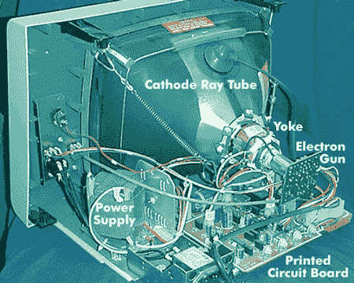
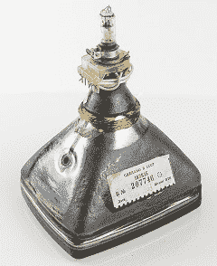

# 什么是艺术

> 原文：<https://www.javatpoint.com/what-is-crt>

阴极射线管是一种技术，代表阴极射线管，用于电视机和电脑显示器。它由一个带有静电偏转板的真空管、一个或多个电子枪和一个位于玻璃屏幕后面的磷靶组成。阴极射线管这个词来自阴极，阴极是电子可以进入的正极端子。显示器内部的阴极射线管可以在下图中看到。

在电脑显示器或电视机中，有三种类型的电子枪可供选择，它们是红、绿、蓝，通常被称为 RGB，在显示器中将图像投射到屏幕上的过程中起着重要的作用。对于监视器的每一行，这些枪使屏幕上的电子流从左向右流动。电子束一碰到荧光粉就会发光并投射到屏幕上。在屏幕上，你看到的颜色是由红、绿、蓝三种电子枪组合而成的。枪再次从左边开始，当新的一行开始时继续向右。除非屏幕完全是一行一行画出来的，否则这些枪会不断重复这个过程。

当电子束击中阴极射线管上的荧光粉时，它们会发光一段时间。由于这个事实，阴极射线管必须刷新。如果显卡的刷新率设置得不够高，您可能会在屏幕上看到明显的稳定线条或闪烁。为了弯曲电子束，现代阴极射线管显示器使用磁偏转，这是通过改变磁场来实现的。通过电子电路驱动线圈产生的磁场。

在体积更小、耗电更少的液晶显示器问世之前，通常被称为显像管的阴极射线管一直是显示设备的唯一选择。磁偏转通常用于改变电子束的方向。此外，所用磷光体的类型会影响光的亮度、颜色和持续时间。特别是，不同类型的磷光体在制造用于不同应用的阴极射线管中起着重要作用。

## 阴极射线管的特点

使用不同种类的磷光体会影响照明的亮度、颜色和持久性。特别是，不同类型的磷光体在制造用于不同应用的阴极射线管中起着重要作用:

1.  **尺寸**
    大尺寸是 CRT 最好的特点之一，它描述了屏幕直径。这是阴极射线管显示器的一个固有特征，因为由于它们所采用的技术的限制。CRT 适用于 1、2、3、5 和 7 英寸的示波器。例如，一个包含数字 5GP1 的阴极射线管，这表明它是一个 5 英寸的管。
2.  **对比度**
    阴极射线管技术提供了比液晶显示器更好的对比度。CRT 有能力产生高 dep 黑色水平，并有更好的对比度。这意味着，在黑暗的画面中，阴极射线管显示器或电视上有更多可见的细节。然而，阴极射线管显示器的亮度水平低于液晶显示器技术。
3.  **成本**
    自从液晶显示器问世以来，CRT 技术几乎已经过时。例如，如果你想买一台阴极射线管显示器，你可能买不到新的，可能不得不买二手的；因为制造商已经停止生产阴极射线管显示器。但是阴极射线管显示器的成本相当便宜。然而，长时间使用液晶显示器可能并不贵。
4.  **用户友好**
    阴极射线管的另一个相当大的特点是它在使用中更常见。大多数媒体数据都是方形的，4:3 的信箱格式，而今天是宽屏的。如果您在 4:3 显示器上观看宽屏内容，屏幕顶部和底部会有黑条。这意味着您将无法使用屏幕的所有空间。在现代，所有的液晶显示器都配有宽屏，允许您使用屏幕的所有空间，或者显示较小的条，或者根本不显示条。

## 阴极射线管的历史

阴极射线管的发展始于 1854 年以后。朱利叶斯·普吕克和约翰·希托夫发现了阴极射线；然而，直到 1897 年，费迪南德·布劳恩才发明了第一台 CRT。未知的射线从阴极释放出来，希托夫注意到这些射线能够在灯管的发光壁上投下阴影。这也表明光线是直线通过的。在法国和英国等其他国家，盖斯勒的管子被送去了。他们去找了像希托夫、法拉第和克鲁克斯这样的研究人员。然后，他们进行了大量的实验，导致了大量的新发现。

后来，德国化学家赫尔曼·斯普林格尔在 1865 年改进了盖斯勒真空泵。放在阴极前的固体物质阻挡光线，并证明阴极发出的光线呈直线运动；这是德国科学家约翰·威廉·希托夫在 1869 年发现的。

英国工程师克伦威尔·弗利特伍德·瓦利在 1871 年发表的一篇论文中提出阴极射线是由粒子组成的。德国物理学家欧根·戈尔茨坦在 1876 年证明，当电流在电子管的帮助下被推动时，就会产生真空管中的辐射。除了阴极射线之外，后来由戈德斯坦在 1876 年发现，阴极射线管被制造出来，辐射以相反的方向传播。由于在阴极上钻孔(管道)，这些射线被称为管道射线。

带电的金属板不会偏转阴极射线，海因里希·赫兹在 **1883 年证明了这一点。**表示阴极射线不是带电粒子。海因里希·赫兹在 1892 年(错误地)确定阴极射线一定是某种波。结论表明光子可以穿过薄金属箔。

1897 年， **J. J.** 汤姆逊测量了阴极射线的荷质比。他证明了第一个“亚原子粒子”，比原子小的负电荷粒子，产生了阴极射线。

布劳恩管是阴极射线管的第一个版本，由德国物理学家费迪南德·布劳恩于 1897 年发明。这是对克鲁克斯管的一种改进，带有一个磷涂层屏幕(一个冷阴极二极管)。布劳恩是第一个想到用阴极射线管作为显示设备的人。

西方电气公司的约翰·贝特朗·约翰逊和哈里·韦纳·温哈特是第一个制造带有加热阴极的阴极射线管的人；约翰逊噪声以他的名字命名。1922 年，它变成了一种商业产品。

后来，高柳健次郎在 1926 年展示了一台可以接收 40 行分辨率图像的阴极射线管电视。到 1927 年，高柳健次郎把电视的分辨率从 40 行提高到 100 行，这在 1931 年之前是无与伦比的。此外，在阴极射线管显示器上，人脸最早是由他在 1928 年传送的。到 1935 年，他发明了早期的全电子阴极射线管电视；它的名字是由弗拉基米尔·兹沃里金于 1929 年命名的。他是一个受高柳前期作品影响的创新者。RCA 在 1932 年被赋予了阴极射线管这个词的商标，它在 1950 年将这个词交给了公众。

艾伦·杜蒙(Allen B. DuMont)在 20 世纪 30 年代推出了第一批使用 1000 小时的彩色显像管，这导致了电视应用的一场重大革命。

1934 年，Telefunken 在德国生产了第一台带有阴极射线管的商用电子电视机。

尽管 Telefunken 在 1938 年推出了第一台矩形阴极射线管，但阴极射线管的尺寸在 1949 年至 20 世纪 60 年代初发生了巨大变化，从圆形阴极射线管过渡到矩形阴极射线管。1954 年，皇家艺术学院生产了一些第一批彩色阴极射线管；第一台量产的彩色电视机 CT-100 使用了 15GP22 CRTs。第一批矩形彩色阴极射线管在同一年，1954 年生产。但是第一次提供给公众的彩色矩形阴极射线管是在 1963 年制造的。

在生产矩形彩色阴极射线管的过程中，阴极射线管拐角处的会聚是遇到的困难之一。蓝色磷光体最终在 1965 年被淘汰，当时较暗和含镉的红色和绿色磷光体被淘汰，取而代之的是较亮的稀土磷光体。

随着时间的推移，阴极射线管的尺寸从 19 英寸(1938 年)增加到 21 英寸(1955 年)。到 1985 年，尺寸已经扩大到 35 英寸，到 1989 年，它已经增加到 43 英寸。1960 年，艾肯管，一种平板显示格式的阴极射线管被引进。这是一种只有一个电子枪的显示形式。由于专利问题，偏转从未投入生产，这是静电和磁性的。

Zenith 在 1987 年开发了用于计算机显示器的平板液晶显示器；它们有助于增强图像对比度和亮度，减少反射。这些阴极射线管显示器价格昂贵，限制了计算机用户的使用。1990 年，当索尼在市场上推出第一台高清分辨率的平板液晶显示器时，人们试图通过使用更便宜、更广泛的浮法玻璃来生产平板液晶显示器。

在**2000 年代，**平板显示器开始明显取代阴极射线管，价格也有所下降。2003-2004 年，液晶显示器的销量急剧下降，液晶显示器的销量开始超过液晶显示器。2005 年，在美国，与液晶电视相比，液晶电视的销量更多。因此，液晶显示器的销售迅速增长，到 2007-2008 年，它在全球和印度的 **2013 年蔓延。**

2000 年代中期，索尼和佳能推出了表面传导电子发射显示器和场发射显示器，这两种显示器都是平板显示器。代替电子枪，它们每个子像素都包含一个(SED)或多个(FED)电子发射器。

Videocon 是最后一家 CRTs 制造商，于 2015 年停产。阴极射线管电视的生产也在 2015 年左右停止。此外，在美国，多家阴极射线管制造商在 2015 年因操纵价格而被定罪。2018 年在加拿大，也出现了同样的问题。

## 阴极射线管的类型

显像管和显像管是阴极射线管的两大类。显像管被生产出来用于电脑显示器，而显像管被用于电视，电视也被称为显像管。显像管的分辨率更高，没有过扫描。与显像管相比，显像管中图像的实际边缘没有显示出来，因为它们有过扫描。但这是故意用显像管阴极射线管来实现的，以允许阴极射线管电视之间的调整变化，通过这种变化，图像的参差不齐的边缘可以显示在屏幕上。由于过扫描，为了带走电子，荫罩可能具有不撞击屏幕的特殊结构。

*   **单色阴极射线管:**在 B &的颈部，W 或单色阴极射线管是一个单电子枪。在阴极射线管的内部，它的漏斗涂有铝，铝可以在真空中浓缩和蒸发。铝对于一些任务很重要，例如它有助于防止磷光体上的烧伤、消除对离子阱的需要、反射光、管理热量和吸收电子等。
    铝(涂覆在阴极射线管内部，包括荧光粉)在 20 世纪 50 年代开始用于阴极射线管，这有助于提高图像亮度。在外部，Aquadag 用于镀铝单色阴极射线管。单色阴极射线管可以使用偏转线圈周围的磁铁和环形磁铁来改变电子束的中心，以调整图像的几何形状。
    
*   **彩色阴极射线管:**彩色阴极射线管使用三种不同的荧光粉，分别产生红光、绿光和蓝光。它们被包装在一起，被称为三元组，或者像有孔格栅设计一样被包装成条纹。彩色阴极射线管包括三种电子枪，分别负责红、绿、蓝三种颜色。这些枪通常被构造成以等边三角形或直线排列的单个单元。三角形排列因希腊字母 delta 的形式而被称为“delta-gun”。
    在彩色阴极射线管中，荧光粉的排列方式与电子枪相同。荫罩管阻挡所有其他电子，并帮助电子束照亮管表面正确的磷光体，因为它使用带有小孔的金属板。而且，如果荫罩使用槽而不是孔，这就叫做槽荫罩。当电子撞击空穴内部时，它们会被反射回来；因此，它们可以穿过的槽或孔是锥形的。如果电子没有被吸收，就会被反射回来。
    阴极射线管(Trinitron)是一种彩色阴极射线管，通过使用张紧的垂直金属丝制成的孔径格栅来实现相同的目的。荫罩通常在屏幕后面 1/2 英寸，每个三向轴有一个孔。与其他颜色的彩色彩色显像管相比，三硝基显像管是独一无二的。他们有一个孔径格栅，一个有三个阴极的单电子枪，一个有三个阴极的单电子枪，让更多的电子通过，这有助于提高图像亮度。除了在 Trinitron CRTs 中，红色、绿色和蓝色(三个电子枪)在颈部，这些磷光体可能被屏幕上的黑色网格或矩阵分开。

## 阴极射线管的优点

尽管阴极射线管技术并不更受欢迎，但它仍然比其主要竞争对手具有许多优势，因为它主要用于电视机和计算机显示器。许多人觉得阴极射线管显示器的优点比液晶显示器更有用；然而，CRT 显示器尺寸更大，重量更重。下面是使用 *CRT 技术的显示器的一些优点。*

### 费用

价格是阴极射线管显示器的主要优势之一，与具有可比组件的液晶显示器相比，阴极射线管显示器更实惠。从质量来看，截至 2010 年 6 月，阴极射线管显示器的成本从 50 美元到 300 美元以上。通常，一台普通的液晶显示器的成本可能在 100 美元到 200 美元之间，而一台普通的阴极射线管显示器可以通过支付液晶显示器一半的成本来购买。

### 视角

根据画面的角度，你可能需要注意一些电视机和显示器类型；图像质量会发生巨大变化。例如，如果您从某个左侧或右侧而不是屏幕前部观看电视或显示器显示，您会注意到图像质量不清晰。在阴极射线管显示器中，这个问题实际上是不存在的，但是这个问题主要在液晶显示器中广泛存在。阴极射线管显示器在距离、位置和视角方面提供了更大的灵活性，这意味着无论从哪个角度看，阴极射线管显示器的图像质量都是一样的。

### 颜色质量

阴极射线管显示器能够显示 24 位显示器中使用的所有 1670 万种颜色，而普通的液晶显示器无法显示所有这些颜色，因为它们使用了 TN 技术。因此，与一些竞争对手相比，阴极射线管显示器可以显示更详细、更鲜艳的颜色。因此，阴极射线管显示器对那些无法使用高质量高清显示器的媒体爱好者更有用。还有，对游戏玩家和平面设计师更好。

### 图像质量

阴极射线管显示器的另一个优点是图像质量，因为它们提供真实的颜色和高分辨率，从而提供更详细和更精细的图像。阴极射线管技术使计算机显示器用于各种照明环境，因为它包括暗黑色和高对比度功能。由于良好的图像质量，没有运动模糊的机会。而且，当画面在屏幕上快速变化时，某些显示器会出现运动模糊问题。例如，在其他显示器上，快节奏和动作密集的视频游戏在速度较快的部分可能会模糊不清。但是阴极射线管显示器能够显示这些类型的游戏，而不会增加模糊。

### 浅谈液晶显示器

尽管与液晶显示器相比，阴极射线管的图像质量通常较高，但液晶技术的变化和发展速度比阴极射线管快得多。这意味着它非常接近阴极射线管技术的图像质量。然而，这些类型的高质量液晶显示器很少，而且非常昂贵，可能不是正常人能负担得起的。但是随着技术的进步，它们也将变得更容易获得和便宜。

## 阴极射线管的缺点

尽管阴极射线管技术有各种各样的好处，但它也有许多缺点。下面，给出了使用*阴极射线管技术的计算机显示器的一些缺点。*

### 笨重

与基于液晶显示器和有机发光二极管的平板显示器相比，阴极射线管显示器最大的缺点之一是尺寸。像显示器和电视机这样的阴极射线管设备在地板上占据了很大的空间，而基于液晶显示器和有机发光二极管的设备占用了大量的地板空间。阴极射线管显示技术需要更大的显像管来实现更宽更大的屏幕。阴极射线管显示器需要很大的配置，这限制了它们的使用，并使它们不适合占地面积有限的空间。由于尺寸较大，移动性和阴极射线管显示器的运输也是一个问题。此外，制造大于 40 英寸的阴极射线管基本上不切实际。

### 成本高且能效低

与平板显示器相比，阴极射线管显示器现在更便宜，因为它们已经过时了。然而，由于制造成本高，与液晶显示器相比，它们在更早的时候成本更高。这是液晶显示器过时和液晶显示器不断增长的主要原因。

阴极射线管显示器的另一个缺点是，它们比液晶显示器和有机发光二极管面板消耗更多的电力。例如，32 英寸的阴极射线管电视消耗大约 125 瓦的能量，而类似尺寸的发光二极管电视消耗 18 瓦的能量。一台 42 英寸的 CRT 电视消耗 210 瓦的能量，而 40 英寸的 LED 电视消耗 31 瓦的能量。

### 安全和环境问题

阴极射线管是一种真空管，管内有高真空。在不碰撞空气或气体分子的情况下，它利用这种真空让电子束自由飞行。如果玻璃或阴极射线管的任何表面受到任何损坏，电子管就会坍塌成许多碎片。因此，即使电源关闭，阴极射线管和一些相关的电容器也能保持电荷。因此，有触电的可能。

在回收和妥善处理的情况下，阴极射线管显示器属于最难消费的电子产品。在阴极射线管显示器中，铅和磷的浓度很高。此外，美国环境保护署甚至将废弃的氯氟化碳视为危险的家庭废物。

**CRT 技术劣势的其他一些要点:**

*   阴极射线管的高斯光束轮廓发出的图像边缘较软，这意味着图像的分辨率不如液晶显示技术清晰。
*   一些显示器包括减少莫尔条纹，因为彩色阴极射线管会产生恼人的莫尔条纹。因此，它们可能无法完全消除莫尔干涉图案。
*   它们对于光线非常明亮的区域并不理想，并且亮度低于液晶显示器(相对较亮，但不如液晶显示器)。

* * *