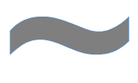
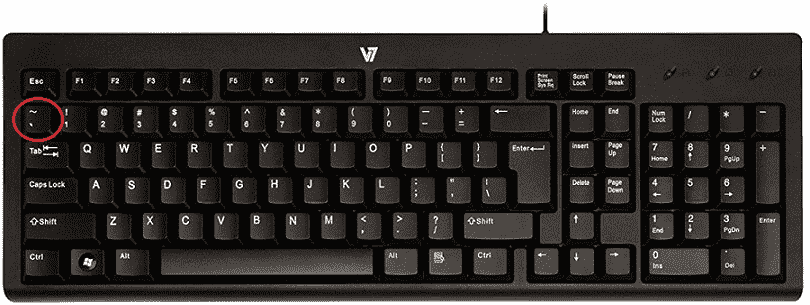

# 什么是颚化符？

> 原文：<https://www.javatpoint.com/what-is-a-tilde>

波浪号()通常被称为波浪线或旋转线，是 ASCII 字符集中的一个字符，用于书写和编程。它位于大多数键盘上的 Esc 键(退出键)下方。恰好是 ASCII 码 126，也广泛应用于 It 相关应用，如 URL 地址、文件系统、数学、目录、编程等。给定的图像显示了键入时波浪号字符的外观。

表示当前用户的主目录是 tilde 符号在某些操作系统(包括 Unix)中的另一种用法。按照传统，在 web 服务器上的文件系统中，颚化符被用作任何用户主目录中的第一个字符。很多时候，您会看到波浪号字符作为网址的一部分，因为在服务器上，用户将业务或个人网页保存在他们的个人主目录下。在数学中，颚化符的意思是“近似”，尤其是当两两连用时。

此外，在数学中，它也被称为“等价符号”。对于电子文本交换，颚化符是最流行的标准。它是 C 编程中的按位运算符，表示一元否定，也是正则表达式模式匹配中的运算符。操作系统中有时使用颚化符来缩写大文件名。

## 键盘上的波浪号键在哪里？

下面给出了一个计算机键盘的图片，其中包括用红色圈起来的波浪号键。

## 如何创建波浪号(~)

**在美国键盘上创建~符号**

您需要在美国键盘上同时按 Shift 和~键来创建波浪符号，按住 Shift 键，然后按~。波浪号与键盘左上角的反引号(')在同一个键上，在 Esc 键下方。

**在平板电脑或智能手机上创建~符号**

要在平板电脑或智能手机屏幕上创建波浪号符号，首先需要点击数字按钮(123)，然后会看到符号按钮(#+=)，然后需要点击波浪号(~)按钮。

## 波浪号字符在计算机上是用来做什么的？

下面给出了一些例子，描述了如何以及何时使用颚化符。

*   在葡萄牙语和西班牙语等语言中，颚化符通过在字母“和”上做记号来表示辅音或元音的交替发音。
*   颚化符可以在正则表达式的模式匹配中用作运算符。
*   在微软视窗 95 和更高版本中，它被用来压缩长文件名。例如，将“程序文件”目录名修改为“Progra~1”目录。
*   如果文件以波浪号和美元符号或波浪号和美元符号开头，则该文件被视为临时文件。例如，~$example.doc。
*   在 C 编程语言中，它也用作按位运算符来表示一元否定。
*   在 Linux 计算机上，表示当前用户的主目录是它的另一种用途。
*   波浪号字符也可以用于在应用程序和游戏中到达控制台，如 Quake。
*   tilde 的另一个用途是访问 Tilda GTK+终端仿真器。
*   将它放在=符号上，例如≅.这意味着它表示形状的一致性。
*   数学中的颚化符表示“粗略”，尤其是成对使用时。
*   此外，双颚化符可以用来表示另一个估计值，例如“大致等于”

## 如何在字母上方获得颚化符

如果您需要在键盘上的字母上方使用颚化符或其他重音符号，您可以使用程序的“插入特殊字符”选项或字符映射表来执行此操作。

* * *