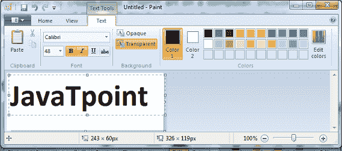

# 什么是绘画？

> 原文：<https://www.javatpoint.com/what-is-paint>

Microsoft Paint(画笔，适用于 MacOS 用户)是一个遗留的图形绘制程序，允许用户编辑图形文件或创建自己的图形。它是一个简单的光栅图形编辑器，使在计算机上创建基本的图形艺术变得容易，并且从一开始它就随微软视窗的所有版本一起提供。它为绘图和绘画文件提供了各种功能，例如颜色填充工具、固化线条工具、图像粘贴、成型模具以及用于添加不同字体和大小的文本的文本工具。

绘画程序使用户能够打开和保存不同格式的图像，如 JPEG、GIF、PNG、Windows 位图(BMP)和单页 TIFF 格式。该应用程序没有灰度模式，尽管它可以用于彩色或双色黑白。由于简单，它很快成为早期版本 Windows 中最受欢迎的应用之一；它还第一次介绍了许多人在电脑上写生。通常，它仍然用于图片处理。2017 年 7 月，微软将 Paint 添加到其不推荐使用的 Windows 功能列表中。据微软称，油漆软件也将作为免费的独立应用程序在微软商店提供。下图是微软绘画的一个例子。

## 油漆的历史

Paint 的最初版本是在 1985 年 11 月发布的，同时发布的还有 Windows 的原始版本 Windows 1.0。这是 ZSoft 公司的个人电脑画笔的授权版本，它只能处理 1 位深度的单色图形。这个版本后来被 Windows 3.0 中的“画笔”所取代，它有一个改进的用户界面，支持 BMP 和 PCX 文件格式，并支持真彩色。在 Windows 95 和 Windows NT 4.0 中，微软包含了一个更新版本的 Paint，它使用户能够以调色板的形式保存和加载颜色组合。如果照片的色深是每像素 16 位或更多，这种功能就能很好地工作。较新版本不支持此功能。

安装适当的图形过滤器后，Paint 有可能在 Windows 95、Windows 98、Windows 2000 和 Windows Me 中打开 TIF、JPEG、48 位、GIF，并以 JPEG 和 GIF 格式保存图片。这几类插件都是用微软 PhotoDraw 和微软 Office 添加的。“绘画”也可以使用透明背景。当打开或粘贴较大的图片而不是询问时，画布大小会自动扩展。

后来随着时间的推移，Paint 开始将图片保存为 PNG、GIF、TIFF、BMP 和 JPEG，而不需要额外的图形过滤器，因为它使用 GDI+。然而，仍然缺乏不支持 alpha 通道透明度。默认调色板和工具栏图标在视窗 Vista 中被重新设计。在 Windows Vista 中，Paint 最多可以擦除十次更改，而在以前的版本中为三次。它现在有一个裁剪选项以及一个用于图像放大的滑块。默认情况下，在此版本中，文件以 JPEG 格式保存。

### Windows 7 及更高版本

在 Windows 7 和更高版本中，其用户界面中的功能区包含在 paint 版本中。这个版本还包含各种灰色阴影和不同透明度的艺术画笔。因此，它提供了一个更现实的结果。此外，此版本能够将文件保存在。默认为 png 扩展名文件格式，并允许用户查看透明的 PNG 和 ICO 文件格式。

现在，即使没有更多空间来显示文本，也可以将文本粘贴到文本框中。此外，文本框允许您相应地放大它，以使文本适合文本框。而在早期版本的 Paint 中，如果用户试图将文本粘贴到文本框中，而文本框大小不适合文本，则会显示一条错误消息。Windows 8 中的 Paint 进行了更新，以解决一个长期存在的问题，即当在大于 100%的缩放视图中编辑时，用户无法滚动窗口。

### 将来的

2017 年 4 月，微软为 Windows 10 推出了 3D Paint。除了传统的二维绘图工具外，Paint 3D 还具有导入和操作三维模型的潜力。2017 年 7 月 23 日，微软将 Paint 添加到过时的 Windows 功能列表中，三个月后，它又被添加到不推荐使用的 Windows 功能列表中。尽管 Paint 3D 具有相同的功能，但微软在第二天表示，Paint 程序将成为微软商店中的一个免费独立应用程序。但是，所有版本的 Windows 10 都包含绘画。

## 微软绘画的特点

Paint 有一些功能，如踪迹模式、常规形状、图章模式和运动图片。这个工具对人们来说是一个有吸引力的选择，它使得在计算机上创建基本的图形艺术变得容易。但是，Paint 提供了多种功能，使用户能够制作有效的图形文件。下面讨论一些重要特性:

### 绘图工具

在绘画中，工具箱是一个包含艺术工具图标的盒子。这类工具为用户提供了选择不同纹理的不同大小画笔的能力。它还允许用户选择颜色来填充绘图，使其更具吸引力。“绘画”中还有其他工具，包含各种形状，如矩形、圆形和正方形，并允许用户选择它们。

### 变焦

用户可以在 Paint 中更改打开文件的查看大小。他们可以通过从菜单中选择“查看”来调整可视区域的大小。通过从菜单中选择“自定义”，用户可以将视图放大到原始视图的 800%。工作人员可以通过以高分辨率放大来更详细地更改图形。此外，用户可以通过“缩放”菜单上的附加选项向窗口添加网格线。但是，网格线不会随文件一起打印。当艺术家使用绘图工具时，这些工具是指导他们使用得更精确的指南。此外，通过使用键盘命令，用户可以放大屏幕视图。要放大，请在按下电脑上的“向下翻页”键的同时按下“CTRL”键。您也可以通过按住“CTRL”键的同时按下“向上翻页”键来缩放回原始视图大小。

### 图像选项

在 Paint 中，影响整体画面的“图像”菜单提供了不同的常用工具。例如，“翻转和旋转”选项使工作人员能够在任何方向上旋转图像，例如向左、向右、向上和向下。此外，他可以将图形旋转指定的度数。图片也可以按程度拉伸或倾斜。此外，图像的大小属性可以横向和纵向改变。

### 简单文件发送

用户只需点击“文件”菜单并选择“发送”选项，即可发送文件。Microsoft Paint 有一个电子邮件选项，允许用户发送打开的文件。当您选择要发送的文件时，首先，电脑的电子邮件软件由 Paint 程序打开，并将文件插入电子邮件。用户只需选择收件人，因为文件将自动附加，写下主题和消息，并点击“发送”按钮。

## 微软 Paint 为什么包含在 Windows 中？

用户可以在 Microsoft Paint 中打开其他图片文件。例如，扩展名为，的文件。ico，。巴布亚新几内亚。tiff，。jpg，。bmp，。迪布。可以使用最新版本的 Microsoft Paint 创建、打开、查看和编辑 gif。如果您的计算机上没有安装 Paint，您需要安装一个图像查看器来查看系统上的图片。

* * *