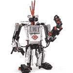

# 机器人教程

> 原文：<https://www.javatpoint.com/robotics-tutorial>

机器人教程提供了机器人学的基本和高级概念。我们的机器人教程是为初学者和专业人士设计的。

机器人是一种多功能、可重新编程的自动工业机器。

我们的机器人教程包括机器人的所有主题，如组件、运动、人工智能、传感器、硬件设计、电源、微控制器、液晶显示器、印刷电路板等。

在本教程中，您将能够通过机器人项目更好地理解机器人教程:避障机器人、线跟随机器人、手势控制机器人和基于双音多频的受控机器人。

* * *

## 机器人索引

* * *

**机器人教程**

*   [机器人学导论](robotics-tutorial)
*   [什么是机器人](what-is-robotics)
*   [机器人历史](robotics-history)
*   [机器人组件](components-of-robot)
*   [机器人运动](robot-locomotion)
*   [机器人领域的 AI](artificial-intelligence-in-robotics)
*   [人工智能研究领域](artificial-intelligence-research-areas)
*   [机器人类型](types-of-robot)
*   [机器人传感器类型](types-of-robot-sensors)

*   [硬件设计](robotics-hardware-designing)
*   [电源](robotics-power-supply)
*   [微控制器](robotics-microcontroler)
*   [液晶显示器](robotics-liquid-crystal-display)
*   [印刷电路板设计](robotics-designing-of-pcb)

**机器人项目**

*   [避障机器人](obstacle-avoider-robot)
*   [直线跟随机器人](line-follower-robot)
*   Hg 机器人
*   [双音多频控制机器人](dtmf-based-mobile-controlled-robot)

* * *

## 先决条件

在学习机器人之前，你必须具备计算机体系结构和嵌入式系统的基础知识。

## 观众

我们的机器人教程旨在帮助初学者和专业人士。

## 问题

我们保证您在本机器人教程中不会发现任何问题。但是如果有任何错误，请在联系表格中发布问题。