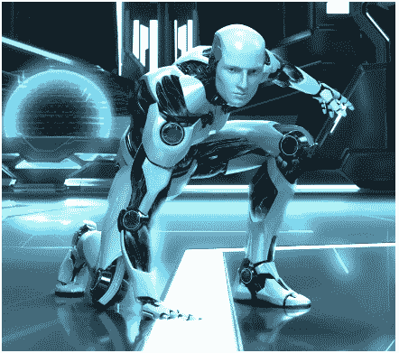

# 机器人学

> 原文：<https://www.javatpoint.com/what-is-robotics>

机器人学是人工智能中使用的术语，用于研究创造智能和高效的机器人。

## 什么是机器人

机器人是多功能的、可重新编程的、自动的工业机器，旨在替代危险工作中的人。

机器人可以作为:-

*   自动机器清扫机
*   在宇宙空间
*   在战场上清除地雷的机器
*   供孩子玩耍的自动汽车
*   在军事等方面。

## 目标

机器人的目的是通过感知、移动、拾取、修改物体的物理属性来操纵物体。

## 什么是机器人技术

机器人学是人工智能的一个分支，它主要由电气工程、机械工程和计算机科学工程组成

机器人的应用。

Robotics is science of building or designing an application of robots. The aim of robotics is to design an efficient robot.

## 机器人的各个方面

*   机器人有**电气部件**来提供动力和控制机械。
*   它们具有机械结构、形状，或者是为完成特定任务而设计的形状。
*   它包含某种类型的**计算机程序**，决定机器人做什么，什么时候做，如何做。